Rotterdam2 pre-QC
-----------------

Initial quality assessment of dataset clustered by HUGE-F in Rotterdam.

### Call rate

Overall call rate per sample.

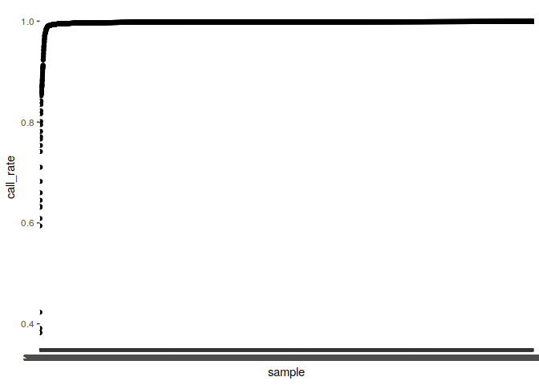

    ## Warning: Removed 24 rows containing missing values (geom_point).

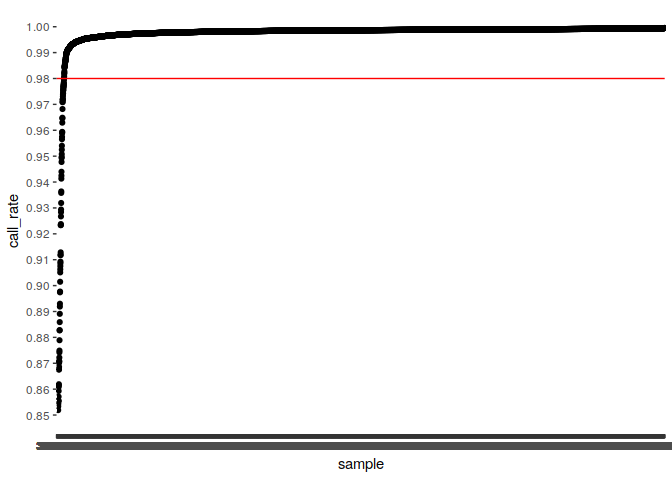

| Call rate     |     N|
|:--------------|-----:|
| (0,0.8\]      |    18|
| (0.8,0.9\]    |    35|
| (0.9,0.95\]   |    24|
| (0.95,0.96\]  |     8|
| (0.96,0.97\]  |     4|
| (0.97,0.98\]  |    23|
| (0.98,0.99\]  |    39|
| (0.99,0.995\] |   232|
| (0.995,1\]    |  8658|

### Heterozygosity

Mean heterozygosity per:

-   Sample plate
-   Sample well
-   Sentrix Barcode/ID
-   Sentrix position

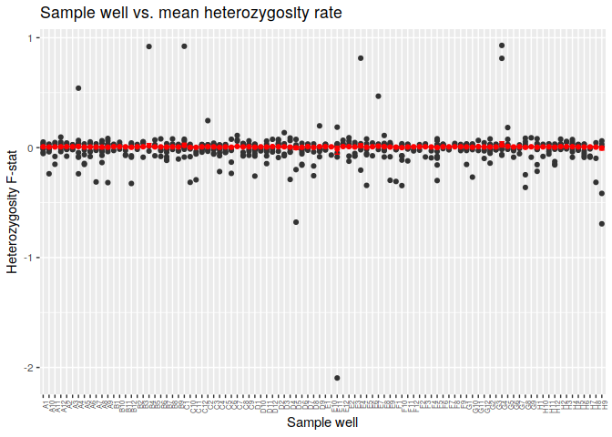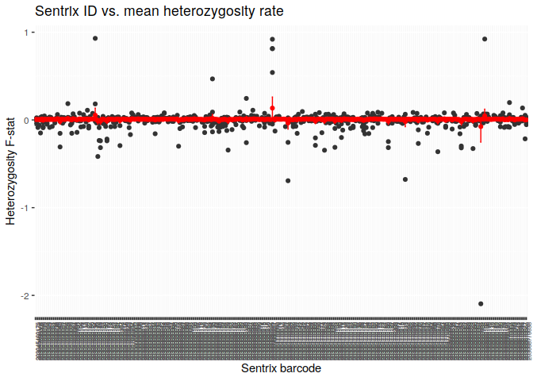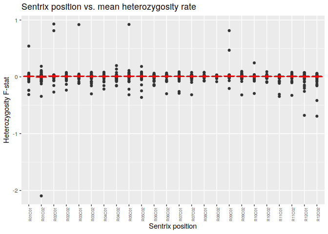

### Call rate

Mean call rate per:

-   Sample plate
-   Sample well
-   Sentrix Barcode/ID
-   Sentrix position

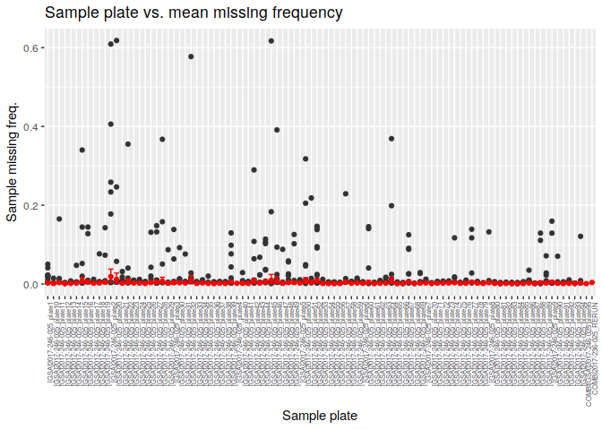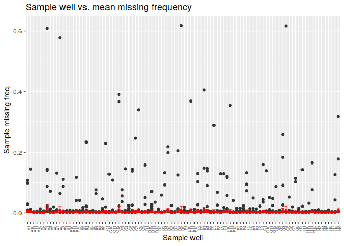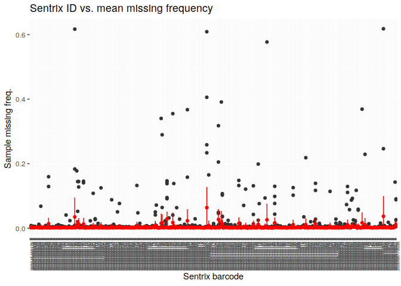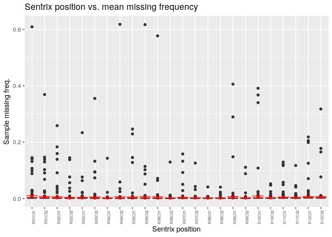

### Call rate vs. heterozygosity

Plots showing relationship between call rate and heterozygosity F-stat. Higher missingness yields more heterozygous calls.

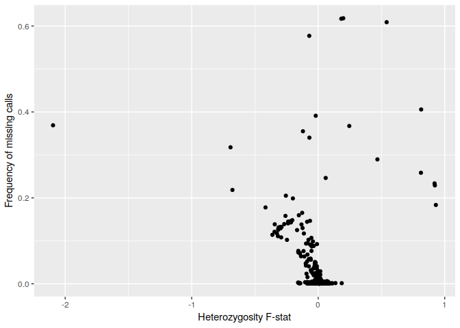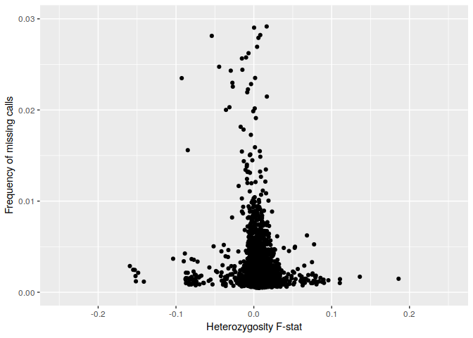
