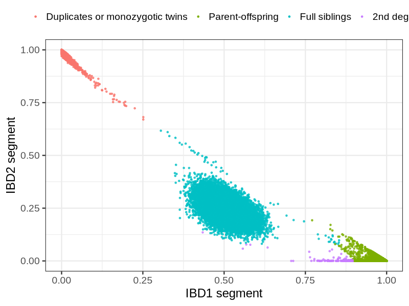
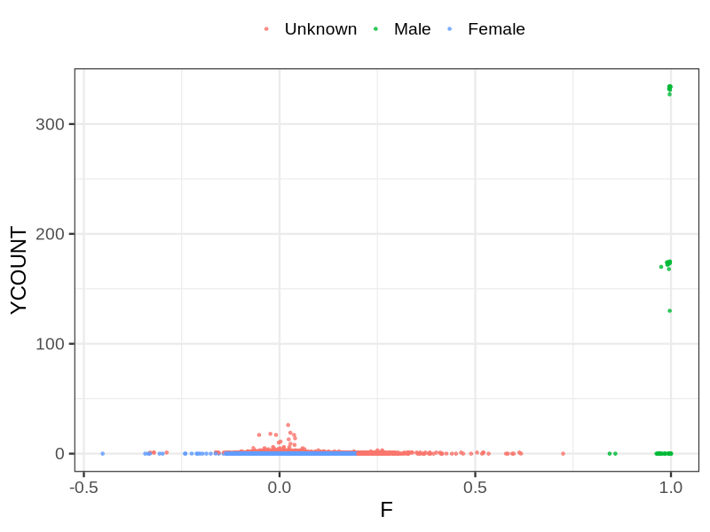
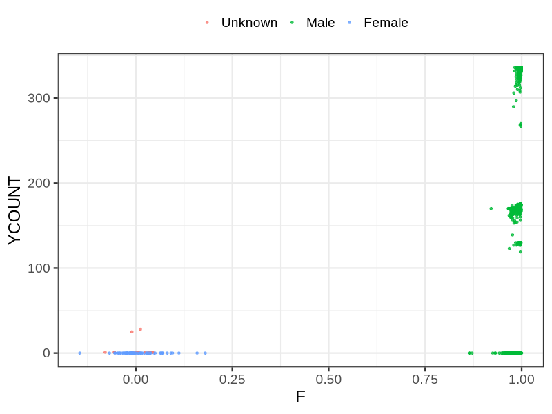
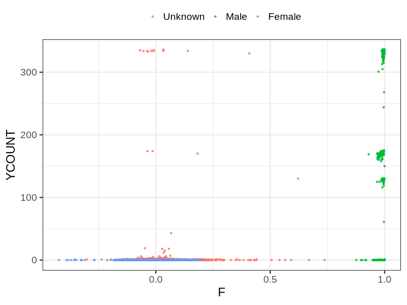

# Psam file reconstruction
## Samples not in Medical Birth Regsitry
795 samples with missing birth year, assumed to be parent in the following.
## Relationship inference
| Relationship |   |
| ------------ | - |
| Duplicates or monozygotic twins| 3725 |
| Parent-offspring| 138870 |
| Full siblings| 26011 |
| 2nd degree| 122 |
| 3rd degree| 0 |
| 4th degree| 0 |
| Unrelated| 0 |

## Mother sex check
| Inferred sex |   |
| ------------ | - |
| Unknown | 25188 |
| Male | 87 |
| Female | 61789 |

## Father sex check
| Inferred sex |   |
| ------------ | - |
| Unknown | 15 |
| Male | 59858 |
| Female | 69 |

## Children sex check
| Inferred sex |   |
| ------------ | - |
| Unknown | 9927 |
| Male | 42554 |
| Female | 30742 |

## Parental relationship
83839 mother-child relationships expected.
- 83501 (99.6%) recovered by genetic relationships.
- 338 (0.4%) not recovered by genetic relationships.

59358 father-child relationships expected.
- 59048 (99.48%) recovered by genetic relationships.
- 310 (0.52%) not recovered by genetic relationships.

145758 parent-offspring relationships detected
- 142549 (97.8%) match to registry.
- 3209 (2.2%) do not match to registry.

## Exclusion
- Number of samples excluded: 0
