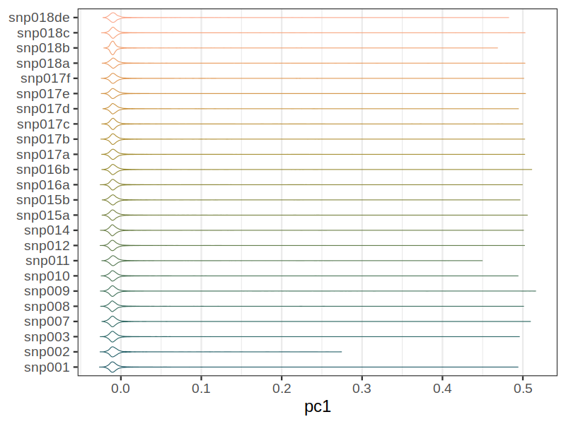
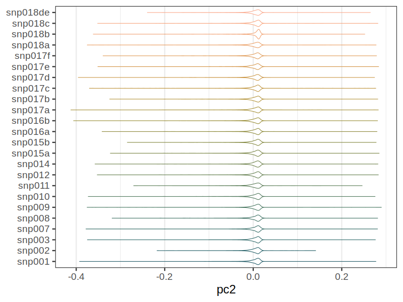
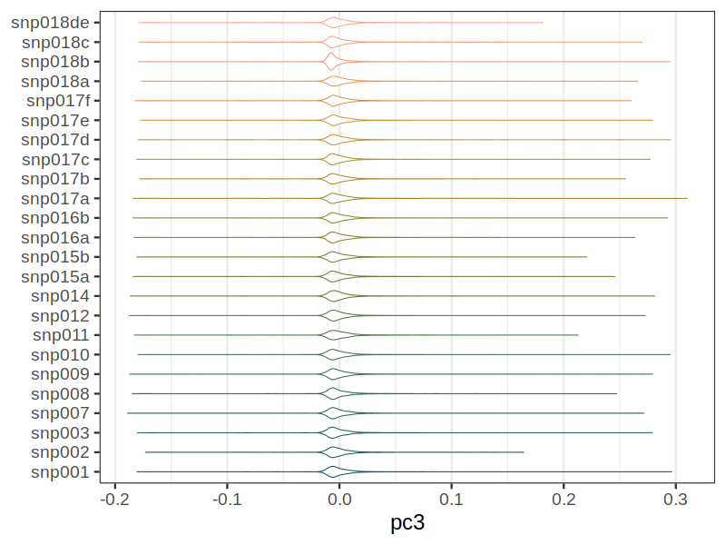
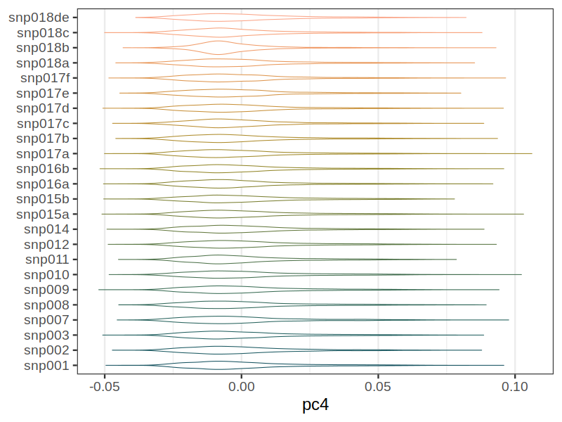
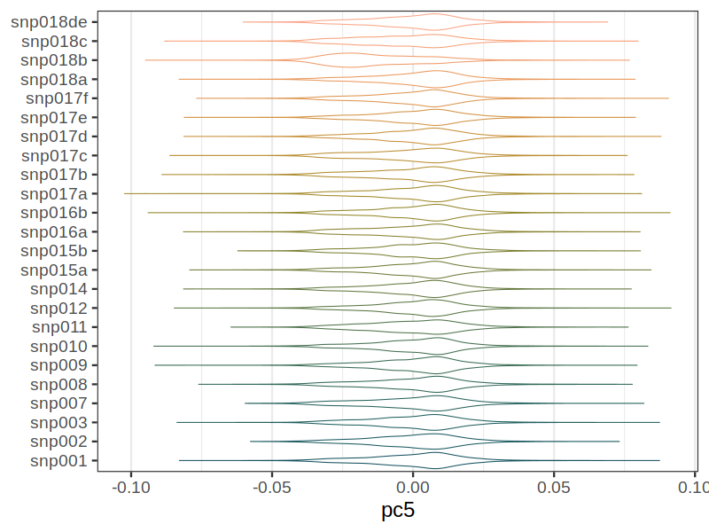
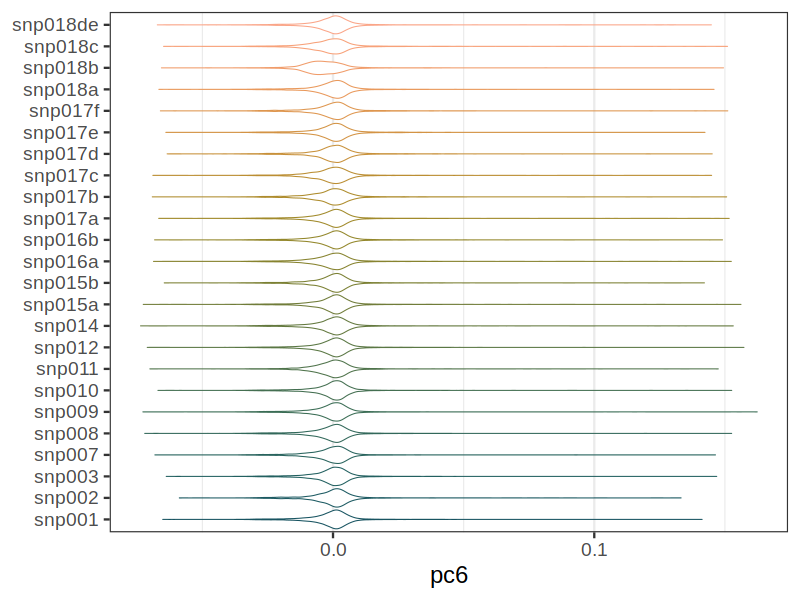
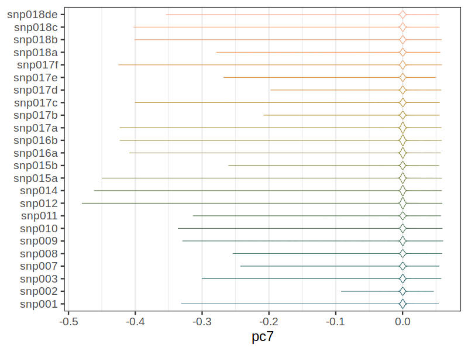
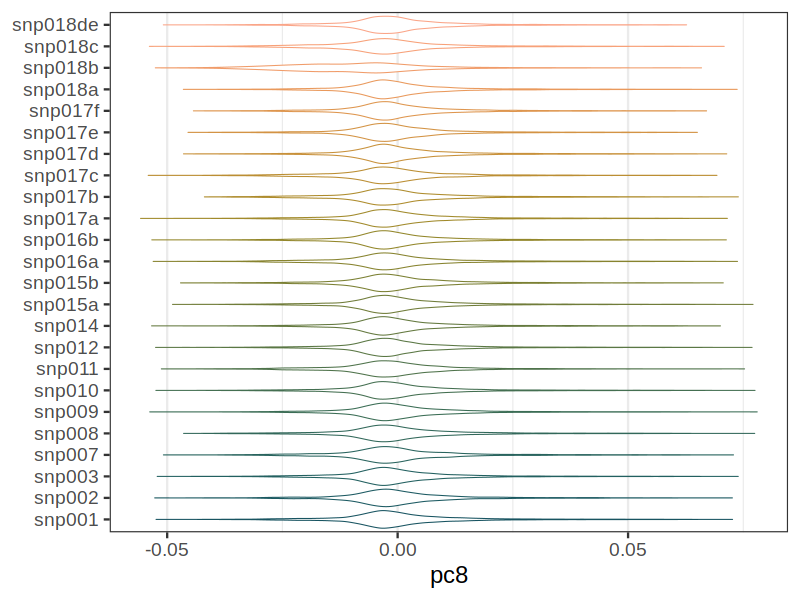
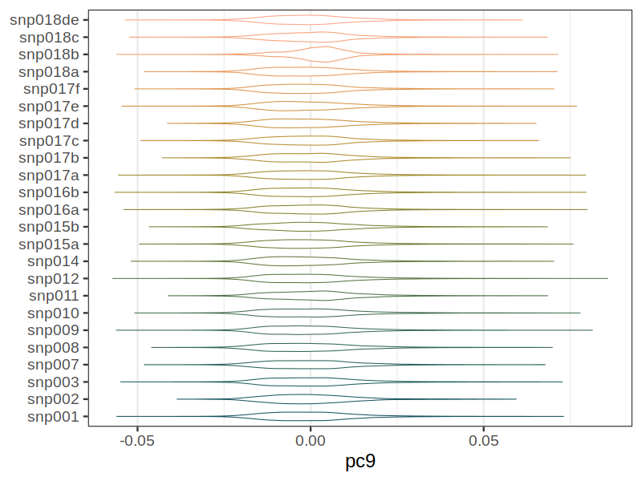
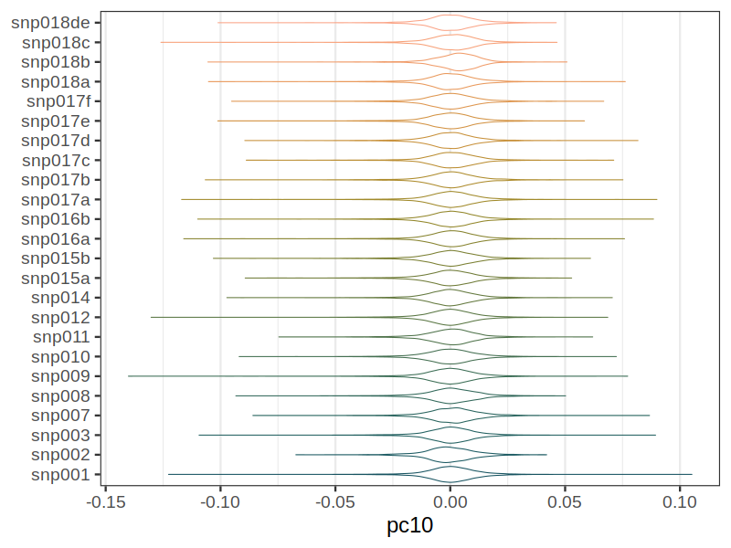

# Principal Component Analysys (PCA) vs. batch
Principal component analysis of the MoBa samples vs genotyping batch.
| Batch | Number of samples |
| ----- | ----------------- |
| snp001 | 18473 |
| snp002 | 1662 |
| snp003 | 12700 |
| snp007 | 2970 |
| snp008 | 2841 |
| snp009 | 17484 |
| snp010 | 9567 |
| snp011 | 5157 |
| snp012 | 17582 |
| snp014 | 8781 |
| snp015a | 13365 |
| snp015b | 4363 |
| snp016a | 24686 |
| snp016b | 24749 |
| snp017a | 24757 |
| snp017b | 4645 |
| snp017c | 4742 |
| snp017d | 5566 |
| snp017e | 4565 |
| snp017f | 5210 |
| snp018a | 5372 |
| snp018b | 2676 |
| snp018c | 5545 |
| snp018de | 2160 |
| Total | 229618 |
### pc1

### pc2

### pc3

### pc4

### pc5

### pc6

### pc7

### pc8

### pc9

### pc10

### pc2 vs. pc1

### pc3 vs. pc2

### pc4 vs. pc3

### pc5 vs. pc4

### pc6 vs. pc5

### pc7 vs. pc6

### pc8 vs. pc7

### pc9 vs. pc8

### pc10 vs. pc9

