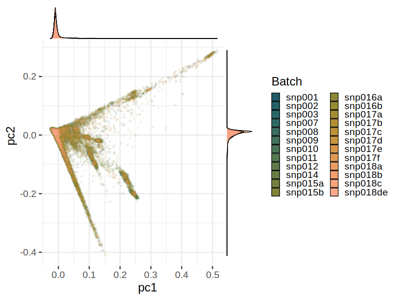
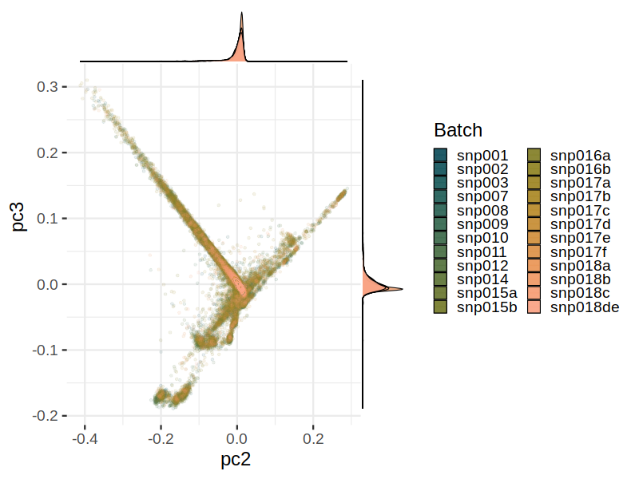
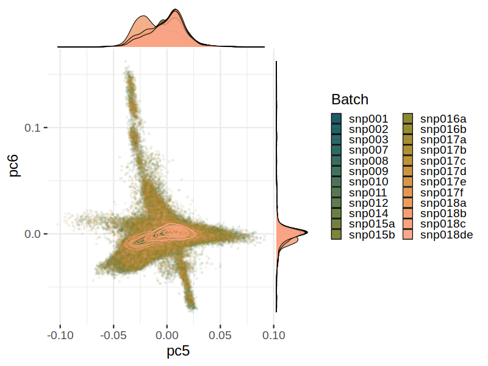
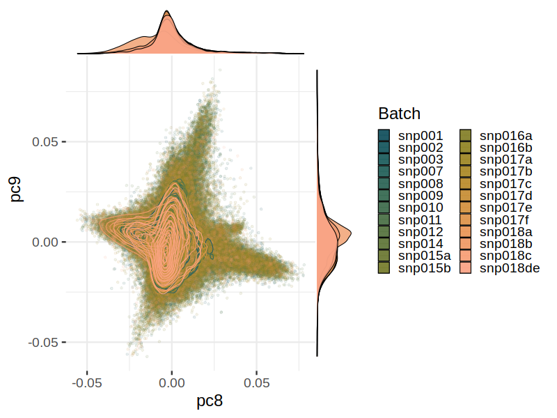

# Principal Component Analysys (PCA) vs. batch
Principal component analysis of the MoBa samples vs genotyping batch.
| Batch | Number of samples |
| ----- | ----------------- |
| snp001 | 783 |
| snp002 | 82 |
| snp003 | 554 |
| snp007 | 138 |
| snp008 | 122 |
| snp009 | 744 |
| snp010 | 440 |
| snp011 | 224 |
| snp012 | 758 |
| snp014 | 358 |
| snp015a | 580 |
| snp015b | 186 |
| snp016a | 1111 |
| snp016b | 1053 |
| snp017a | 1086 |
| snp017b | 194 |
| snp017c | 221 |
| snp017d | 257 |
| snp017e | 196 |
| snp017f | 238 |
| snp018a | 215 |
| snp018b | 118 |
| snp018c | 228 |
| snp018de | 114 |
| Total | 10000 |
### pc2 vs. pc1

### pc3 vs. pc2

### pc4 vs. pc3

### pc5 vs. pc4

### pc6 vs. pc5

### pc7 vs. pc6

### pc8 vs. pc7

### pc9 vs. pc8

### pc10 vs. pc9

