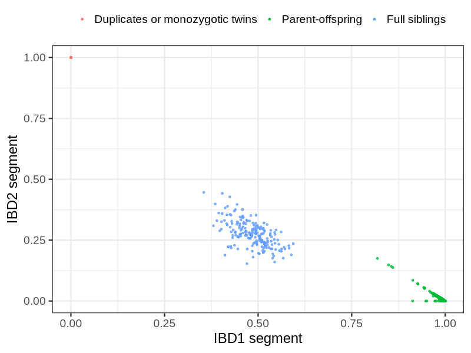
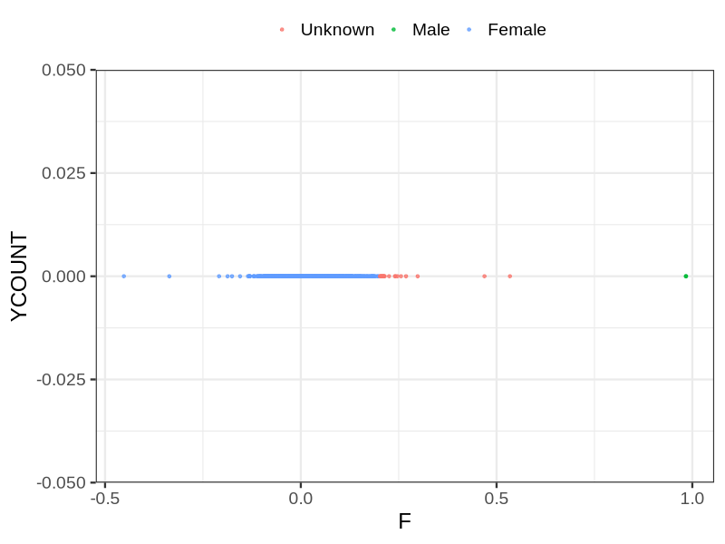
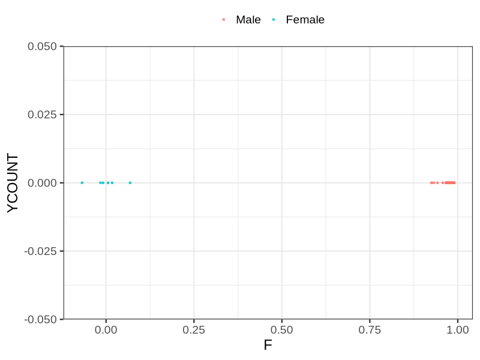

# Fam file reconstruction in snp001
## Samples not in Medical Birth Regsitry
140 samples with missing birth year, will be assumed to be parent.
## Relationship inference
| Relationship |   |
| ------------ | - |
| Duplicates or monozygotic twins| 142 |
| Parent-offspring| 11223 |
| Full siblings| 196 |
| 2nd degree| 0 |
| 3rd degree| 0 |
| 4th degree| 0 |
| Unrelated| 0 |

## Mother sex check
| Inferred sex |   |
| ------------ | - |
| Unknown | 20 |
| Male | 2 |
| Female | 6193 |

## Father sex check
| Inferred sex |   |
| ------------ | - |
| Unknown | 0 |
| Male | 6150 |
| Female | 6 |

## Parental relationship
6424 mother-child relationships expected.
- 6421 (99.95%) recovered by genetic relationships.
- 3 (0.05%) not recovered by genetic relationships.

6186 father-child relationships expected.
- 6180 (99.9%) recovered by genetic relationships.
- 6 (0.1%) not recovered by genetic relationships.

12691 parent-offspring relationships detected
- 12601 (99.29%) match to registry.
- 90 (0.71%) do not match to registry.

## Exclusion
- Number of samples excluded: 19
