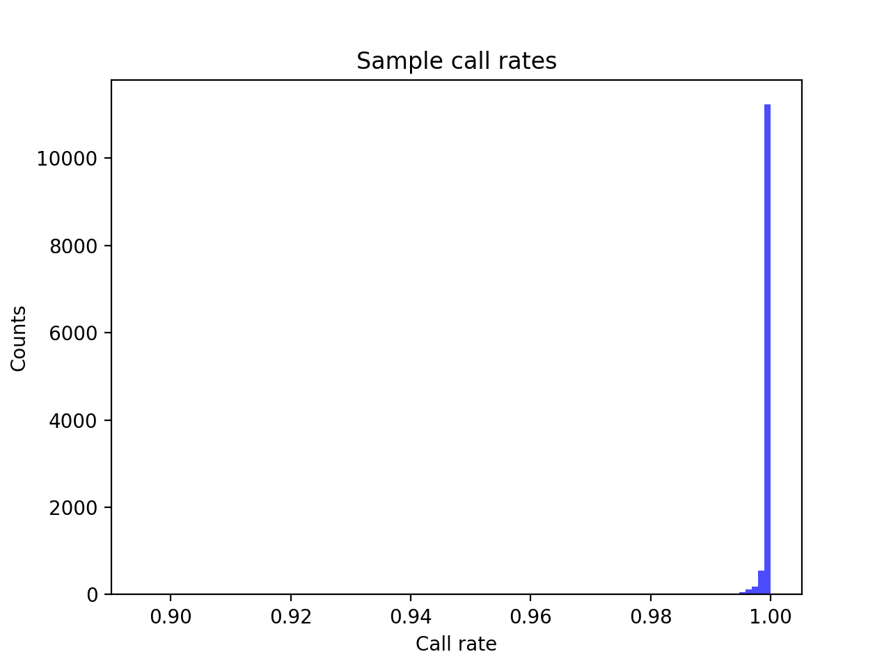
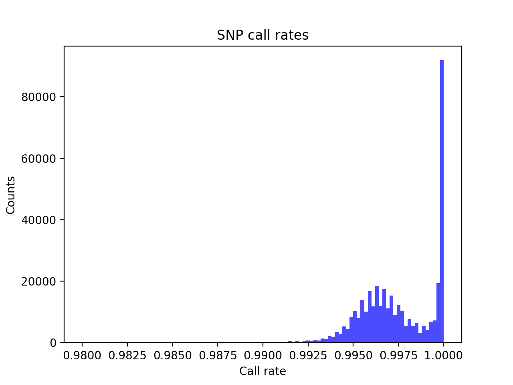
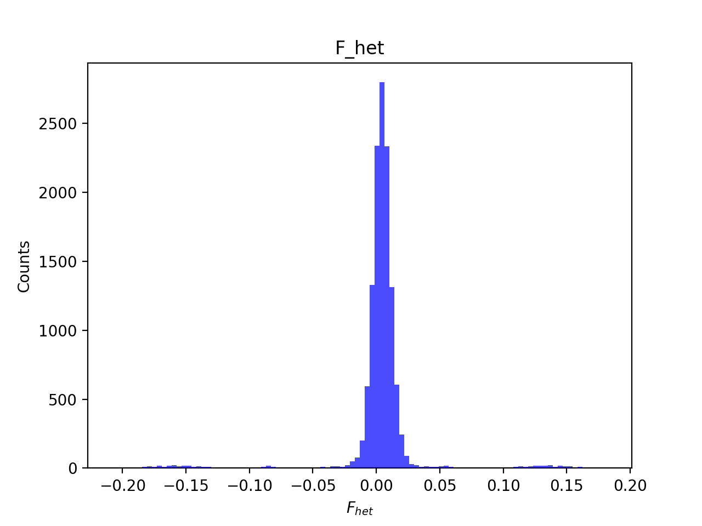
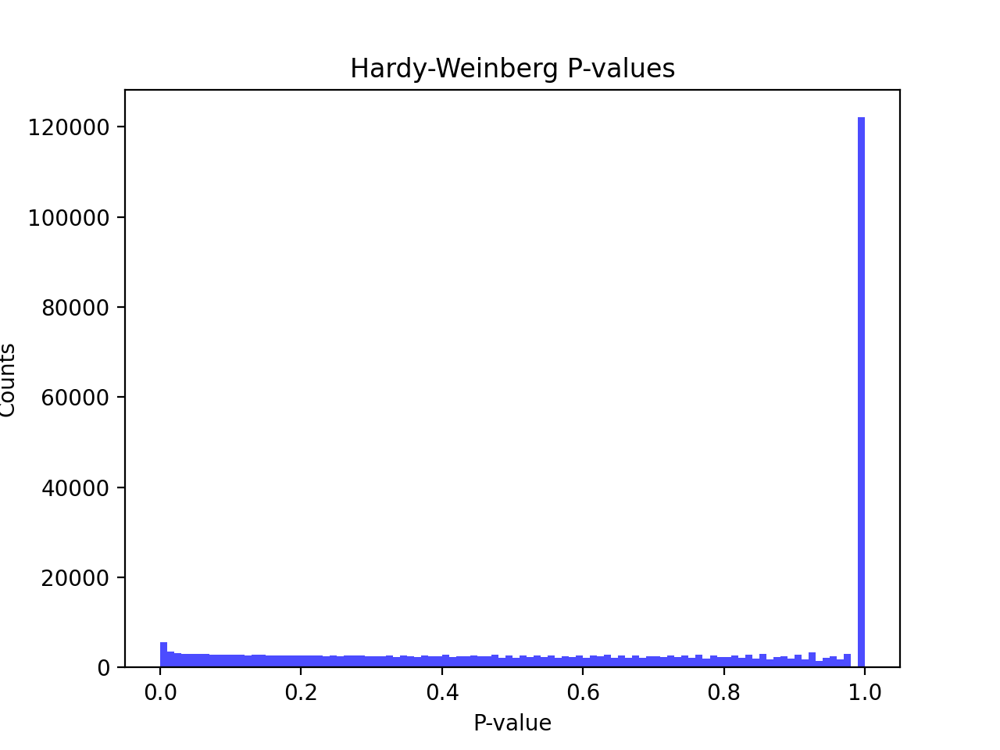
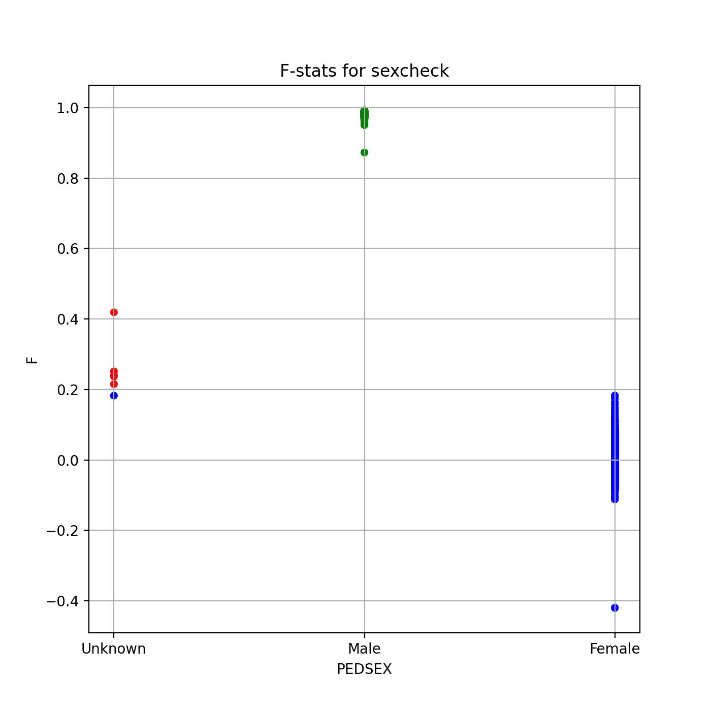
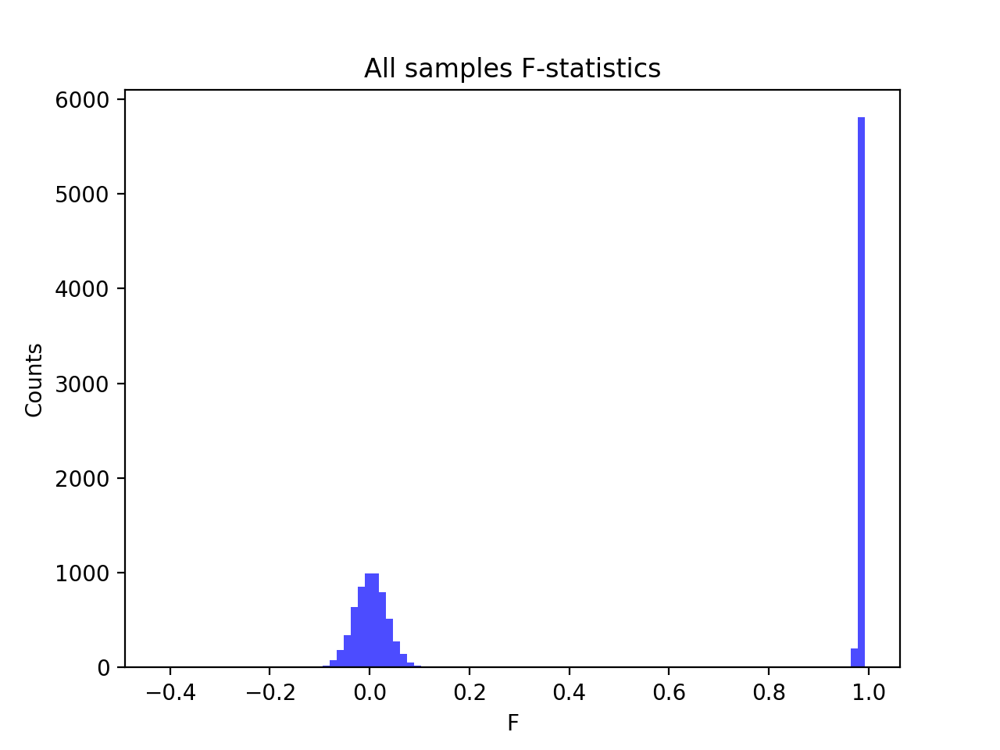
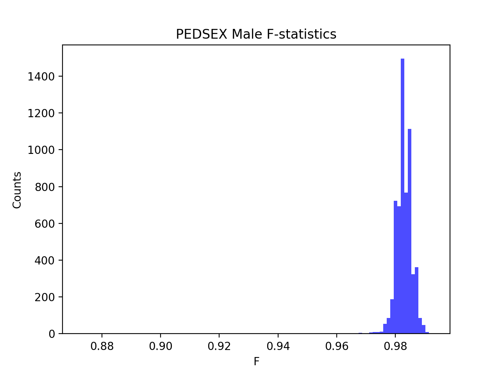
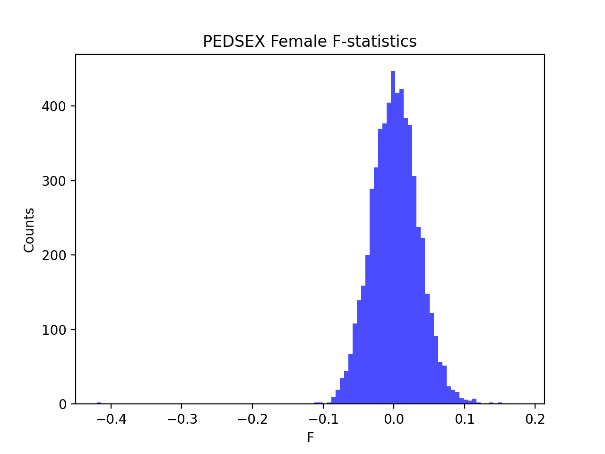

# Batch report for batch snp003, module mod5-pre-phasing
## Samples overview
12700 samples
 4312 kinship clusters
 4087 offspring with mother ID
 4087 offspring with mother in batch
 2047 mothers with offspring in batch
 0 mothers missing from batch
 4177 offspring with father ID
 4177 offspring with father in batch
 2087 fathers with offspring in batch
 0 fathers missing from batch
## Call rates
### Sample call rates
min: 0.895347
 max: 0.9999895488
 median: 0.9999007133 
### SNP call rates
min: 0.98
 max: 1.0
 median: 0.99724409 
## F_het
min: -0.207774
 max: 0.181718
 median: 0.00450449 
## Hardy-Weinberg P-values
min: 1.0102e-06
 max: 1.0
 median: 0.7055385000000001 
## Sexcheck
11943 out of 12700 OK 
| PEDSEX | Total | SNPSEX Male | SNPSEX Female | SNPSEX Unknown | OK | Problem |
| ------ | ------ | ------ | ------ | ------ | ------ | ------ |
| Male | 6012 | 6012 | 0 | 0 | 6012 | 0 |
| Female | 5931 | 0 | 5931 | 0 | 5931 | 0 |
| Unknown | 6 | 0 | 1 | 5 | 0 | 6 |

### All samples 
### All samples F-statistics
min: -0.4198
 max: 0.9926
 median: 0.9733 
### PEDSEX Male
### PEDSEX Male F-statistics
min: 0.8726
 max: 0.9926
 median: 0.9827 
### PEDSEX Female
### PEDSEX Female F-statistics
min: -0.4198
 max: 0.1829
 median: 0.001935 