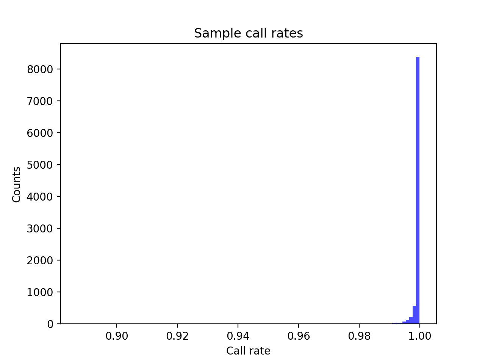
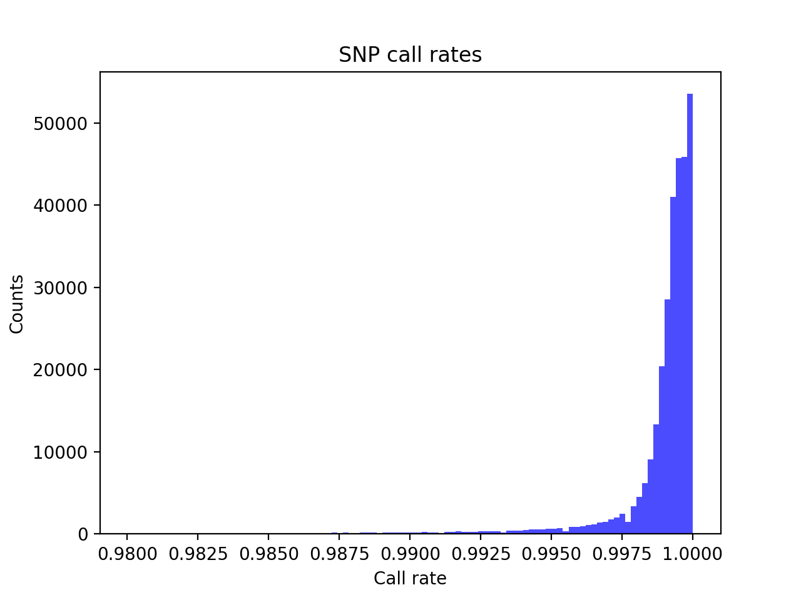
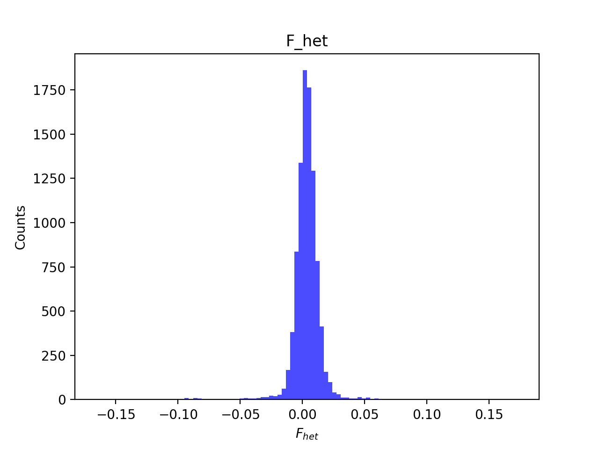
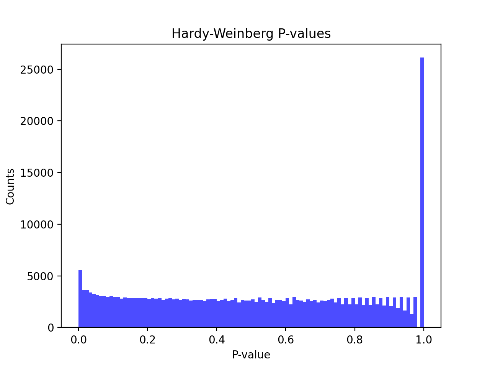
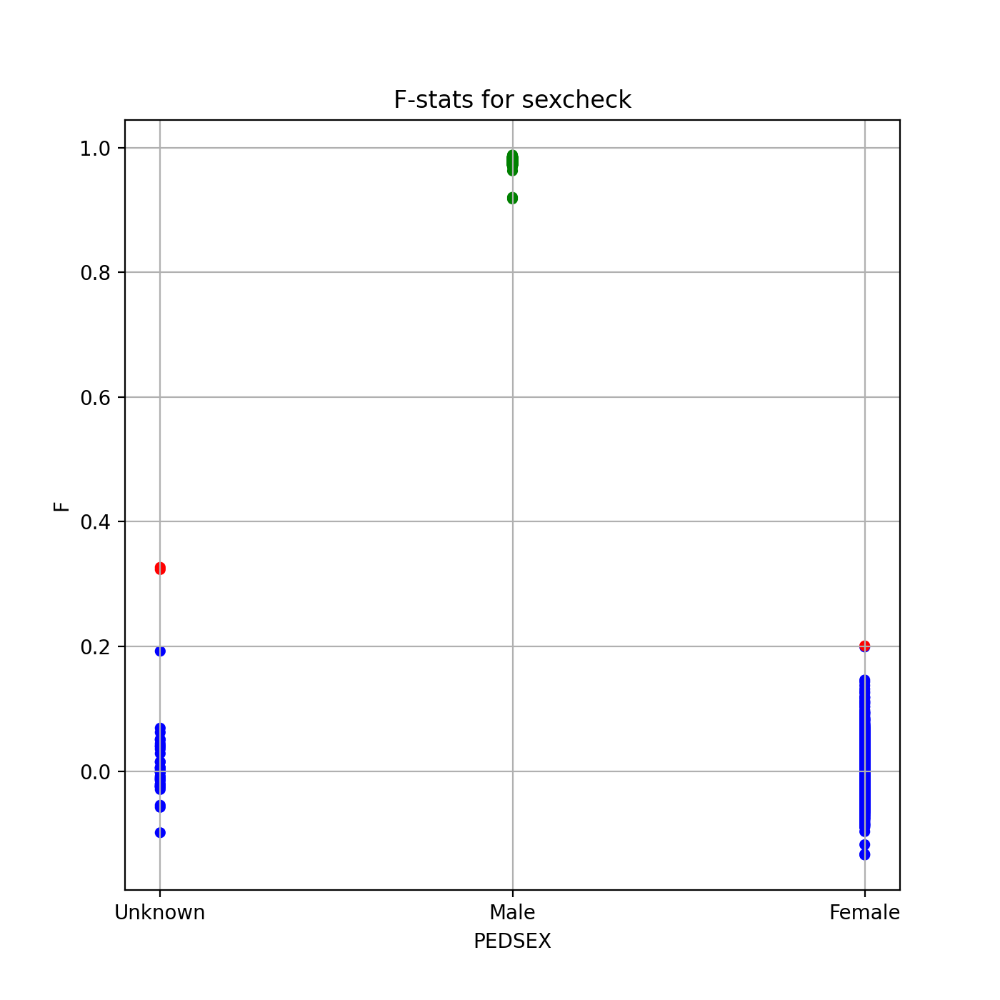
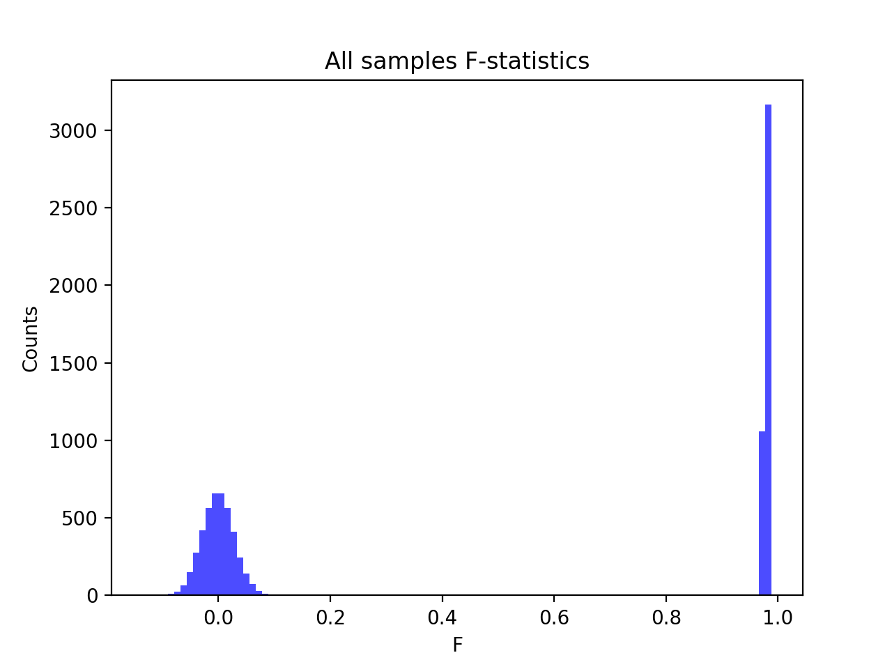
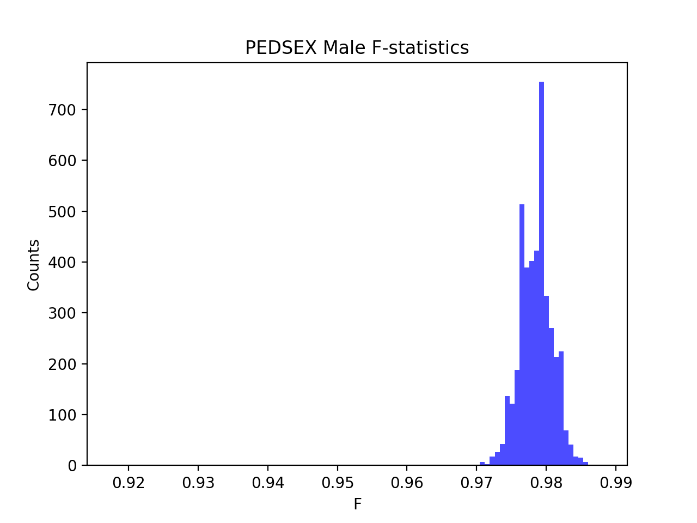
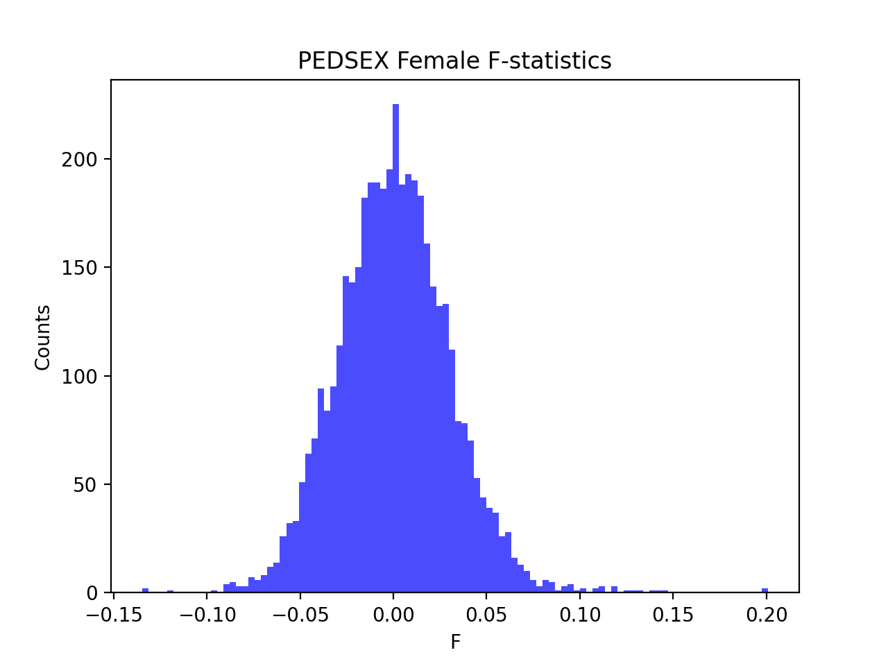

# Batch report for batch snp010, module mod5-pre-phasing
## Samples overview
9567 samples
 6067 kinship clusters
 1719 offspring with mother ID
 1719 offspring with mother in batch
 1052 mothers with offspring in batch
 0 mothers missing from batch
 1714 offspring with father ID
 1713 offspring with father in batch
 1043 fathers with offspring in batch
 1 fathers missing from batch
## Call rates
### Sample call rates
min: 0.88718
 max: 0.999854426
 median: 0.999516958 
### SNP call rates
min: 0.9800355
 max: 1.0
 median: 0.999372844 
## F_het
min: -0.165839
 max: 0.173214
 median: 0.00355127 
## Hardy-Weinberg P-values
min: 1.00382e-06
 max: 1.0
 median: 0.5070205 
## Sexcheck
8530 out of 9567 OK 
| PEDSEX | Total | SNPSEX Male | SNPSEX Female | SNPSEX Unknown | OK | Problem |
| ------ | ------ | ------ | ------ | ------ | ------ | ------ |
| Male | 4223 | 4223 | 0 | 0 | 4223 | 0 |
| Female | 4308 | 0 | 4307 | 1 | 4307 | 1 |
| Unknown | 37 | 0 | 35 | 2 | 0 | 37 |

### All samples 
### All samples F-statistics
min: -0.1346
 max: 0.9881
 median: 0.06953000000000001 
### PEDSEX Male
### PEDSEX Male F-statistics
min: 0.9176
 max: 0.9881
 median: 0.9785 
### PEDSEX Female
### PEDSEX Female F-statistics
min: -0.1346
 max: 0.2008
 median: 7.4885e-05 