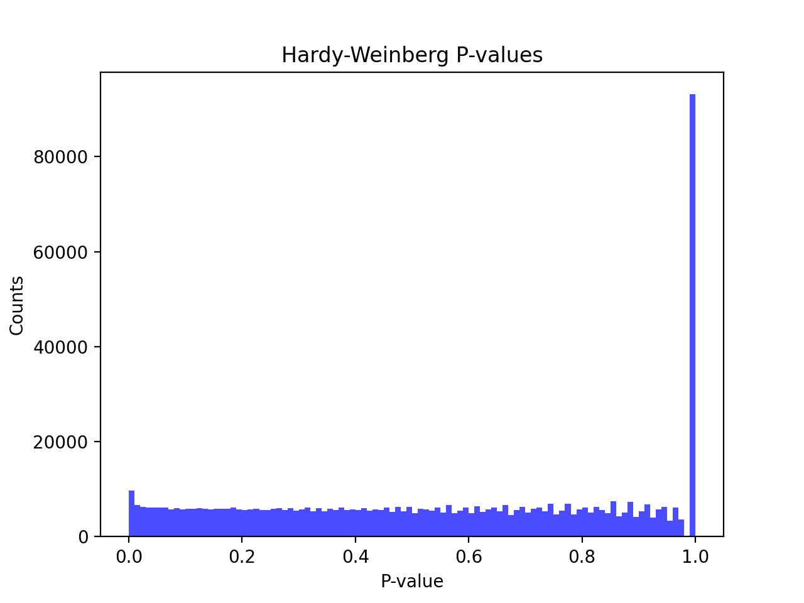

# Batch report for batch snp011, module mod5-pre-phasing
## Samples overview
5157 samples
 3128 kinship clusters
 549 offspring with mother ID
 549 offspring with mother in batch
 369 mothers with offspring in batch
 0 mothers missing from batch
 1447 offspring with father ID
 1446 offspring with father in batch
 989 fathers with offspring in batch
 1 fathers missing from batch
## Call rates
### Sample call rates
min: 0.888812
 max: 0.999728894
 median: 0.999296911 
### SNP call rates
min: 0.792515
 max: 1.0
 median: 0.999224355 
## F_het
min: -0.177853
 max: 0.16081
 median: 0.00354656 
## Hardy-Weinberg P-values
min: 1.02065e-06
 max: 1.0
 median: 0.5583374999999999 
## Sexcheck
4875 out of 5157 OK 
| PEDSEX | Total | SNPSEX Male | SNPSEX Female | SNPSEX Unknown | OK | Problem |
| ------ | ------ | ------ | ------ | ------ | ------ | ------ |
| Male | 2735 | 2735 | 0 | 0 | 2735 | 0 |
| Female | 2140 | 0 | 2140 | 0 | 2140 | 0 |
| Unknown | 41 | 0 | 38 | 3 | 0 | 41 |

### All samples 
### All samples F-statistics
min: -0.09413
 max: 0.9977
 median: 0.9916 
### PEDSEX Male
### PEDSEX Male F-statistics
min: 0.9534
 max: 0.9977
 median: 0.9933 
### PEDSEX Female
### PEDSEX Female F-statistics
min: -0.09413
 max: 0.1488
 median: 0.0005494 