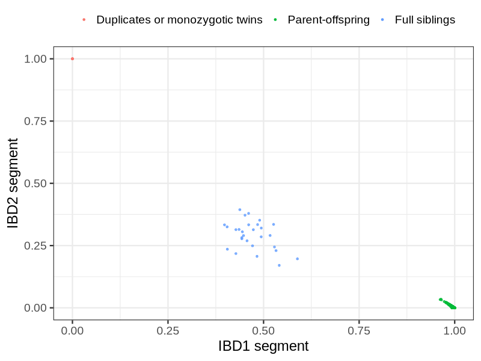
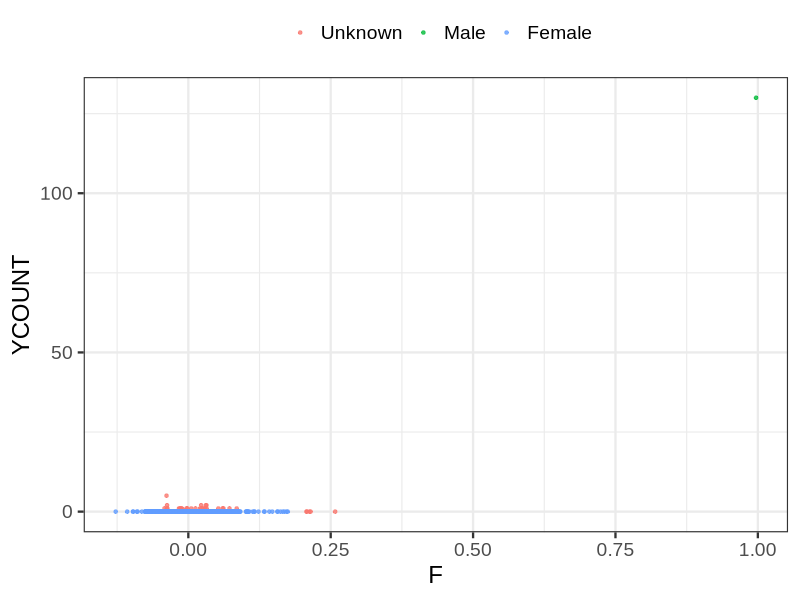
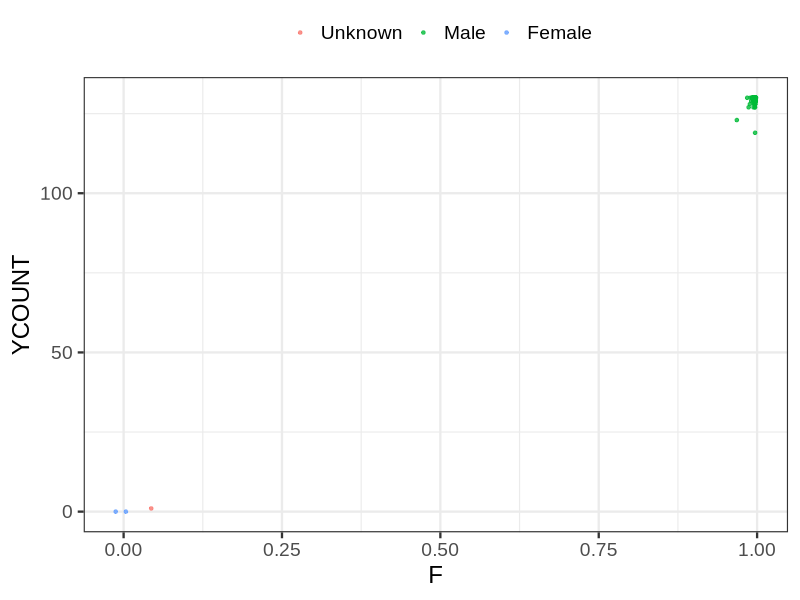

# Fam file reconstruction in snp011
## Samples not in Medical Birth Regsitry
37 samples with missing birth year, will be assumed to be parent.
## Relationship inference
| Relationship |   |
| ------------ | - |
| Duplicates or monozygotic twins| 5 |
| Parent-offspring| 2028 |
| Full siblings| 28 |
| 2nd degree| 0 |
| 3rd degree| 0 |
| 4th degree| 0 |
| Unrelated| 0 |

## Mother sex check
| Inferred sex |   |
| ------------ | - |
| Unknown | 34 |
| Male | 1 |
| Female | 1430 |

## Father sex check
| Inferred sex |   |
| ------------ | - |
| Unknown | 1 |
| Male | 772 |
| Female | 2 |

## Parental relationship
1666 mother-child relationships expected.
- 1656 (99.4%) recovered by genetic relationships.
- 10 (0.6%) not recovered by genetic relationships.

1027 father-child relationships expected.
- 1012 (98.54%) recovered by genetic relationships.
- 15 (1.46%) not recovered by genetic relationships.

2677 parent-offspring relationships detected
- 2668 (99.66%) match to registry.
- 9 (0.34%) do not match to registry.

## Exclusion
- Number of samples excluded: 25
