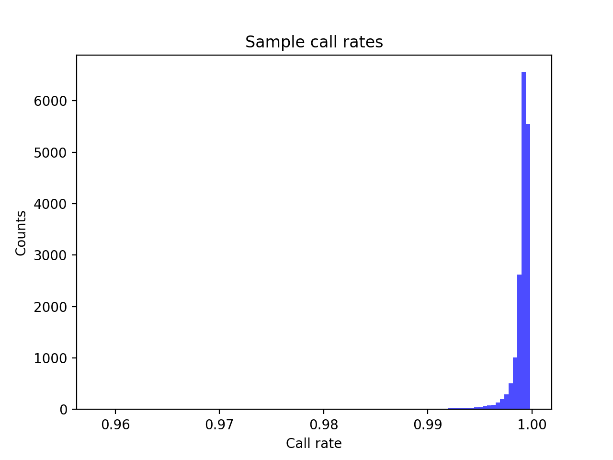
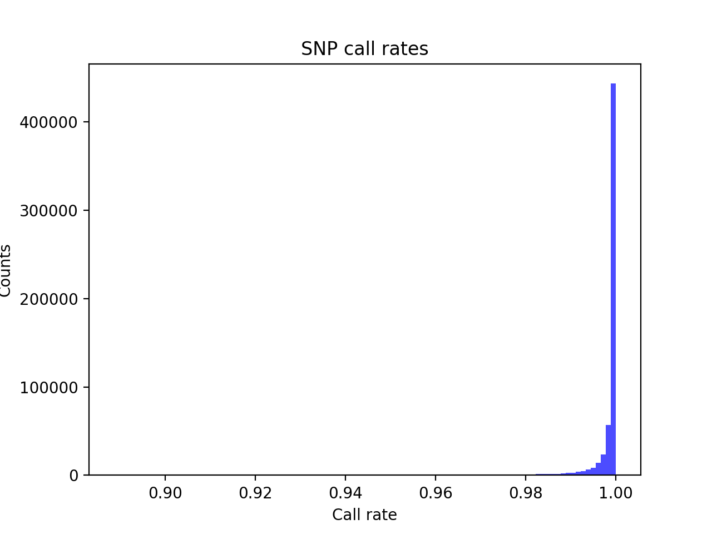
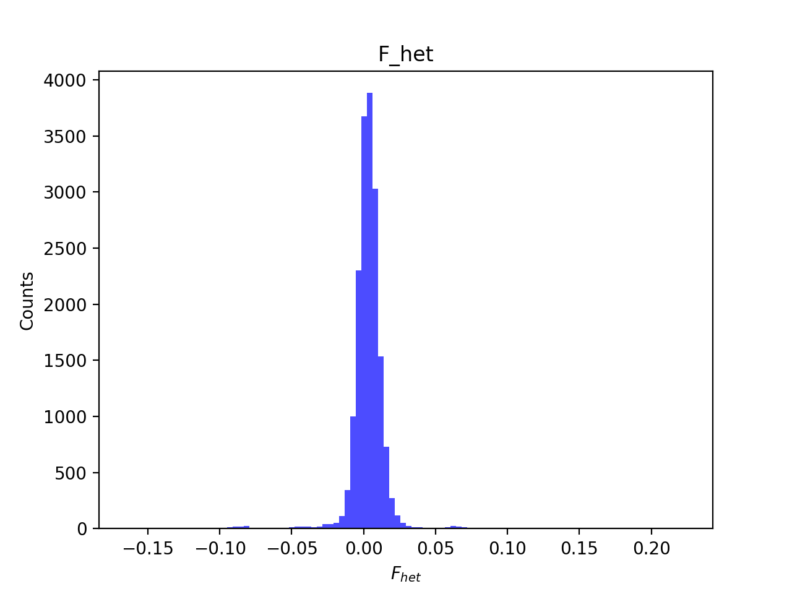
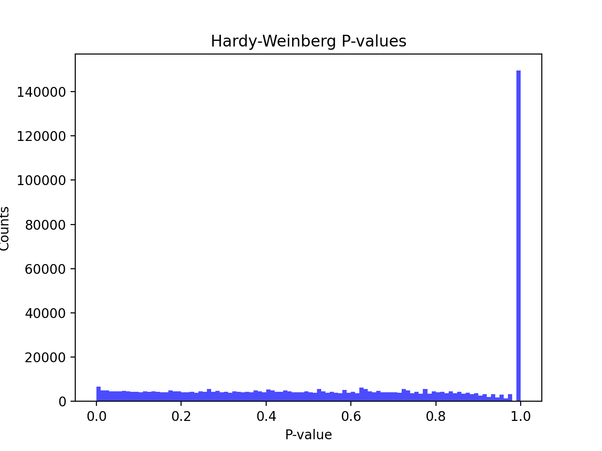
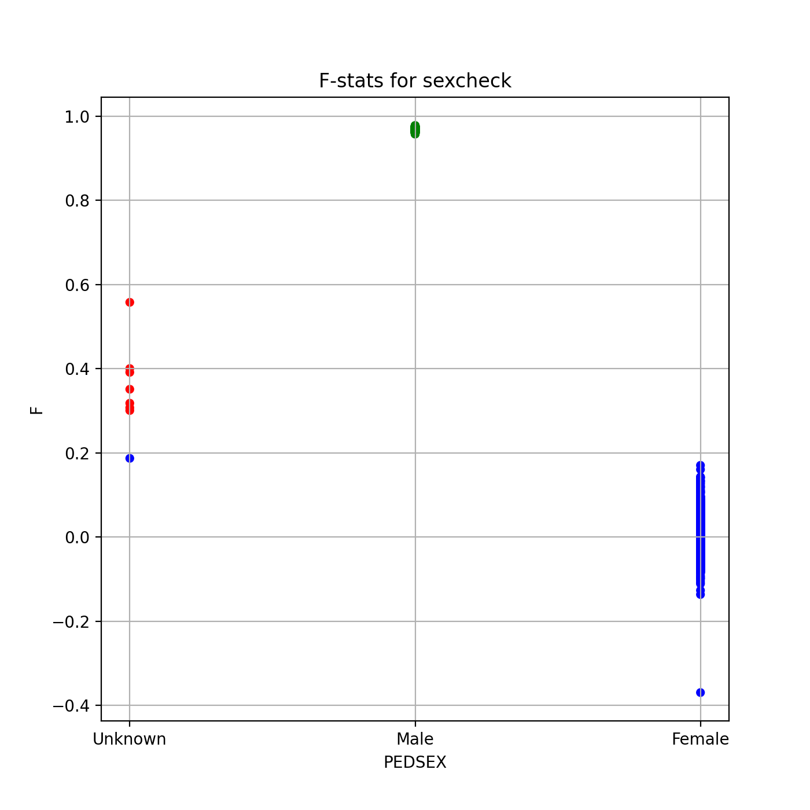
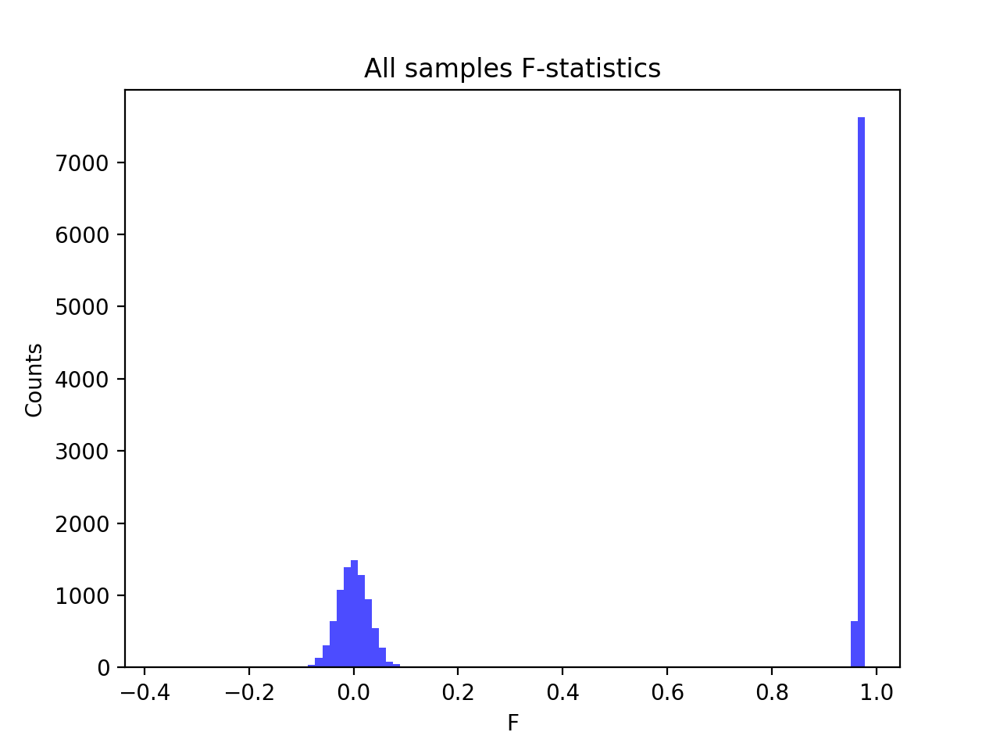
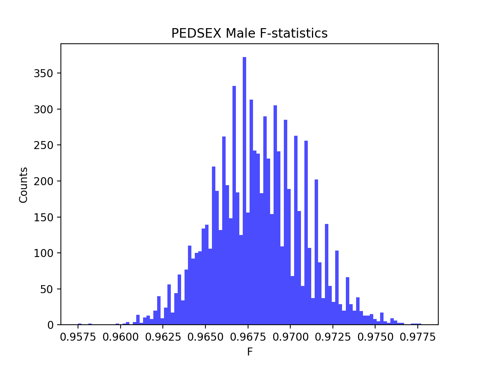
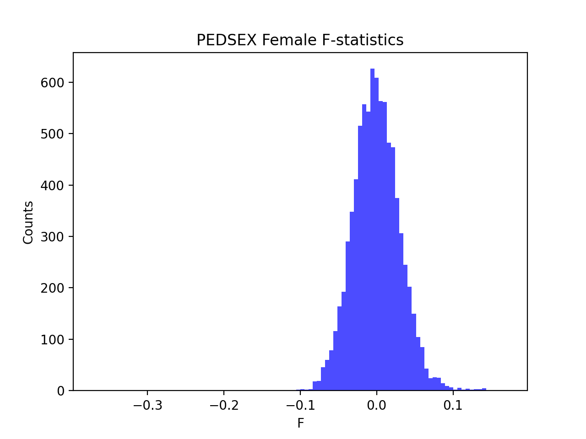

# Batch report for batch snp012, module mod5-pre-phasing
## Samples overview
17582 samples
 5996 kinship clusters
 5744 offspring with mother ID
 5737 offspring with mother in batch
 2911 mothers with offspring in batch
 7 mothers missing from batch
 5749 offspring with father ID
 5743 offspring with father in batch
 2909 fathers with offspring in batch
 6 fathers missing from batch
## Call rates
### Sample call rates
min: 0.9583585
 max: 0.999825312
 median: 0.999240712 
### SNP call rates
min: 0.888693
 max: 1.0
 median: 0.999715618 
## F_het
min: -0.164515
 max: 0.223319
 median: 0.0031883149999999997 
## Hardy-Weinberg P-values
min: 1.10929e-06
 max: 1.0
 median: 0.630943 
## Sexcheck
16591 out of 17582 OK 
| PEDSEX | Total | SNPSEX Male | SNPSEX Female | SNPSEX Unknown | OK | Problem |
| ------ | ------ | ------ | ------ | ------ | ------ | ------ |
| Male | 8259 | 8259 | 0 | 0 | 8259 | 0 |
| Female | 8332 | 0 | 8332 | 0 | 8332 | 0 |
| Unknown | 8 | 0 | 1 | 7 | 0 | 8 |

### All samples 
### All samples F-statistics
min: -0.3698
 max: 0.9777
 median: 0.09567 
### PEDSEX Male
### PEDSEX Male F-statistics
min: 0.9575
 max: 0.9777
 median: 0.9681 
### PEDSEX Female
### PEDSEX Female F-statistics
min: -0.3698
 max: 0.1702
 median: -0.0010845 