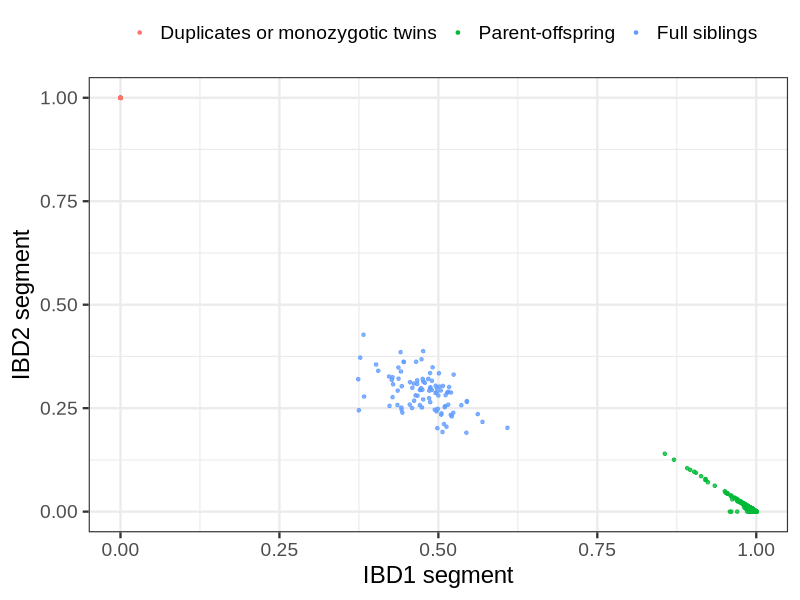
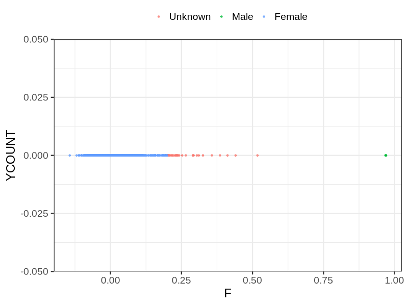
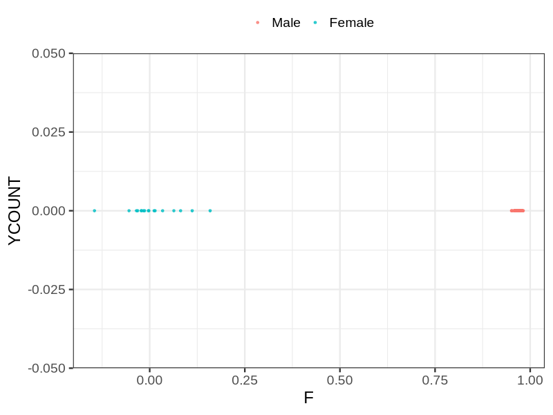

# Fam file reconstruction in snp012
## Samples not in Medical Birth Regsitry
37 samples with missing birth year, will be assumed to be parent.
## Relationship inference
| Relationship |   |
| ------------ | - |
| Duplicates or monozygotic twins| 37 |
| Parent-offspring| 11524 |
| Full siblings| 95 |
| 2nd degree| 0 |
| 3rd degree| 0 |
| 4th degree| 0 |
| Unrelated| 0 |

## Mother sex check
| Inferred sex |   |
| ------------ | - |
| Unknown | 36 |
| Male | 3 |
| Female | 5864 |

## Father sex check
| Inferred sex |   |
| ------------ | - |
| Unknown | 0 |
| Male | 5858 |
| Female | 17 |

## Parental relationship
5903 mother-child relationships expected.
- 5869 (99.42%) recovered by genetic relationships.
- 34 (0.58%) not recovered by genetic relationships.

5960 father-child relationships expected.
- 5906 (99.09%) recovered by genetic relationships.
- 54 (0.91%) not recovered by genetic relationships.

11819 parent-offspring relationships detected
- 11775 (99.63%) match to registry.
- 44 (0.37%) do not match to registry.

## Exclusion
- Number of samples excluded: 106
