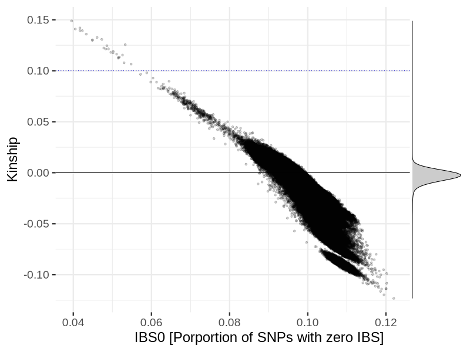
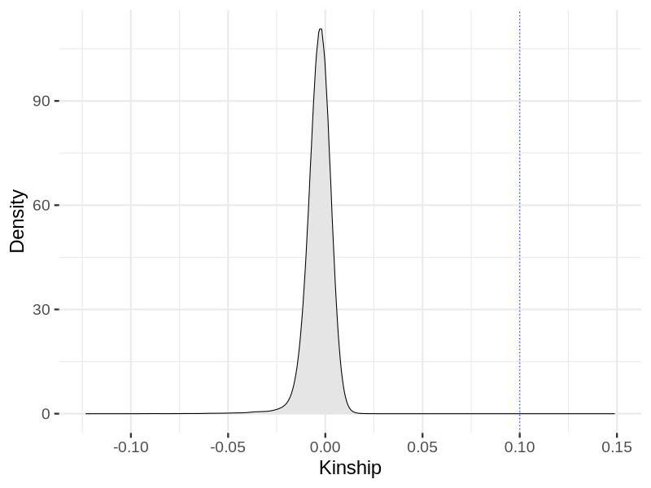
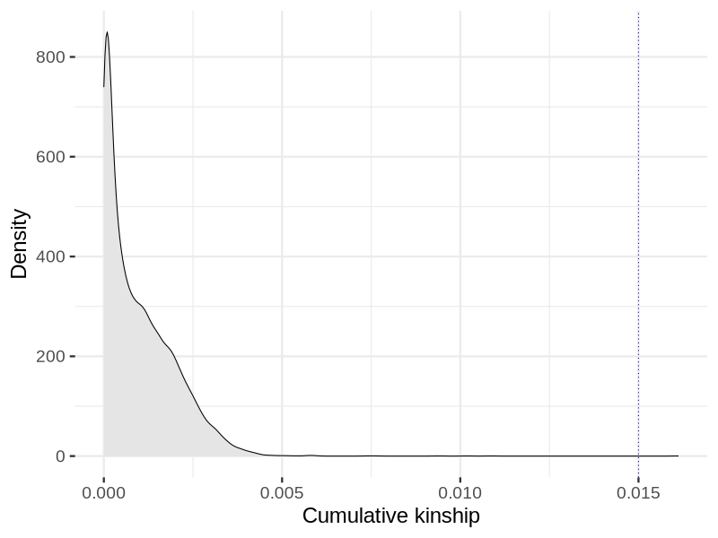
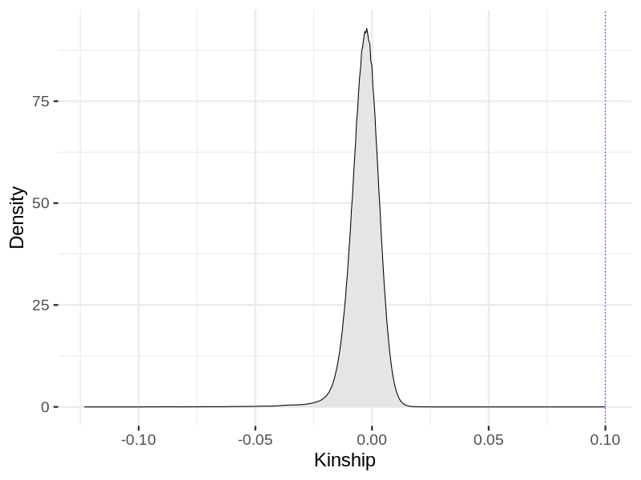
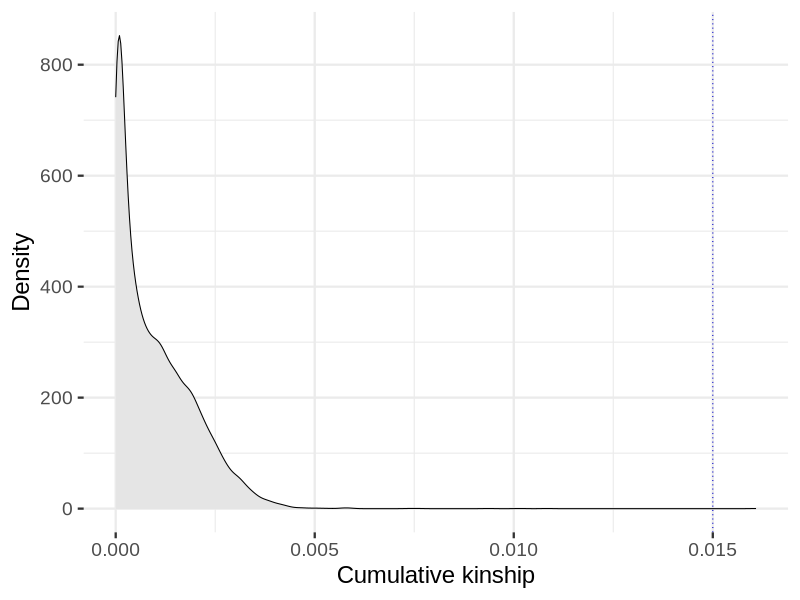

# Kinship filtering in offspring in snp012
Relatedness filtering, {length(ids)} individuals.
## Relatedness

## Relatedness
- Pairwise kinship

- Cummulative positive kinship

Percolation of the relatedness graph using a Kinship threshold of 0.1: 25 excluded, 11139 remaining.
## Relatedness after relatedness filtering
- Pairwise kinship

- Cummulative positive kinship

Removal of samples with accumulated kinship using threshold of 0.015: 1 excluded, 11138 remaining.
