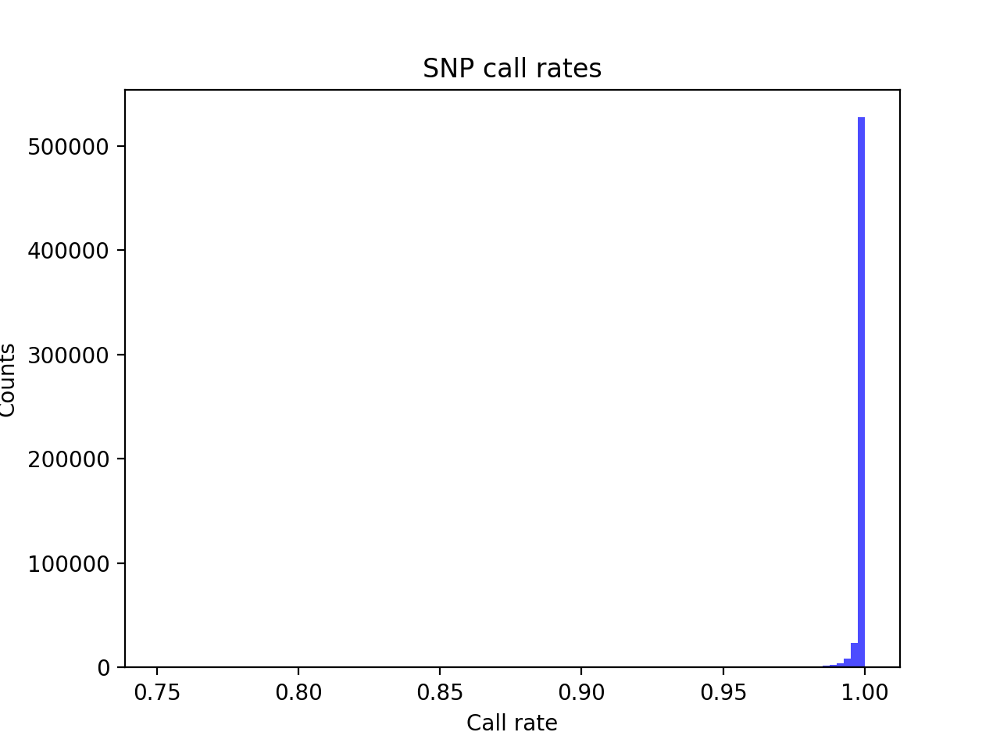

# Batch report for batch snp014, module mod5-pre-phasing
## Samples overview
8781 samples
 3027 kinship clusters
 2802 offspring with mother ID
 2793 offspring with mother in batch
 1412 mothers with offspring in batch
 9 mothers missing from batch
 2948 offspring with father ID
 2939 offspring with father in batch
 1485 fathers with offspring in batch
 9 fathers missing from batch
## Call rates
### Sample call rates
min: 0.9493474
 max: 0.999875305
 median: 0.999517025 
### SNP call rates
min: 0.751167
 max: 1.0
 median: 0.999772236 
## F_het
min: -0.162928
 max: 0.181562
 median: 0.00321149 
## Hardy-Weinberg P-values
min: 1.01226e-06
 max: 1.0
 median: 0.654884 
## Sexcheck
8193 out of 8781 OK 
| PEDSEX | Total | SNPSEX Male | SNPSEX Female | SNPSEX Unknown | OK | Problem |
| ------ | ------ | ------ | ------ | ------ | ------ | ------ |
| Male | 4141 | 4141 | 0 | 0 | 4141 | 0 |
| Female | 4052 | 0 | 4052 | 0 | 4052 | 0 |
| Unknown | 3 | 0 | 0 | 3 | 0 | 3 |

### All samples 
### All samples F-statistics
min: -0.3649
 max: 1.0
 median: 0.9629 
### PEDSEX Male
### PEDSEX Male F-statistics
min: 0.9552
 max: 1.0
 median: 0.9689 
### PEDSEX Female
### PEDSEX Female F-statistics
min: -0.3649
 max: 0.1671
 median: 0.0007836 