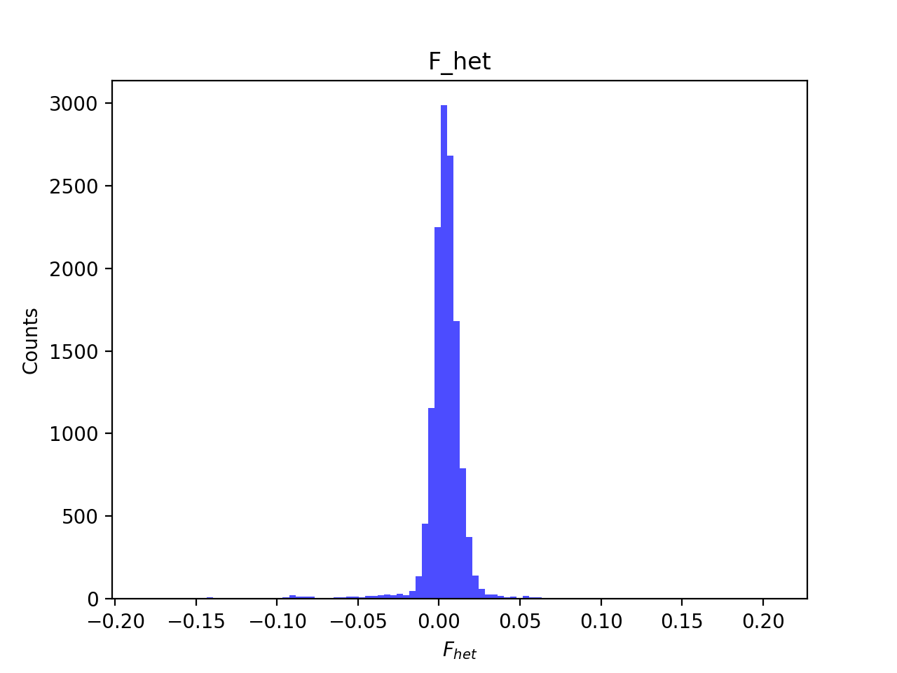

# Batch report for batch snp015a, module mod5-pre-phasing
## Samples overview
13365 samples
 8390 kinship clusters
 2394 offspring with mother ID
 2394 offspring with mother in batch
 1582 mothers with offspring in batch
 0 mothers missing from batch
 2472 offspring with father ID
 2472 offspring with father in batch
 1621 fathers with offspring in batch
 0 fathers missing from batch
## Call rates
### Sample call rates
min: 0.879963
 max: 0.999855721
 median: 0.999524536 
### SNP call rates
min: 0.9800224
 max: 1.0
 median: 0.99895249 
## F_het
min: -0.182255
 max: 0.207848
 median: 0.00402471 
## Hardy-Weinberg P-values
min: 1.03749e-06
 max: 1.0
 median: 0.5024005 
## Sexcheck
12624 out of 13365 OK 
| PEDSEX | Total | SNPSEX Male | SNPSEX Female | SNPSEX Unknown | OK | Problem |
| ------ | ------ | ------ | ------ | ------ | ------ | ------ |
| Male | 6371 | 6371 | 0 | 0 | 6371 | 0 |
| Female | 6254 | 0 | 6253 | 1 | 6253 | 1 |
| Unknown | 1 | 0 | 0 | 1 | 0 | 1 |

### All samples 
### All samples F-statistics
min: -0.3315
 max: 0.987
 median: 0.97305 
### PEDSEX Male
### PEDSEX Male F-statistics
min: 0.9573
 max: 0.987
 median: 0.9791 
### PEDSEX Female
### PEDSEX Female F-statistics
min: -0.3315
 max: 0.2129
 median: -0.001189 