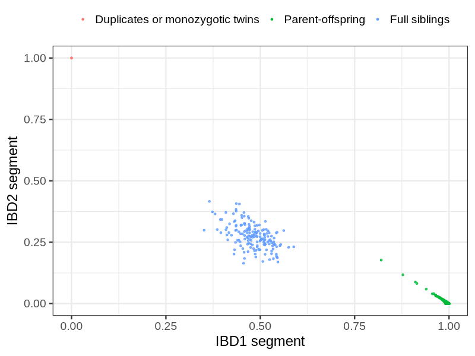
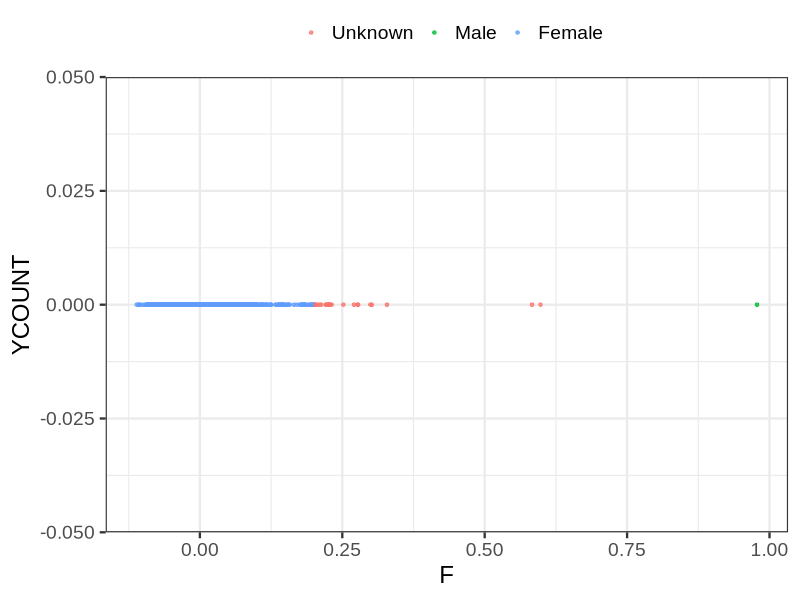
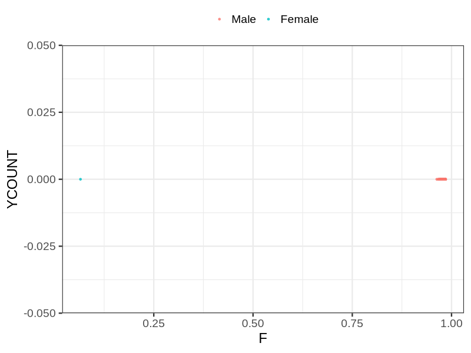

# Fam file reconstruction in snp015a
## Samples not in Medical Birth Regsitry
41 samples with missing birth year, will be assumed to be parent.
## Relationship inference
| Relationship |   |
| ------------ | - |
| Duplicates or monozygotic twins| 2 |
| Parent-offspring| 4930 |
| Full siblings| 169 |
| 2nd degree| 0 |
| 3rd degree| 0 |
| 4th degree| 0 |
| Unrelated| 0 |

## Mother sex check
| Inferred sex |   |
| ------------ | - |
| Unknown | 25 |
| Male | 1 |
| Female | 3881 |

## Father sex check
| Inferred sex |   |
| ------------ | - |
| Unknown | 0 |
| Male | 3901 |
| Female | 1 |

## Parental relationship
2587 mother-child relationships expected.
- 2575 (99.54%) recovered by genetic relationships.
- 12 (0.46%) not recovered by genetic relationships.

2378 father-child relationships expected.
- 2361 (99.29%) recovered by genetic relationships.
- 17 (0.71%) not recovered by genetic relationships.

4949 parent-offspring relationships detected
- 4936 (99.74%) match to registry.
- 13 (0.26%) do not match to registry.

## Exclusion
- Number of samples excluded: 43
