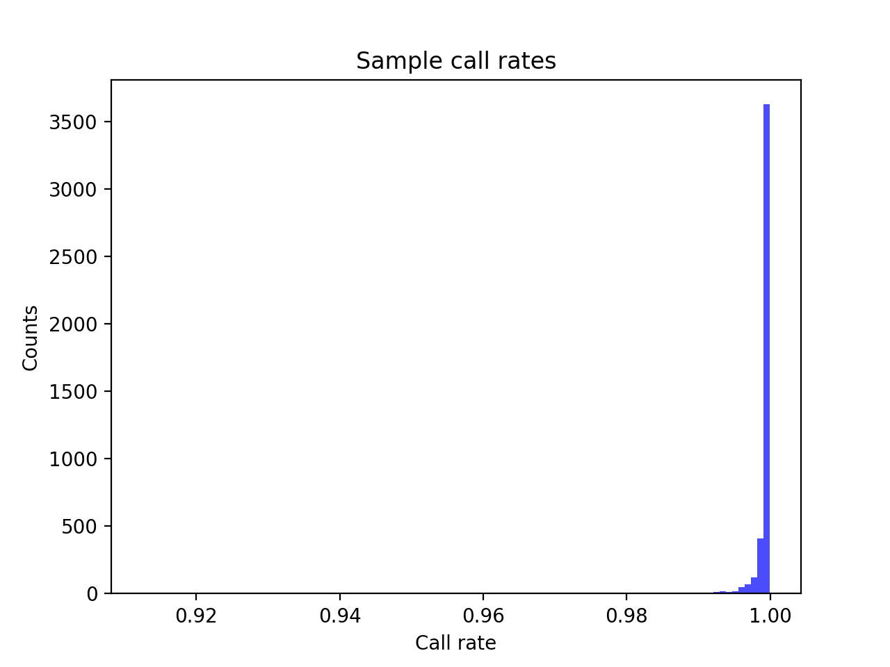
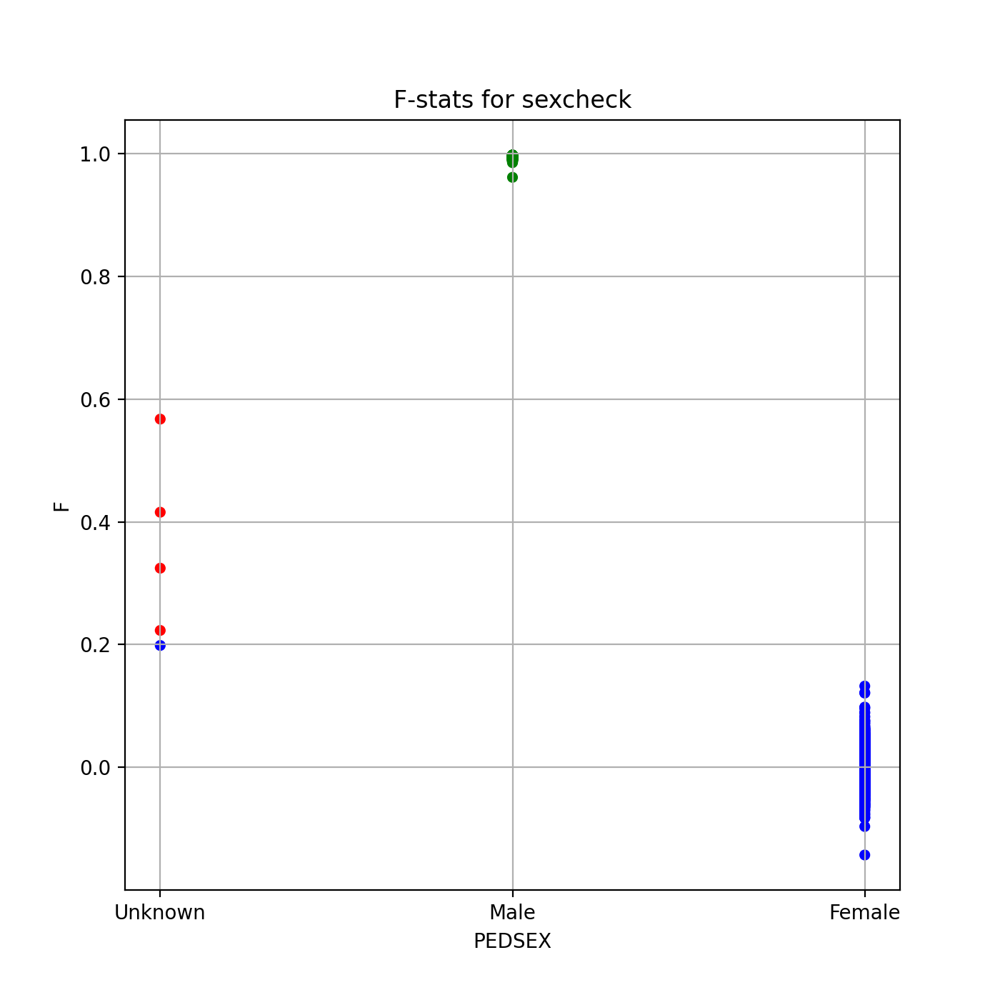

# Batch report for batch snp015b, module mod5-harmonization
## Samples overview
4363 samples
 3767 kinship clusters
 271 offspring with mother ID
 270 offspring with mother in batch
 217 mothers with offspring in batch
 1 mothers missing from batch
 309 offspring with father ID
 309 offspring with father in batch
 257 fathers with offspring in batch
 0 fathers missing from batch
## Call rates
### Sample call rates
min: 0.9125228
 max: 0.9999074417
 median: 0.99963615 
### SNP call rates
min: 0.9800596
 max: 1.0
 median: 0.9997708 
## F_het
min: -0.139123
 max: 0.239419
 median: 0.00356856 
## Hardy-Weinberg P-values
min: 1.00895e-06
 max: 1.0
 median: 0.5272535 
## Sexcheck
4138 out of 4363 OK 
| PEDSEX | Total | SNPSEX Male | SNPSEX Female | SNPSEX Unknown | OK | Problem |
| ------ | ------ | ------ | ------ | ------ | ------ | ------ |
| Male | 2094 | 2094 | 0 | 0 | 2094 | 0 |
| Female | 2044 | 0 | 2044 | 0 | 2044 | 0 |
| Unknown | 5 | 0 | 1 | 4 | 0 | 5 |

### All samples 
### All samples F-statistics
min: -0.1428
 max: 0.9977
 median: 0.9896 
### PEDSEX Male
### PEDSEX Male F-statistics
min: 0.9613
 max: 0.9977
 median: 0.9941 
### PEDSEX Female
### PEDSEX Female F-statistics
min: -0.1428
 max: 0.1324
 median: 0.00036835 