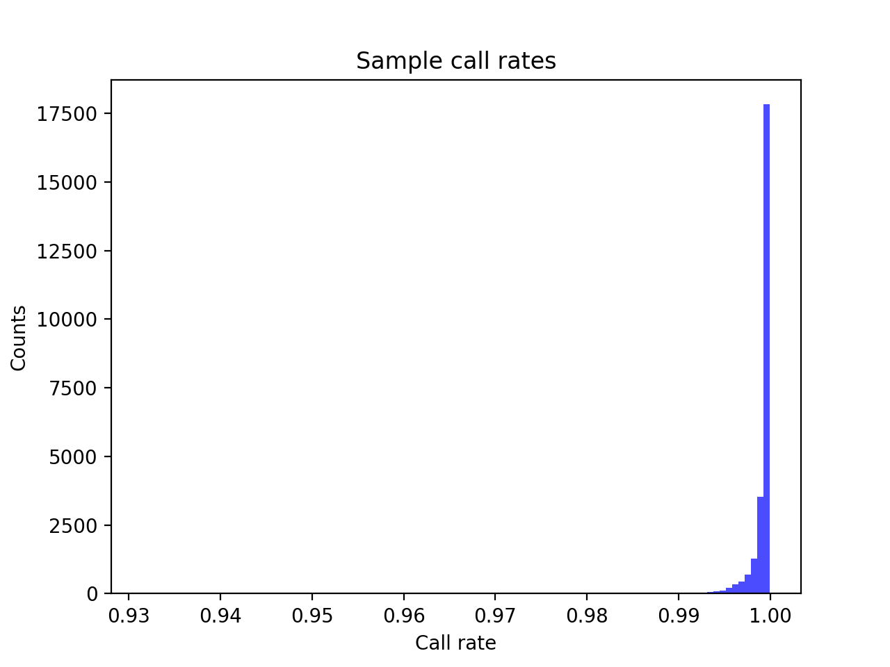
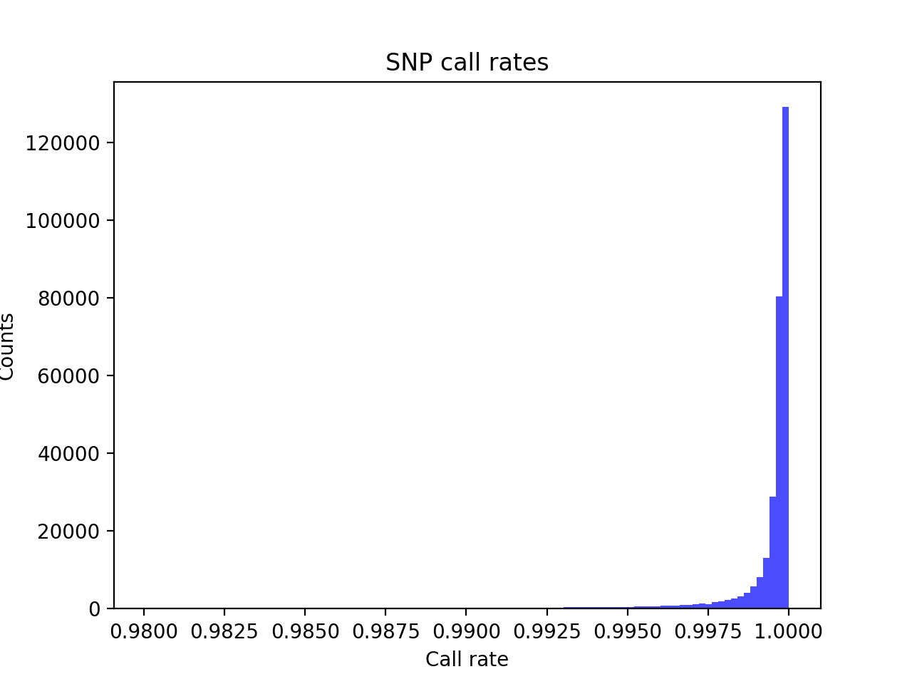
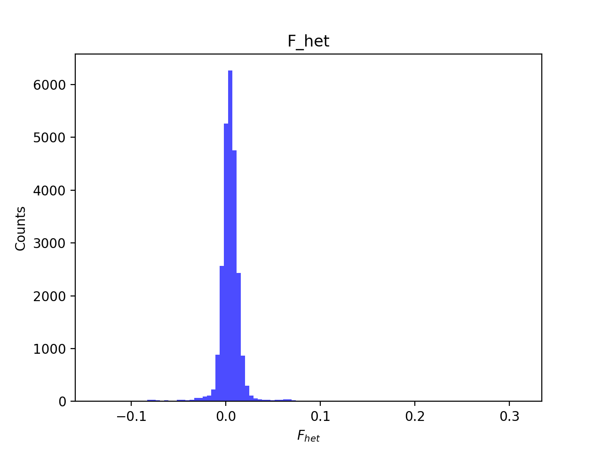
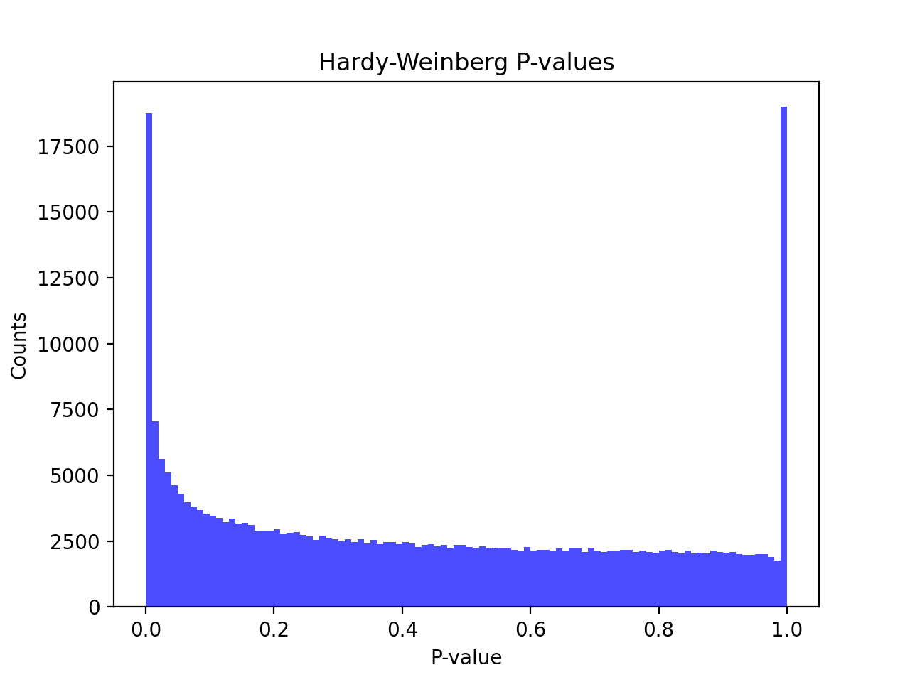
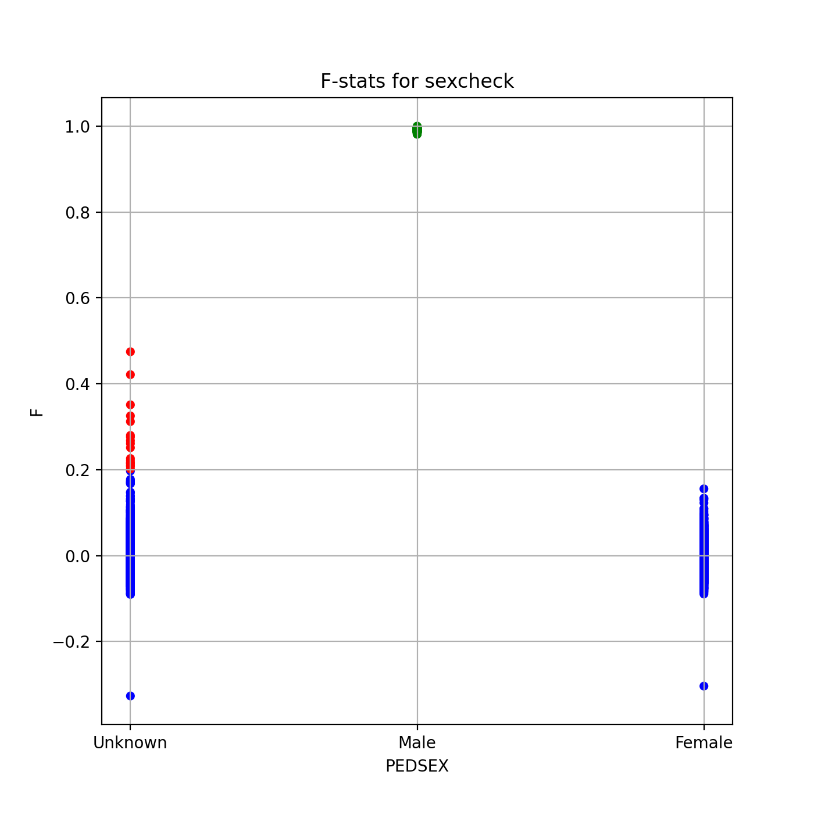
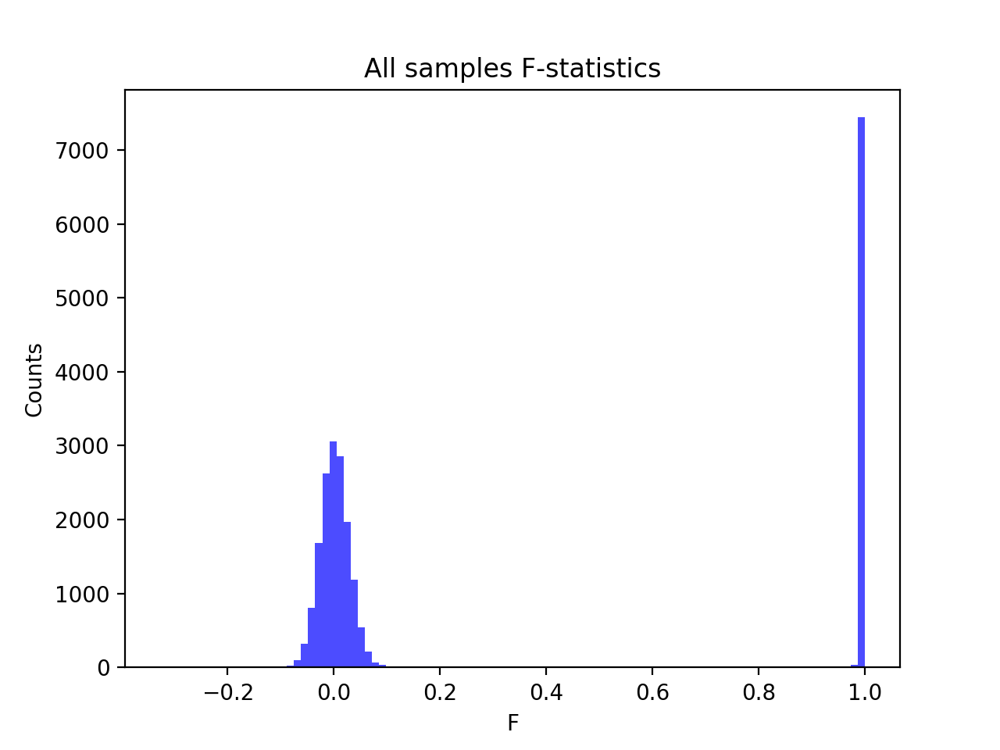
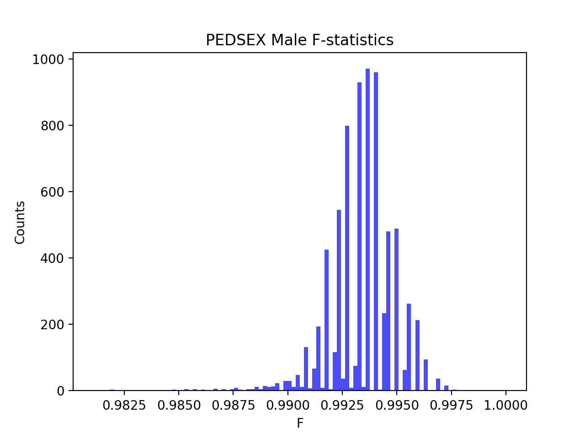
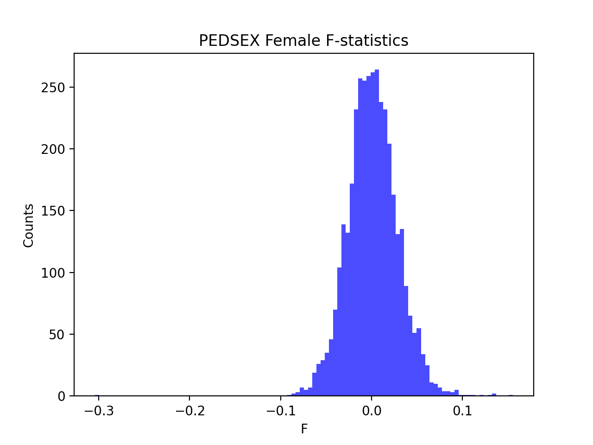

# Batch report for batch snp016a, module mod5-pre-phasing
## Samples overview
24686 samples
 21244 kinship clusters
 355 offspring with mother ID
 355 offspring with mother in batch
 329 mothers with offspring in batch
 0 mothers missing from batch
 1540 offspring with father ID
 1539 offspring with father in batch
 1429 fathers with offspring in batch
 1 fathers missing from batch
## Call rates
### Sample call rates
min: 0.9315148
 max: 0.9999182598
 median: 0.999571681 
### SNP call rates
min: 0.9800697
 max: 1.0
 median: 0.999756947 
## F_het
min: -0.136644
 max: 0.311913
 median: 0.00437131 
## Hardy-Weinberg P-values
min: 1.00076e-06
 max: 1.0
 median: 0.4048355 
## Sexcheck
11272 out of 24686 OK 
| PEDSEX | Total | SNPSEX Male | SNPSEX Female | SNPSEX Unknown | OK | Problem |
| ------ | ------ | ------ | ------ | ------ | ------ | ------ |
| Male | 7470 | 7470 | 0 | 0 | 7470 | 0 |
| Female | 3802 | 0 | 3802 | 0 | 3802 | 0 |
| Unknown | 11762 | 0 | 11745 | 17 | 0 | 11762 |

### All samples 
### All samples F-statistics
min: -0.327
 max: 1.0
 median: 0.018224999999999998 
### PEDSEX Male
### PEDSEX Male F-statistics
min: 0.9811
 max: 1.0
 median: 0.9936 
### PEDSEX Female
### PEDSEX Female F-statistics
min: -0.3041
 max: 0.1554
 median: 0.0009677500000000001 