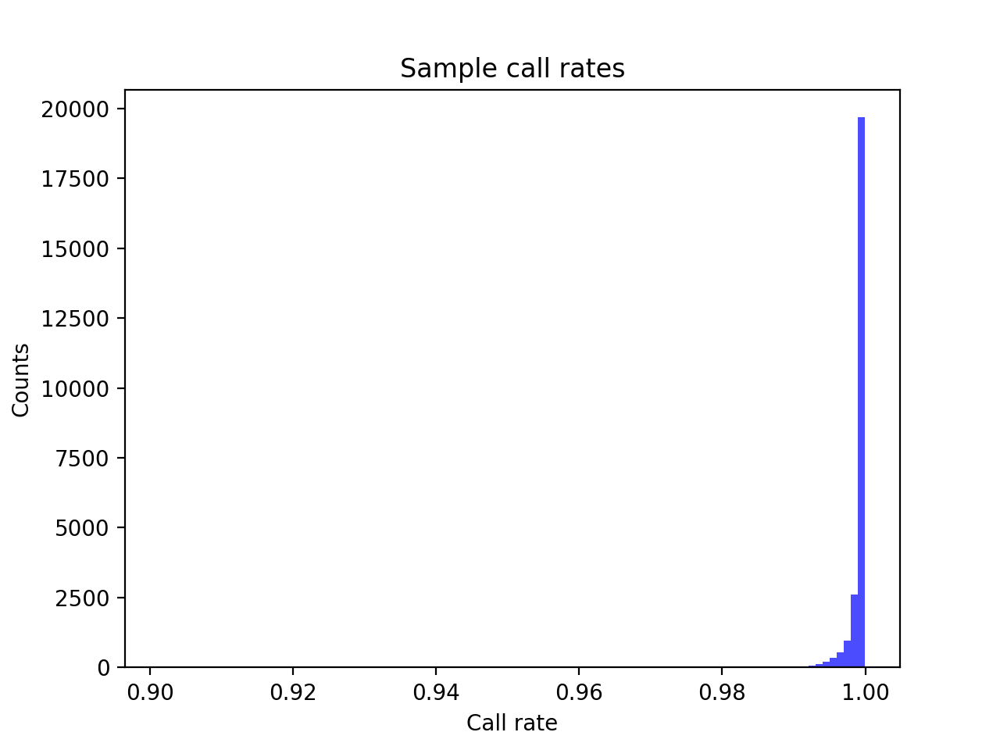
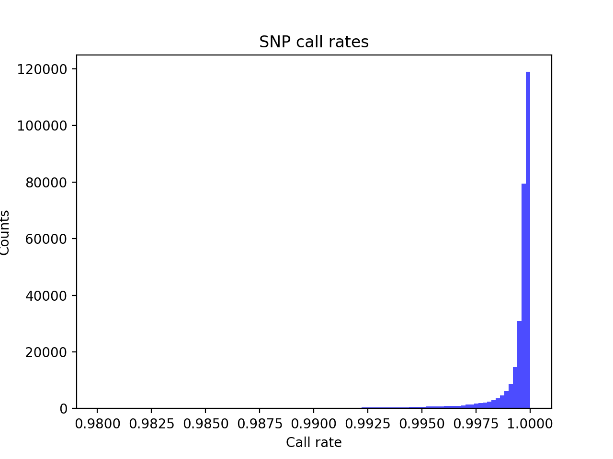
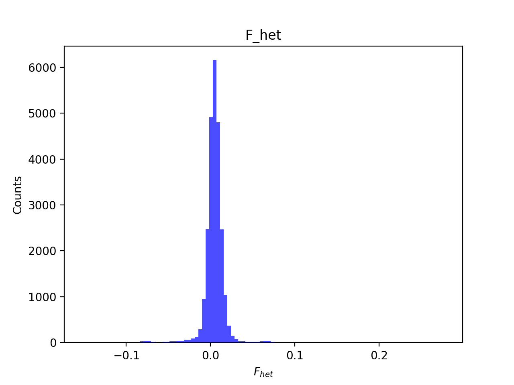
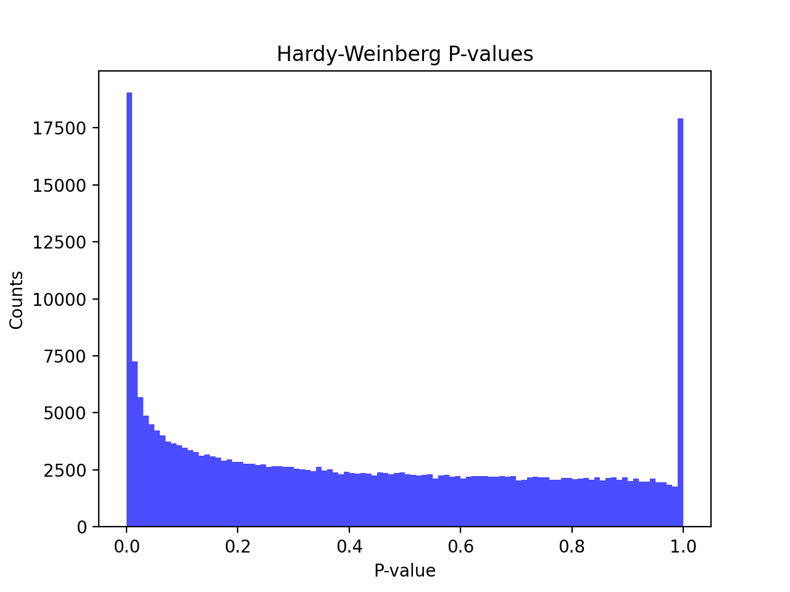
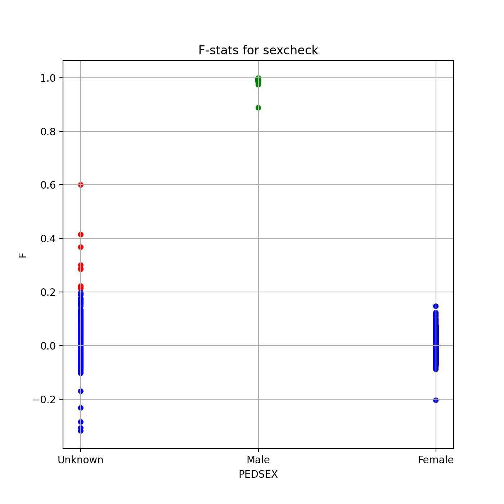
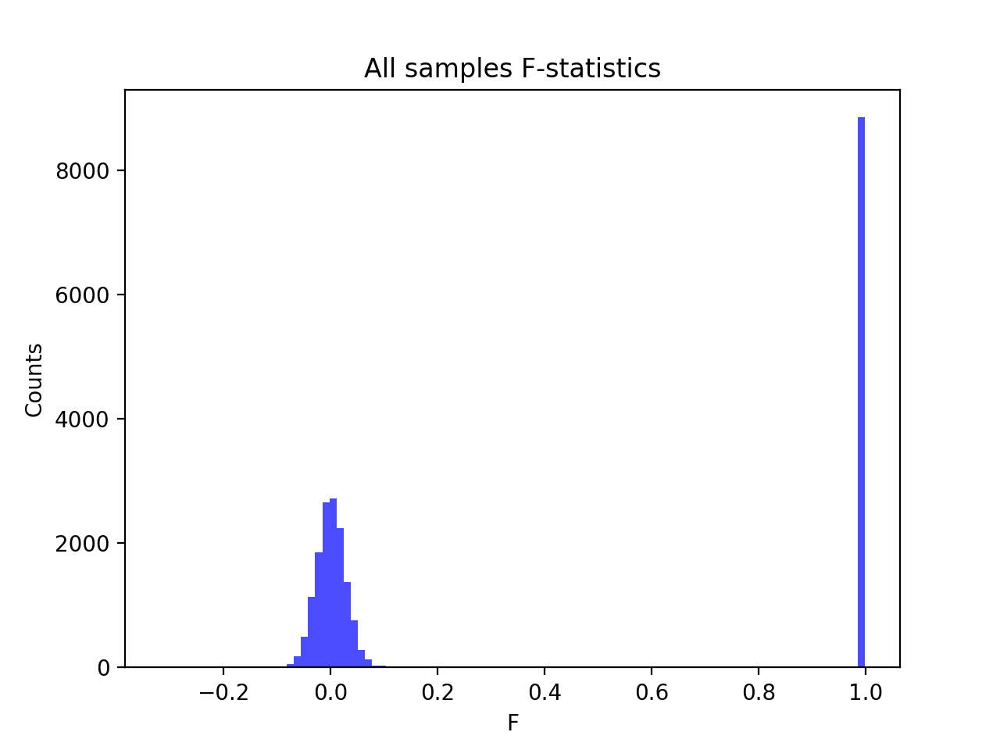
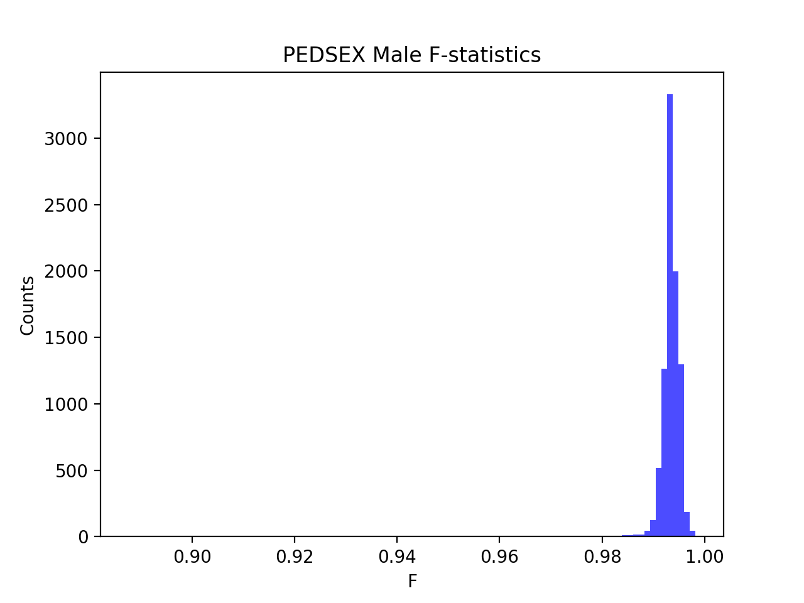
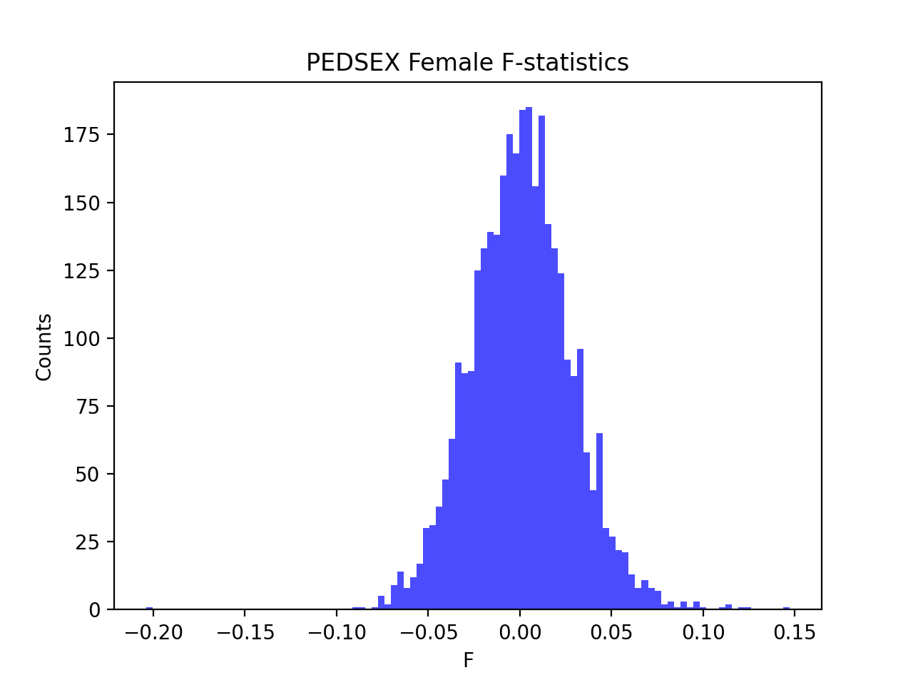

# Batch report for batch snp016b, module mod5-pre-phasing
## Samples overview
24749 samples
 21617 kinship clusters
 335 offspring with mother ID
 335 offspring with mother in batch
 309 mothers with offspring in batch
 0 mothers missing from batch
 1366 offspring with father ID
 1366 offspring with father in batch
 1217 fathers with offspring in batch
 0 fathers missing from batch
## Call rates
### Sample call rates
min: 0.9014734
 max: 0.9999244755
 median: 0.999569839 
### SNP call rates
min: 0.9800396
 max: 1.0
 median: 0.999757566 
## F_het
min: -0.152077
 max: 0.277561
 median: 0.00463623 
## Hardy-Weinberg P-values
min: 1.00339e-06
 max: 1.0
 median: 0.405475 
## Sexcheck
12173 out of 24749 OK 
| PEDSEX | Total | SNPSEX Male | SNPSEX Female | SNPSEX Unknown | OK | Problem |
| ------ | ------ | ------ | ------ | ------ | ------ | ------ |
| Male | 8874 | 8874 | 0 | 0 | 8874 | 0 |
| Female | 3299 | 0 | 3299 | 0 | 3299 | 0 |
| Unknown | 10699 | 0 | 10690 | 9 | 0 | 10699 |

### All samples 
### All samples F-statistics
min: -0.3182
 max: 0.9982
 median: 0.02466 
### PEDSEX Male
### PEDSEX Male F-statistics
min: 0.8876
 max: 0.9982
 median: 0.9936 
### PEDSEX Female
### PEDSEX Female F-statistics
min: -0.2038
 max: 0.1471
 median: 0.0009416 