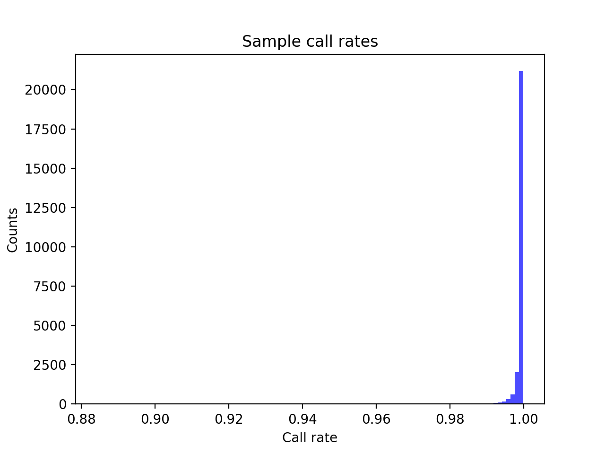
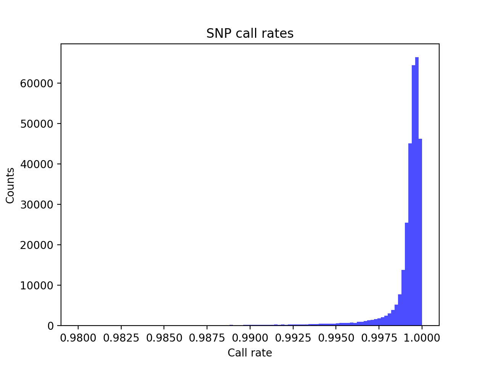
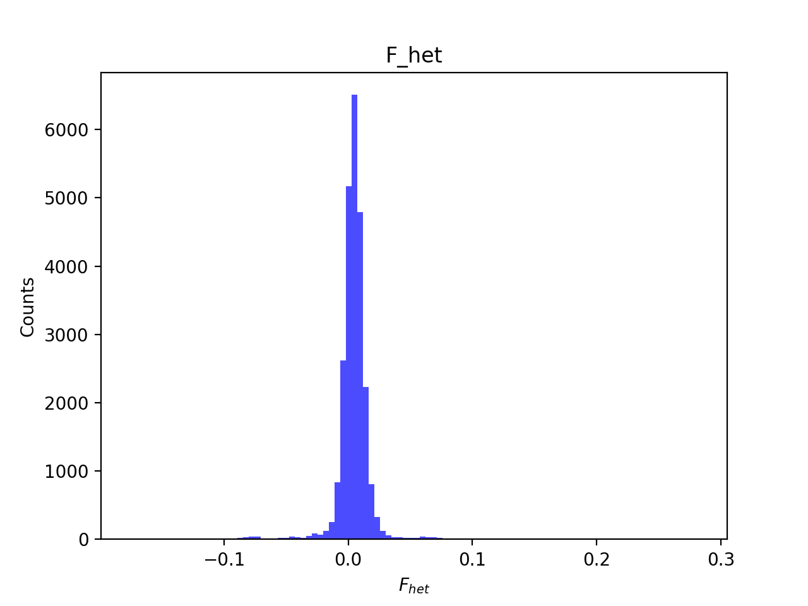
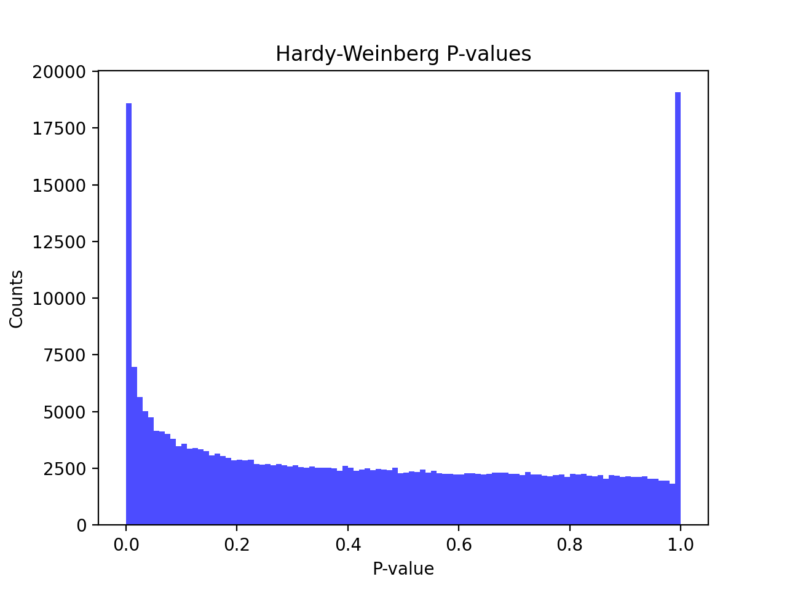
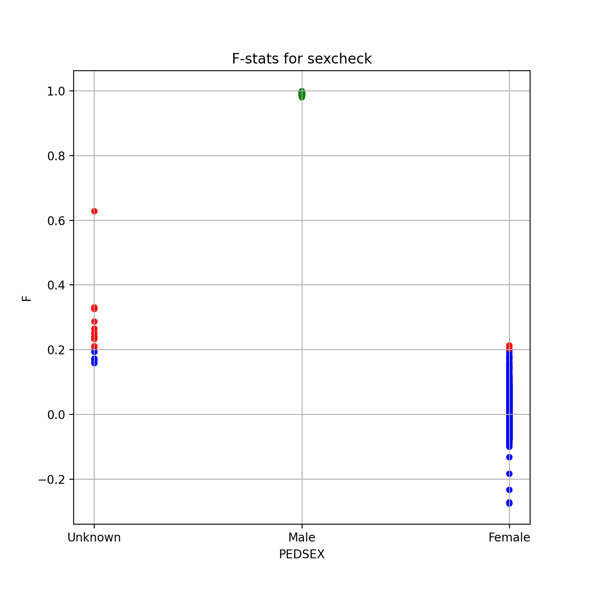
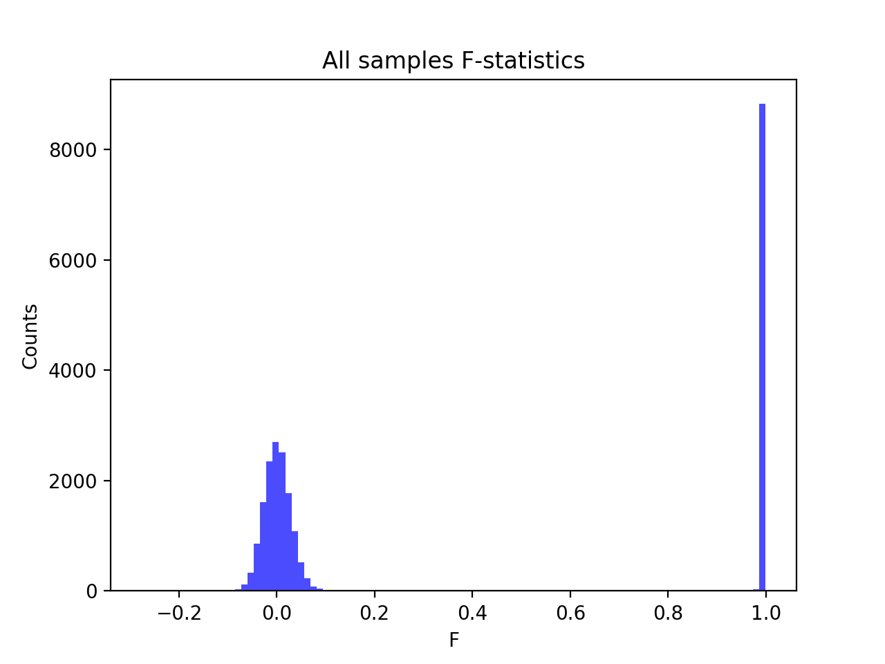
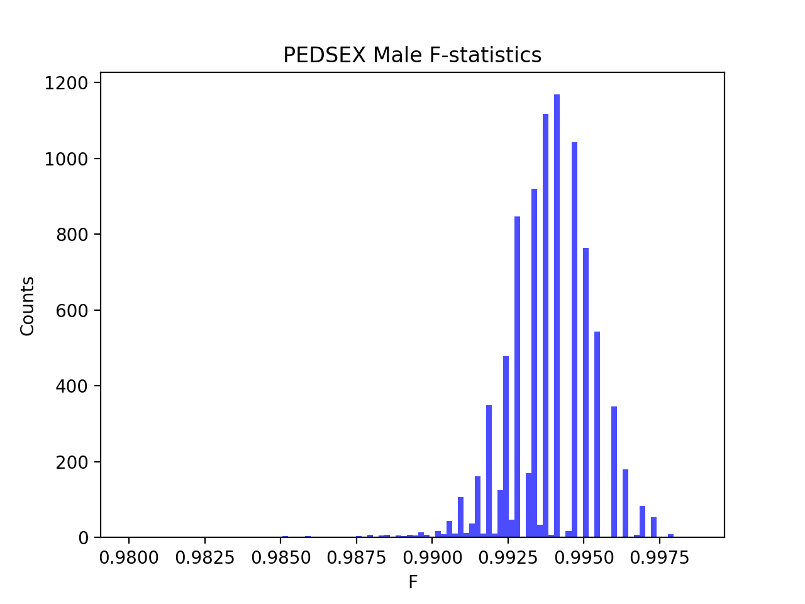
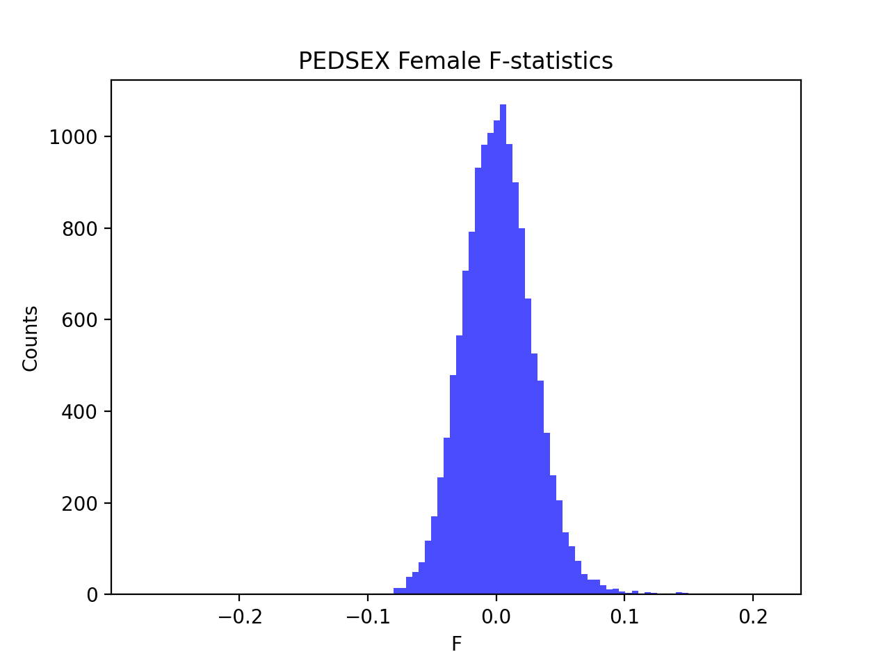

# Batch report for batch snp017a, module mod5-pre-phasing
## Samples overview
24757 samples
 21390 kinship clusters
 1552 offspring with mother ID
 1551 offspring with mother in batch
 1366 mothers with offspring in batch
 1 mothers missing from batch
 1509 offspring with father ID
 1508 offspring with father in batch
 1324 fathers with offspring in batch
 1 fathers missing from batch
## Call rates
### Sample call rates
min: 0.88428
 max: 0.9999135986
 median: 0.999590393 
### SNP call rates
min: 0.9800057
 max: 1.0
 median: 0.999474896 
## F_het
min: -0.176088
 max: 0.282167
 median: 0.00462349 
## Hardy-Weinberg P-values
min: 1.00376e-06
 max: 1.0
 median: 0.4132045 
## Sexcheck
23164 out of 24757 OK 
| PEDSEX | Total | SNPSEX Male | SNPSEX Female | SNPSEX Unknown | OK | Problem |
| ------ | ------ | ------ | ------ | ------ | ------ | ------ |
| Male | 8851 | 8851 | 0 | 0 | 8851 | 0 |
| Female | 14315 | 0 | 14313 | 2 | 14313 | 2 |
| Unknown | 16 | 0 | 5 | 11 | 0 | 16 |

### All samples 
### All samples F-statistics
min: -0.2755
 max: 0.9987
 median: 0.024294999999999997 
### PEDSEX Male
### PEDSEX Male F-statistics
min: 0.98
 max: 0.9987
 median: 0.9937 
### PEDSEX Female
### PEDSEX Female F-statistics
min: -0.2755
 max: 0.2131
 median: 0.0009791 