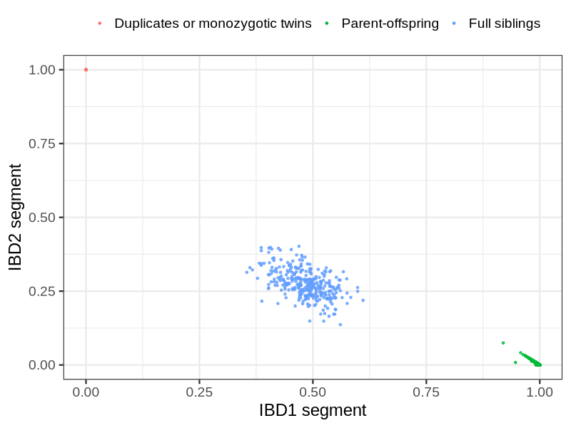
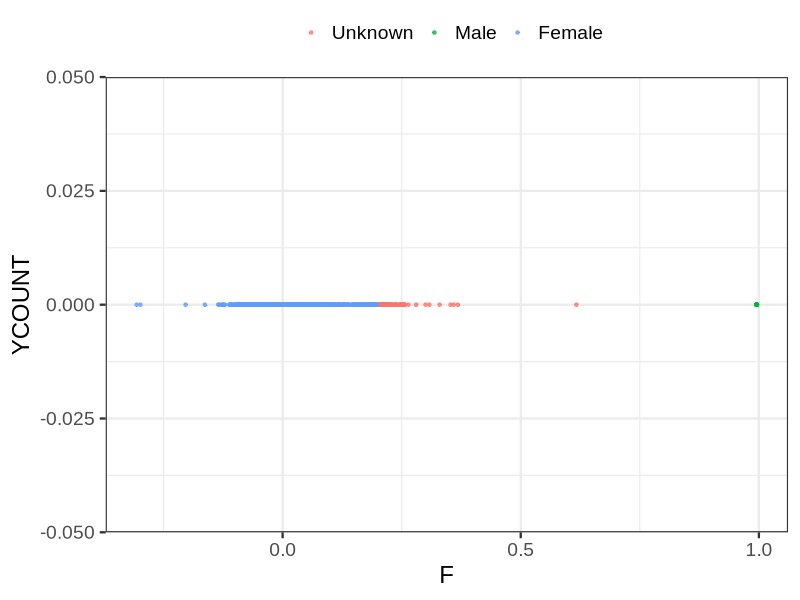
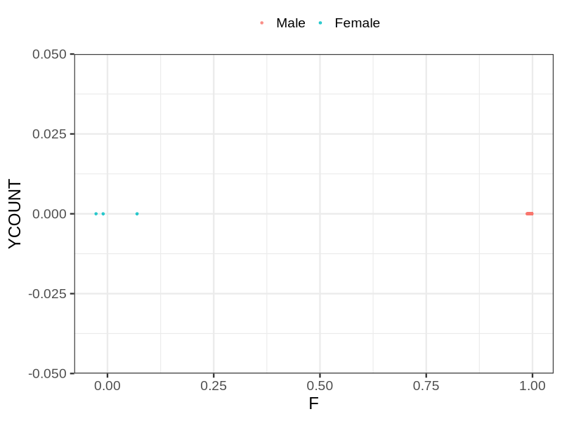

# Fam file reconstruction in snp017a
## Samples not in Medical Birth Regsitry
91 samples with missing birth year, will be assumed to be parent.
## Relationship inference
| Relationship |   |
| ------------ | - |
| Duplicates or monozygotic twins| 26 |
| Parent-offspring| 3109 |
| Full siblings| 322 |
| 2nd degree| 0 |
| 3rd degree| 0 |
| 4th degree| 0 |
| Unrelated| 0 |

## Mother sex check
| Inferred sex |   |
| ------------ | - |
| Unknown | 78 |
| Male | 10 |
| Female | 11193 |

## Father sex check
| Inferred sex |   |
| ------------ | - |
| Unknown | 0 |
| Male | 5216 |
| Female | 3 |

## Parental relationship
2359 mother-child relationships expected.
- 2352 (99.7%) recovered by genetic relationships.
- 7 (0.3%) not recovered by genetic relationships.

713 father-child relationships expected.
- 705 (98.88%) recovered by genetic relationships.
- 8 (1.12%) not recovered by genetic relationships.

3112 parent-offspring relationships detected
- 3057 (98.23%) match to registry.
- 55 (1.77%) do not match to registry.

## Exclusion
- Number of samples excluded: 29
