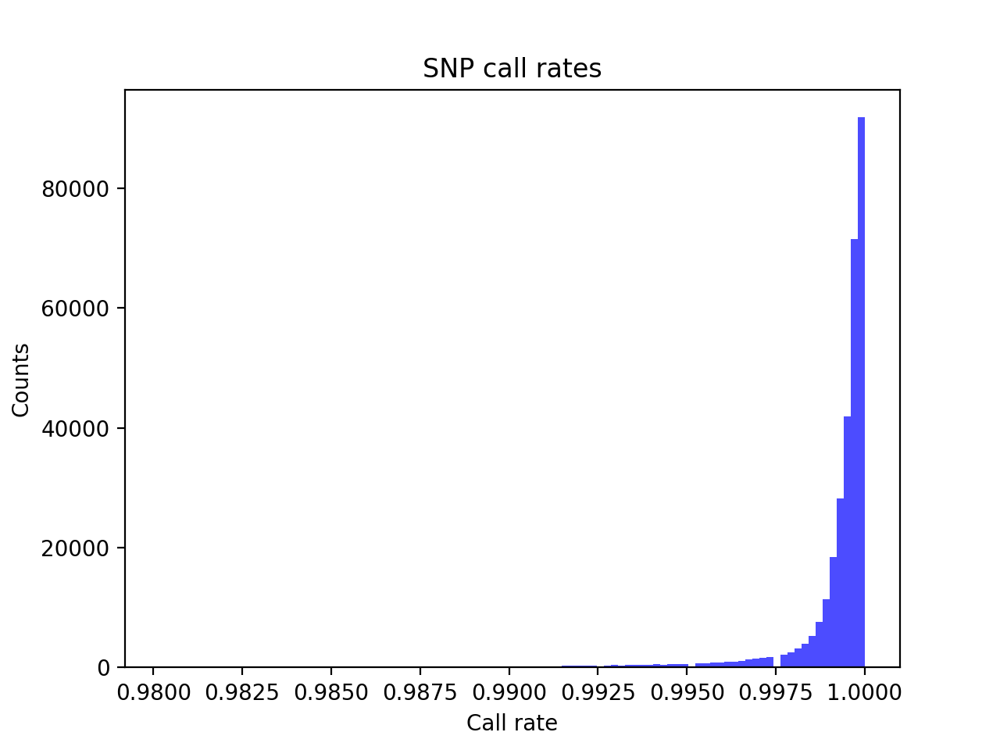

# Batch report for batch snp017b, module mod5-harmonization
## Samples overview
4645 samples
 4407 kinship clusters
 106 offspring with mother ID
 106 offspring with mother in batch
 100 mothers with offspring in batch
 0 mothers missing from batch
 109 offspring with father ID
 109 offspring with father in batch
 106 fathers with offspring in batch
 0 fathers missing from batch
## Call rates
### Sample call rates
min: 0.9437534
 max: 0.999875412
 median: 0.999578318 
### SNP call rates
min: 0.9801938
 max: 1.0
 median: 0.999784715 
## F_het
min: -0.151784
 max: 0.132137
 median: 0.00457146 
## Hardy-Weinberg P-values
min: 1.00692e-06
 max: 1.0
 median: 0.504783 
## Sexcheck
4376 out of 4645 OK 
| PEDSEX | Total | SNPSEX Male | SNPSEX Female | SNPSEX Unknown | OK | Problem |
| ------ | ------ | ------ | ------ | ------ | ------ | ------ |
| Male | 1661 | 1661 | 0 | 0 | 1661 | 0 |
| Female | 2715 | 0 | 2715 | 0 | 2715 | 0 |
| Unknown | 1 | 0 | 0 | 1 | 0 | 1 |

### All samples 
### All samples F-statistics
min: -0.09028
 max: 0.9978
 median: 0.02343 
### PEDSEX Male
### PEDSEX Male F-statistics
min: 0.9817
 max: 0.9978
 median: 0.9937 
### PEDSEX Female
### PEDSEX Female F-statistics
min: -0.09028
 max: 0.1846
 median: 0.0008252 