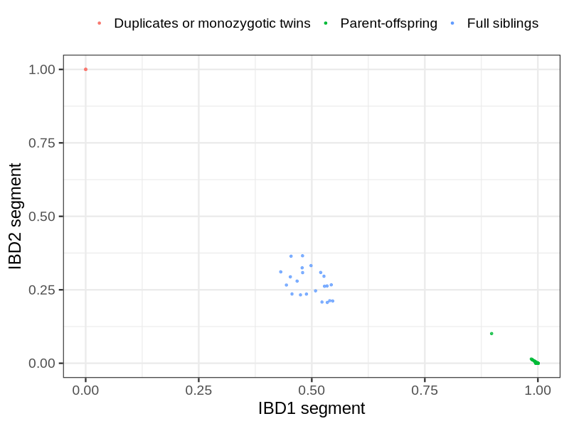
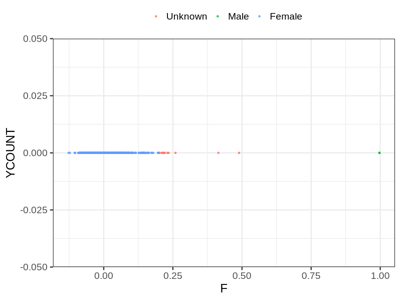
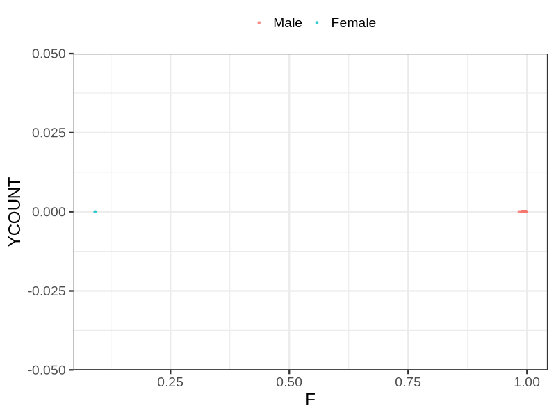

# Fam file reconstruction in snp017b
## Samples not in Medical Birth Regsitry
21 samples with missing birth year, will be assumed to be parent.
## Relationship inference
| Relationship |   |
| ------------ | - |
| Duplicates or monozygotic twins| 3 |
| Parent-offspring| 219 |
| Full siblings| 22 |
| 2nd degree| 0 |
| 3rd degree| 0 |
| 4th degree| 0 |
| Unrelated| 0 |

## Mother sex check
| Inferred sex |   |
| ------------ | - |
| Unknown | 12 |
| Male | 2 |
| Female | 2177 |

## Father sex check
| Inferred sex |   |
| ------------ | - |
| Unknown | 0 |
| Male | 1013 |
| Female | 1 |

## Parental relationship
199 mother-child relationships expected.
- 197 (98.99%) recovered by genetic relationships.
- 2 (1.01%) not recovered by genetic relationships.

19 father-child relationships expected.
- 19 (100%) recovered by genetic relationships.
- 0 (0%) not recovered by genetic relationships.

219 parent-offspring relationships detected
- 216 (98.63%) match to registry.
- 3 (1.37%) do not match to registry.

## Exclusion
- Number of samples excluded: 6
