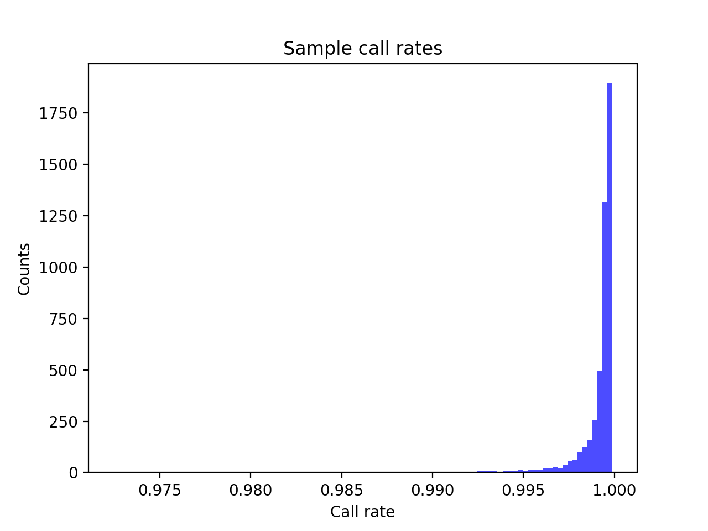
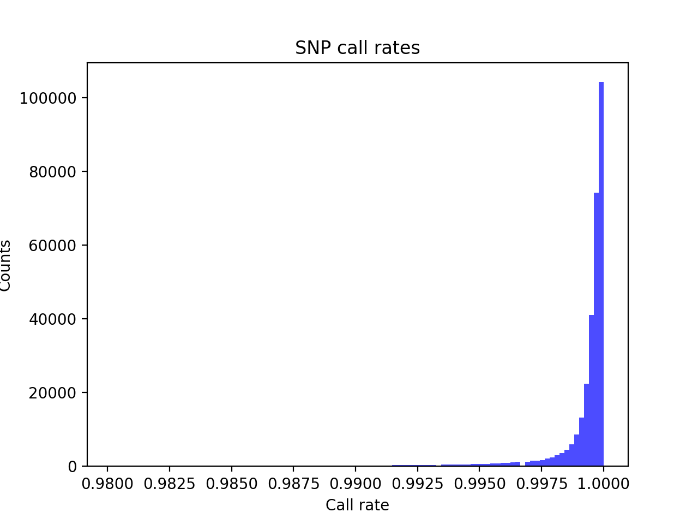
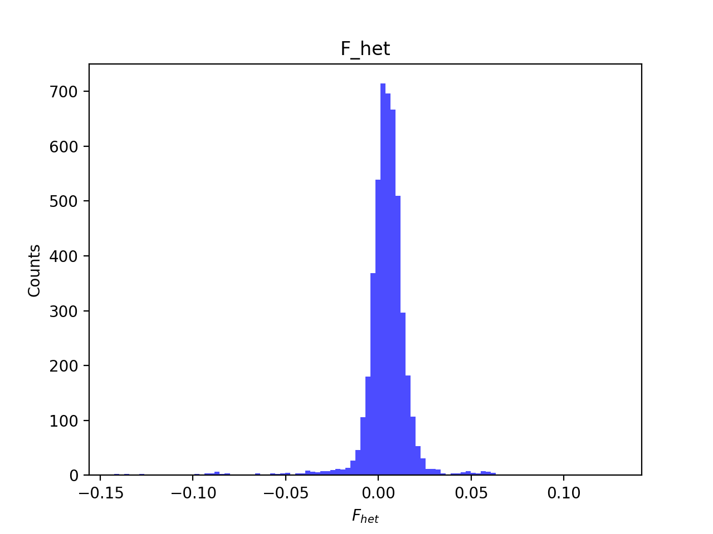
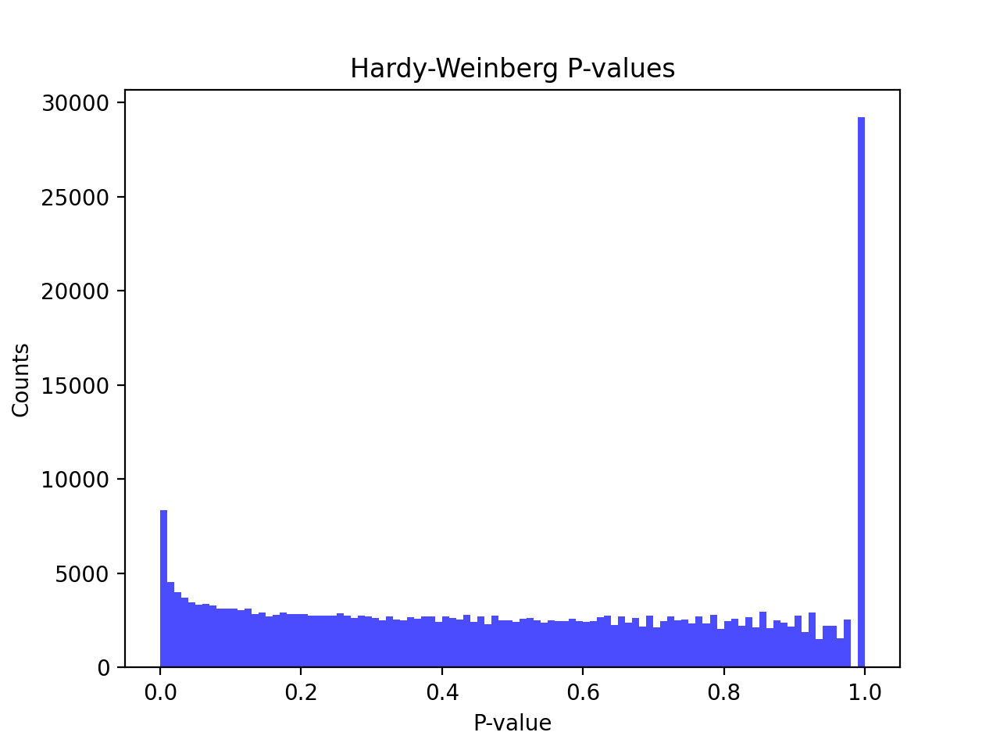
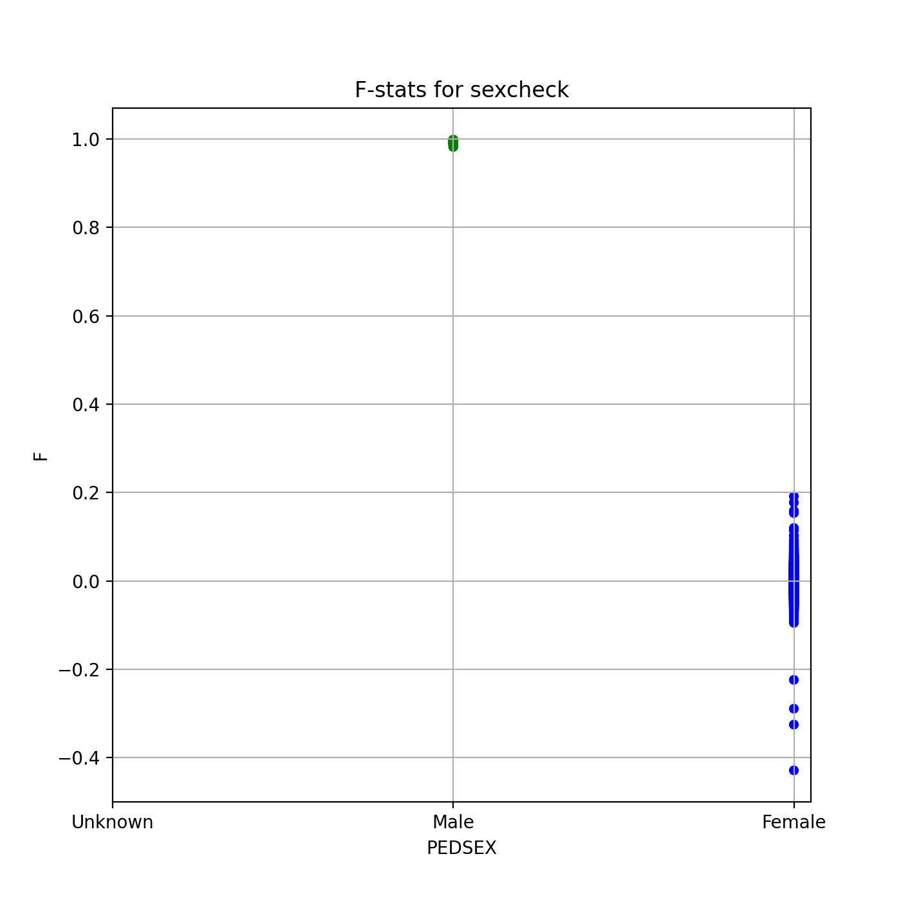
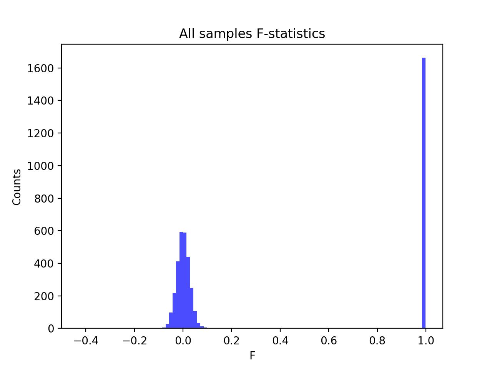
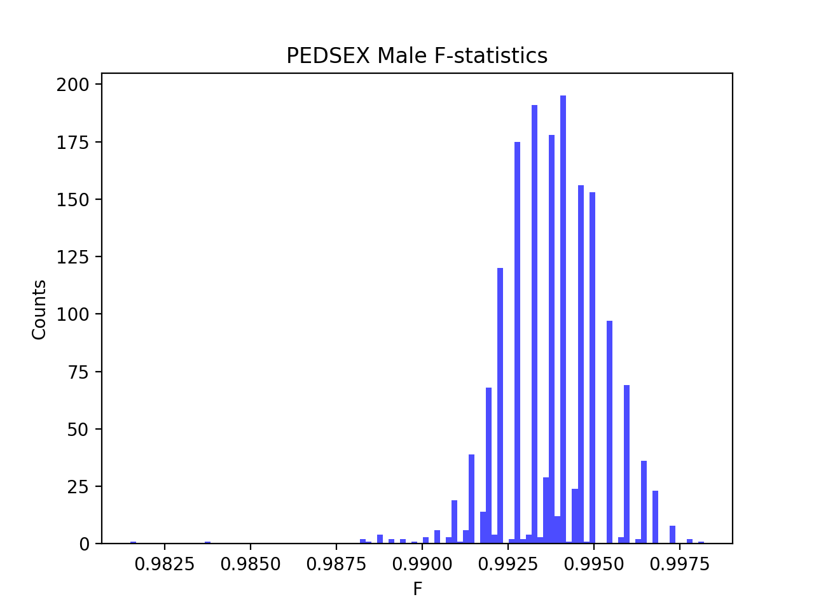
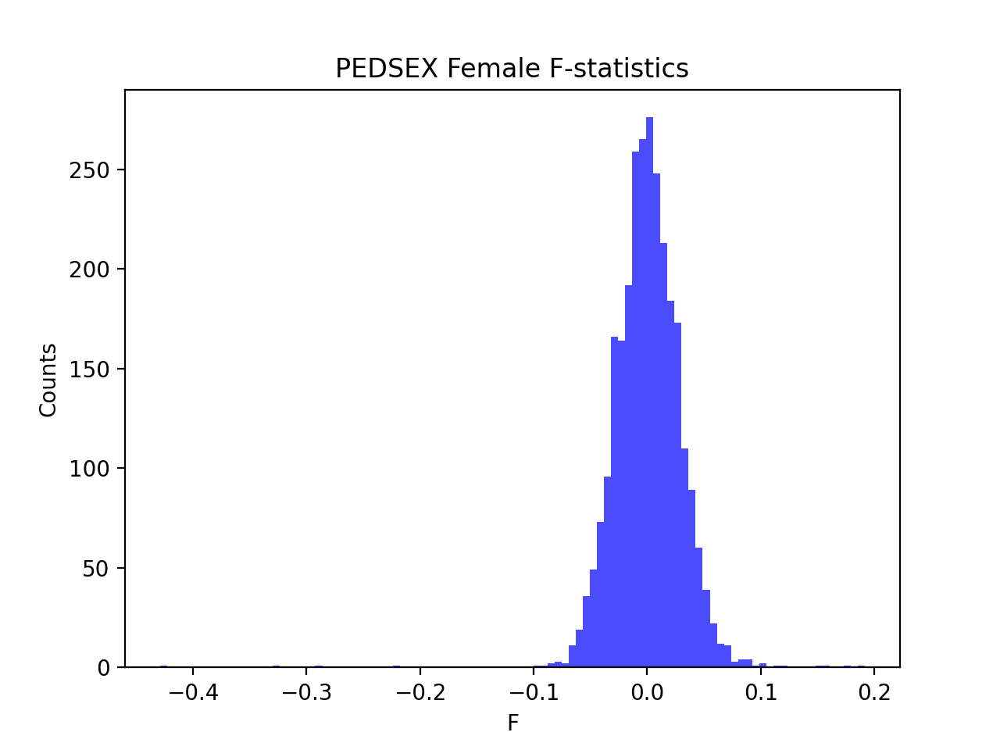

# Batch report for batch snp017c, module mod5-pre-phasing
## Samples overview
4742 samples
 4507 kinship clusters
 104 offspring with mother ID
 104 offspring with mother in batch
 101 mothers with offspring in batch
 0 mothers missing from batch
 109 offspring with father ID
 109 offspring with father in batch
 105 fathers with offspring in batch
 0 fathers missing from batch
## Call rates
### Sample call rates
min: 0.972456
 max: 0.999884619
 median: 0.999544886 
### SNP call rates
min: 0.9801771
 max: 1.0
 median: 0.999789119 
## F_het
min: -0.14248
 max: 0.128525
 median: 0.00486193 
## Hardy-Weinberg P-values
min: 1.00907e-06
 max: 1.0
 median: 0.493104 
## Sexcheck
4464 out of 4742 OK 
| PEDSEX | Total | SNPSEX Male | SNPSEX Female | SNPSEX Unknown | OK | Problem |
| ------ | ------ | ------ | ------ | ------ | ------ | ------ |
| Male | 1664 | 1664 | 0 | 0 | 1664 | 0 |
| Female | 2800 | 0 | 2800 | 0 | 2800 | 0 |
| Unknown | 0 | 0 | 0 | 0 | 0 | 0 |

### All samples 
### All samples F-statistics
min: -0.4285
 max: 0.9982
 median: 0.022965 
### PEDSEX Male
### PEDSEX Male F-statistics
min: 0.9815
 max: 0.9982
 median: 0.9937 
### PEDSEX Female
### PEDSEX Female F-statistics
min: -0.4285
 max: 0.1914
 median: 0.0005196 