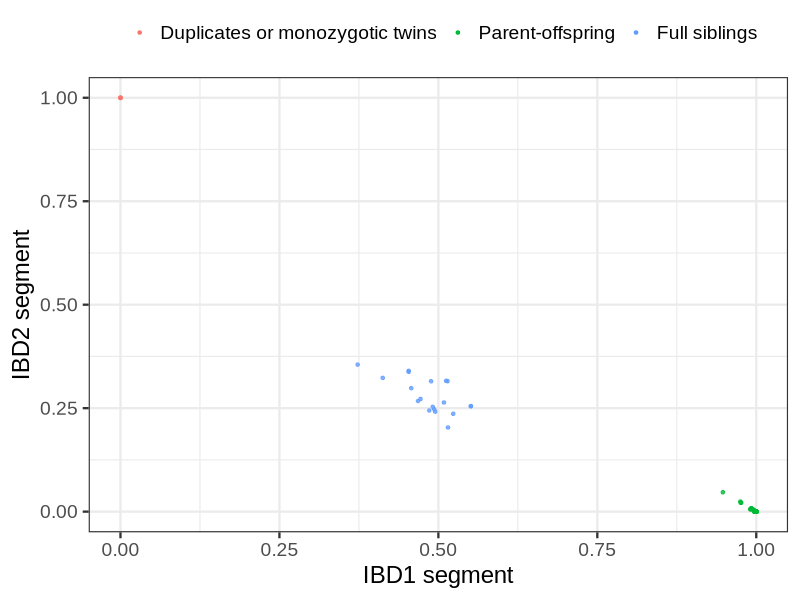
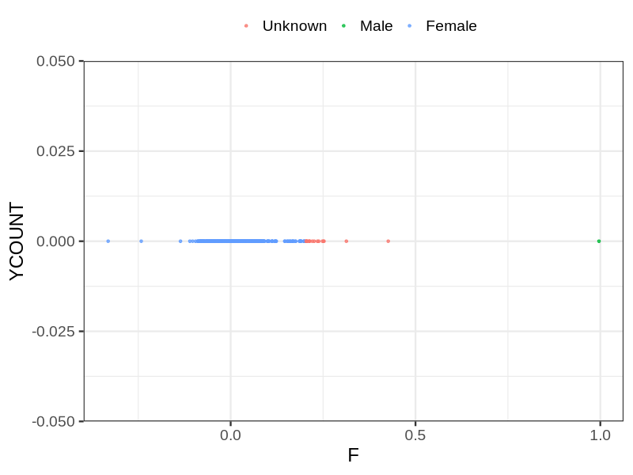
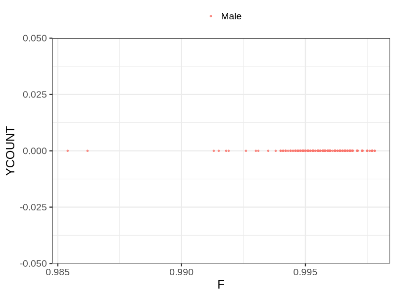

# Fam file reconstruction in snp017c
## Samples not in Medical Birth Regsitry
16 samples with missing birth year, will be assumed to be parent.
## Relationship inference
| Relationship |   |
| ------------ | - |
| Duplicates or monozygotic twins| 4 |
| Parent-offspring| 216 |
| Full siblings| 19 |
| 2nd degree| 0 |
| 3rd degree| 0 |
| 4th degree| 0 |
| Unrelated| 0 |

## Mother sex check
| Inferred sex |   |
| ------------ | - |
| Unknown | 17 |
| Male | 1 |
| Female | 2107 |

## Father sex check
| Inferred sex |   |
| ------------ | - |
| Unknown | 0 |
| Male | 862 |
| Female | 0 |

## Parental relationship
195 mother-child relationships expected.
- 195 (100%) recovered by genetic relationships.
- 0 (0%) not recovered by genetic relationships.

21 father-child relationships expected.
- 21 (100%) recovered by genetic relationships.
- 0 (0%) not recovered by genetic relationships.

217 parent-offspring relationships detected
- 216 (99.54%) match to registry.
- 1 (0.46%) do not match to registry.

## Exclusion
- Number of samples excluded: 1
