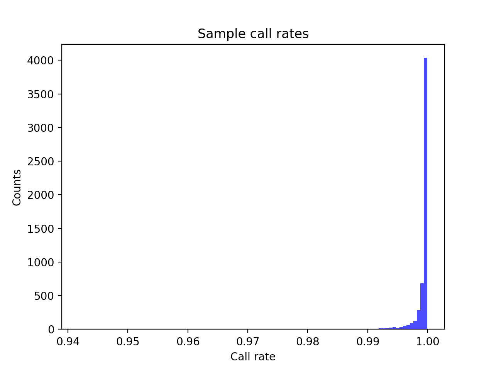
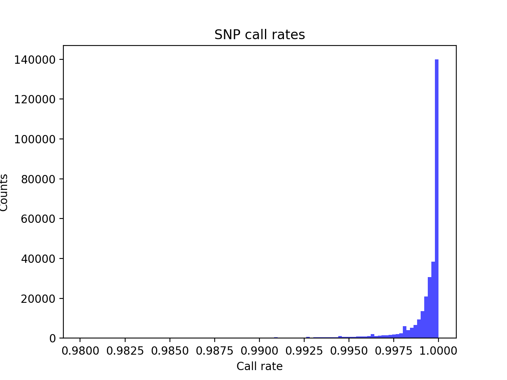
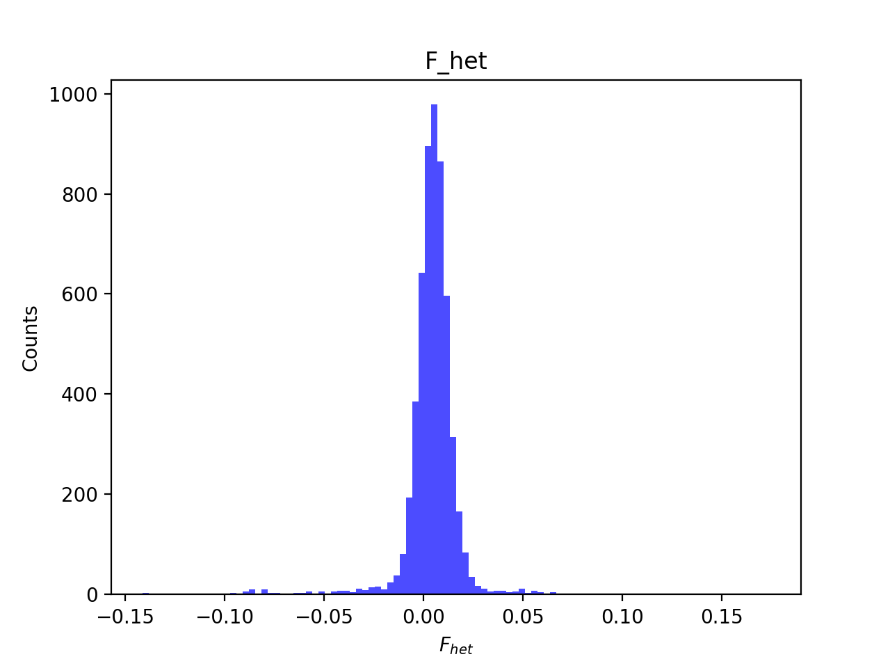
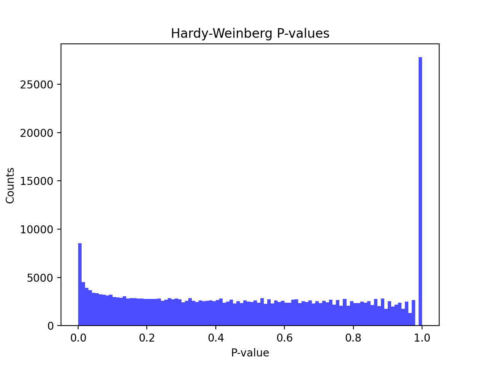
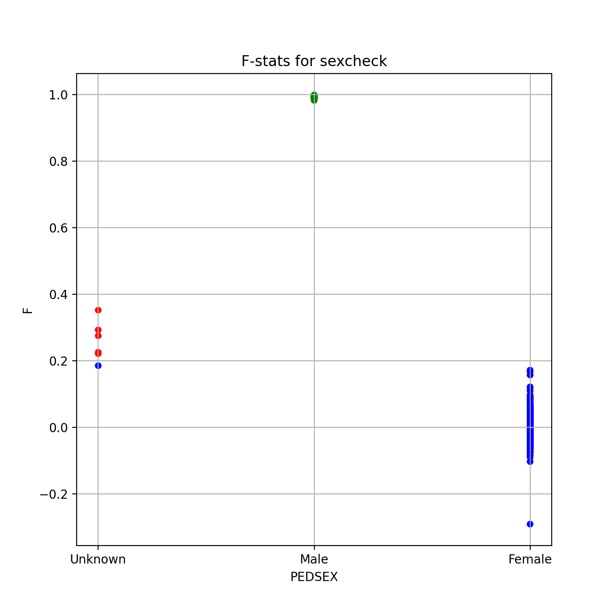
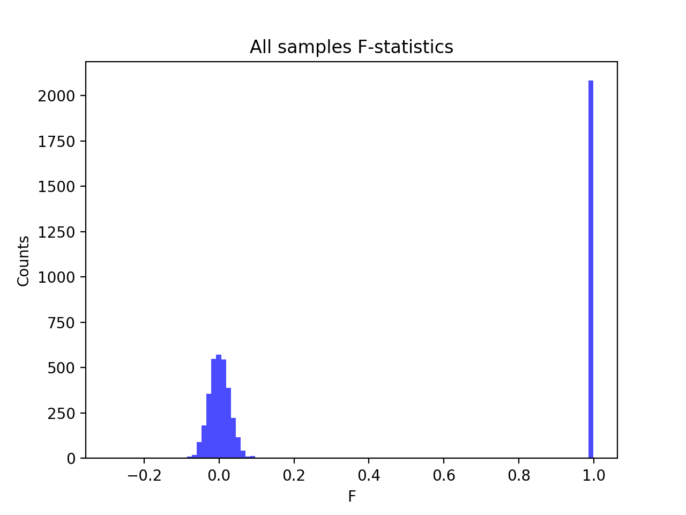
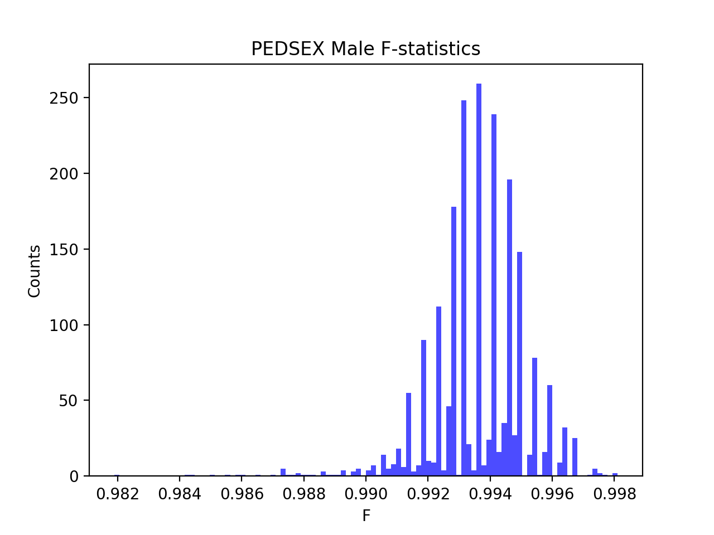
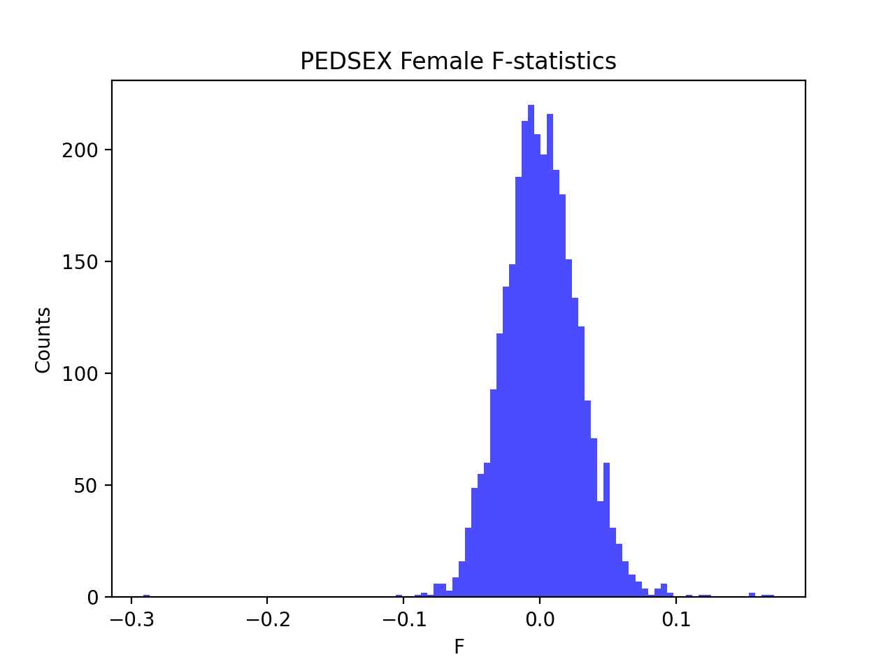

# Batch report for batch snp017d, module mod5-pre-phasing
## Samples overview
5566 samples
 5075 kinship clusters
 218 offspring with mother ID
 218 offspring with mother in batch
 191 mothers with offspring in batch
 0 mothers missing from batch
 241 offspring with father ID
 241 offspring with father in batch
 204 fathers with offspring in batch
 0 fathers missing from batch
## Call rates
### Sample call rates
min: 0.9418869
 max: 0.9999252711
 median: 0.999632853 
### SNP call rates
min: 0.9800575
 max: 1.0
 median: 0.999640676 
## F_het
min: -0.141129
 max: 0.17403
 median: 0.005014515 
## Hardy-Weinberg P-values
min: 1.00627e-06
 max: 1.0
 median: 0.4912315 
## Sexcheck
5220 out of 5566 OK 
| PEDSEX | Total | SNPSEX Male | SNPSEX Female | SNPSEX Unknown | OK | Problem |
| ------ | ------ | ------ | ------ | ------ | ------ | ------ |
| Male | 2087 | 2087 | 0 | 0 | 2087 | 0 |
| Female | 3133 | 0 | 3133 | 0 | 3133 | 0 |
| Unknown | 6 | 0 | 1 | 5 | 0 | 6 |

### All samples 
### All samples F-statistics
min: -0.291
 max: 0.9981
 median: 0.02739 
### PEDSEX Male
### PEDSEX Male F-statistics
min: 0.9819
 max: 0.9981
 median: 0.9937 
### PEDSEX Female
### PEDSEX Female F-statistics
min: -0.291
 max: 0.1717
 median: 0.000447 