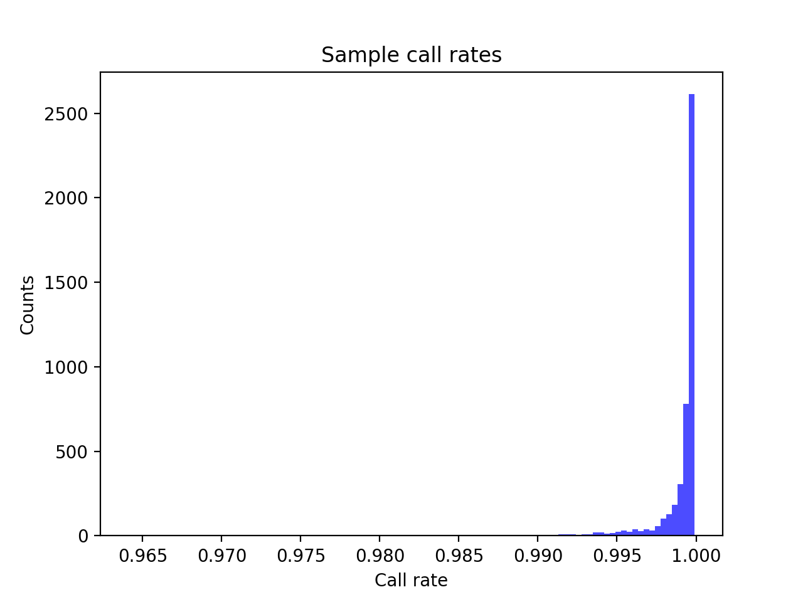
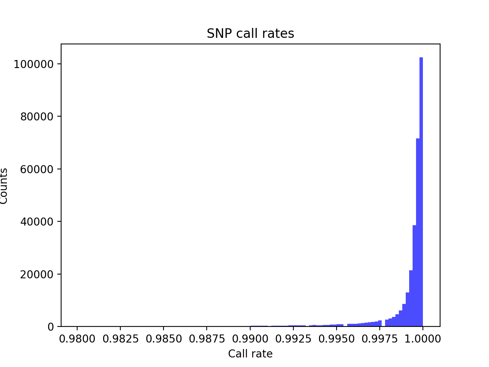
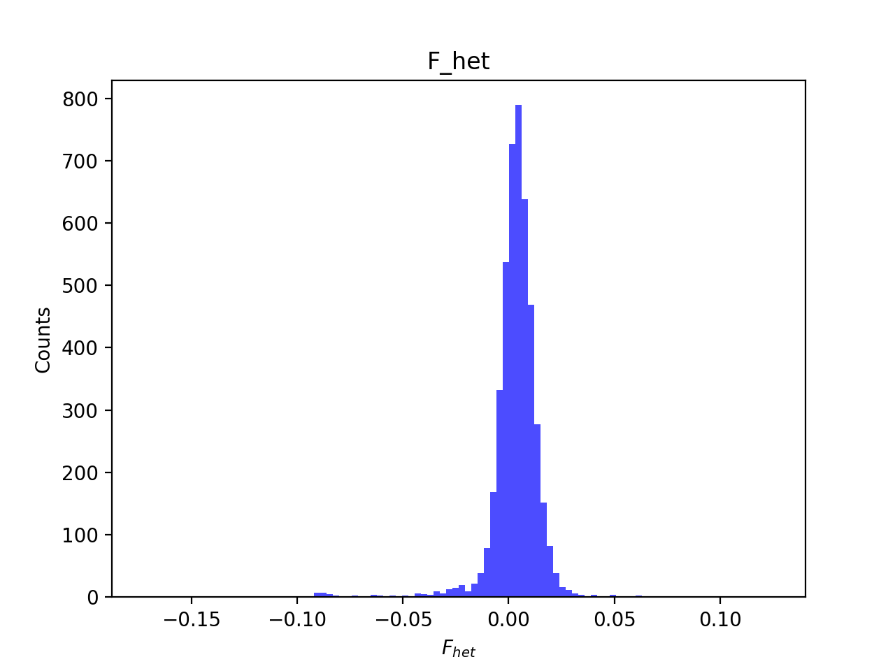
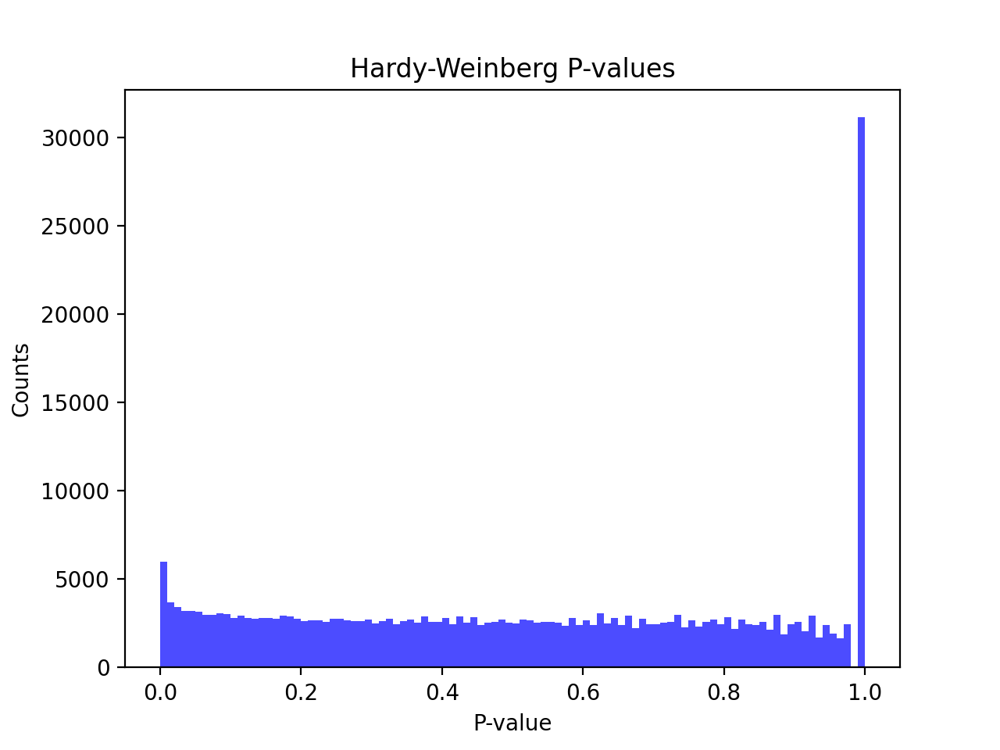
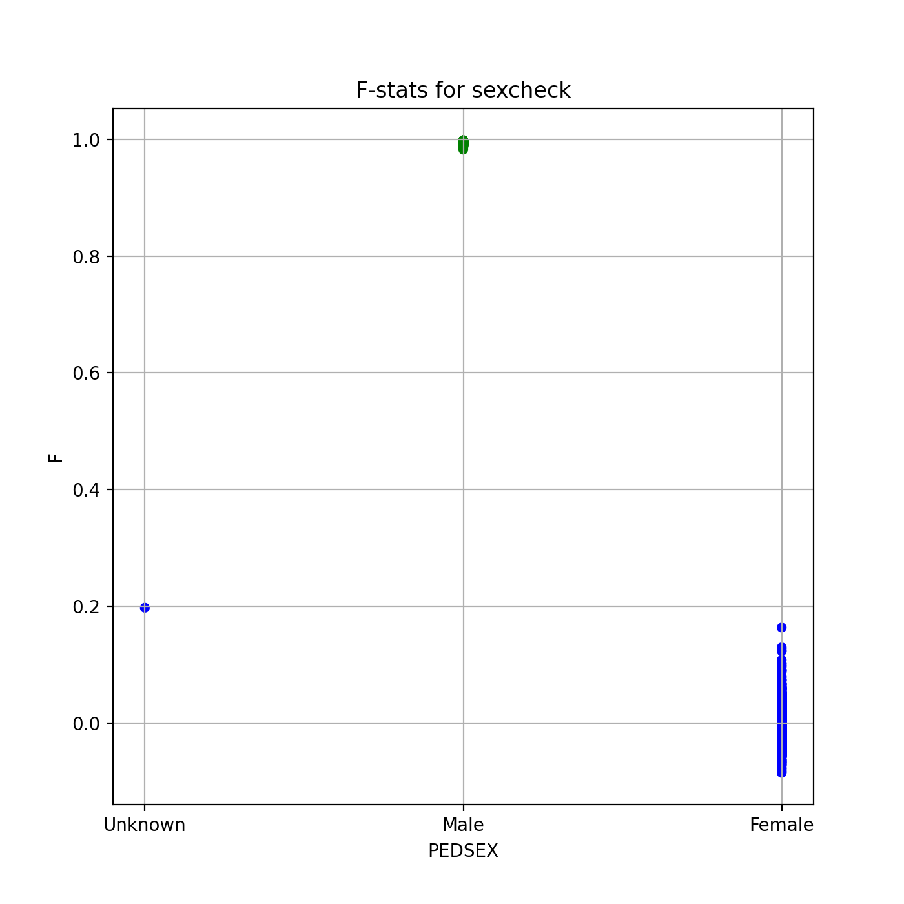
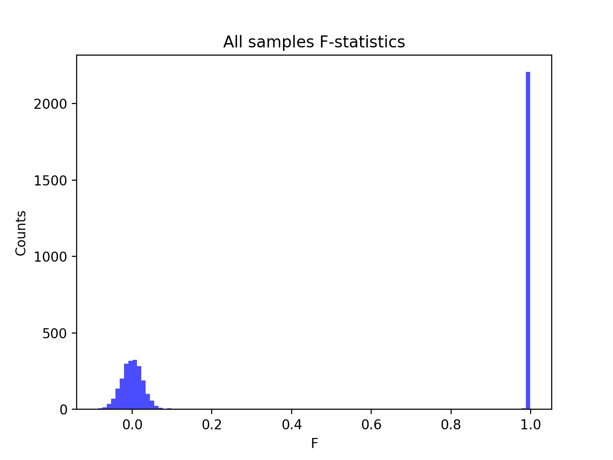
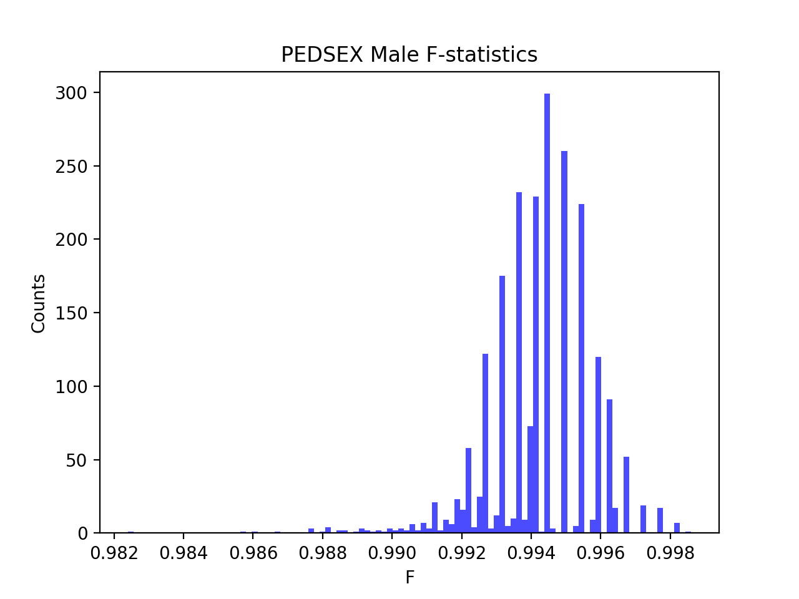
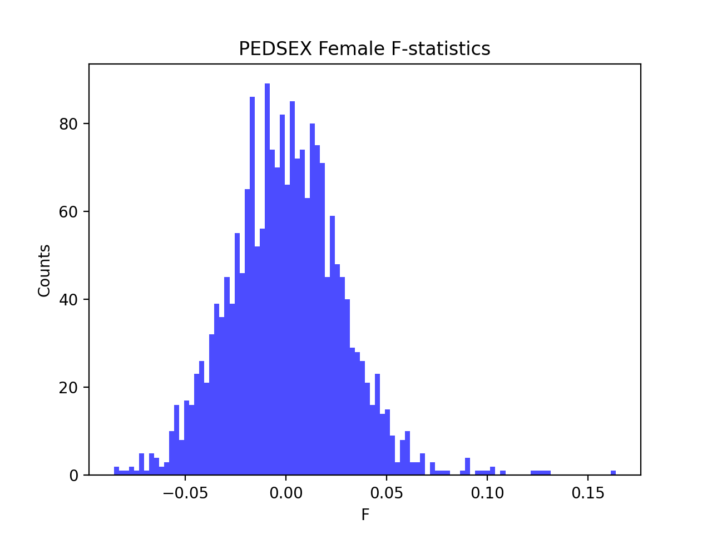

# Batch report for batch snp017e, module mod5-harmonization
## Samples overview
4565 samples
 4272 kinship clusters
 118 offspring with mother ID
 117 offspring with mother in batch
 104 mothers with offspring in batch
 1 mothers missing from batch
 144 offspring with father ID
 144 offspring with father in batch
 125 fathers with offspring in batch
 0 fathers missing from batch
## Call rates
### Sample call rates
min: 0.9641164
 max: 0.999896729
 median: 0.999612732 
### SNP call rates
min: 0.9800657
 max: 1.0
 median: 0.999780942 
## F_het
min: -0.172608
 max: 0.125401
 median: 0.00401994 
## Hardy-Weinberg P-values
min: 1.02791e-06
 max: 1.0
 median: 0.517645 
## Sexcheck
4301 out of 4565 OK 
| PEDSEX | Total | SNPSEX Male | SNPSEX Female | SNPSEX Unknown | OK | Problem |
| ------ | ------ | ------ | ------ | ------ | ------ | ------ |
| Male | 2213 | 2213 | 0 | 0 | 2213 | 0 |
| Female | 2088 | 0 | 2088 | 0 | 2088 | 0 |
| Unknown | 1 | 0 | 1 | 0 | 0 | 1 |

### All samples 
### All samples F-statistics
min: -0.08517
 max: 0.9986
 median: 0.9913 
### PEDSEX Male
### PEDSEX Male F-statistics
min: 0.9824
 max: 0.9986
 median: 0.9945 
### PEDSEX Female
### PEDSEX Female F-statistics
min: -0.08517
 max: 0.1637
 median: 0.00019099999999999998 