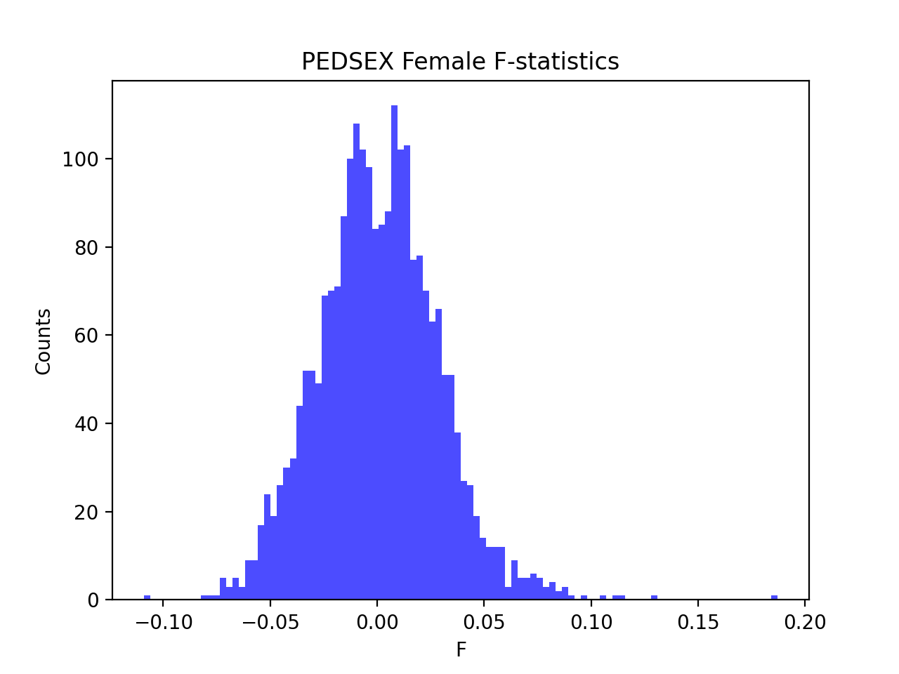

# Batch report for batch snp017f, module mod5-harmonization
## Samples overview
5210 samples
 4970 kinship clusters
 96 offspring with mother ID
 96 offspring with mother in batch
 89 mothers with offspring in batch
 0 mothers missing from batch
 95 offspring with father ID
 95 offspring with father in batch
 87 fathers with offspring in batch
 0 fathers missing from batch
## Call rates
### Sample call rates
min: 0.9498749
 max: 0.999906266
 median: 0.999563652 
### SNP call rates
min: 0.9800384
 max: 1.0
 median: 0.999616123 
## F_het
min: -0.137005
 max: 0.152676
 median: 0.00496205 
## Hardy-Weinberg P-values
min: 1.0022e-06
 max: 1.0
 median: 0.489899 
## Sexcheck
4861 out of 5210 OK 
| PEDSEX | Total | SNPSEX Male | SNPSEX Female | SNPSEX Unknown | OK | Problem |
| ------ | ------ | ------ | ------ | ------ | ------ | ------ |
| Male | 2531 | 2531 | 0 | 0 | 2531 | 0 |
| Female | 2330 | 0 | 2330 | 0 | 2330 | 0 |
| Unknown | 2 | 0 | 0 | 2 | 0 | 2 |

### All samples 
### All samples F-statistics
min: -0.1089
 max: 0.9977
 median: 0.9909 
### PEDSEX Male
### PEDSEX Male F-statistics
min: 0.9669
 max: 0.9977
 median: 0.9931 
### PEDSEX Female
### PEDSEX Female F-statistics
min: -0.1089
 max: 0.1871
 median: 0.00032245 