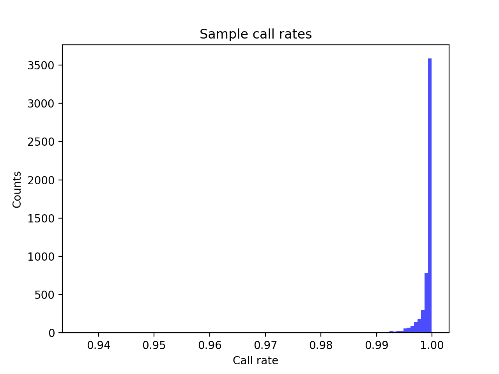
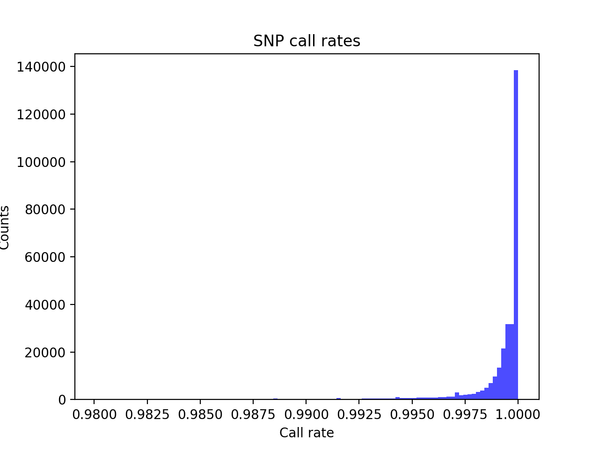
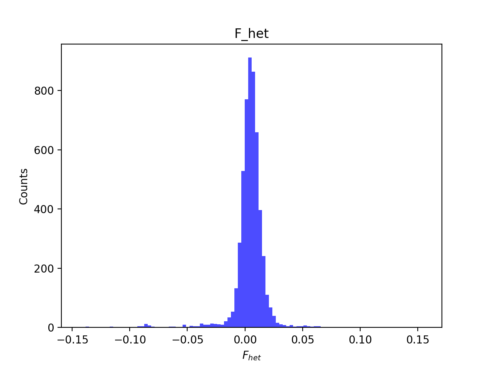
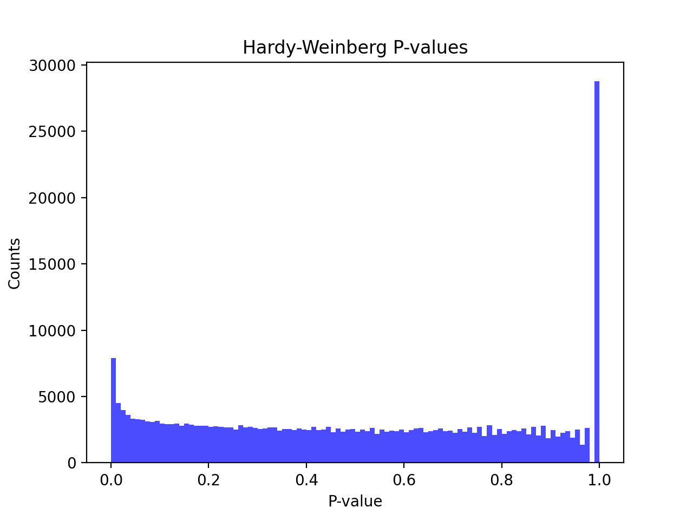
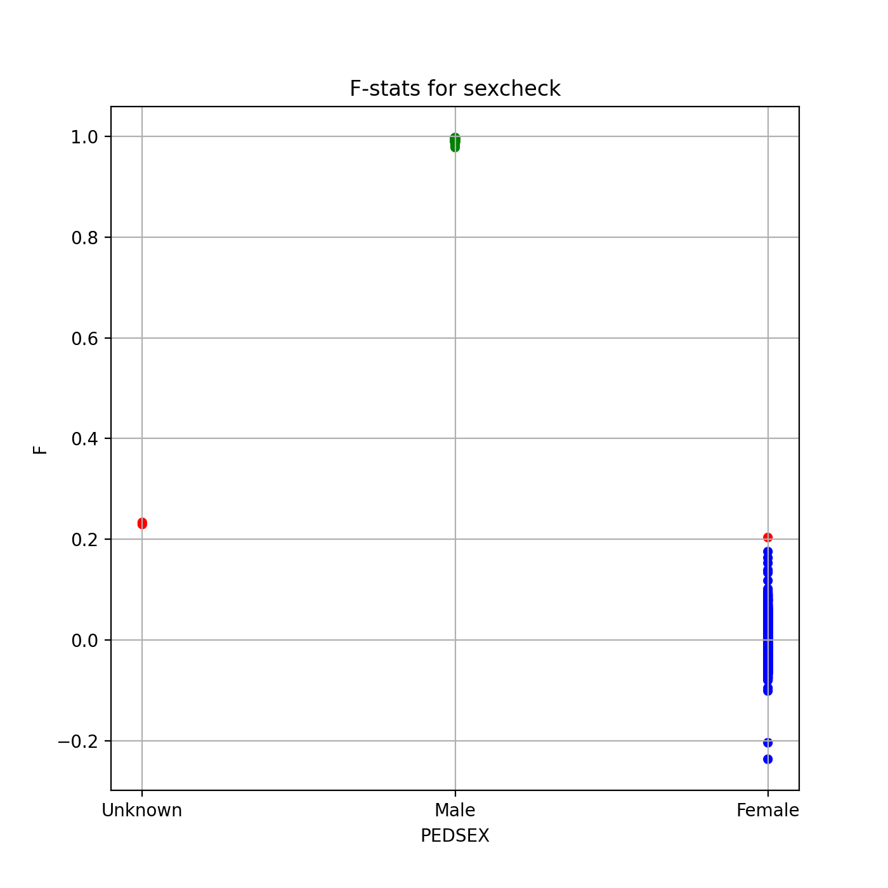
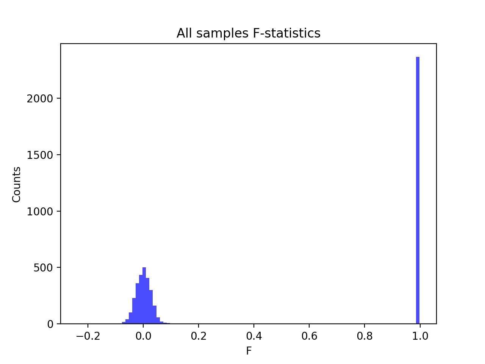
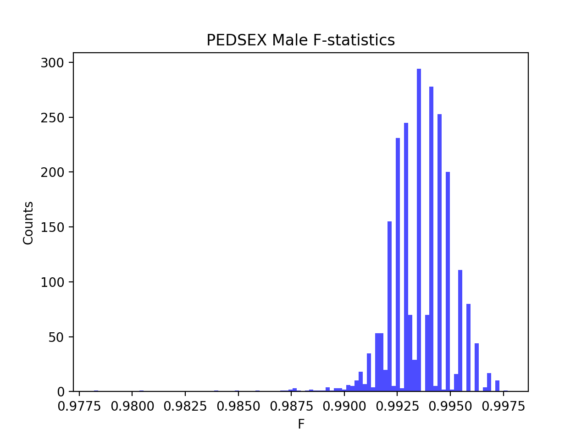
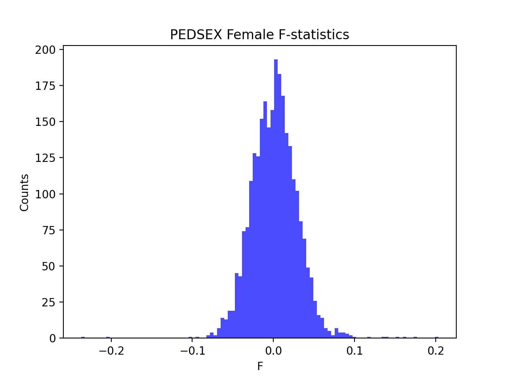

# Batch report for batch snp018a, module mod5-harmonization
## Samples overview
5372 samples
 5043 kinship clusters
 150 offspring with mother ID
 150 offspring with mother in batch
 139 mothers with offspring in batch
 0 mothers missing from batch
 142 offspring with father ID
 142 offspring with father in batch
 136 fathers with offspring in batch
 0 fathers missing from batch
## Call rates
### Sample call rates
min: 0.936661
 max: 0.999898227
 median: 0.999537096 
### SNP call rates
min: 0.9800819
 max: 1.0
 median: 0.999627699 
## F_het
min: -0.14438
 max: 0.15597
 median: 0.005052665 
## Hardy-Weinberg P-values
min: 1.00731e-06
 max: 1.0
 median: 0.4948975 
## Sexcheck
5043 out of 5372 OK 
| PEDSEX | Total | SNPSEX Male | SNPSEX Female | SNPSEX Unknown | OK | Problem |
| ------ | ------ | ------ | ------ | ------ | ------ | ------ |
| Male | 2368 | 2368 | 0 | 0 | 2368 | 0 |
| Female | 2676 | 0 | 2675 | 1 | 2675 | 1 |
| Unknown | 2 | 0 | 0 | 2 | 0 | 2 |

### All samples 
### All samples F-statistics
min: -0.2369
 max: 0.9977
 median: 0.04356 
### PEDSEX Male
### PEDSEX Male F-statistics
min: 0.9782
 max: 0.9977
 median: 0.9935 
### PEDSEX Female
### PEDSEX Female F-statistics
min: -0.2369
 max: 0.2035
 median: 0.0016229999999999999 