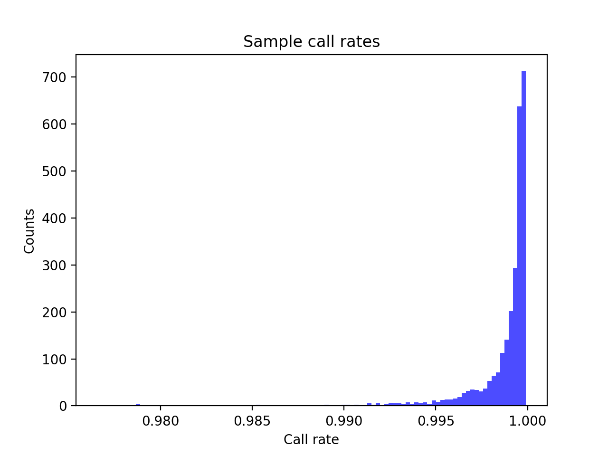
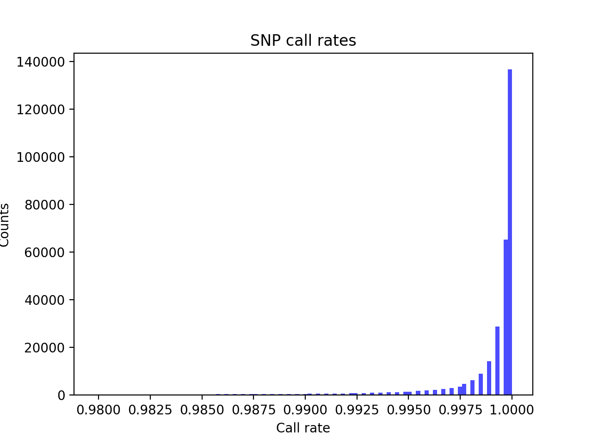
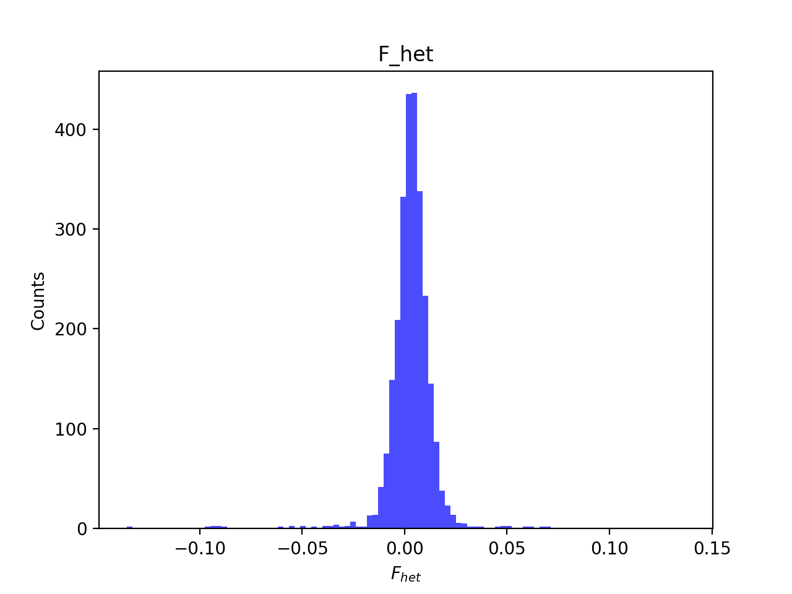
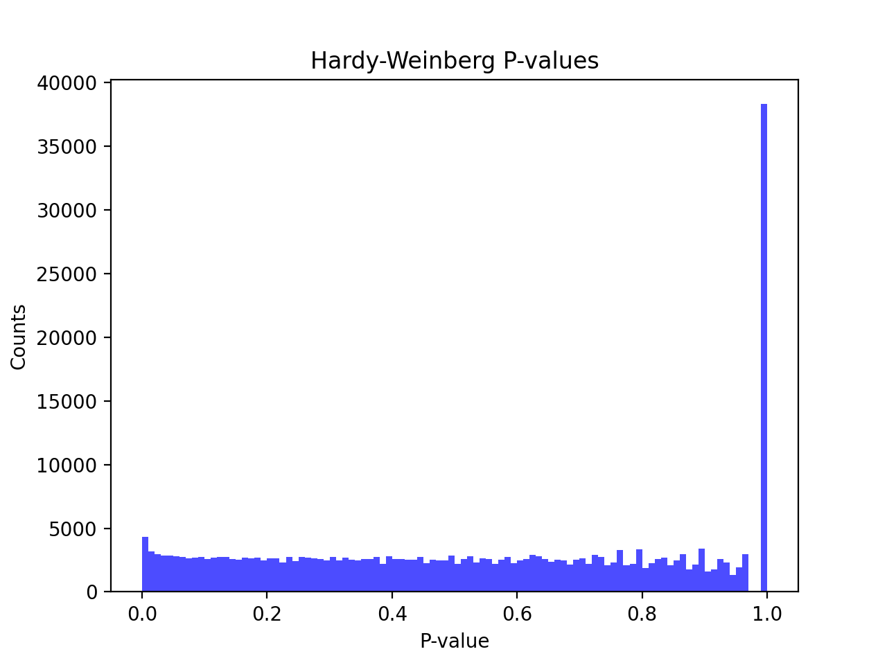
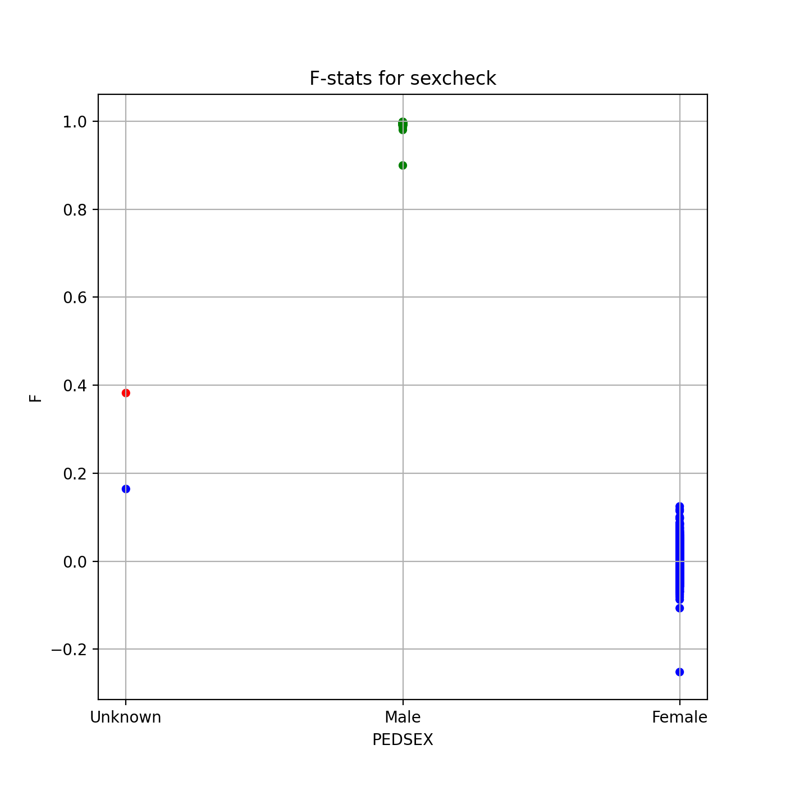
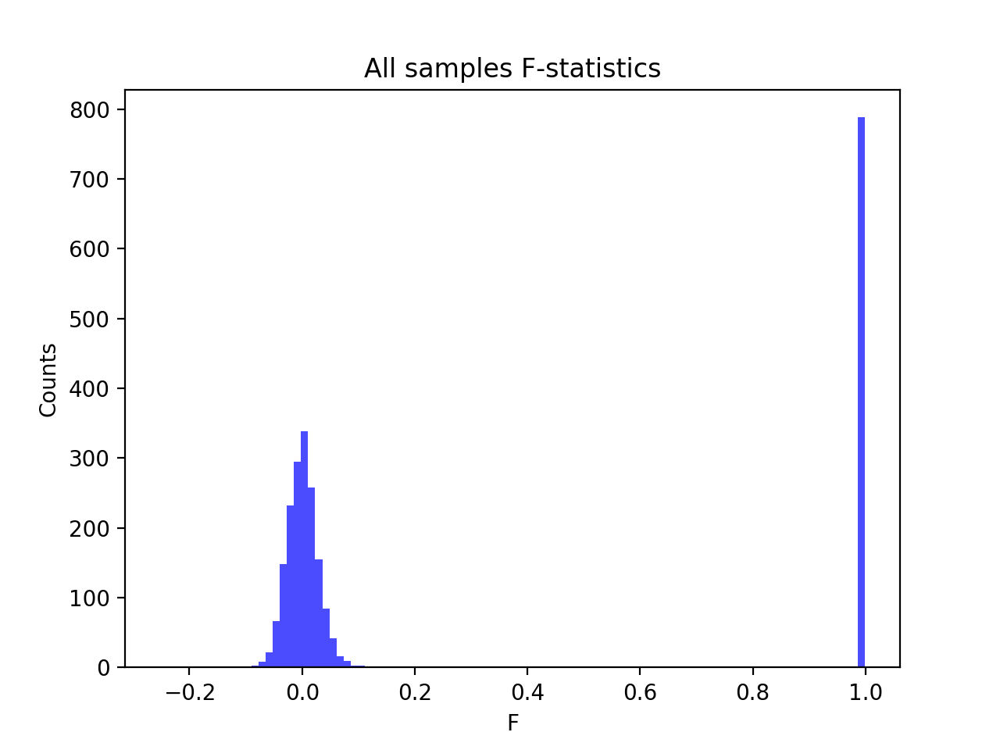
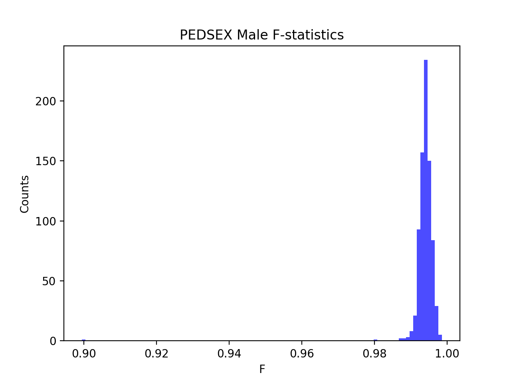
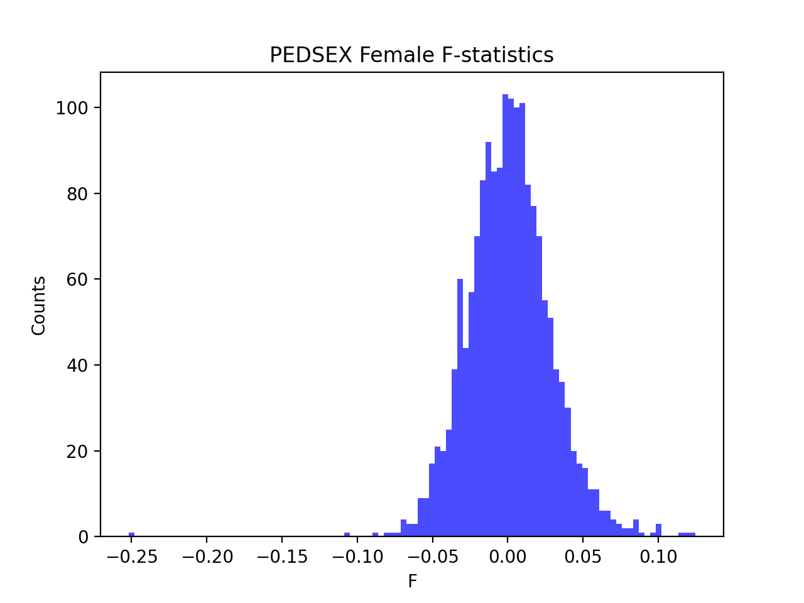

# Batch report for batch snp018b, module mod5-harmonization
## Samples overview
2676 samples
 2211 kinship clusters
 210 offspring with mother ID
 210 offspring with mother in batch
 209 mothers with offspring in batch
 0 mothers missing from batch
 227 offspring with father ID
 227 offspring with father in batch
 227 fathers with offspring in batch
 0 fathers missing from batch
## Call rates
### Sample call rates
min: 0.9765688
 max: 0.9999040926
 median: 0.999444399 
### SNP call rates
min: 0.9798206
 max: 1.0
 median: 0.999626308 
## F_het
min: -0.135453
 max: 0.136815
 median: 0.00347521 
## Hardy-Weinberg P-values
min: 1.0827e-06
 max: 1.0
 median: 0.539563 
## Sexcheck
2479 out of 2676 OK 
| PEDSEX | Total | SNPSEX Male | SNPSEX Female | SNPSEX Unknown | OK | Problem |
| ------ | ------ | ------ | ------ | ------ | ------ | ------ |
| Male | 790 | 790 | 0 | 0 | 790 | 0 |
| Female | 1689 | 0 | 1689 | 0 | 1689 | 0 |
| Unknown | 2 | 0 | 1 | 1 | 0 | 2 |

### All samples 
### All samples F-statistics
min: -0.2518
 max: 0.9986
 median: 0.0164 
### PEDSEX Male
### PEDSEX Male F-statistics
min: 0.8995
 max: 0.9986
 median: 0.994 
### PEDSEX Female
### PEDSEX Female F-statistics
min: -0.2518
 max: 0.1246
 median: 0.000604 