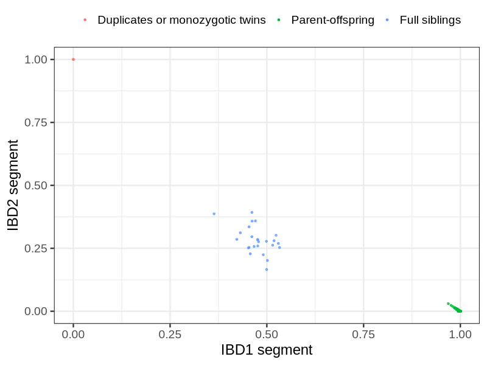
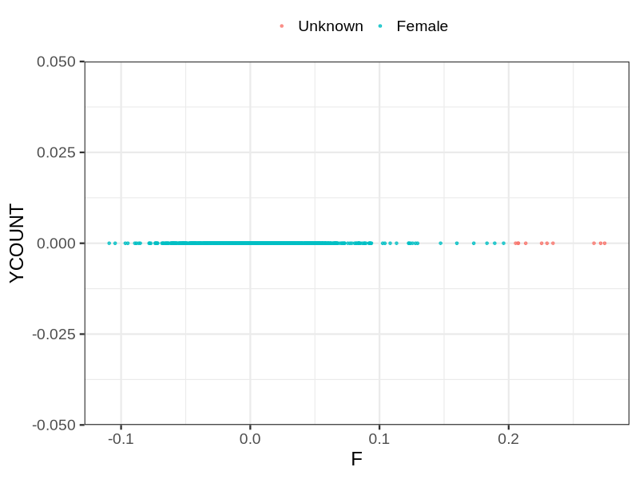
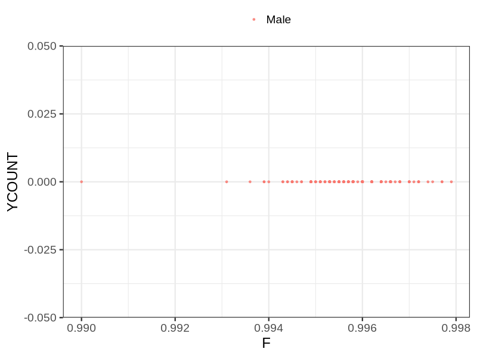

# Fam file reconstruction in snp018b
## Samples not in Medical Birth Regsitry
17 samples with missing birth year, will be assumed to be parent.
## Relationship inference
| Relationship |   |
| ------------ | - |
| Duplicates or monozygotic twins| 2 |
| Parent-offspring| 442 |
| Full siblings| 25 |
| 2nd degree| 0 |
| 3rd degree| 0 |
| 4th degree| 0 |
| Unrelated| 0 |

## Mother sex check
| Inferred sex |   |
| ------------ | - |
| Unknown | 10 |
| Male | 0 |
| Female | 1163 |

## Father sex check
| Inferred sex |   |
| ------------ | - |
| Unknown | 0 |
| Male | 183 |
| Female | 0 |

## Parental relationship
438 mother-child relationships expected.
- 438 (100%) recovered by genetic relationships.
- 0 (0%) not recovered by genetic relationships.

2 father-child relationships expected.
- 2 (100%) recovered by genetic relationships.
- 0 (0%) not recovered by genetic relationships.

442 parent-offspring relationships detected
- 440 (99.55%) match to registry.
- 2 (0.45%) do not match to registry.

## Exclusion
- Number of samples excluded: 2
