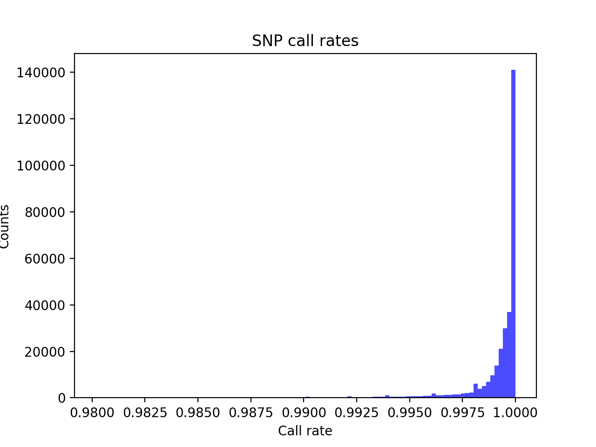

# Batch report for batch snp018c, module mod5-pre-phasing
## Samples overview
5545 samples
 5233 kinship clusters
 107 offspring with mother ID
 107 offspring with mother in batch
 103 mothers with offspring in batch
 0 mothers missing from batch
 120 offspring with father ID
 120 offspring with father in batch
 116 fathers with offspring in batch
 0 fathers missing from batch
## Call rates
### Sample call rates
min: 0.9396881
 max: 0.999932241
 median: 0.999590219 
### SNP call rates
min: 0.9801623
 max: 1.0
 median: 0.999639315 
## F_het
min: -0.156608
 max: 0.14959
 median: 0.00450347 
## Hardy-Weinberg P-values
min: 1.00697e-06
 max: 1.0
 median: 0.501331 
## Sexcheck
5192 out of 5545 OK 
| PEDSEX | Total | SNPSEX Male | SNPSEX Female | SNPSEX Unknown | OK | Problem |
| ------ | ------ | ------ | ------ | ------ | ------ | ------ |
| Male | 2210 | 2210 | 0 | 0 | 2210 | 0 |
| Female | 2982 | 0 | 2982 | 0 | 2982 | 0 |
| Unknown | 2 | 0 | 0 | 2 | 0 | 2 |

### All samples 
### All samples F-statistics
min: -0.1065
 max: 0.9977
 median: 0.031785 
### PEDSEX Male
### PEDSEX Male F-statistics
min: 0.9799
 max: 0.9977
 median: 0.9936 
### PEDSEX Female
### PEDSEX Female F-statistics
min: -0.1065
 max: 0.1692
 median: 0.0002398 