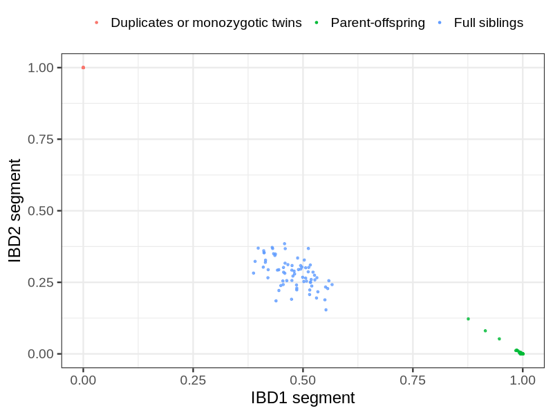
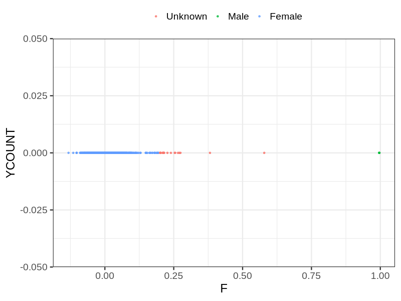
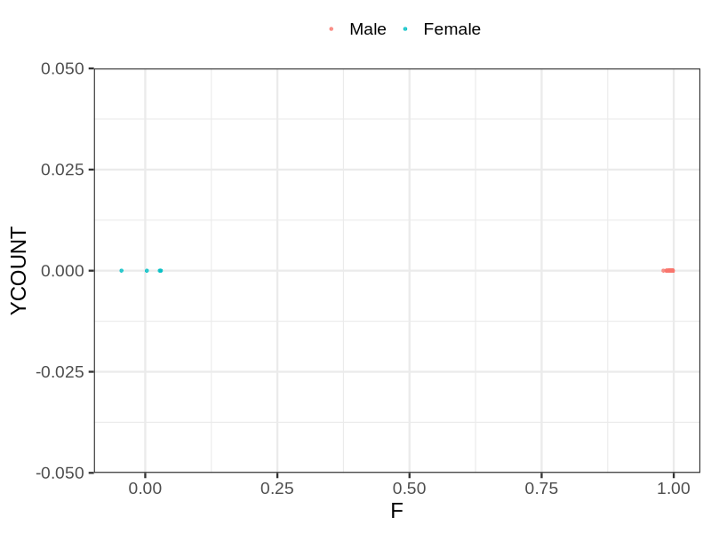

# Fam file reconstruction in snp018c
## Samples not in Medical Birth Regsitry
21 samples with missing birth year, will be assumed to be parent.
## Relationship inference
| Relationship |   |
| ------------ | - |
| Duplicates or monozygotic twins| 15 |
| Parent-offspring| 235 |
| Full siblings| 74 |
| 2nd degree| 0 |
| 3rd degree| 0 |
| 4th degree| 0 |
| Unrelated| 0 |

## Mother sex check
| Inferred sex |   |
| ------------ | - |
| Unknown | 19 |
| Male | 3 |
| Female | 1872 |

## Father sex check
| Inferred sex |   |
| ------------ | - |
| Unknown | 0 |
| Male | 1052 |
| Female | 4 |

## Parental relationship
194 mother-child relationships expected.
- 194 (100%) recovered by genetic relationships.
- 0 (0%) not recovered by genetic relationships.

38 father-child relationships expected.
- 38 (100%) recovered by genetic relationships.
- 0 (0%) not recovered by genetic relationships.

235 parent-offspring relationships detected
- 232 (98.72%) match to registry.
- 3 (1.28%) do not match to registry.

## Exclusion
- Number of samples excluded: 3
