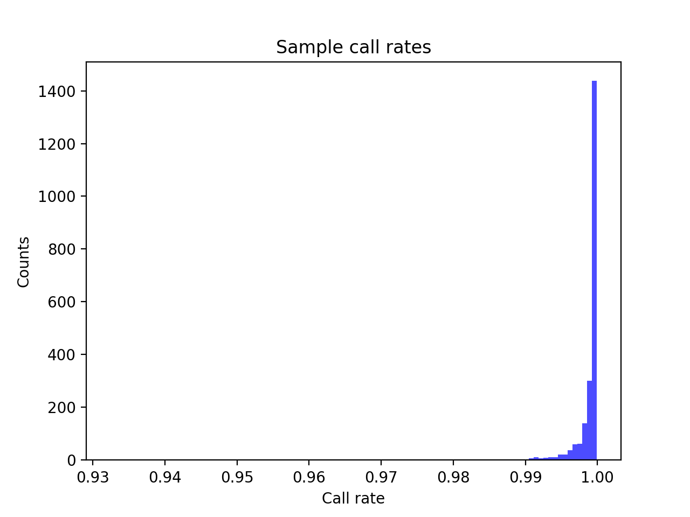
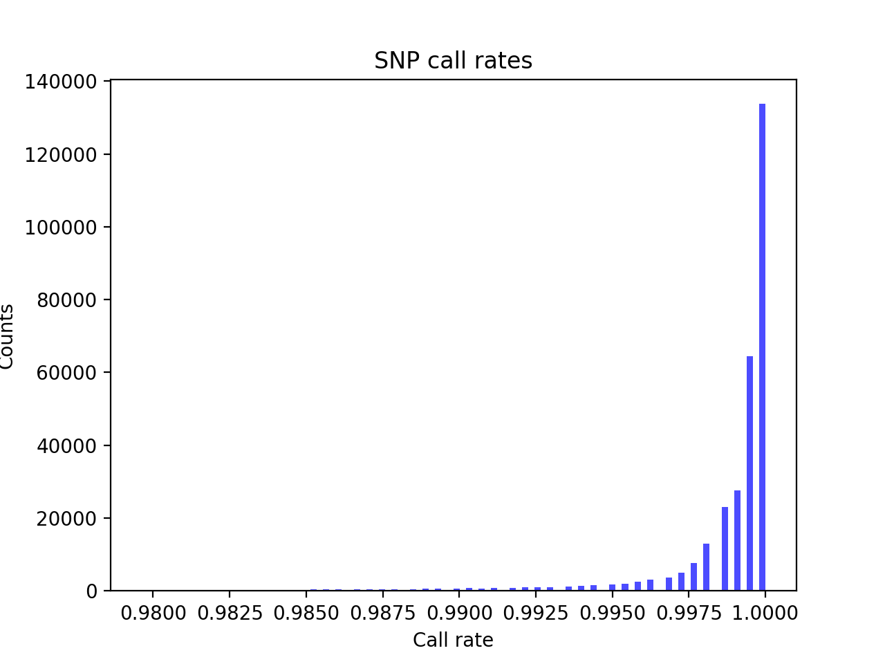
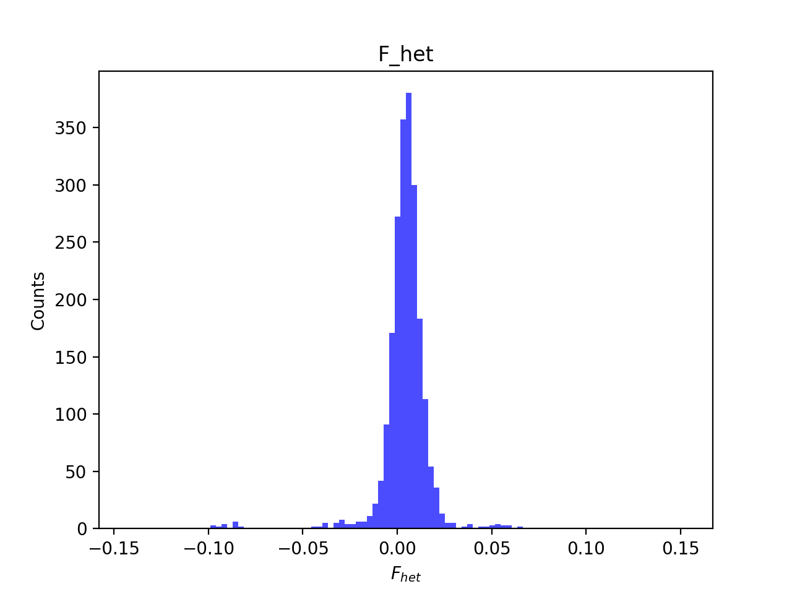
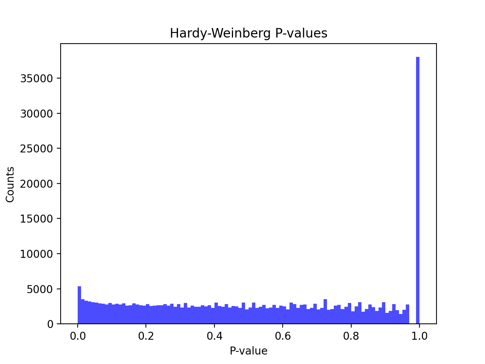
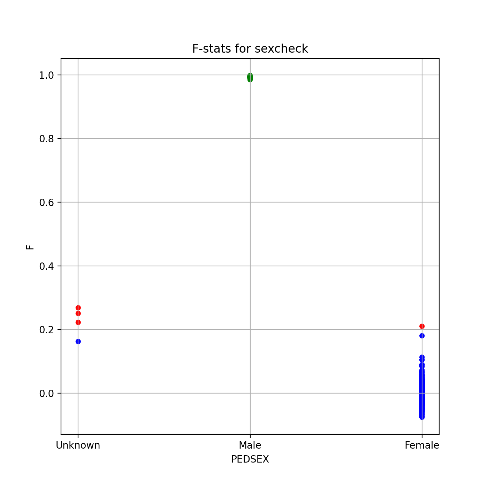
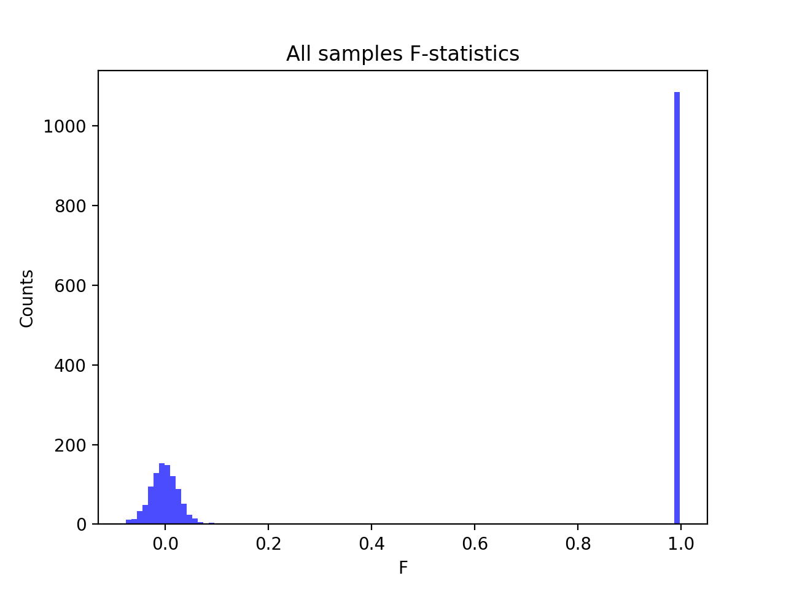
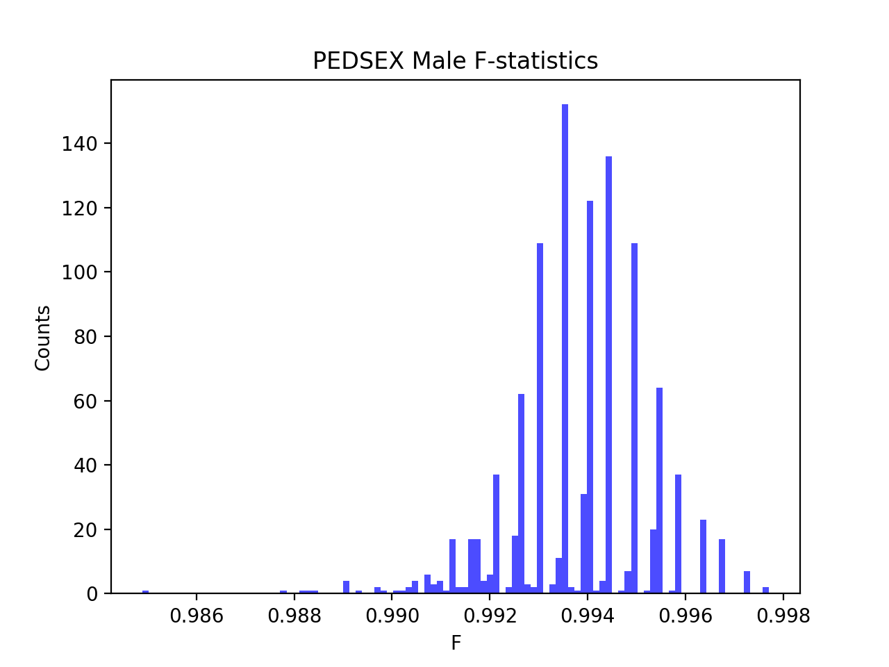
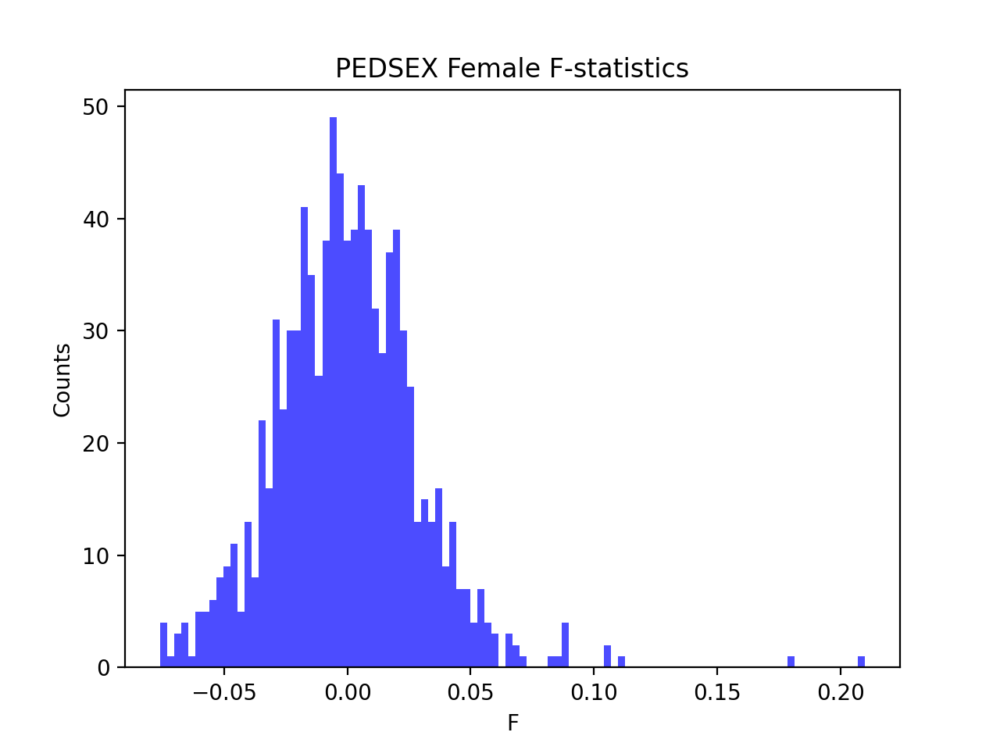

# Batch report for batch snp018de, module mod5-harmonization
## Samples overview
2160 samples
 2119 kinship clusters
 10 offspring with mother ID
 10 offspring with mother in batch
 10 mothers with offspring in batch
 0 mothers missing from batch
 14 offspring with father ID
 14 offspring with father in batch
 14 fathers with offspring in batch
 0 fathers missing from batch
## Call rates
### Sample call rates
min: 0.9324562
 max: 0.999899018
 median: 0.999527666 
### SNP call rates
min: 0.9796296
 max: 1.0
 median: 0.999537037 
## F_het
min: -0.143085
 max: 0.152283
 median: 0.004841985 
## Hardy-Weinberg P-values
min: 1.01331e-06
 max: 1.0
 median: 0.524838 
## Sexcheck
2030 out of 2160 OK 
| PEDSEX | Total | SNPSEX Male | SNPSEX Female | SNPSEX Unknown | OK | Problem |
| ------ | ------ | ------ | ------ | ------ | ------ | ------ |
| Male | 1085 | 1085 | 0 | 0 | 1085 | 0 |
| Female | 946 | 0 | 945 | 1 | 945 | 1 |
| Unknown | 4 | 0 | 1 | 3 | 0 | 4 |

### All samples 
### All samples F-statistics
min: -0.07587
 max: 0.9977
 median: 0.9916 
### PEDSEX Male
### PEDSEX Male F-statistics
min: 0.9849
 max: 0.9977
 median: 0.994 
### PEDSEX Female
### PEDSEX Female F-statistics
min: -0.07587
 max: 0.2099
 median: -0.001287 