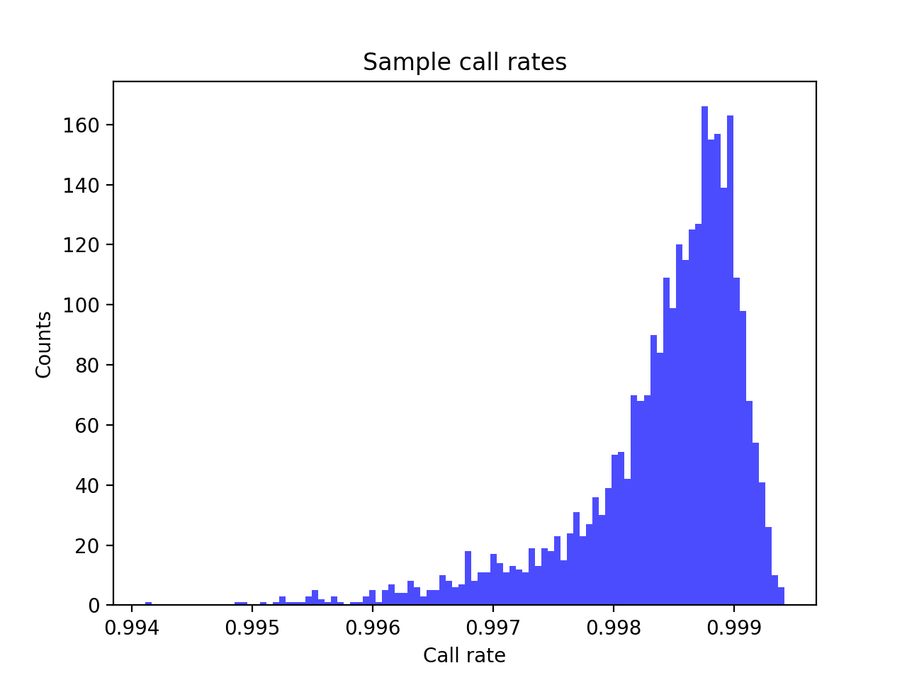
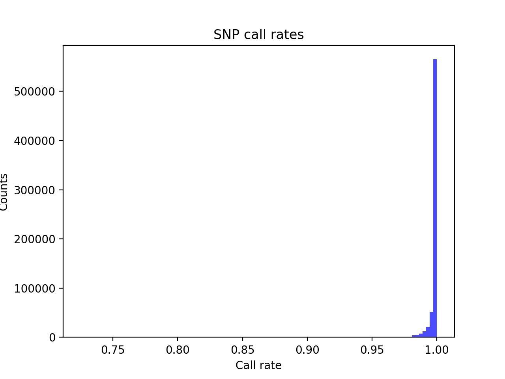
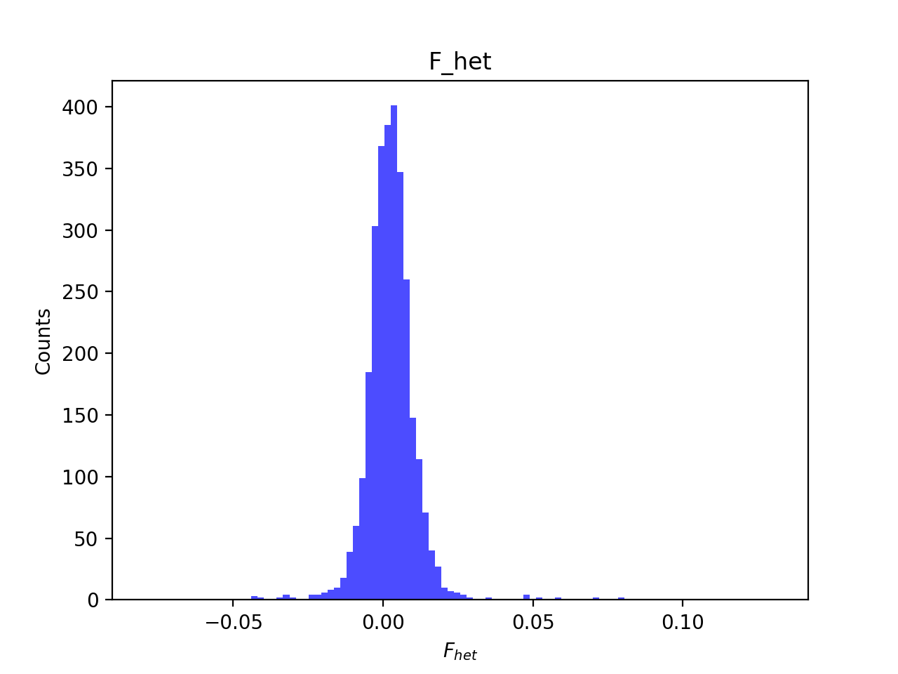
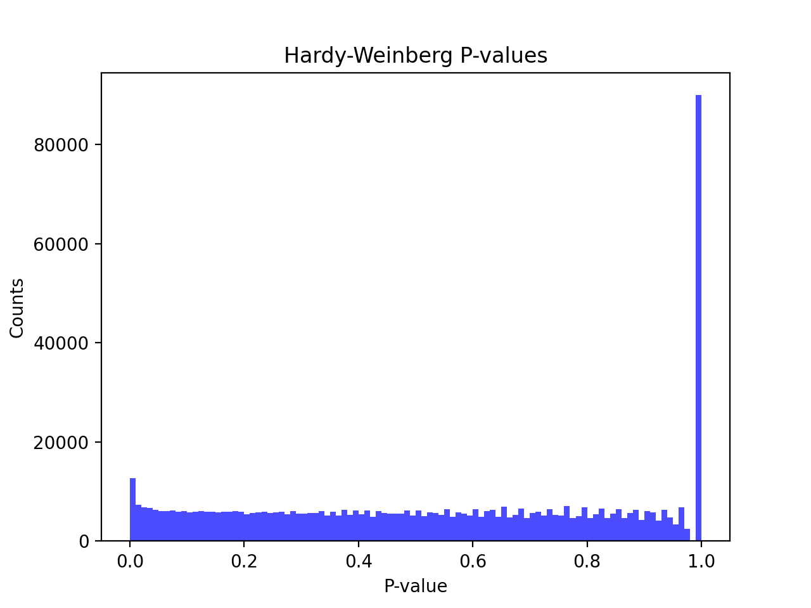
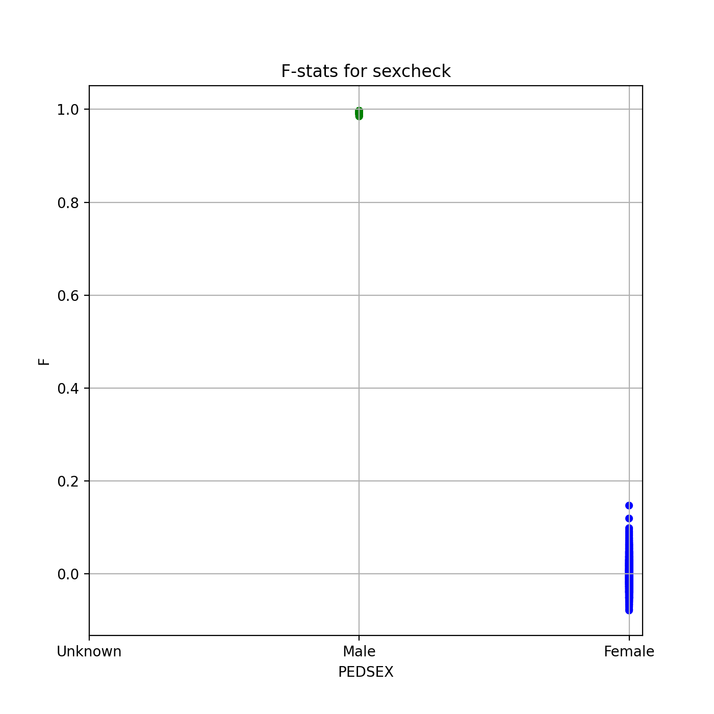
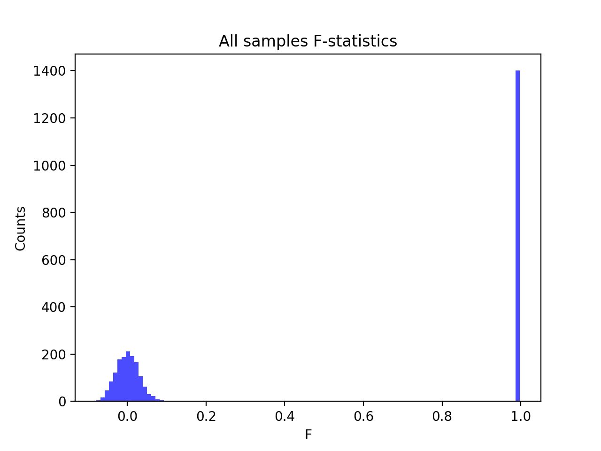
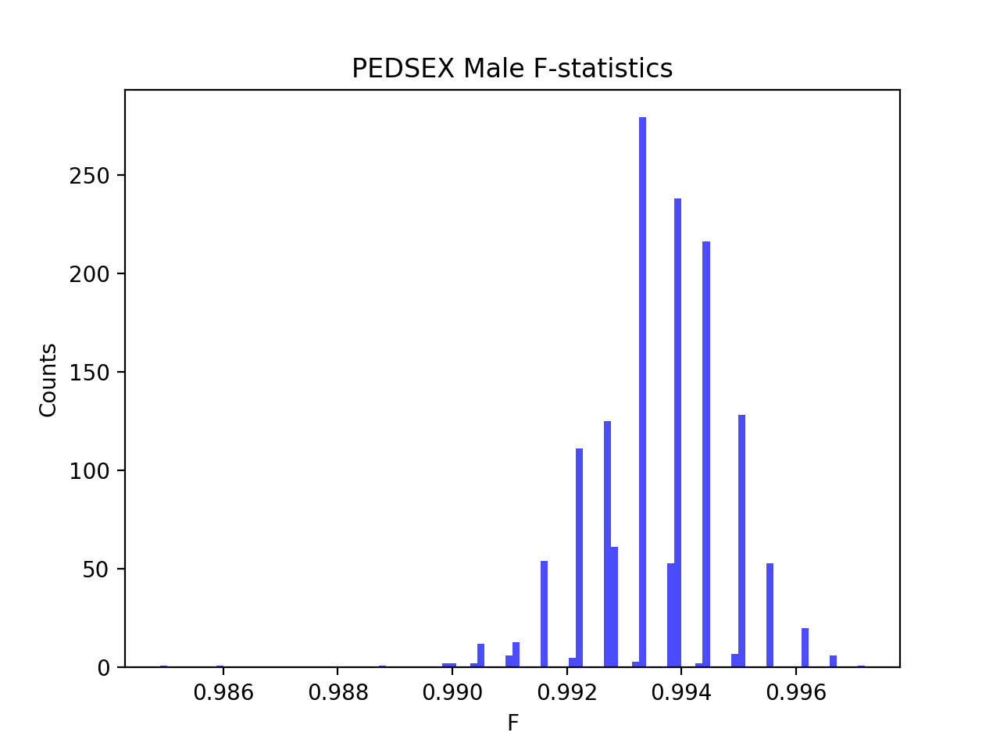
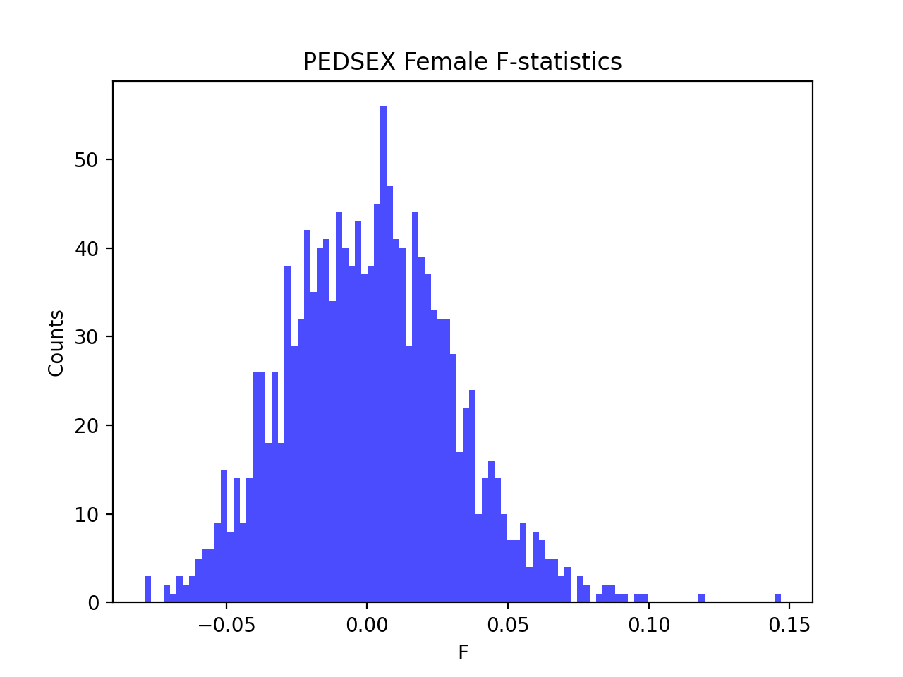

# Batch report for batch snp007, module mod5-harmonization
## Samples overview
2970 samples
 2966 kinship clusters
 2970 offspring with mother ID
 0 offspring with mother in batch
 0 mothers with offspring in batch
 2970 mothers missing from batch
 2970 offspring with father ID
 0 offspring with father in batch
 0 fathers with offspring in batch
 2970 fathers missing from batch
## Call rates
### Sample call rates
min: 0.99411085
 max: 0.999419464
 median: 0.99860477 
### SNP call rates
min: 0.7252529999999999
 max: 1.0
 median: 0.9996633 
## F_het
min: -0.0797077
 max: 0.131277
 median: 0.0024700399999999997 
## Hardy-Weinberg P-values
min: 1.05962e-06
 max: 1.0
 median: 0.548054 
## Sexcheck
2852 out of 2970 OK 
| PEDSEX | Total | SNPSEX Male | SNPSEX Female | SNPSEX Unknown | OK | Problem |
| ------ | ------ | ------ | ------ | ------ | ------ | ------ |
| Male | 1402 | 1402 | 0 | 0 | 1402 | 0 |
| Female | 1450 | 0 | 1450 | 0 | 1450 | 0 |
| Unknown | 0 | 0 | 0 | 0 | 0 | 0 |

### All samples 
### All samples F-statistics
min: -0.07901
 max: 0.9972
 median: 0.06732 
### PEDSEX Male
### PEDSEX Male F-statistics
min: 0.9849
 max: 0.9972
 median: 0.9938 
### PEDSEX Female
### PEDSEX Female F-statistics
min: -0.07901
 max: 0.1469
 median: 0.0008214 