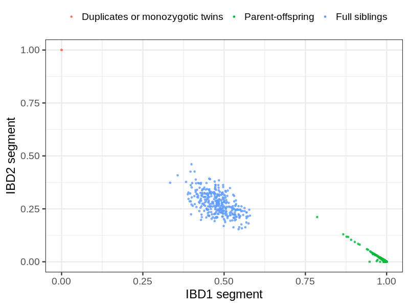
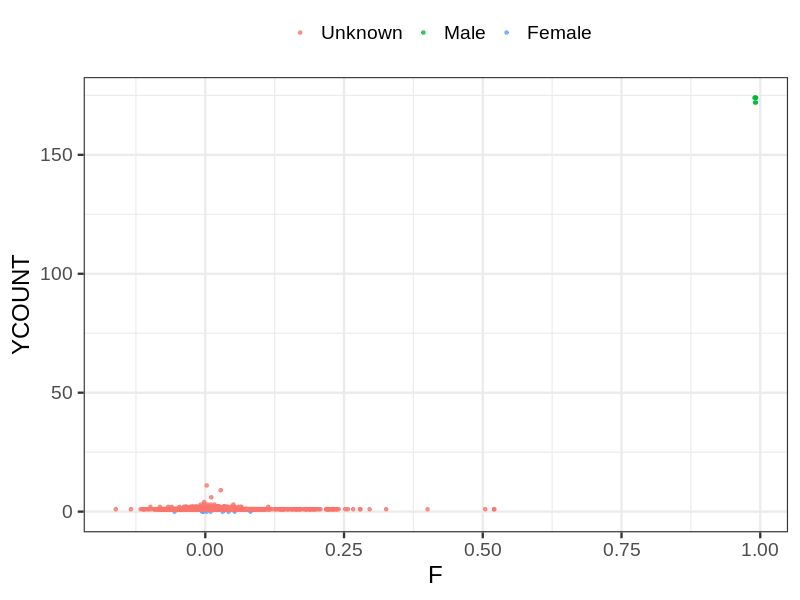
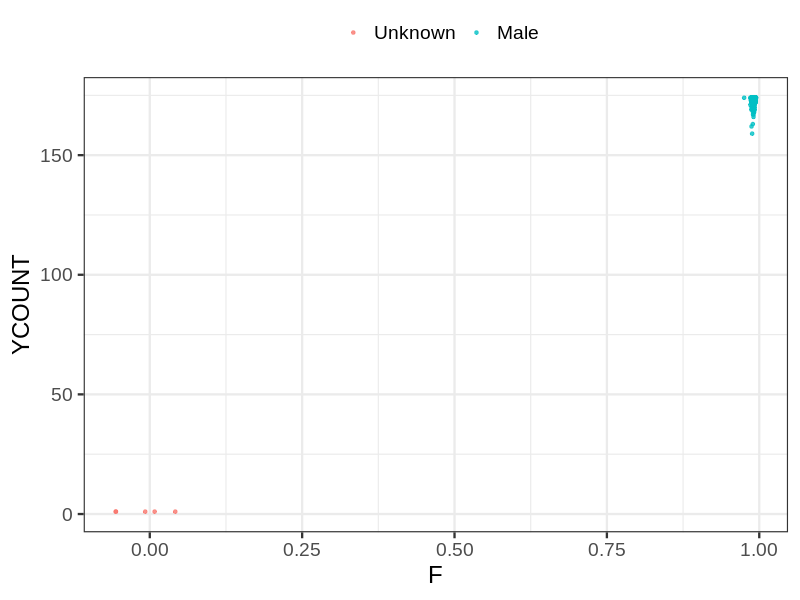
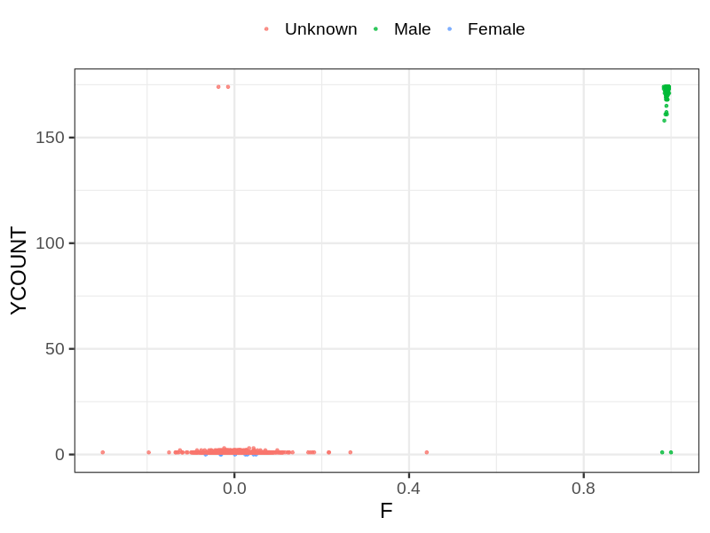

# Fam file reconstruction in snp009
- Number of samples in the genotyping data: 17547.
## Samples not in Medical Birth Regsitry
40 samples with missing birth year, assumed to be parent in the following.
## Relationship inference
| Relationship |   |
| ------------ | - |
| Duplicates or monozygotic twins| 5 |
| Parent-offspring| 10321 |
| Full siblings| 340 |
| 2nd degree| 0 |
| 3rd degree| 0 |
| 4th degree| 0 |
| Unrelated| 0 |

## Mother sex check
| Inferred sex |   |
| ------------ | - |
| Unknown | 5676 |
| Male | 7 |
| Female | 9 |

## Father sex check
| Inferred sex |   |
| ------------ | - |
| Unknown | 5 |
| Male | 5377 |
| Female | 0 |

## Children sex check
| Inferred sex |   |
| ------------ | - |
| Unknown | 3191 |
| Male | 3274 |
| Female | 8 |

## Parental relationships
40 sentrix IDs missing from ID file. These are not counted as individuals.
###  Individuals
17507 individuals in total. Breakdown excluding multiple same-sex parents:
 -  5798 children
 -  5085 mothers
 -  4795 fathers
 -  5306 mother-child pairs
 -  5001 father-child pairs
 -  4509 mother-father-child trios
 -  1830 unrelated

Multiple same-sex parents (at the individual level):
 -  0 children with more than one mother detected
 -  4 children with more than one father detected
 -  0 children with more than one mother in registry
 -  0 children with more than one father in registry

5327 mother-child relationships expected.
- 5304 (99.57%) recovered by genetic relationships.
- 23 (0.43%) not recovered by genetic relationships.

5021 father-child relationships expected.
- 4996 (99.5%) recovered by genetic relationships.
- 25 (0.5%) not recovered by genetic relationships.

5306 mother-child relationships detected.
- 5304 (99.96%) matched to registry.
- 2 (0.04%) not matched to registry.

5005 father-child relationships detected.
- 4996 (99.82%) matched to registry.
- 9 (0.18%) not matched to registry.

###  Samples
17547 samples in total. Breakdown excluding multiple same-sex parents:
 -  5799 children
 -  5085 mothers
 -  4798 fathers
 -  5306 mother-child pairs
 -  5004 father-child pairs
 -  4511 mother-father-child trios
 -  1866 unrelated

Multiple same-sex parents (at the sample level):
 -  0 children with more than one mother detected
 -  4 children with more than one father detected
 -  3883 children with more than one mother in registry
 -  2490 children with more than one father in registry

5327 mother-child relationships expected.
- 5304 (99.57%) recovered by genetic relationships.
- 23 (0.43%) not recovered by genetic relationships.

5021 father-child relationships expected.
- 4996 (99.5%) recovered by genetic relationships.
- 25 (0.5%) not recovered by genetic relationships.

5306 mother-child relationships detected.
- 5304 (99.96%) matched to registry.
- 2 (0.04%) not matched to registry.

5008 father-child relationships detected.
- 4996 (99.76%) matched to registry.
- 12 (0.24%) not matched to registry.

## Exclusion
- Number of samples excluded: 67
