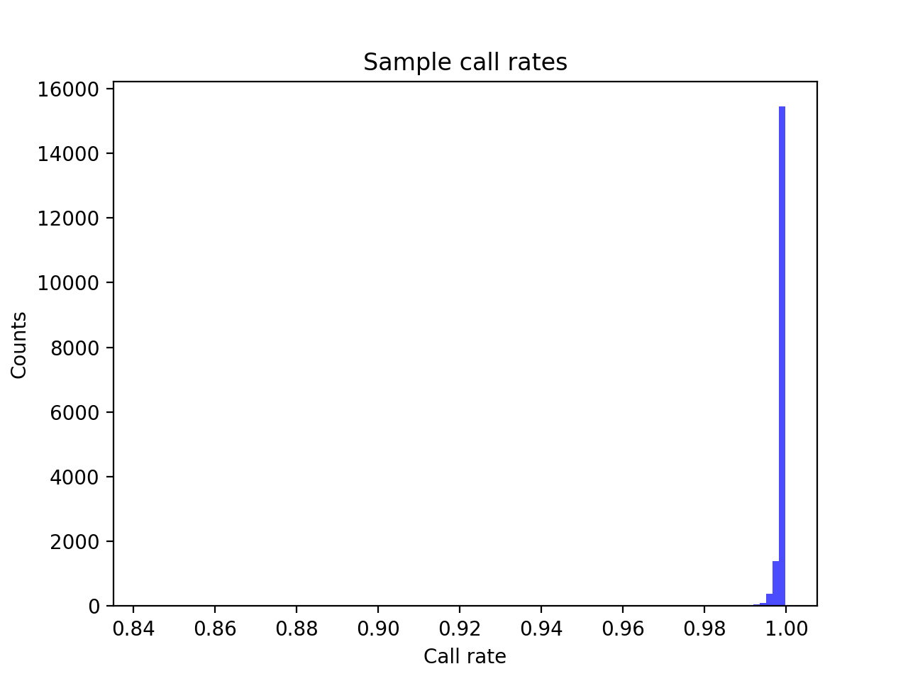
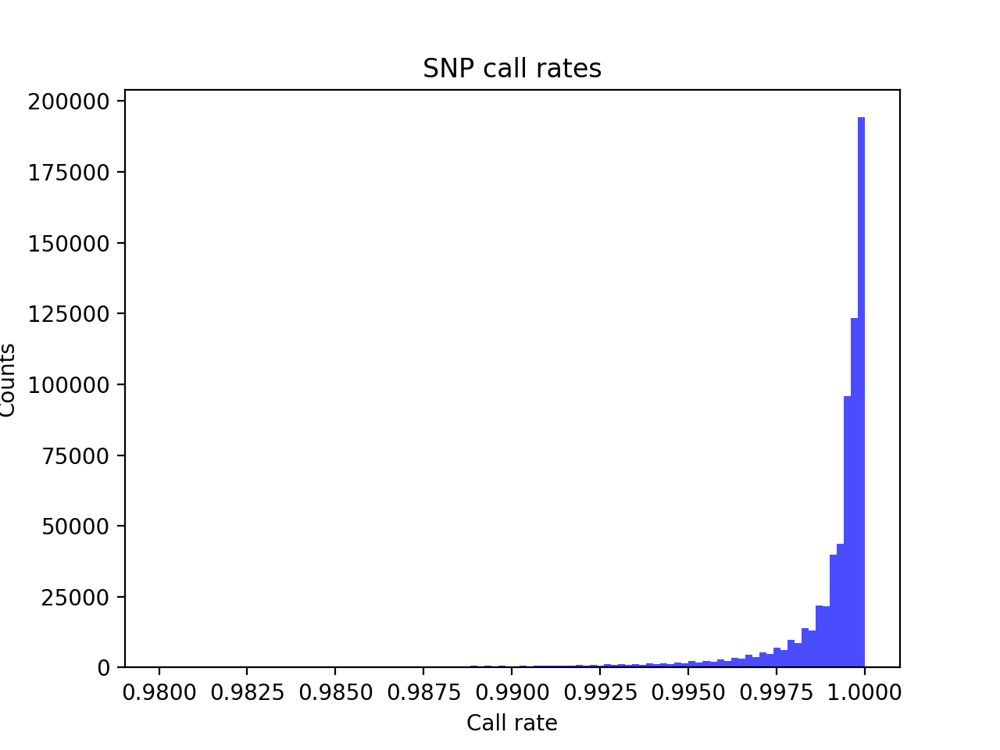
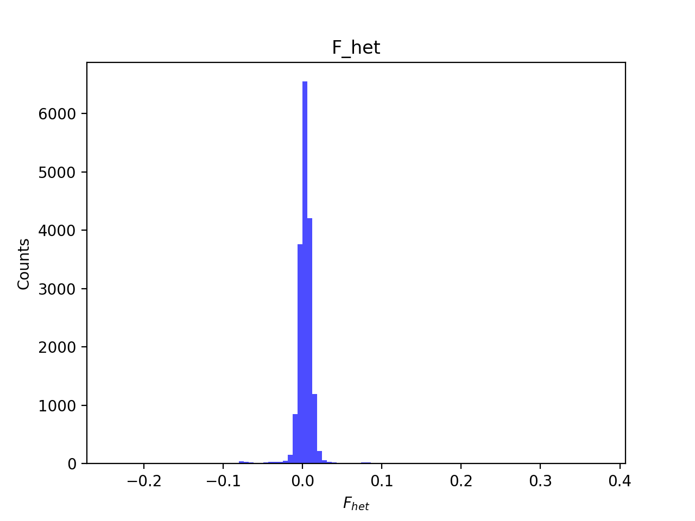
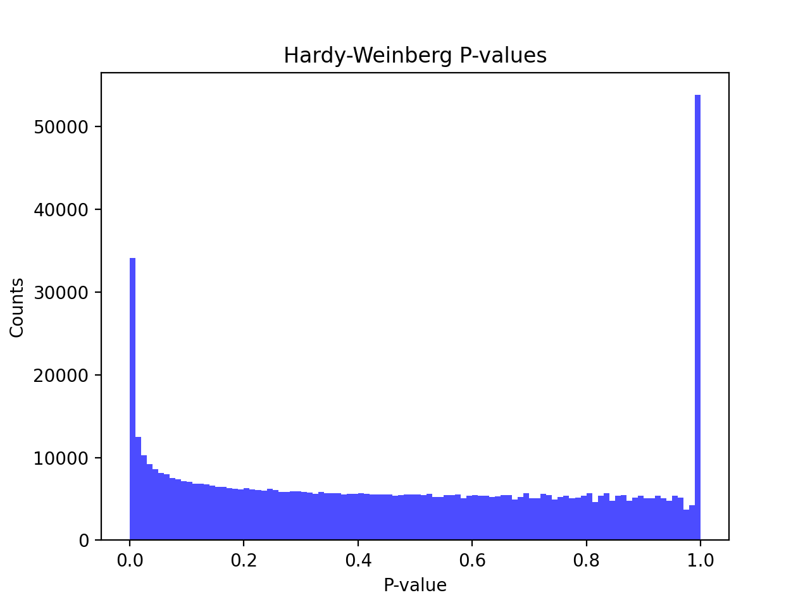
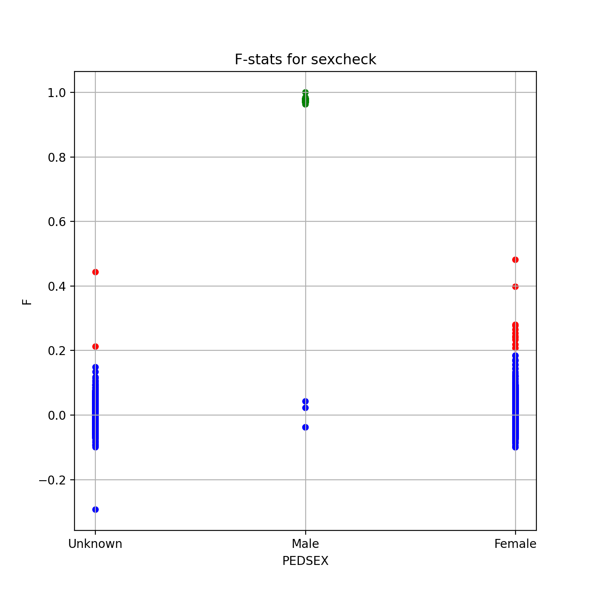
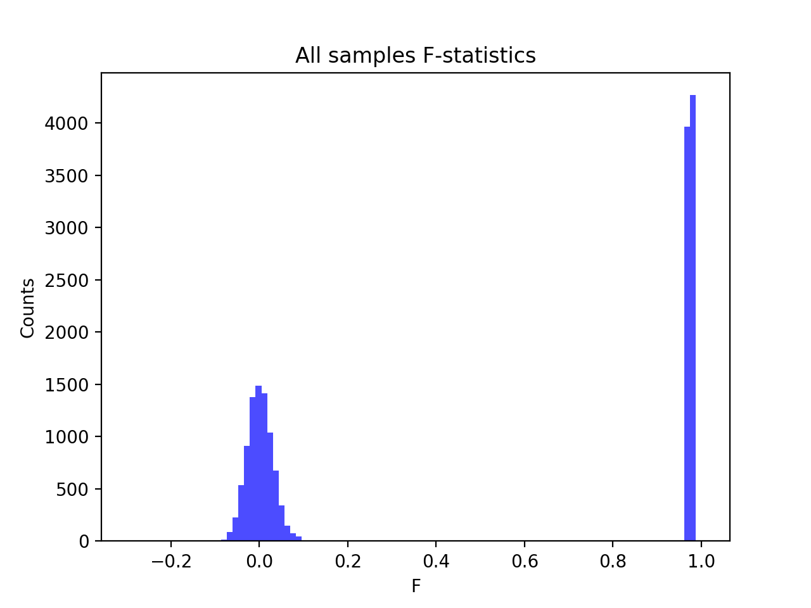
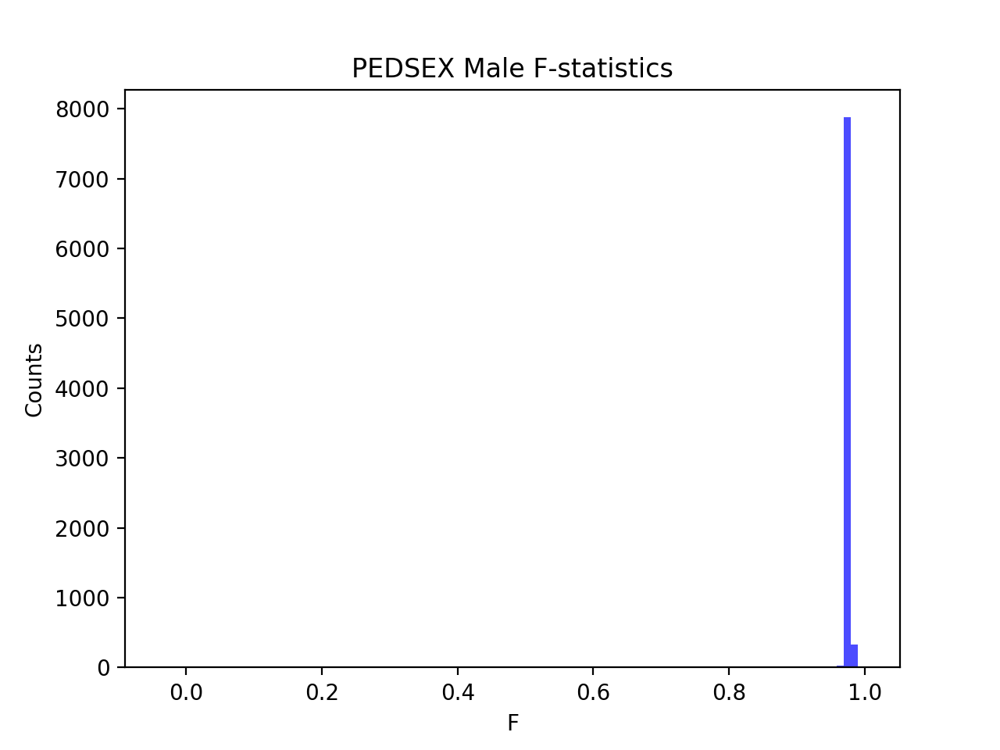
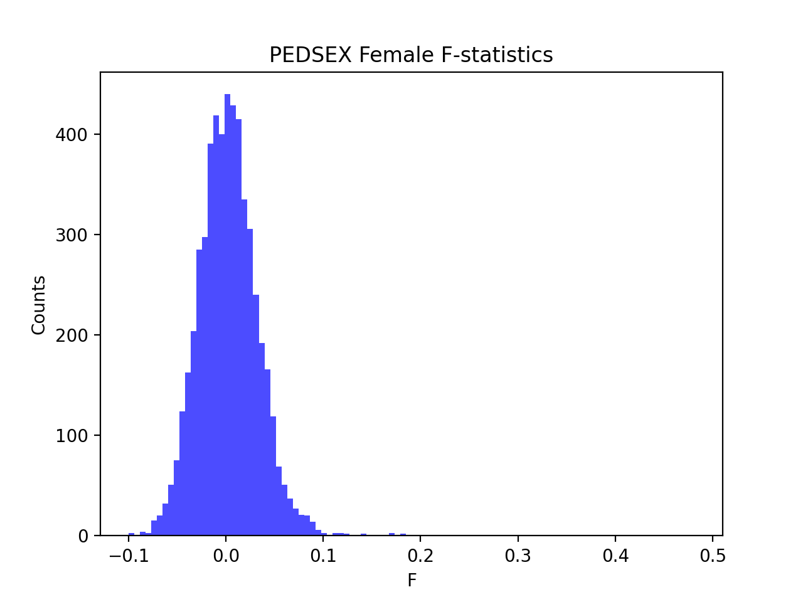

# Batch report for batch snp009, module mod5-pre-phasing
## Samples overview
17480 samples
 7268 kinship clusters
 5305 offspring with mother ID
 5303 offspring with mother in batch
 5082 mothers with offspring in batch
 2 mothers missing from batch
 4994 offspring with father ID
 4993 offspring with father in batch
 4787 fathers with offspring in batch
 1 fathers missing from batch
## Call rates
### Sample call rates
min: 0.84289
 max: 0.999742088
 median: 0.999164011 
### SNP call rates
min: 0.9800343
 max: 1.0
 median: 0.999599542 
## F_het
min: -0.240862
 max: 0.376305
 median: 0.00336384 
## Hardy-Weinberg P-values
min: 1.00768e-06
 max: 1.0
 median: 0.462269 
## Sexcheck
13625 out of 17480 OK 
| PEDSEX | Total | SNPSEX Male | SNPSEX Female | SNPSEX Unknown | OK | Problem |
| ------ | ------ | ------ | ------ | ------ | ------ | ------ |
| Male | 8232 | 8228 | 4 | 0 | 8228 | 4 |
| Female | 5408 | 0 | 5397 | 11 | 5397 | 11 |
| Unknown | 3026 | 0 | 3024 | 2 | 0 | 3026 |

### All samples 
### All samples F-statistics
min: -0.2929
 max: 1.0
 median: 0.078165 
### PEDSEX Male
### PEDSEX Male F-statistics
min: -0.03822
 max: 1.0
 median: 0.9743 
### PEDSEX Female
### PEDSEX Female F-statistics
min: -0.09987
 max: 0.4813
 median: 0.0017975 