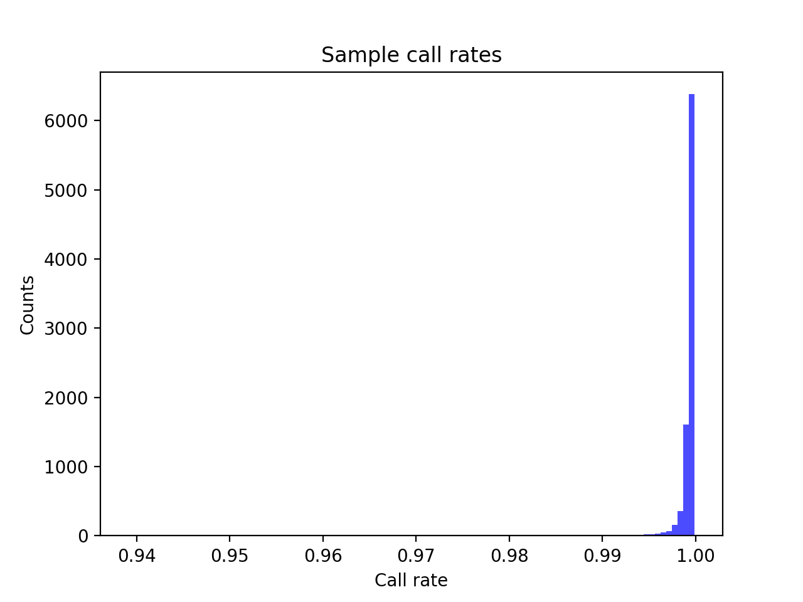
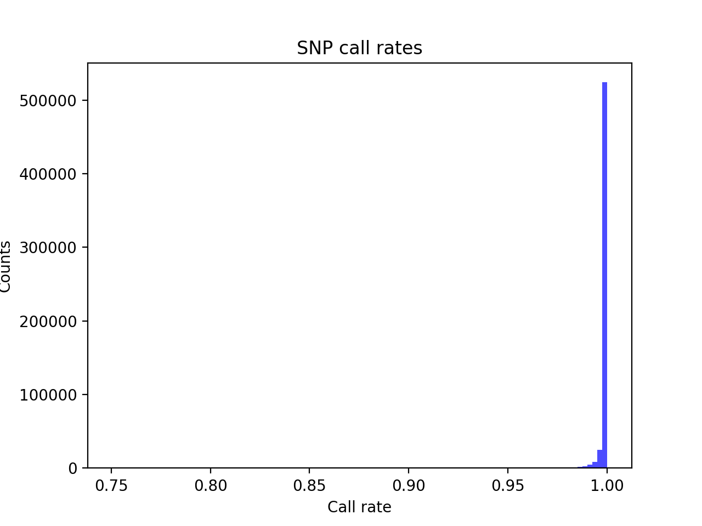
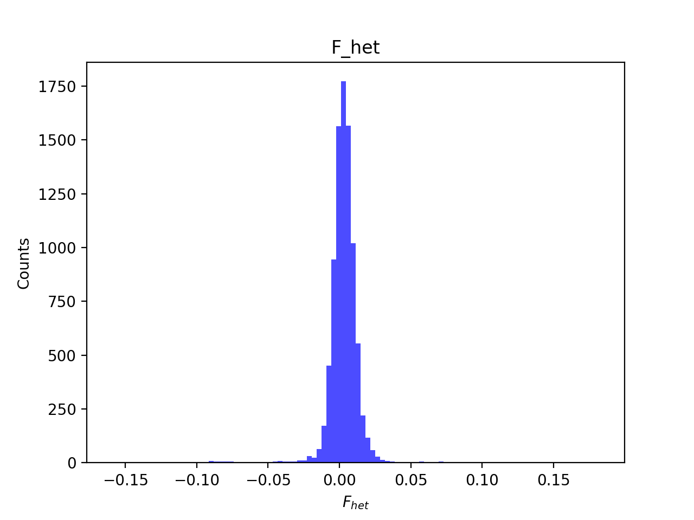
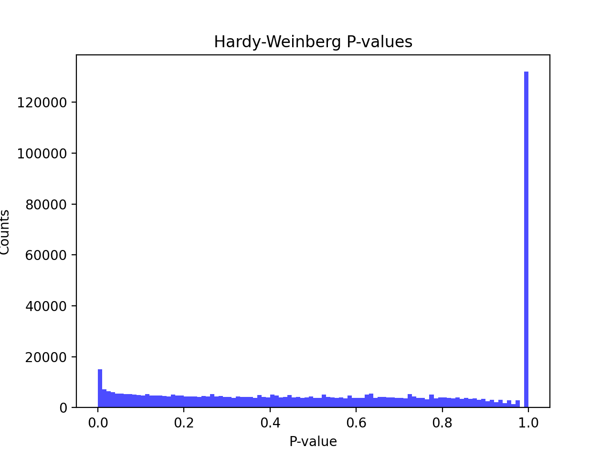
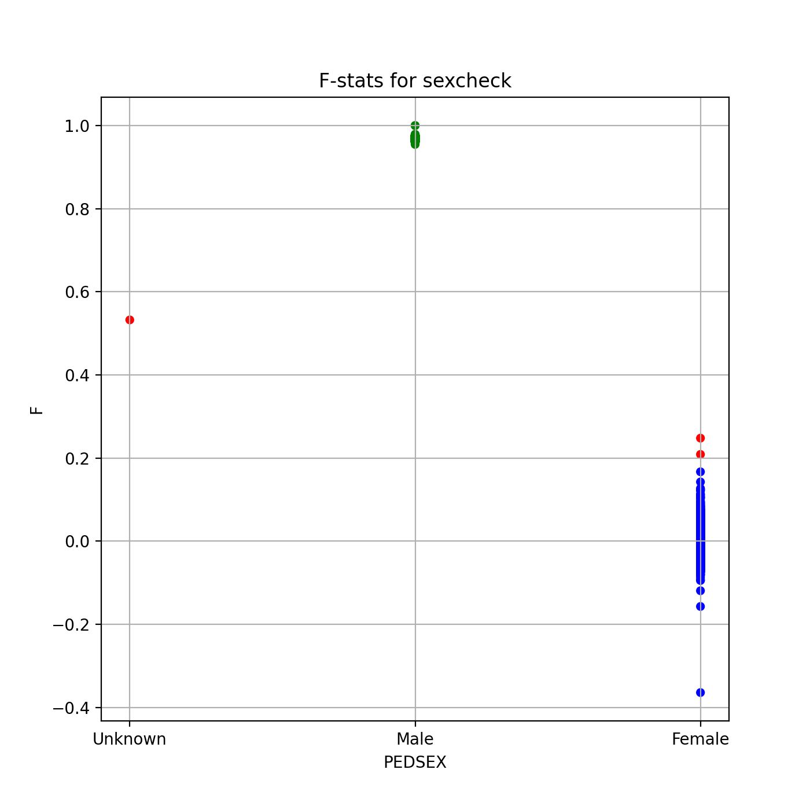
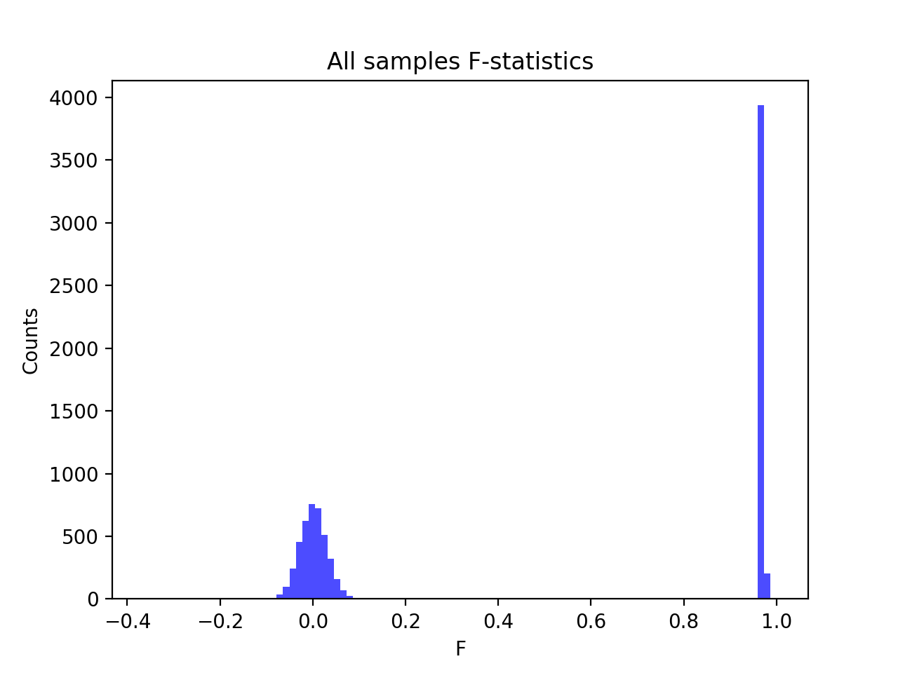
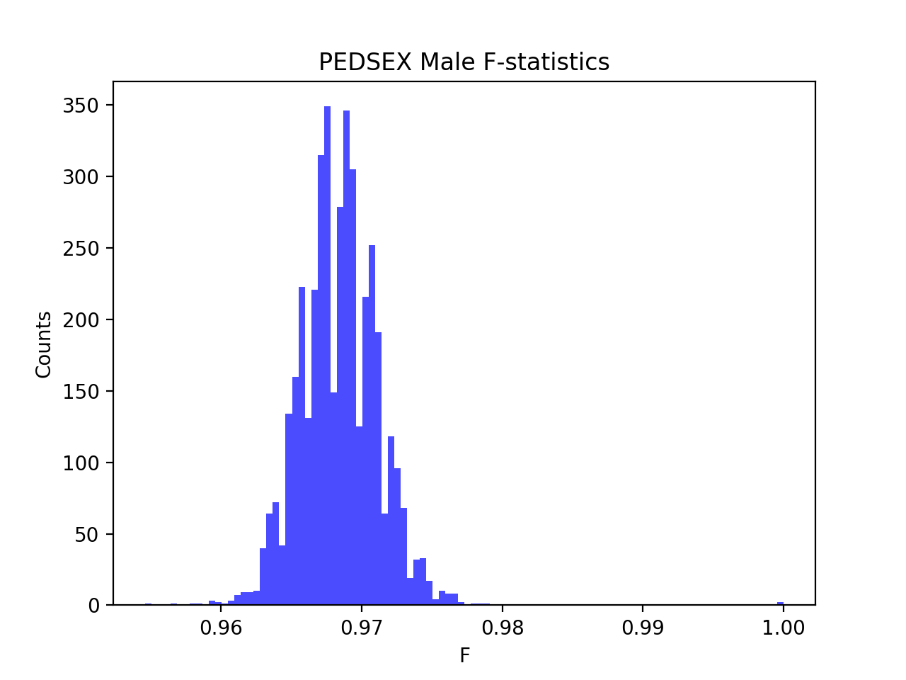
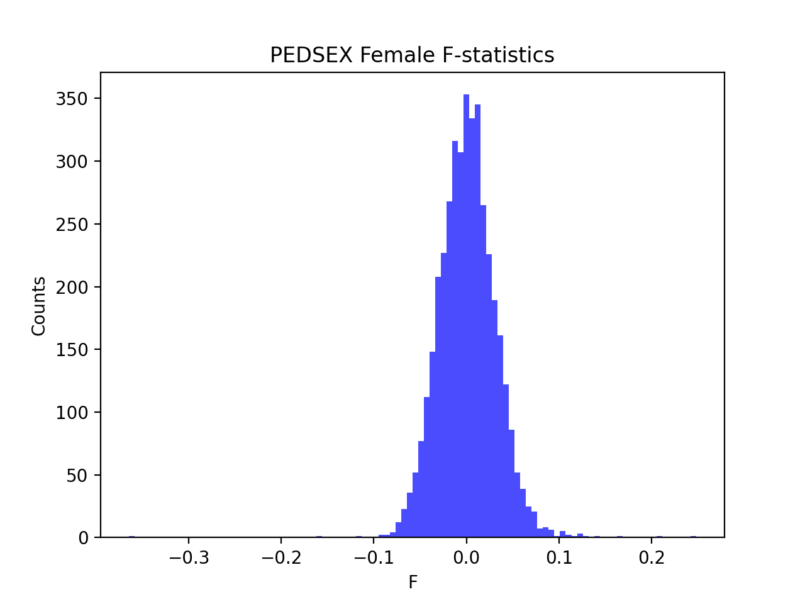

# Batch report for batch snp014, module mod5-pre-phasing
## Samples overview
8778 samples
 3026 kinship clusters
 2880 offspring with mother ID
 2880 offspring with mother in batch
 2880 mothers with offspring in batch
 0 mothers missing from batch
 2856 offspring with father ID
 2852 offspring with father in batch
 2852 fathers with offspring in batch
 4 fathers missing from batch
## Call rates
### Sample call rates
min: 0.9391378
 max: 0.999859221
 median: 0.999487917 
### SNP call rates
min: 0.7506269999999999
 max: 1.0
 median: 0.999772158 
## F_het
min: -0.159978
 max: 0.182742
 median: 0.003118745 
## Hardy-Weinberg P-values
min: 1.00272e-06
 max: 1.0
 median: 0.582642 
## Sexcheck
8197 out of 8778 OK 
| PEDSEX | Total | SNPSEX Male | SNPSEX Female | SNPSEX Unknown | OK | Problem |
| ------ | ------ | ------ | ------ | ------ | ------ | ------ |
| Male | 4146 | 4146 | 0 | 0 | 4146 | 0 |
| Female | 4053 | 0 | 4051 | 2 | 4051 | 2 |
| Unknown | 1 | 0 | 0 | 1 | 0 | 1 |

### All samples 
### All samples F-statistics
min: -0.3641
 max: 1.0
 median: 0.9625 
### PEDSEX Male
### PEDSEX Male F-statistics
min: 0.9546
 max: 1.0
 median: 0.9683 
### PEDSEX Female
### PEDSEX Female F-statistics
min: -0.3641
 max: 0.248
 median: 0.000814 