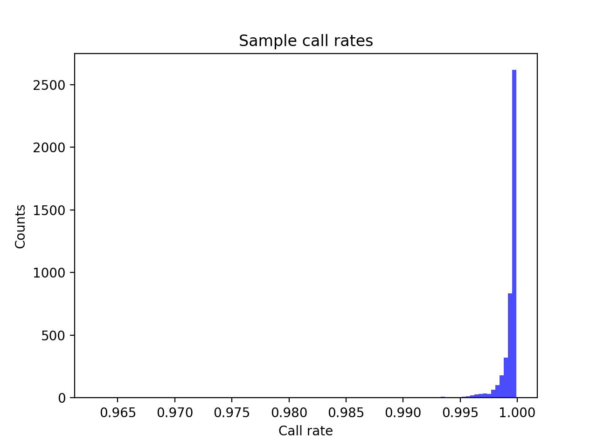
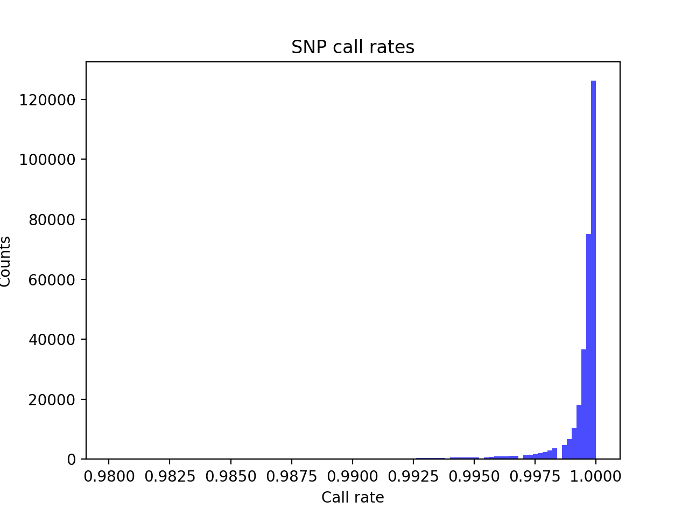
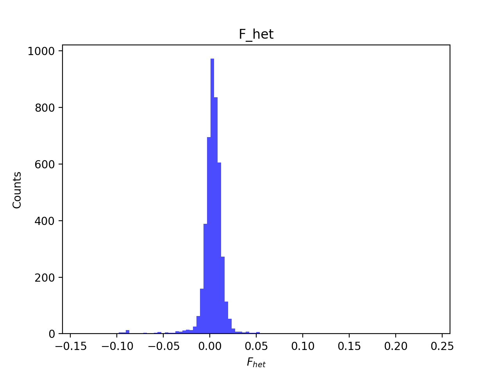
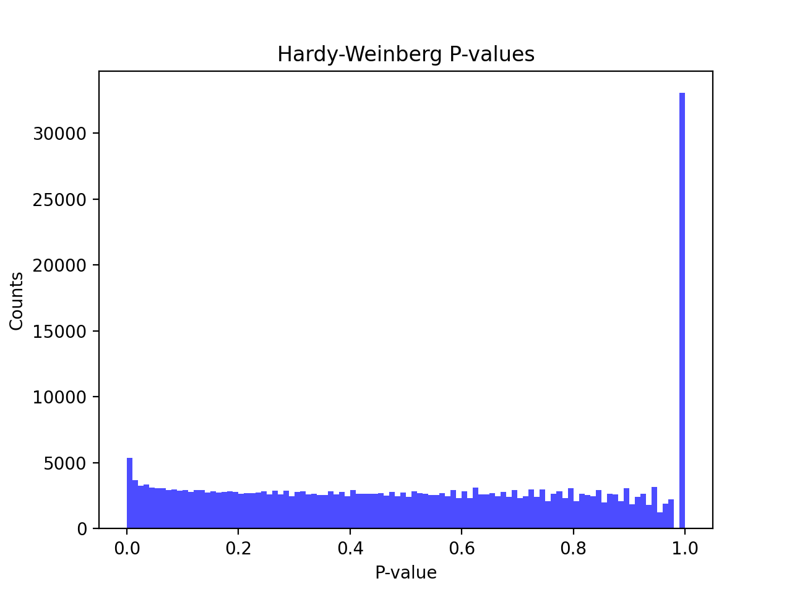
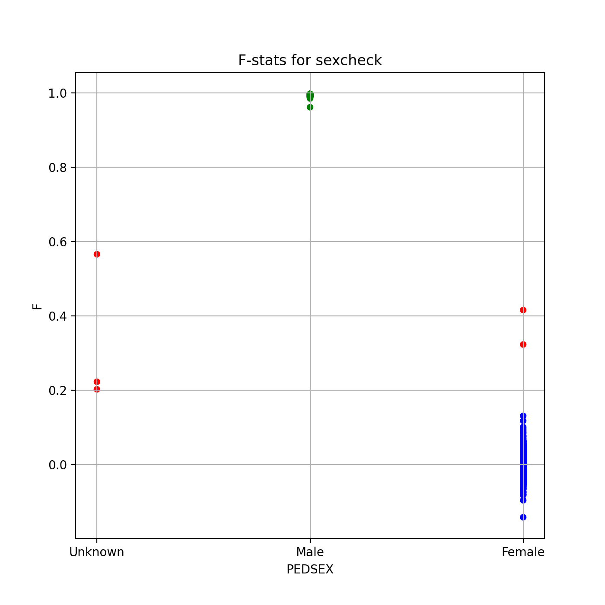
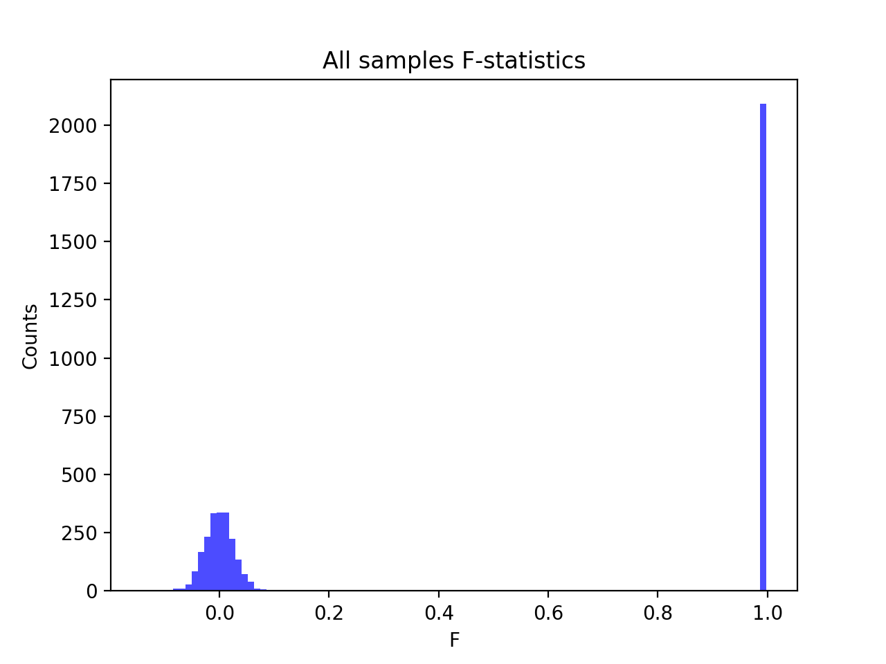
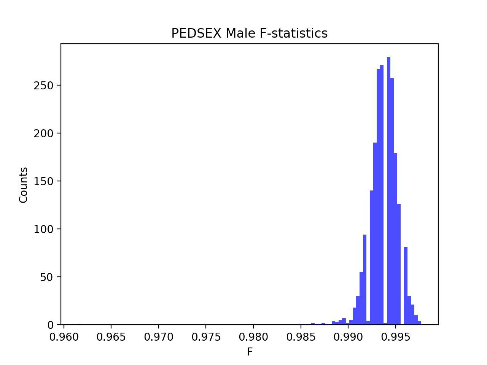
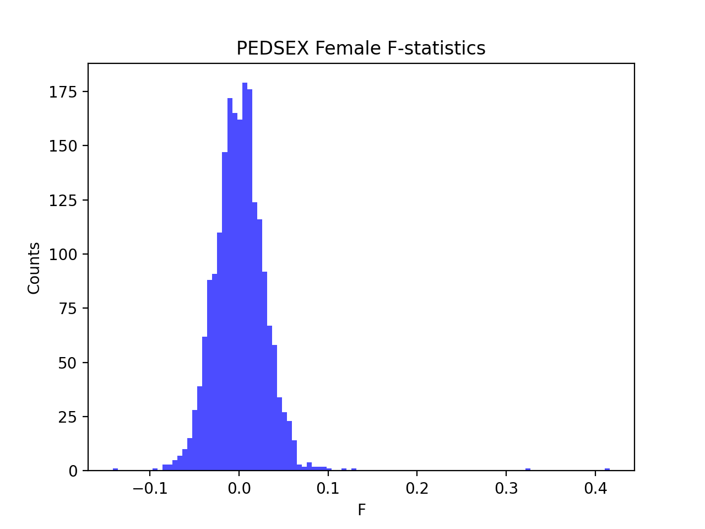

# Batch report for batch snp015b, module mod5-pre-phasing
## Samples overview
4363 samples
 3767 kinship clusters
 336 offspring with mother ID
 336 offspring with mother in batch
 333 mothers with offspring in batch
 0 mothers missing from batch
 247 offspring with father ID
 247 offspring with father in batch
 244 fathers with offspring in batch
 0 fathers missing from batch
## Call rates
### Sample call rates
min: 0.9630701
 max: 0.9999106972
 median: 0.999626842 
### SNP call rates
min: 0.9800596
 max: 1.0
 median: 0.9997708 
## F_het
min: -0.139531
 max: 0.239495
 median: 0.00357826 
## Hardy-Weinberg P-values
min: 1.11597e-06
 max: 1.0
 median: 0.522129 
## Sexcheck
4130 out of 4363 OK 
| PEDSEX | Total | SNPSEX Male | SNPSEX Female | SNPSEX Unknown | OK | Problem |
| ------ | ------ | ------ | ------ | ------ | ------ | ------ |
| Male | 2093 | 2093 | 0 | 0 | 2093 | 0 |
| Female | 2039 | 0 | 2037 | 2 | 2037 | 2 |
| Unknown | 3 | 0 | 0 | 3 | 0 | 3 |

### All samples 
### All samples F-statistics
min: -0.1414
 max: 0.9977
 median: 0.9896 
### PEDSEX Male
### PEDSEX Male F-statistics
min: 0.9615
 max: 0.9977
 median: 0.9937 
### PEDSEX Female
### PEDSEX Female F-statistics
min: -0.1414
 max: 0.416
 median: 0.0005409 