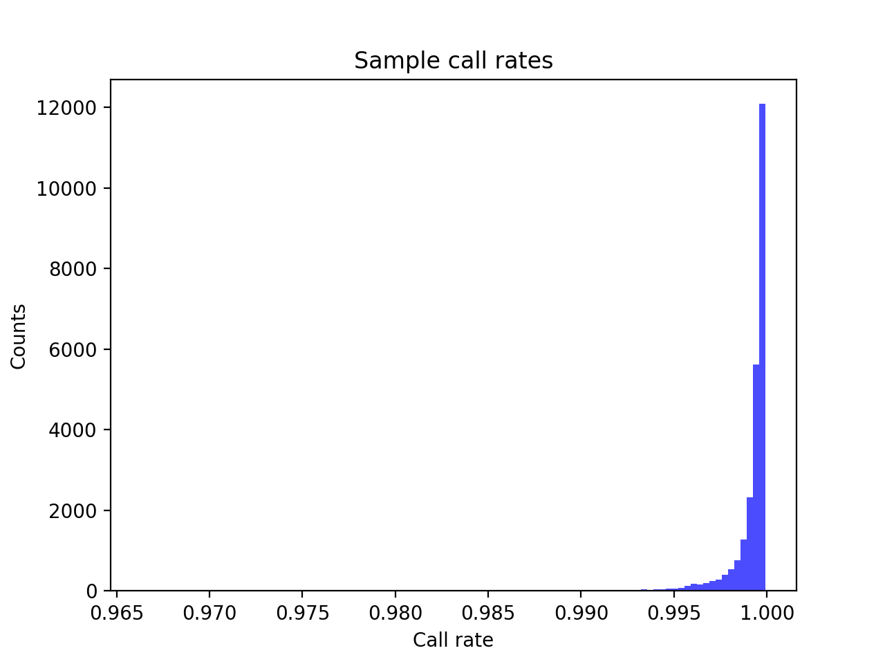
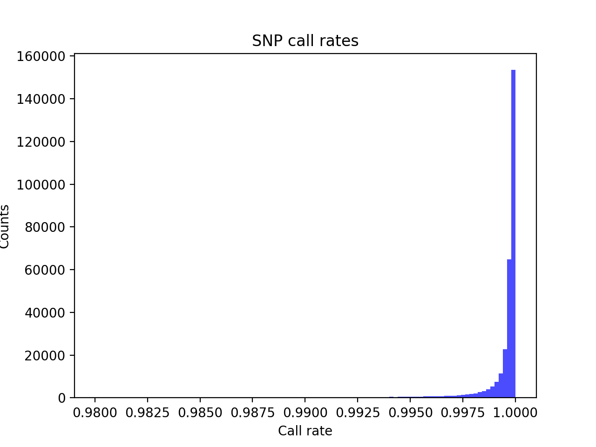
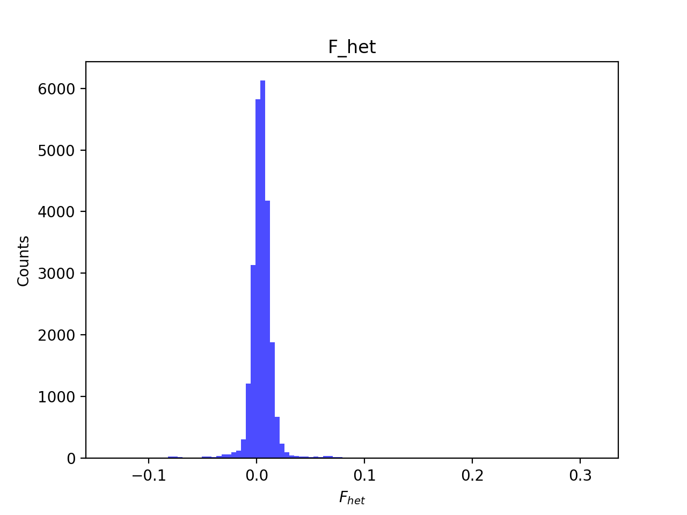
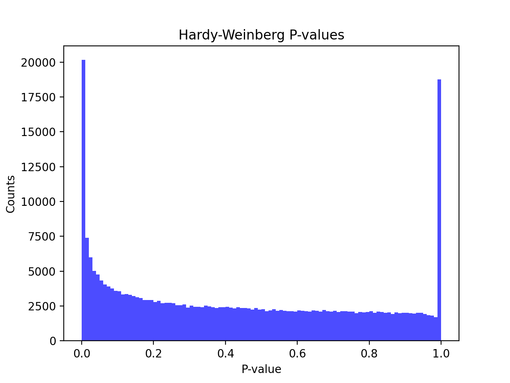
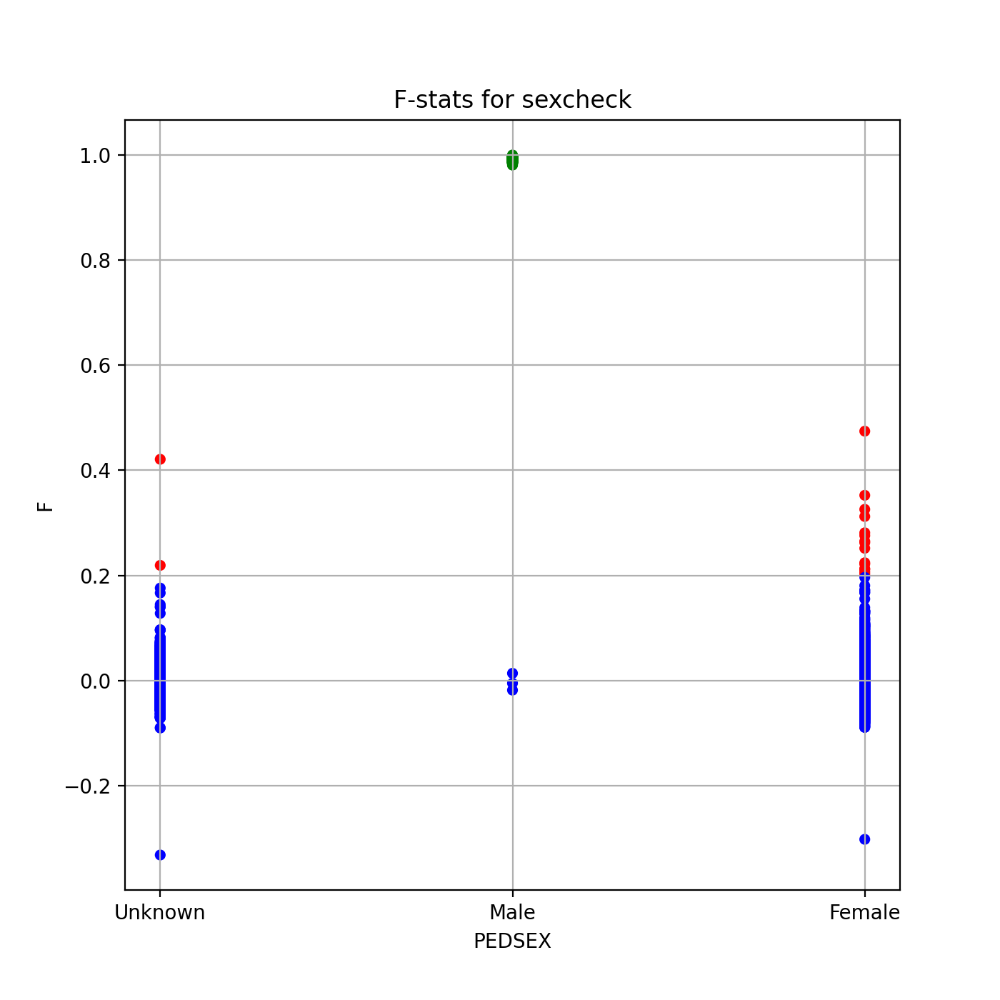
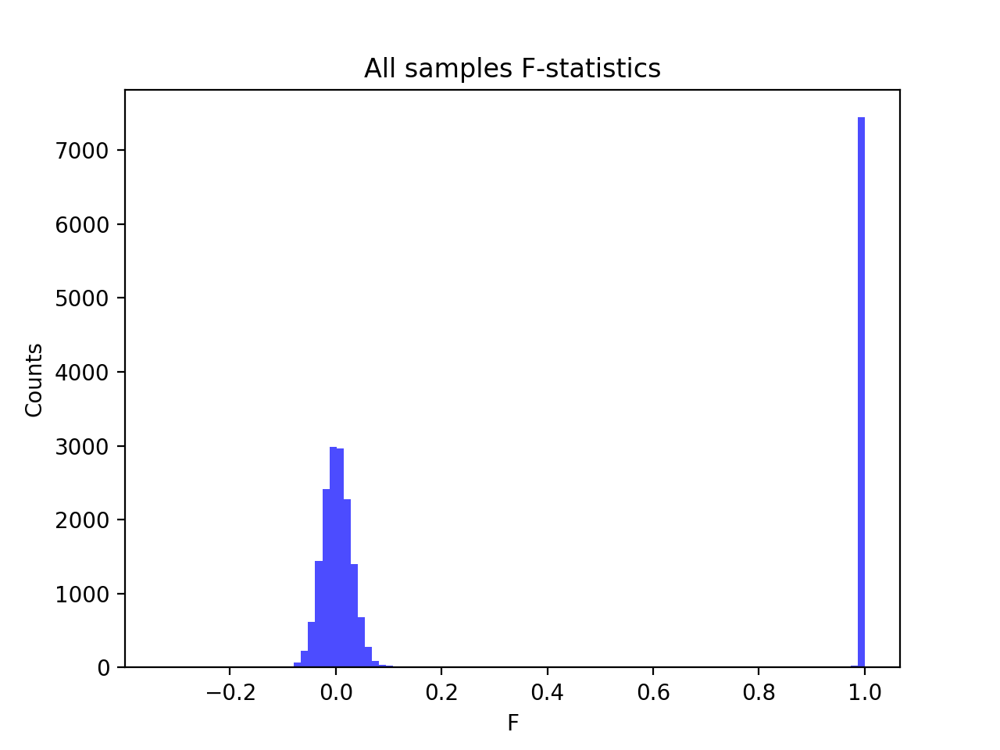
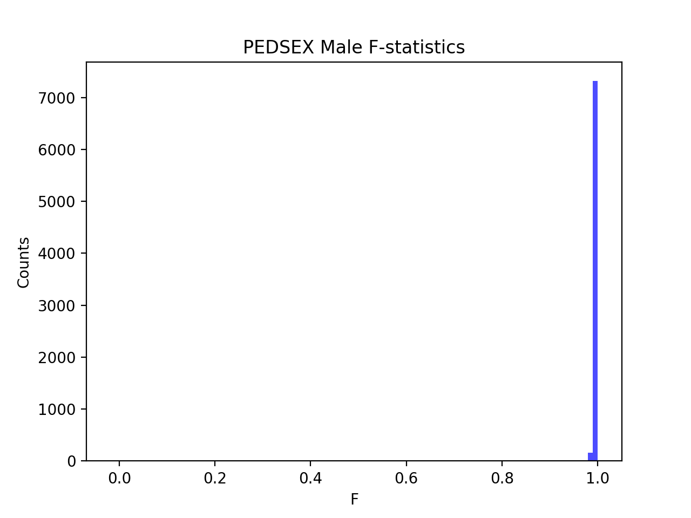
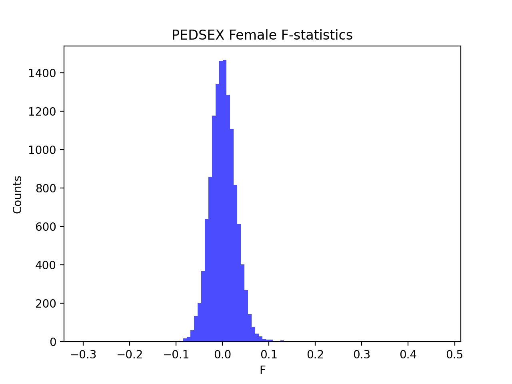

# Batch report for batch snp016a, module mod5-pre-phasing
## Samples overview
24685 samples
 21243 kinship clusters
 2771 offspring with mother ID
 2770 offspring with mother in batch
 2691 mothers with offspring in batch
 1 mothers missing from batch
 404 offspring with father ID
 404 offspring with father in batch
 391 fathers with offspring in batch
 0 fathers missing from batch
## Call rates
### Sample call rates
min: 0.9663586
 max: 0.9999147572
 median: 0.999570507 
### SNP call rates
min: 0.9800284
 max: 1.0
 median: 0.999837958 
## F_het
min: -0.135547
 max: 0.3128
 median: 0.00430205 
## Hardy-Weinberg P-values
min: 1.00092e-06
 max: 1.0
 median: 0.39595349999999996 
## Sexcheck
20067 out of 24685 OK 
| PEDSEX | Total | SNPSEX Male | SNPSEX Female | SNPSEX Unknown | OK | Problem |
| ------ | ------ | ------ | ------ | ------ | ------ | ------ |
| Male | 7473 | 7470 | 3 | 0 | 7470 | 3 |
| Female | 12612 | 0 | 12597 | 15 | 12597 | 15 |
| Unknown | 2941 | 0 | 2939 | 2 | 0 | 2941 |

### All samples 
### All samples F-statistics
min: -0.3319
 max: 1.0
 median: 0.018349999999999998 
### PEDSEX Male
### PEDSEX Male F-statistics
min: -0.01821
 max: 1.0
 median: 0.9936 
### PEDSEX Female
### PEDSEX Female F-statistics
min: -0.3021
 max: 0.4745
 median: 0.000852 