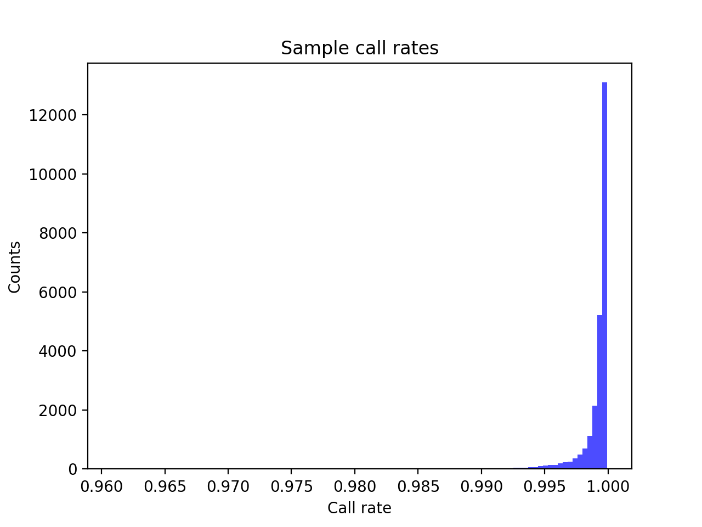
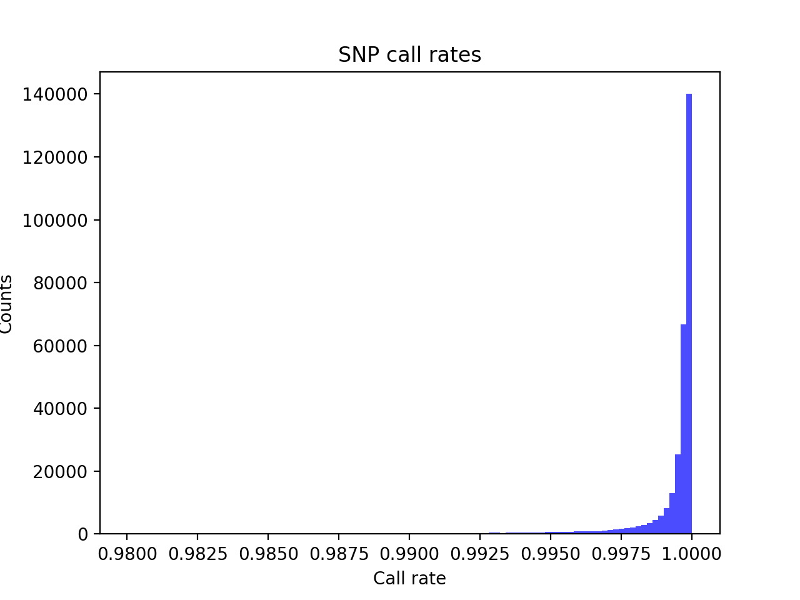
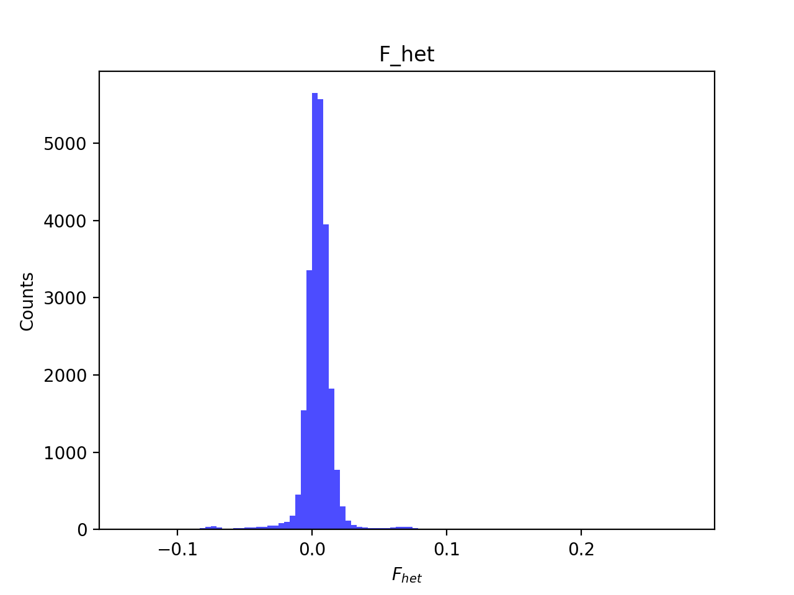
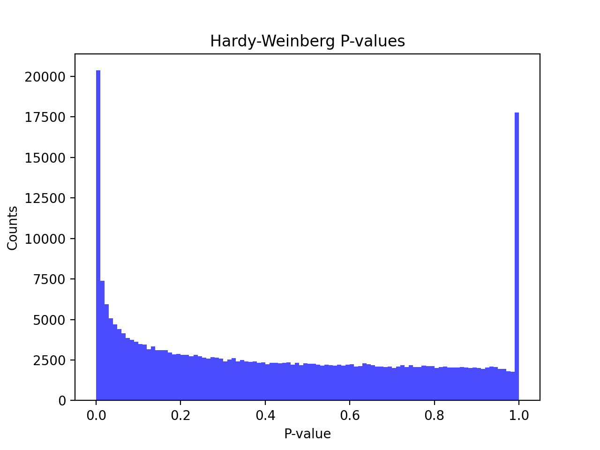
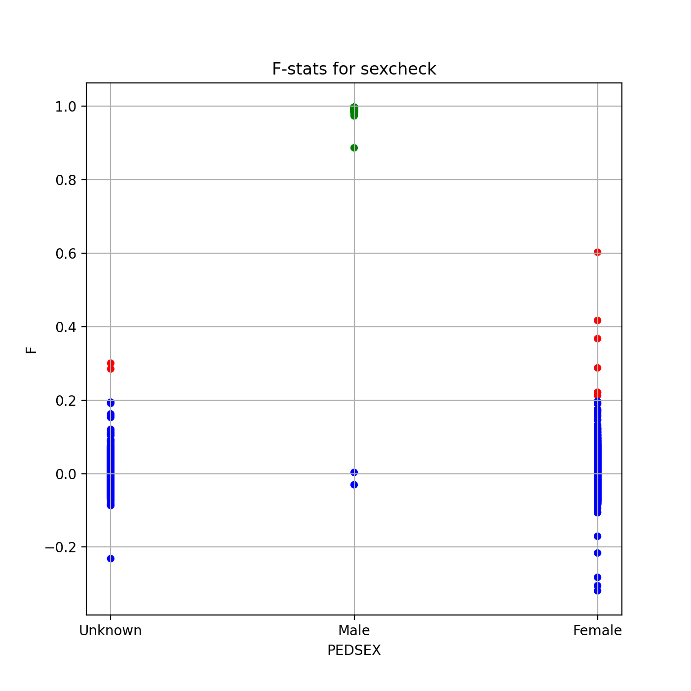
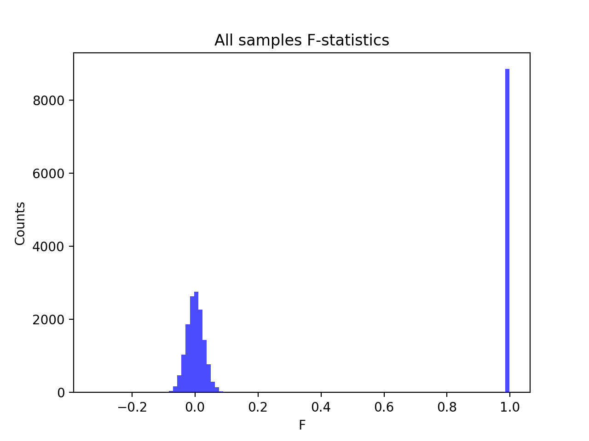
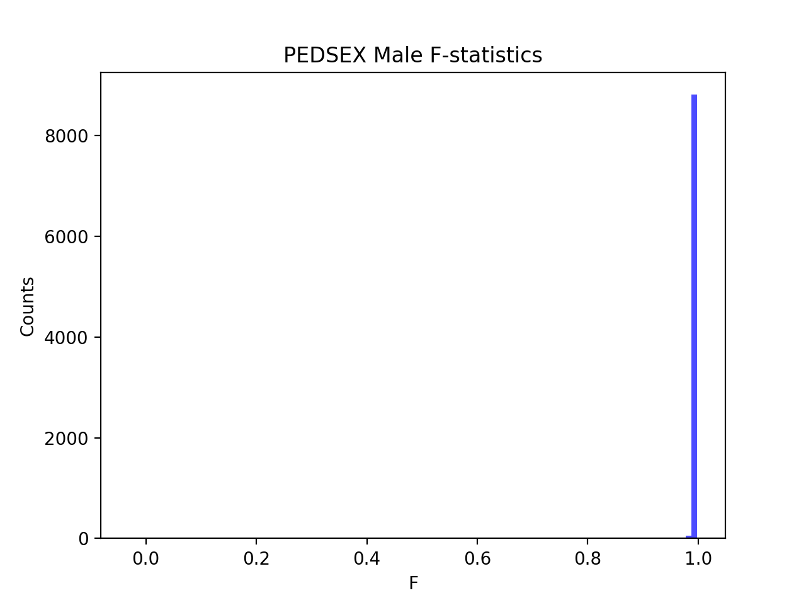
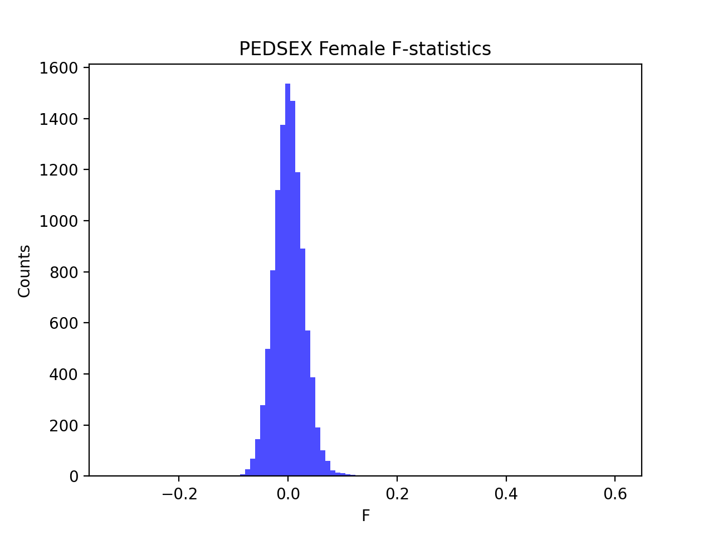

# Batch report for batch snp016b, module mod5-harmonization
## Samples overview
24749 samples
 21617 kinship clusters
 2222 offspring with mother ID
 2221 offspring with mother in batch
 2164 mothers with offspring in batch
 1 mothers missing from batch
 632 offspring with father ID
 632 offspring with father in batch
 606 fathers with offspring in batch
 0 fathers missing from batch
## Call rates
### Sample call rates
min: 0.9608604000000001
 max: 0.999927629
 median: 0.999565774 
### SNP call rates
min: 0.9800396
 max: 1.0
 median: 0.999797972 
## F_het
min: -0.137123
 max: 0.278316
 median: 0.00450293 
## Hardy-Weinberg P-values
min: 1.00113e-06
 max: 1.0
 median: 0.39402349999999997 
## Sexcheck
19671 out of 24749 OK 
| PEDSEX | Total | SNPSEX Male | SNPSEX Female | SNPSEX Unknown | OK | Problem |
| ------ | ------ | ------ | ------ | ------ | ------ | ------ |
| Male | 8868 | 8866 | 2 | 0 | 8866 | 2 |
| Female | 10812 | 0 | 10805 | 7 | 10805 | 7 |
| Unknown | 3186 | 0 | 3184 | 2 | 0 | 3186 |

### All samples 
### All samples F-statistics
min: -0.3189
 max: 0.9977
 median: 0.024745 
### PEDSEX Male
### PEDSEX Male F-statistics
min: -0.03022
 max: 0.9977
 median: 0.9932 
### PEDSEX Female
### PEDSEX Female F-statistics
min: -0.3189
 max: 0.6027
 median: 0.0007991 