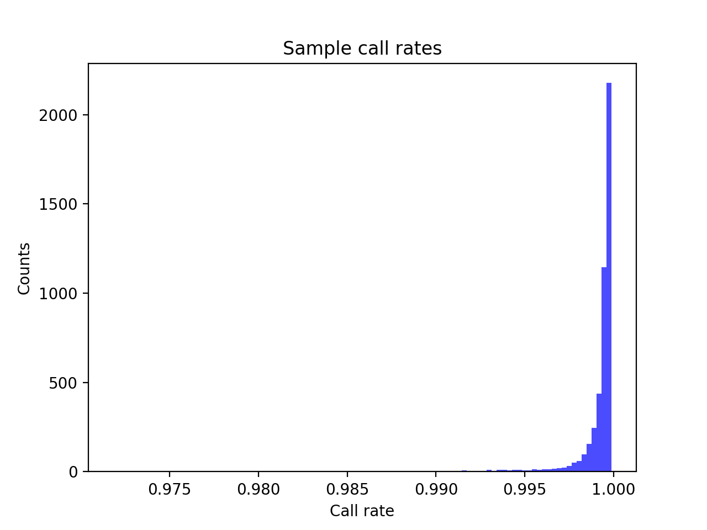
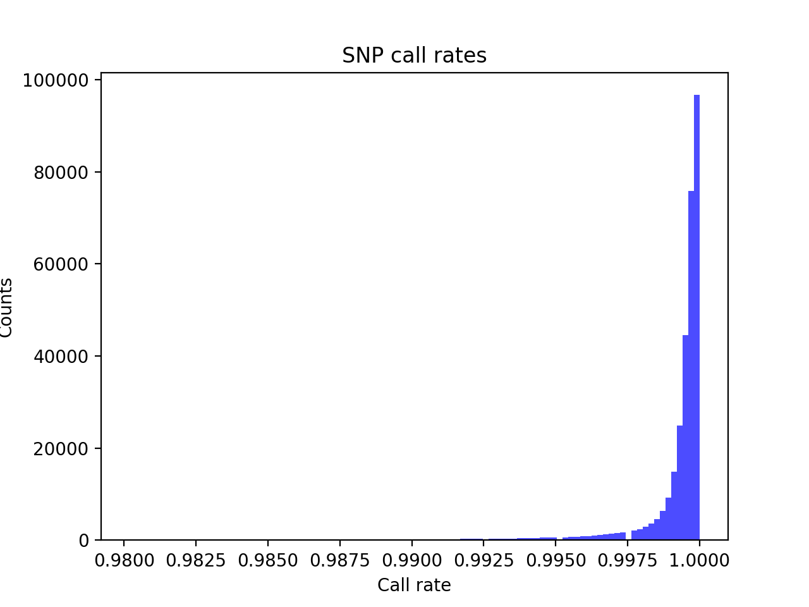
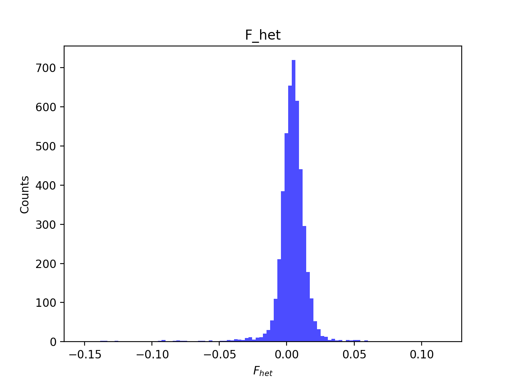
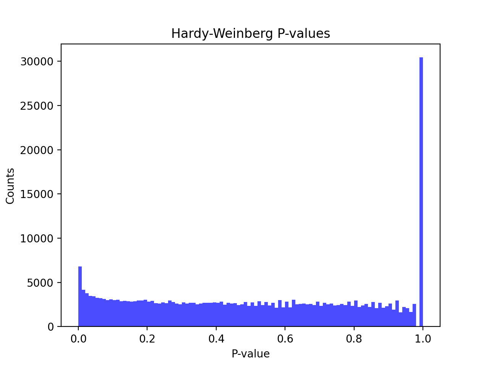
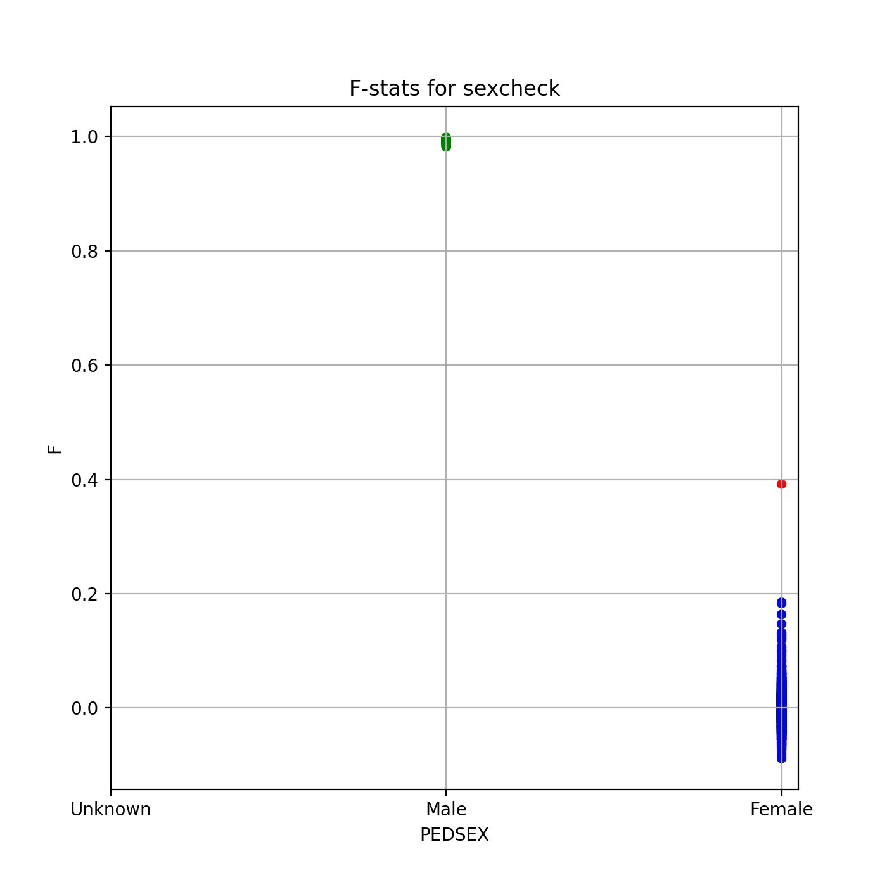
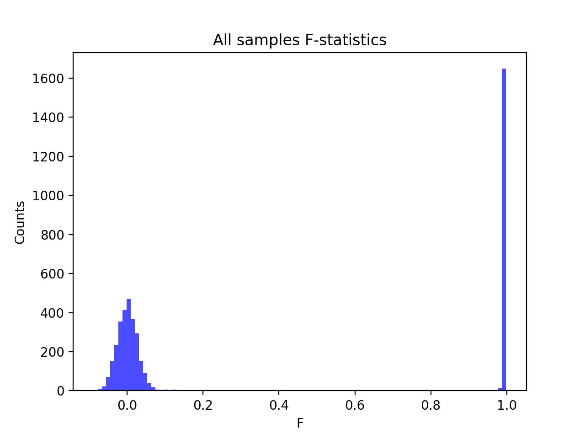
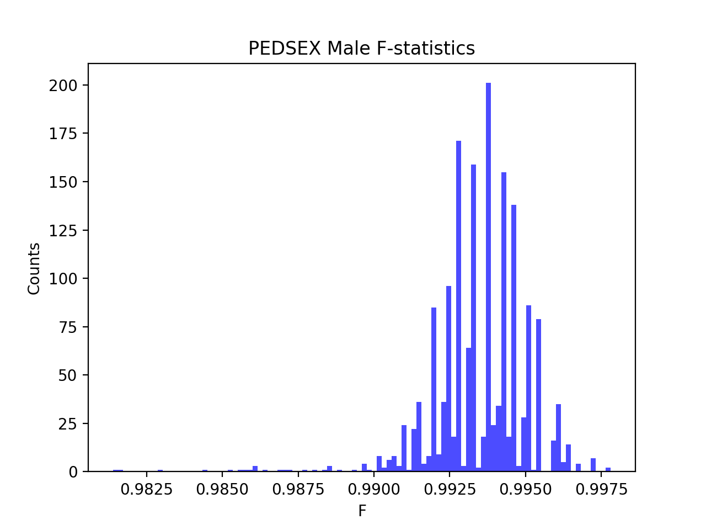
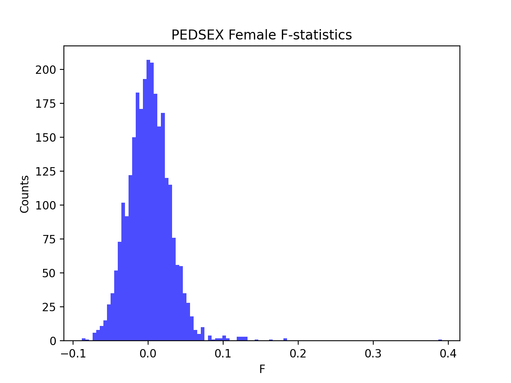

# Batch report for batch snp017b, module mod5-pre-phasing
## Samples overview
4645 samples
 4407 kinship clusters
 198 offspring with mother ID
 198 offspring with mother in batch
 193 mothers with offspring in batch
 0 mothers missing from batch
 21 offspring with father ID
 21 offspring with father in batch
 21 fathers with offspring in batch
 0 fathers missing from batch
## Call rates
### Sample call rates
min: 0.9718309
 max: 0.999875542
 median: 0.999575565 
### SNP call rates
min: 0.9801938
 max: 1.0
 median: 0.999784715 
## F_het
min: -0.151797
 max: 0.116423
 median: 0.0045665 
## Hardy-Weinberg P-values
min: 1.00333e-06
 max: 1.0
 median: 0.505346 
## Sexcheck
4378 out of 4645 OK 
| PEDSEX | Total | SNPSEX Male | SNPSEX Female | SNPSEX Unknown | OK | Problem |
| ------ | ------ | ------ | ------ | ------ | ------ | ------ |
| Male | 1661 | 1661 | 0 | 0 | 1661 | 0 |
| Female | 2718 | 0 | 2717 | 1 | 2717 | 1 |
| Unknown | 0 | 0 | 0 | 0 | 0 | 0 |

### All samples 
### All samples F-statistics
min: -0.0881
 max: 0.9978
 median: 0.0233 
### PEDSEX Male
### PEDSEX Male F-statistics
min: 0.9814
 max: 0.9978
 median: 0.9937 
### PEDSEX Female
### PEDSEX Female F-statistics
min: -0.0881
 max: 0.3917
 median: 0.0010635 