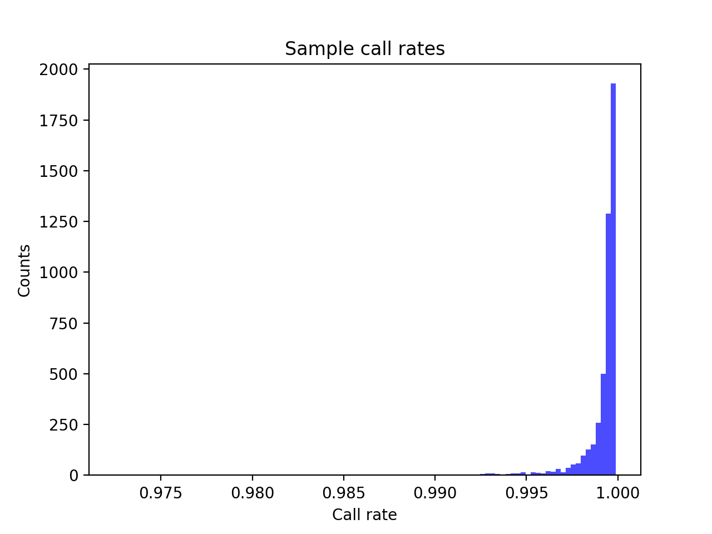
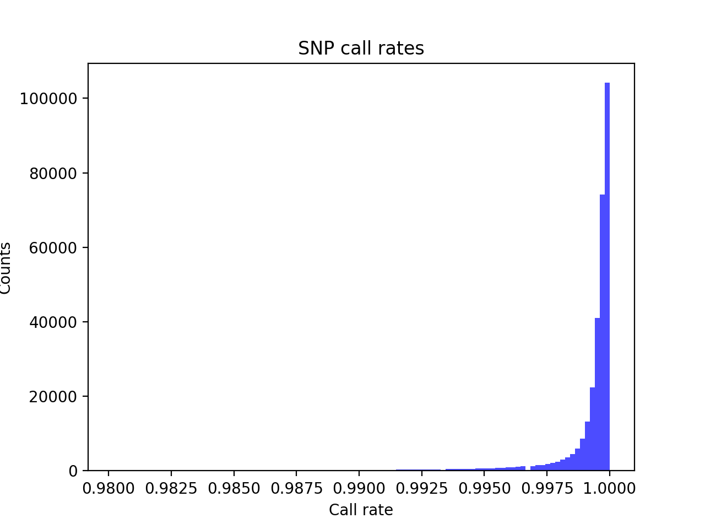
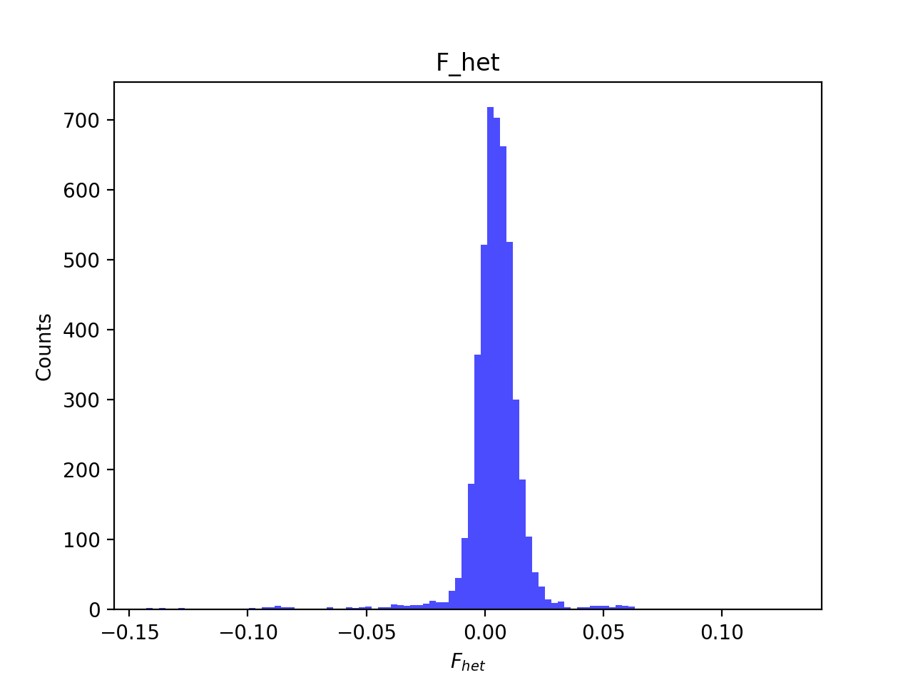
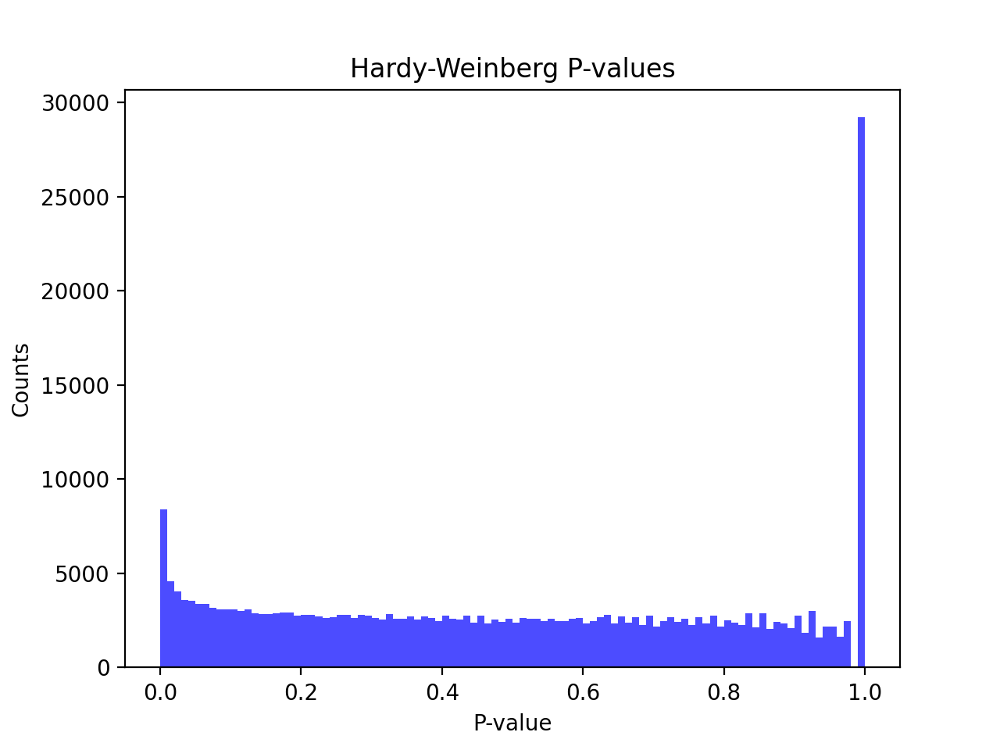
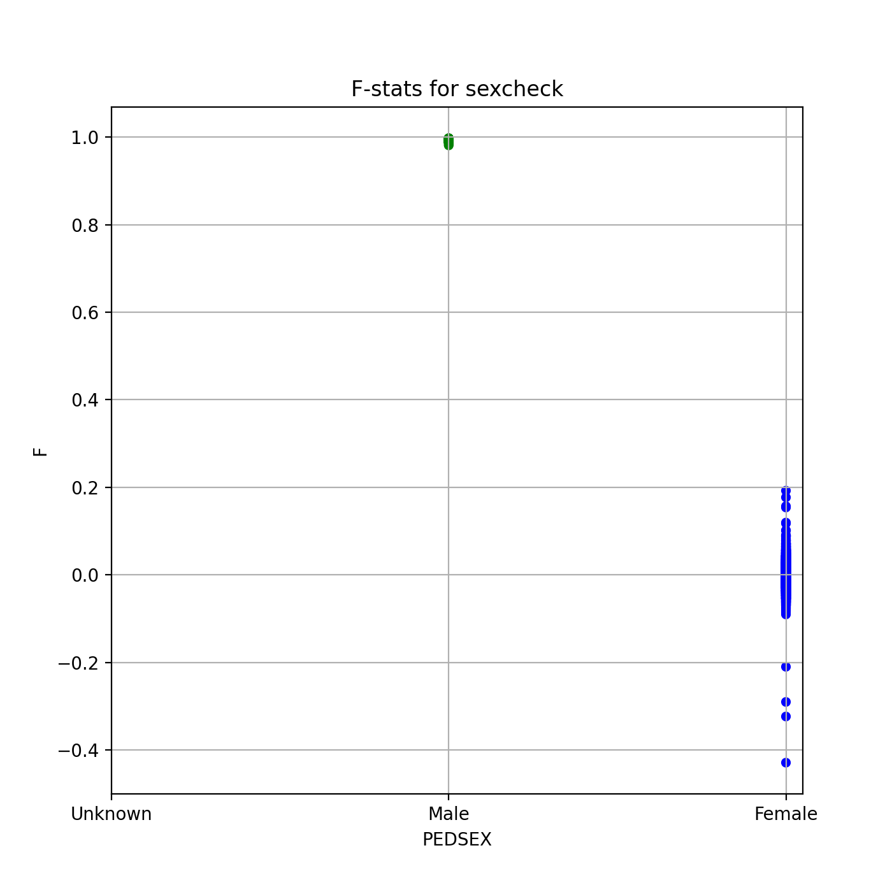
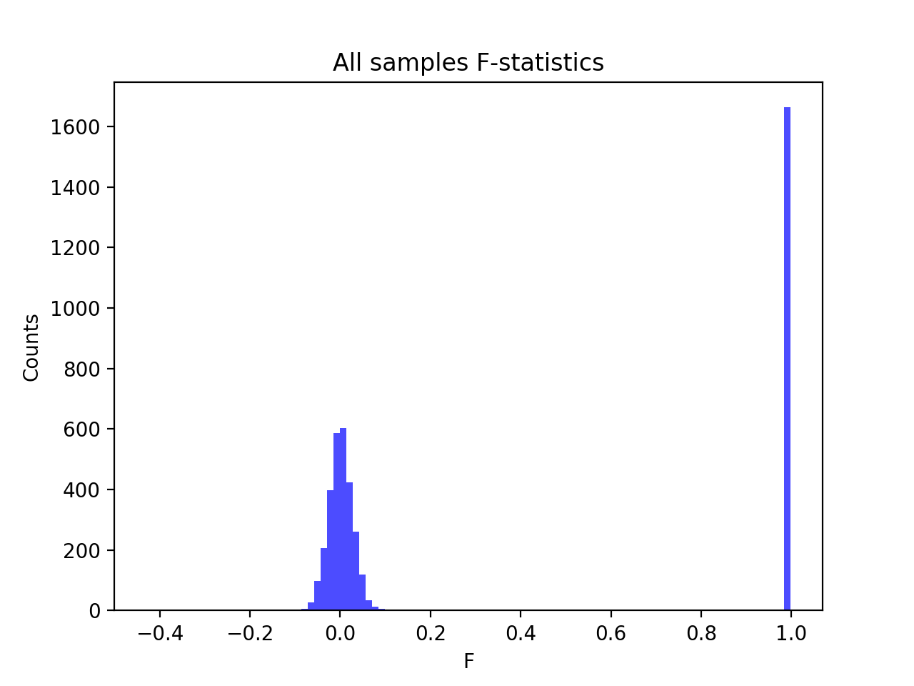
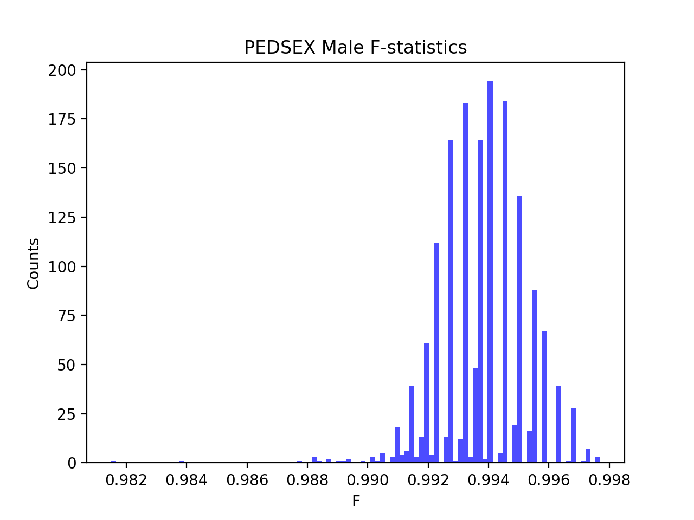
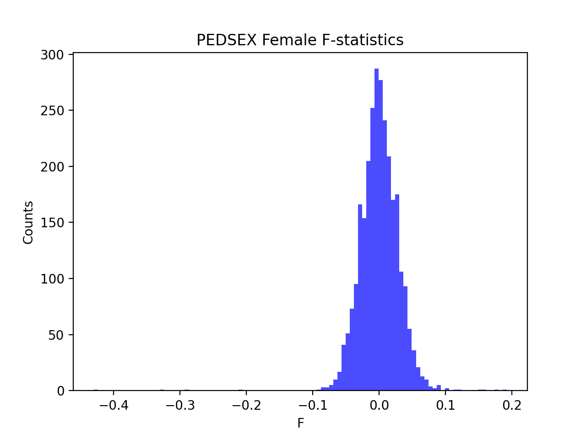

# Batch report for batch snp017c, module mod5-pre-phasing
## Samples overview
4742 samples
 4507 kinship clusters
 196 offspring with mother ID
 196 offspring with mother in batch
 193 mothers with offspring in batch
 0 mothers missing from batch
 20 offspring with father ID
 20 offspring with father in batch
 20 fathers with offspring in batch
 0 fathers missing from batch
## Call rates
### Sample call rates
min: 0.9724412
 max: 0.999881378
 median: 0.9995431450000001 
### SNP call rates
min: 0.9801771
 max: 1.0
 median: 0.999789119 
## F_het
min: -0.142774
 max: 0.12846
 median: 0.004774325 
## Hardy-Weinberg P-values
min: 1.00346e-06
 max: 1.0
 median: 0.494301 
## Sexcheck
4456 out of 4742 OK 
| PEDSEX | Total | SNPSEX Male | SNPSEX Female | SNPSEX Unknown | OK | Problem |
| ------ | ------ | ------ | ------ | ------ | ------ | ------ |
| Male | 1664 | 1664 | 0 | 0 | 1664 | 0 |
| Female | 2792 | 0 | 2792 | 0 | 2792 | 0 |
| Unknown | 0 | 0 | 0 | 0 | 0 | 0 |

### All samples 
### All samples F-statistics
min: -0.4293
 max: 0.9977
 median: 0.02334 
### PEDSEX Male
### PEDSEX Male F-statistics
min: 0.9815
 max: 0.9977
 median: 0.9937 
### PEDSEX Female
### PEDSEX Female F-statistics
min: -0.4293
 max: 0.1923
 median: 0.00010083499999999999 