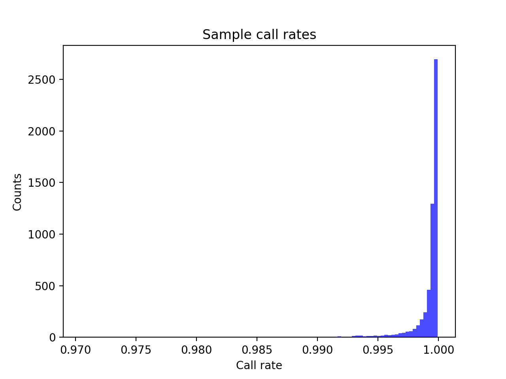
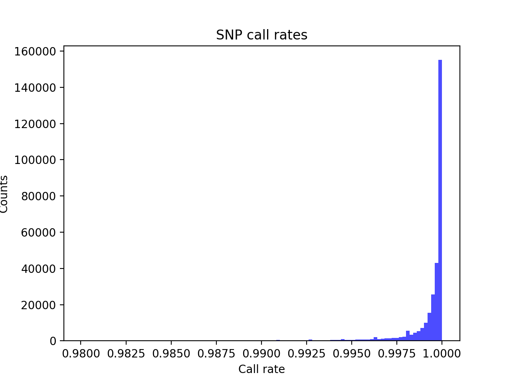
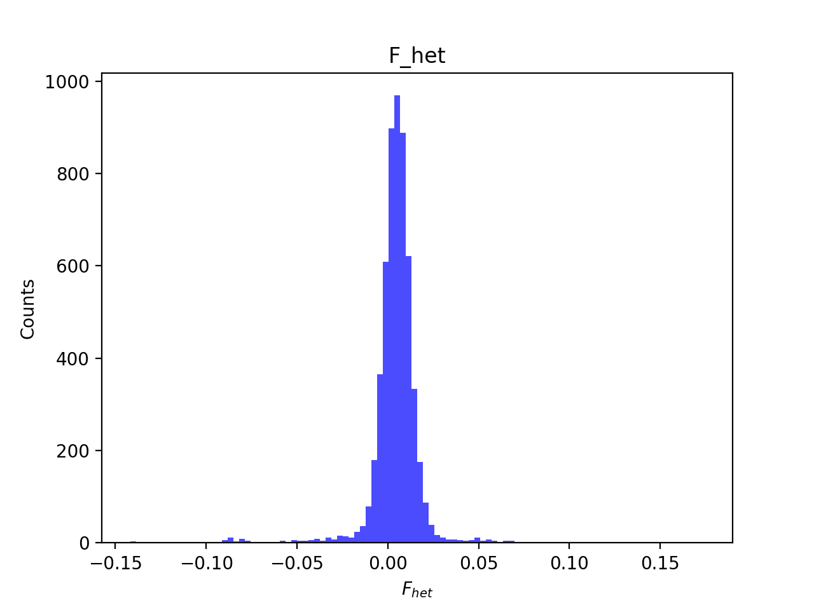
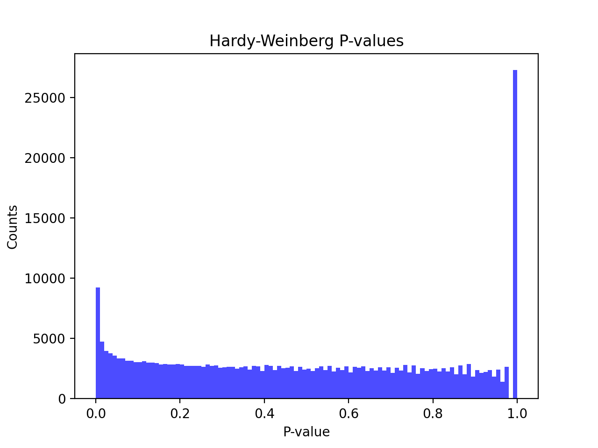
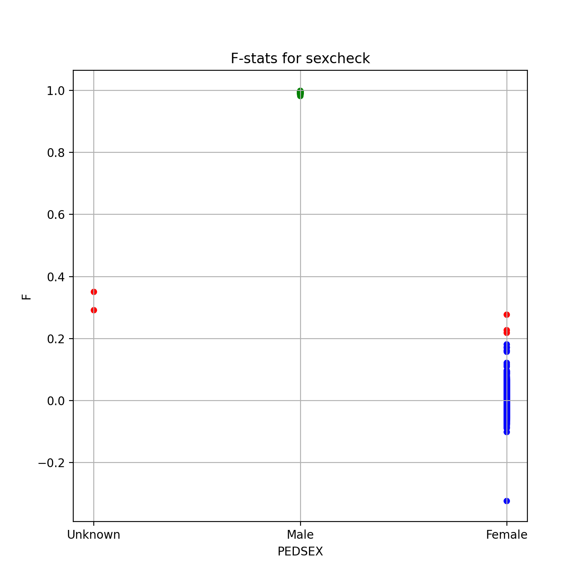
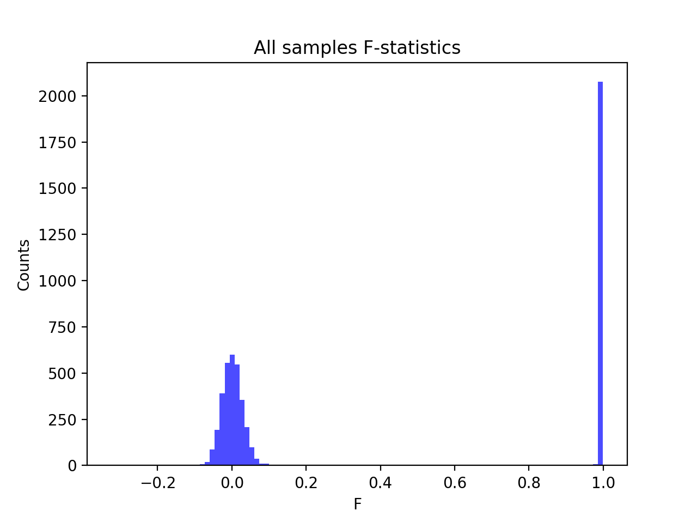
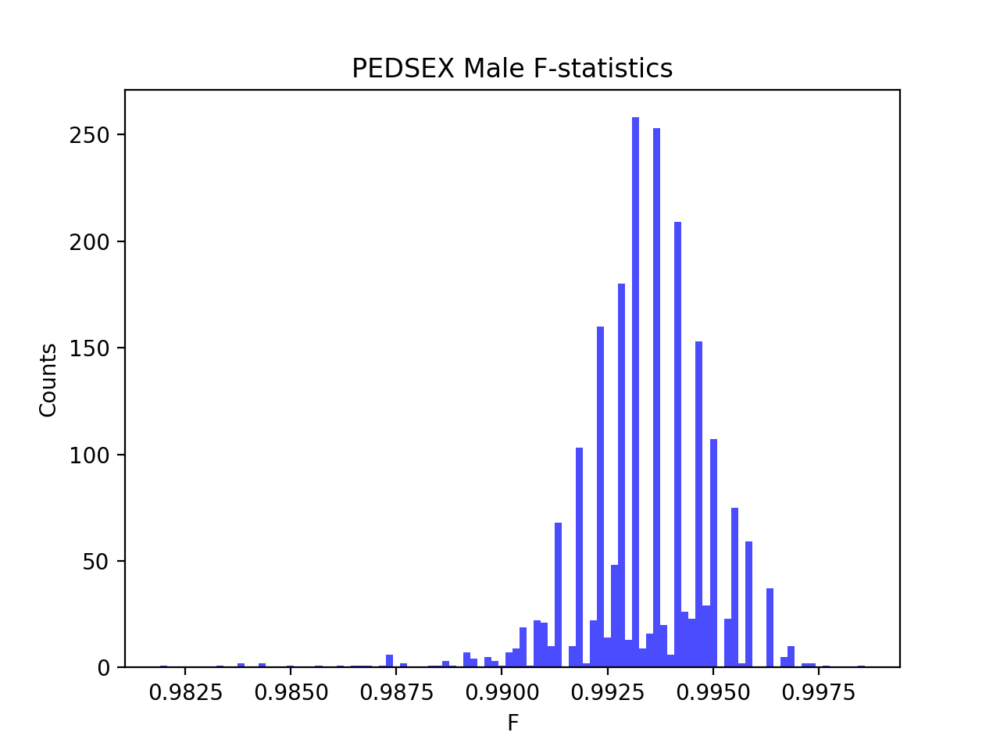
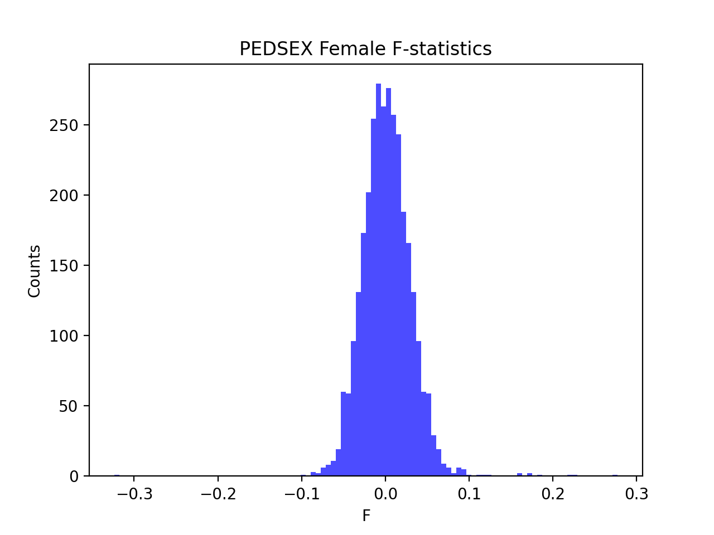

# Batch report for batch snp017d, module mod5-harmonization
## Samples overview
5566 samples
 5075 kinship clusters
 259 offspring with mother ID
 259 offspring with mother in batch
 258 mothers with offspring in batch
 0 mothers missing from batch
 200 offspring with father ID
 200 offspring with father in batch
 199 fathers with offspring in batch
 0 fathers missing from batch
## Call rates
### Sample call rates
min: 0.9704718
 max: 0.999922209
 median: 0.999617528 
### SNP call rates
min: 0.9800575
 max: 1.0
 median: 0.999820338 
## F_het
min: -0.141677
 max: 0.174051
 median: 0.0049424199999999995 
## Hardy-Weinberg P-values
min: 1.01105e-06
 max: 1.0
 median: 0.485334 
## Sexcheck
5211 out of 5566 OK 
| PEDSEX | Total | SNPSEX Male | SNPSEX Female | SNPSEX Unknown | OK | Problem |
| ------ | ------ | ------ | ------ | ------ | ------ | ------ |
| Male | 2082 | 2082 | 0 | 0 | 2082 | 0 |
| Female | 3132 | 0 | 3129 | 3 | 3129 | 3 |
| Unknown | 2 | 0 | 0 | 2 | 0 | 2 |

### All samples 
### All samples F-statistics
min: -0.3235
 max: 0.9986
 median: 0.027395 
### PEDSEX Male
### PEDSEX Male F-statistics
min: 0.9819
 max: 0.9986
 median: 0.9936 
### PEDSEX Female
### PEDSEX Female F-statistics
min: -0.3235
 max: 0.2771
 median: 0.0008062 