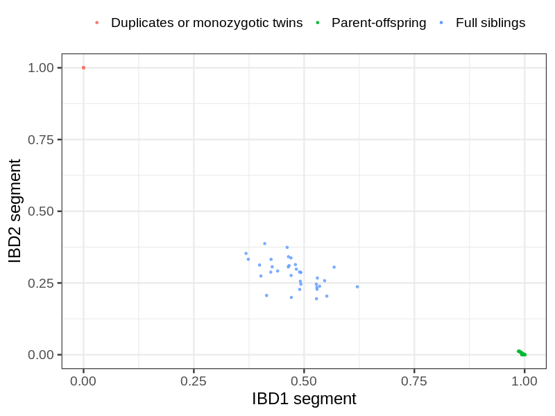
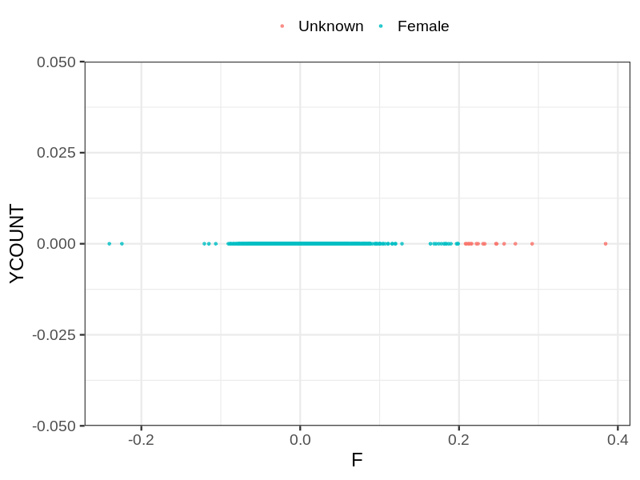
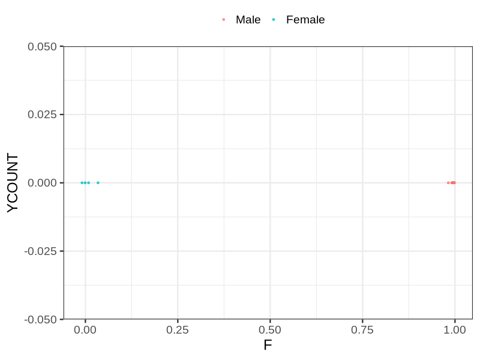
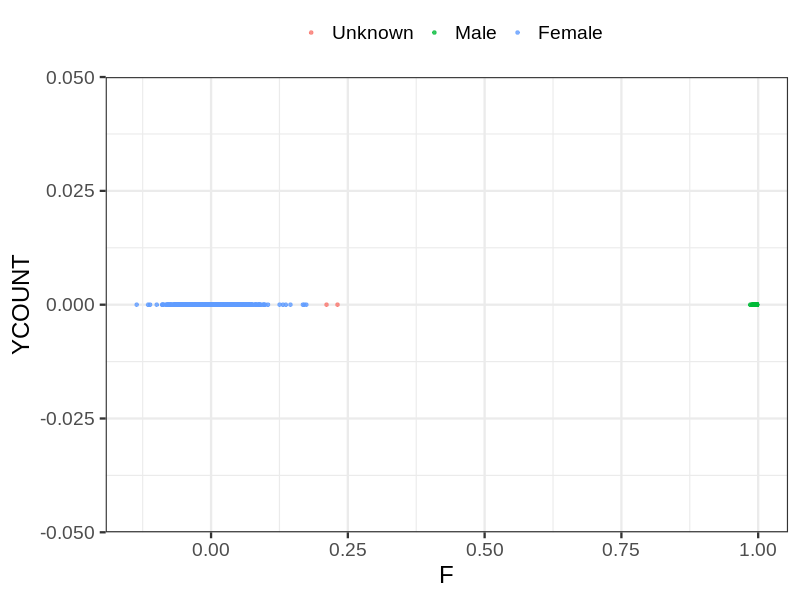

# Fam file reconstruction in snp018a
- Number of samples in the genotyping data: 5378.
## Samples not in Medical Birth Regsitry
19 samples with missing birth year, assumed to be parent in the following.
## Relationship inference
| Relationship |   |
| ------------ | - |
| Duplicates or monozygotic twins| 9 |
| Parent-offspring| 297 |
| Full siblings| 34 |
| 2nd degree| 0 |
| 3rd degree| 0 |
| 4th degree| 0 |
| Unrelated| 0 |

## Mother sex check
| Inferred sex |   |
| ------------ | - |
| Unknown | 16 |
| Male | 0 |
| Female | 1716 |

## Father sex check
| Inferred sex |   |
| ------------ | - |
| Unknown | 0 |
| Male | 1367 |
| Female | 4 |

## Children sex check
| Inferred sex |   |
| ------------ | - |
| Unknown | 2 |
| Male | 1141 |
| Female | 1132 |

## Parental relationships
19 sentrix IDs missing from ID file. These are not counted as individuals.
###  Individuals
5359 individuals in total. Breakdown excluding multiple same-sex parents:
 -  279 children
 -  241 mothers
 -  47 fathers
 -  247 mother-child pairs
 -  49 father-child pairs
 -  17 mother-father-child trios
 -  4792 unrelated

Multiple same-sex parents (at the individual level):
 -  0 children with more than one mother detected
 -  1 children with more than one father detected
 -  0 children with more than one mother in registry
 -  0 children with more than one father in registry

249 mother-child relationships expected.
- 246 (98.8%) recovered by genetic relationships.
- 3 (1.2%) not recovered by genetic relationships.

48 father-child relationships expected.
- 48 (100%) recovered by genetic relationships.
- 0 (0%) not recovered by genetic relationships.

247 mother-child relationships detected.
- 246 (99.6%) matched to registry.
- 1 (0.4%) not matched to registry.

50 father-child relationships detected.
- 48 (96%) matched to registry.
- 2 (4%) not matched to registry.

###  Samples
5378 samples in total. Breakdown excluding multiple same-sex parents:
 -  279 children
 -  241 mothers
 -  47 fathers
 -  247 mother-child pairs
 -  49 father-child pairs
 -  17 mother-father-child trios
 -  4811 unrelated

Multiple same-sex parents (at the sample level):
 -  0 children with more than one mother detected
 -  1 children with more than one father detected
 -  3883 children with more than one mother in registry
 -  2490 children with more than one father in registry

249 mother-child relationships expected.
- 246 (98.8%) recovered by genetic relationships.
- 3 (1.2%) not recovered by genetic relationships.

48 father-child relationships expected.
- 48 (100%) recovered by genetic relationships.
- 0 (0%) not recovered by genetic relationships.

247 mother-child relationships detected.
- 246 (99.6%) matched to registry.
- 1 (0.4%) not matched to registry.

50 father-child relationships detected.
- 48 (96%) matched to registry.
- 2 (4%) not matched to registry.

## Exclusion
- Number of samples excluded: 6
