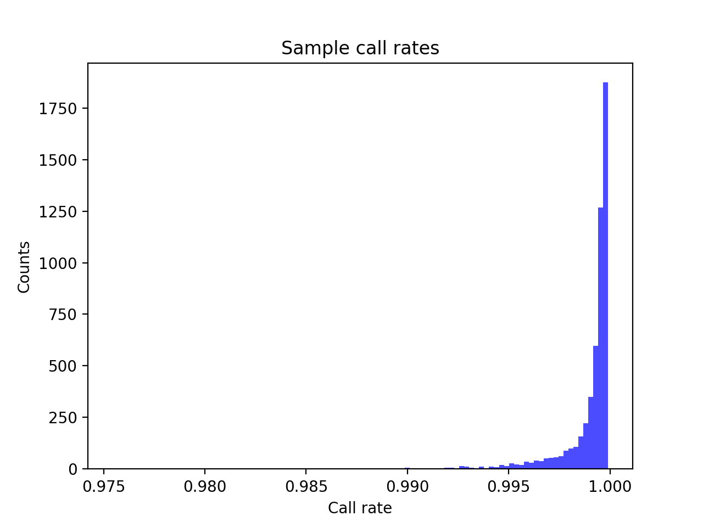
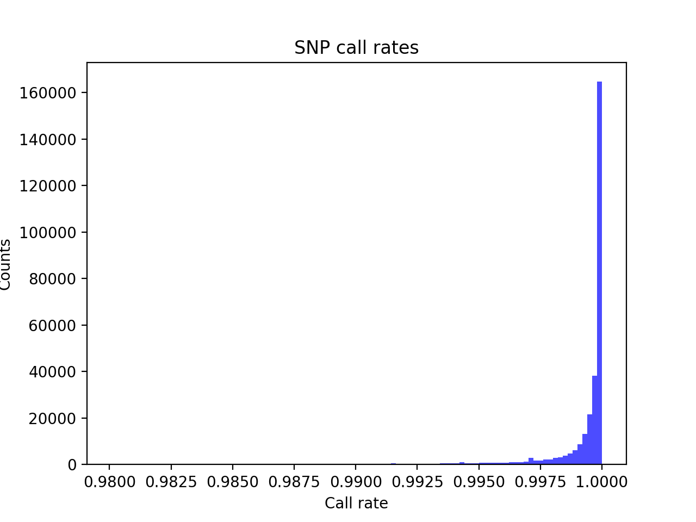
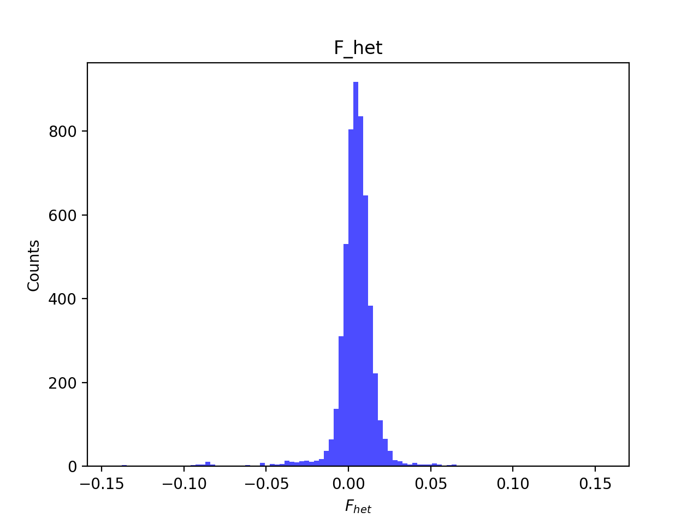
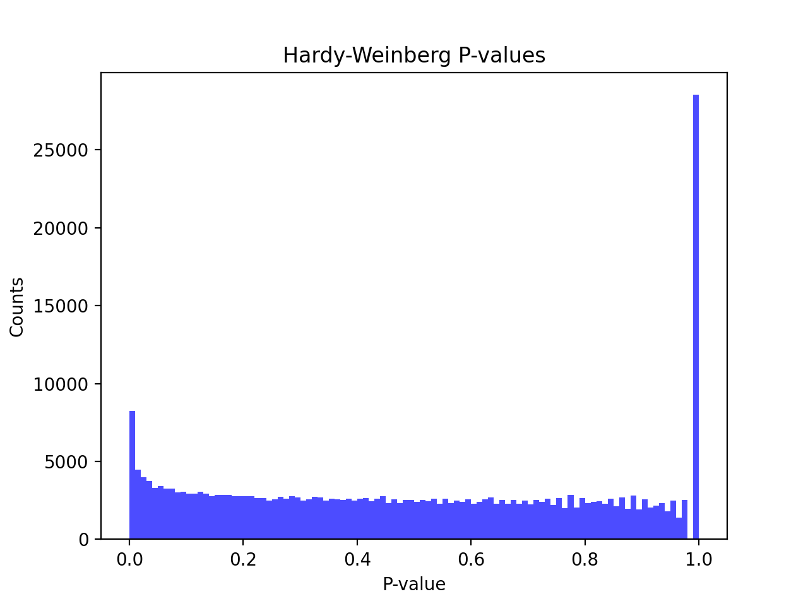
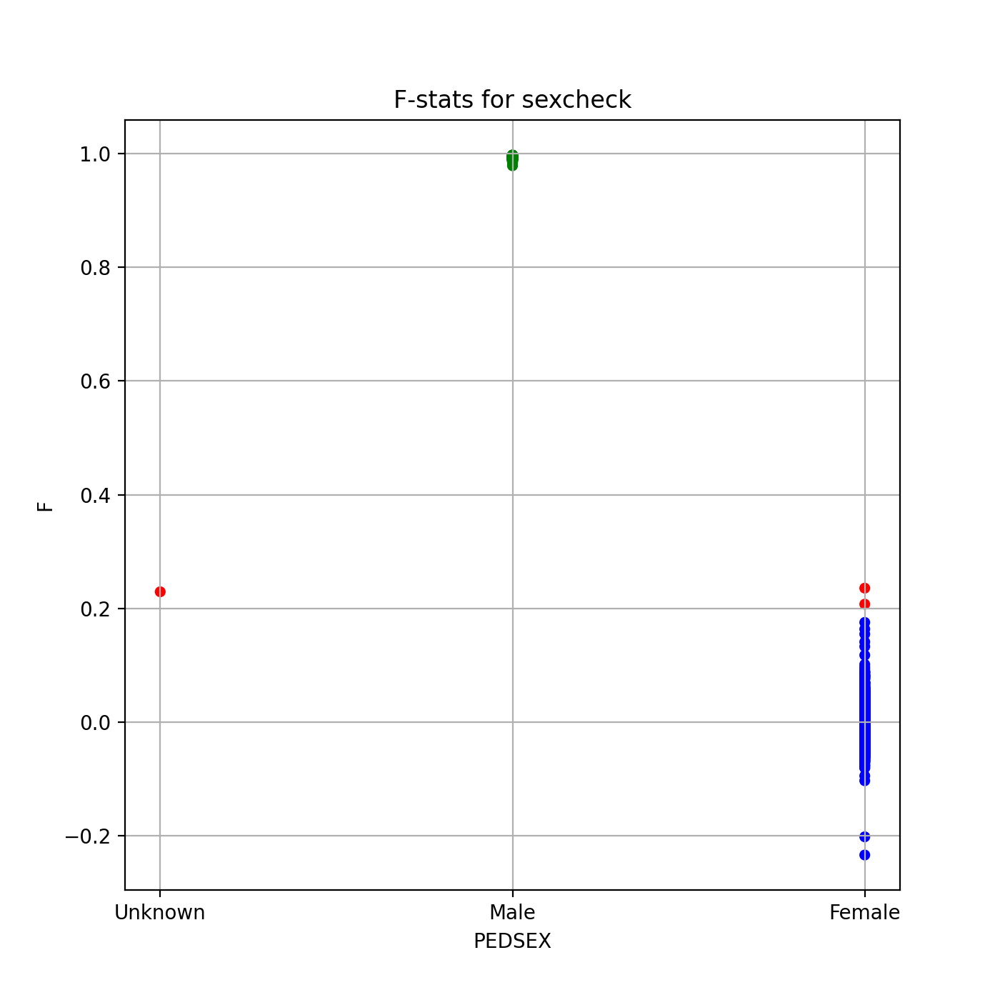
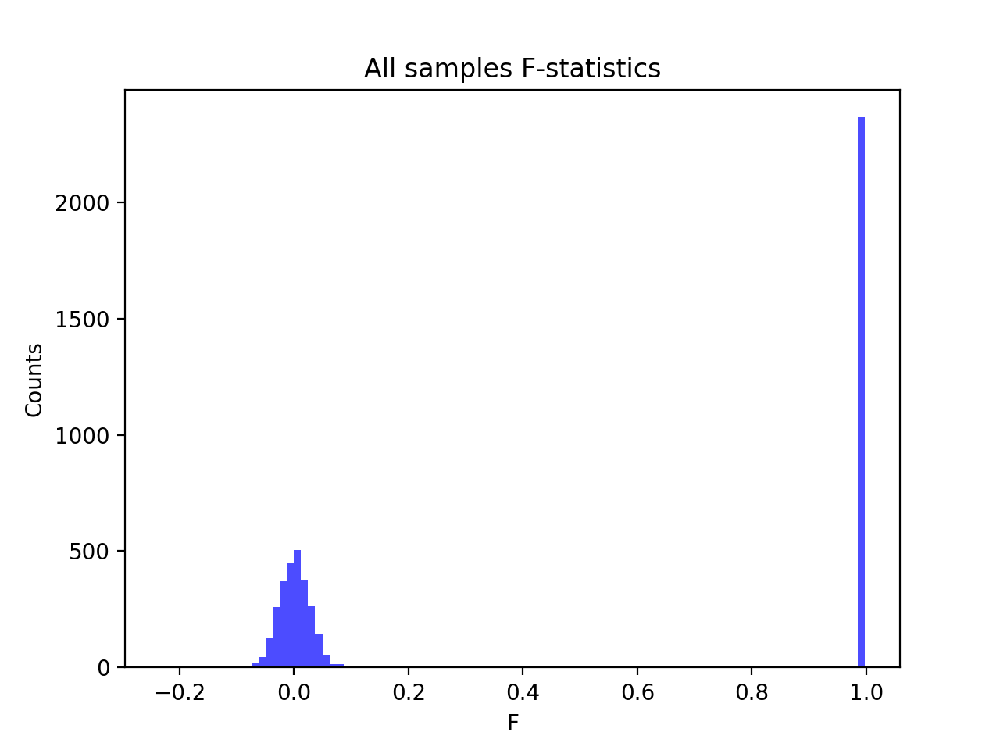
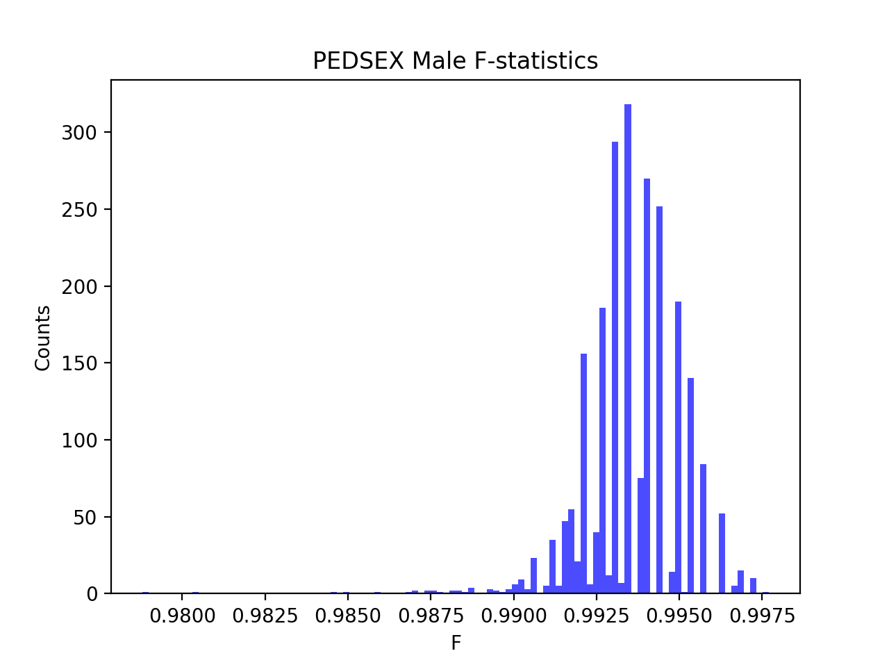
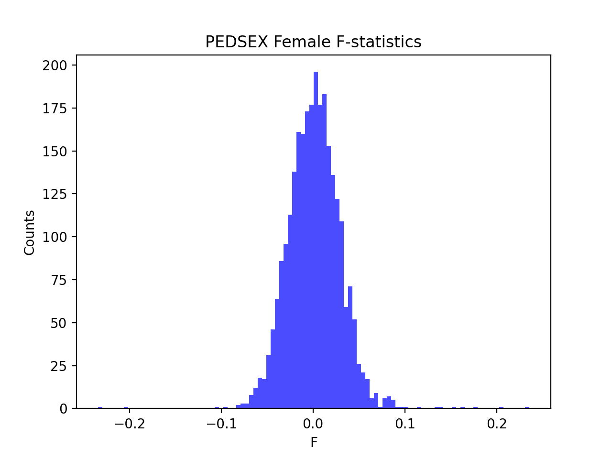

# Batch report for batch snp018a, module mod5-pre-phasing
## Samples overview
5372 samples
 5043 kinship clusters
 247 offspring with mother ID
 247 offspring with mother in batch
 241 mothers with offspring in batch
 0 mothers missing from batch
 49 offspring with father ID
 49 offspring with father in batch
 47 fathers with offspring in batch
 0 fathers missing from batch
## Call rates
### Sample call rates
min: 0.9754447
 max: 0.9999016609
 median: 0.999521417 
### SNP call rates
min: 0.9800819
 max: 1.0
 median: 0.99981385 
## F_het
min: -0.143625
 max: 0.155609
 median: 0.005030135 
## Hardy-Weinberg P-values
min: 1.00281e-06
 max: 1.0
 median: 0.493192 
## Sexcheck
5045 out of 5372 OK 
| PEDSEX | Total | SNPSEX Male | SNPSEX Female | SNPSEX Unknown | OK | Problem |
| ------ | ------ | ------ | ------ | ------ | ------ | ------ |
| Male | 2368 | 2368 | 0 | 0 | 2368 | 0 |
| Female | 2679 | 0 | 2677 | 2 | 2677 | 2 |
| Unknown | 1 | 0 | 0 | 1 | 0 | 1 |

### All samples 
### All samples F-statistics
min: -0.2341
 max: 0.9977
 median: 0.04353 
### PEDSEX Male
### PEDSEX Male F-statistics
min: 0.9788
 max: 0.9977
 median: 0.9935 
### PEDSEX Female
### PEDSEX Female F-statistics
min: -0.2341
 max: 0.2355
 median: 0.001322 