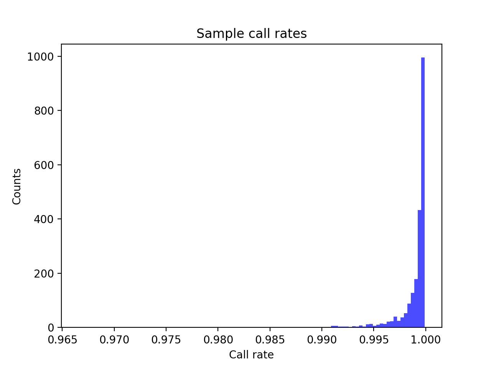
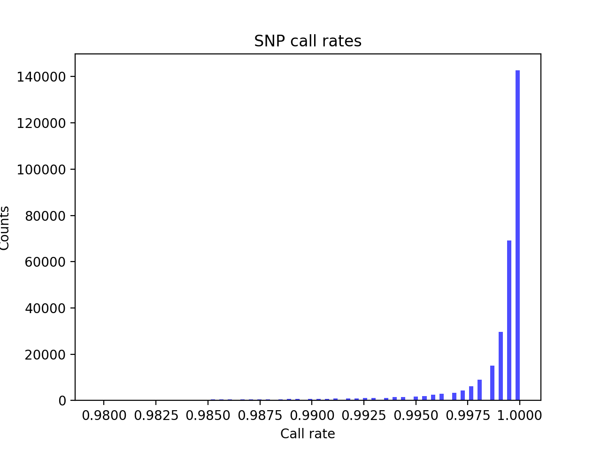
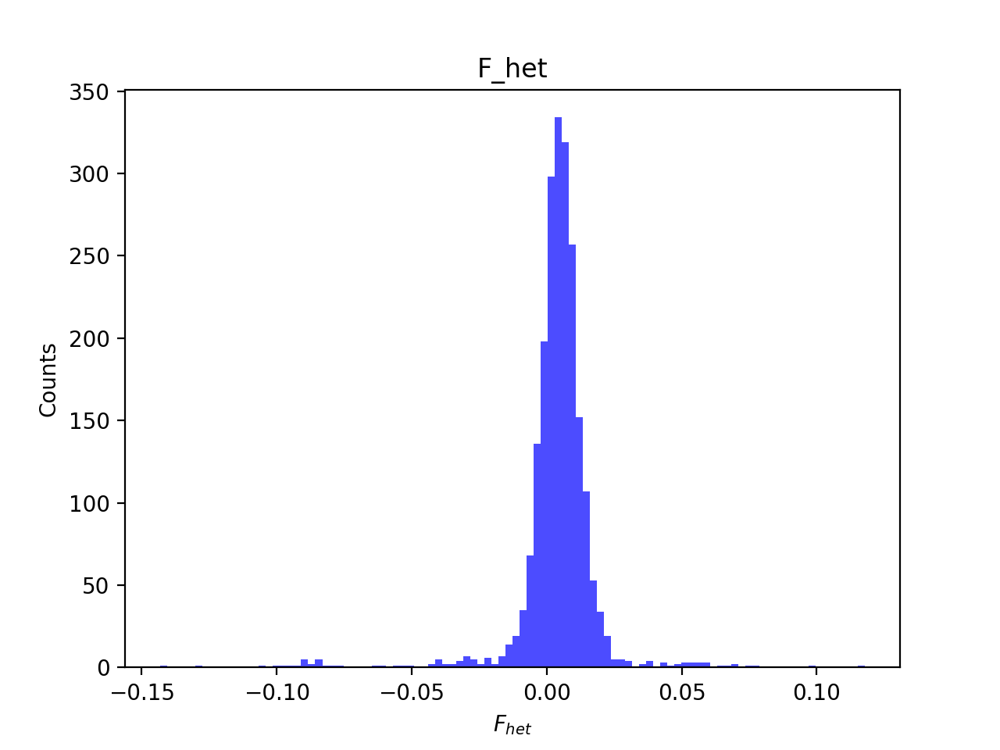
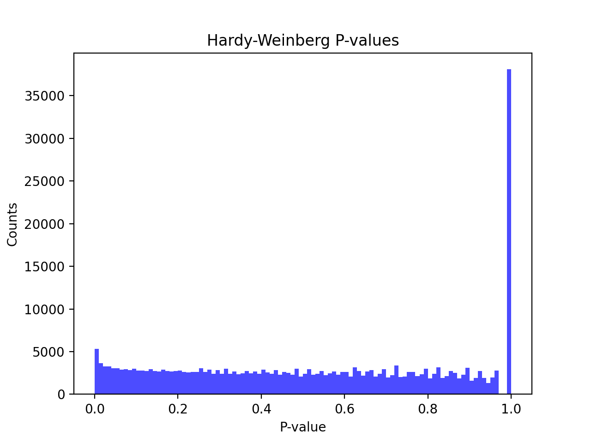
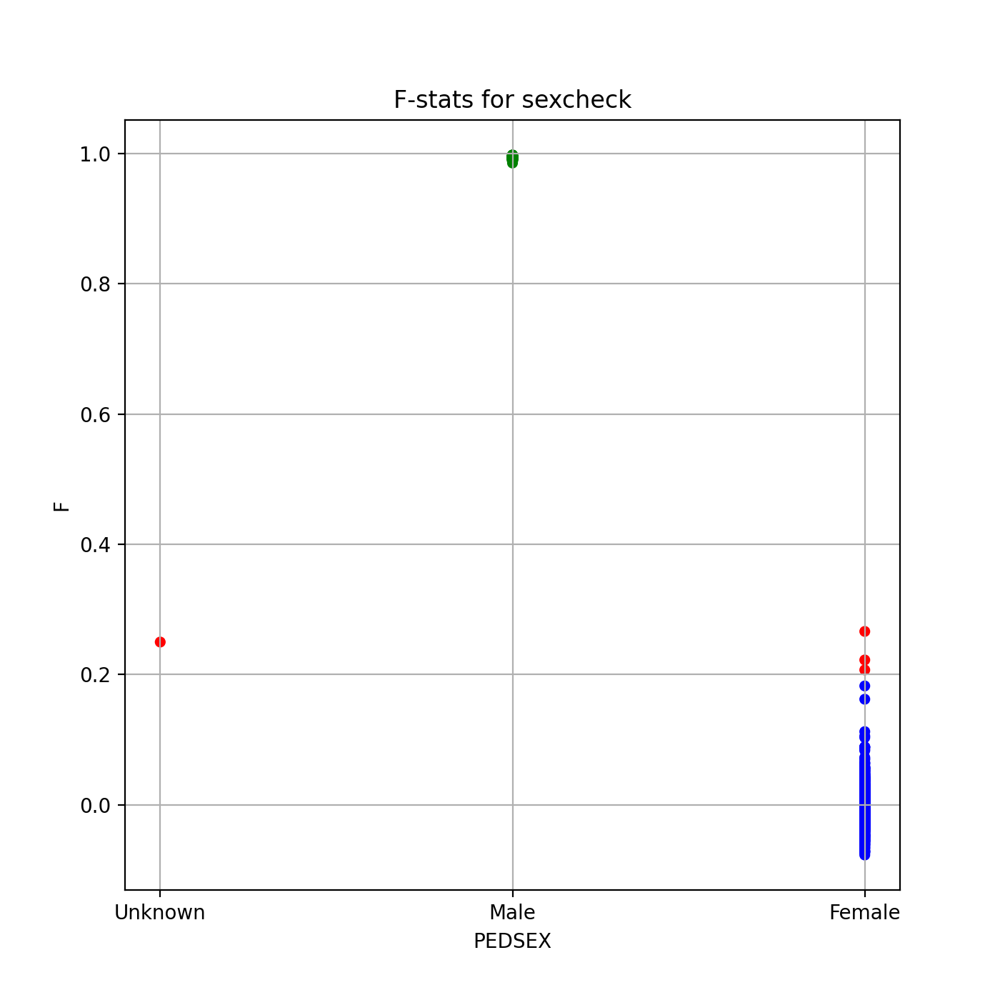
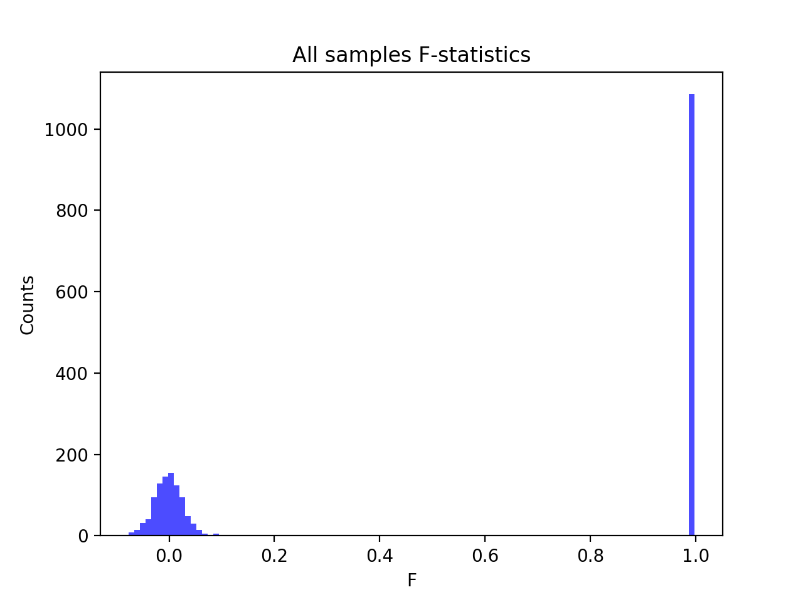
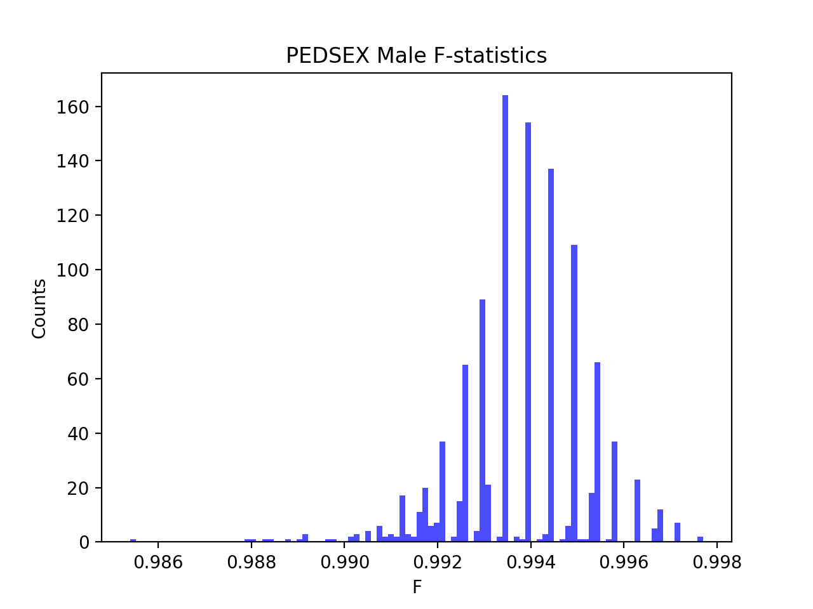
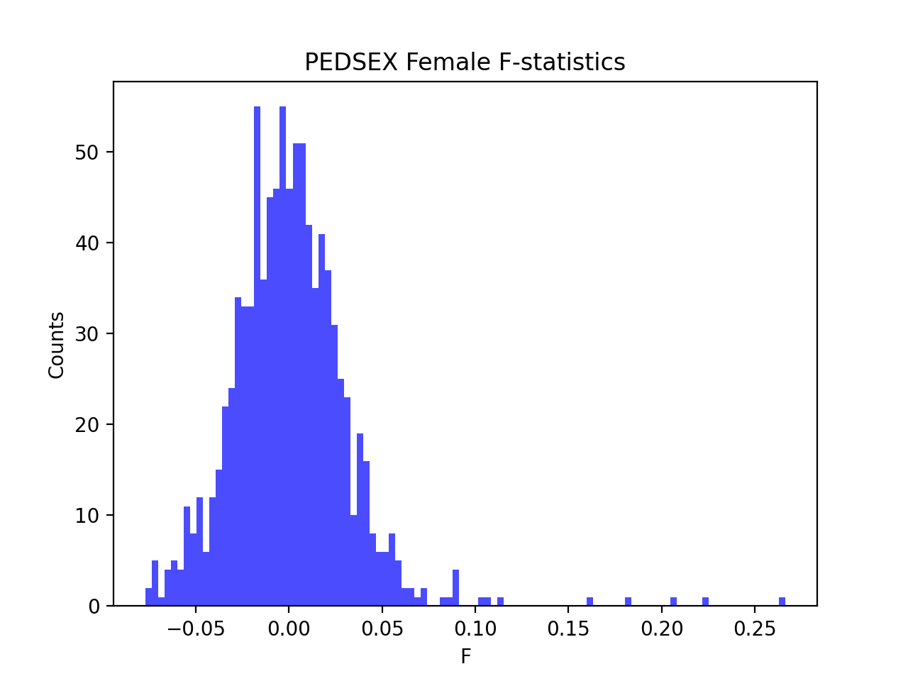

# Batch report for batch snp018de, module mod5-harmonization
## Samples overview
2160 samples
 2119 kinship clusters
 16 offspring with mother ID
 16 offspring with mother in batch
 16 mothers with offspring in batch
 0 mothers missing from batch
 8 offspring with father ID
 8 offspring with father in batch
 7 fathers with offspring in batch
 0 fathers missing from batch
## Call rates
### Sample call rates
min: 0.9665754
 max: 0.999899029
 median: 0.999527717 
### SNP call rates
min: 0.9796296
 max: 1.0
 median: 0.999537037 
## F_het
min: -0.143093
 max: 0.11777
 median: 0.004829405 
## Hardy-Weinberg P-values
min: 1.04645e-06
 max: 1.0
 median: 0.5244875 
## Sexcheck
2032 out of 2160 OK 
| PEDSEX | Total | SNPSEX Male | SNPSEX Female | SNPSEX Unknown | OK | Problem |
| ------ | ------ | ------ | ------ | ------ | ------ | ------ |
| Male | 1086 | 1086 | 0 | 0 | 1086 | 0 |
| Female | 949 | 0 | 946 | 3 | 946 | 3 |
| Unknown | 1 | 0 | 0 | 1 | 0 | 1 |

### All samples 
### All samples F-statistics
min: -0.07693
 max: 0.9977
 median: 0.9917 
### PEDSEX Male
### PEDSEX Male F-statistics
min: 0.9854
 max: 0.9977
 median: 0.994 
### PEDSEX Female
### PEDSEX Female F-statistics
min: -0.07693
 max: 0.2663
 median: -0.001124 