# Phasing report for best SNPs 2025.09.25
## Phasing error rates per chromosome and number of parents in same batch as child
### Phasing error rates, chromosome 1
#### Combined error rates
 - Trios = Number of trios
 - Sites = Total number of sites where error can occur (summed over all trios)
 - Errors = Total number of errors
| Parents in batch | Trios | Sites | Errors | Error rate |
|:----|:----|:----|:----|:----|
| 0 | 20984 | 9664417 | 4762093 | 0.49 |
| 1 | 6569 | 3052962 | 82 | 2.7e-05 |
| 2 | 26935 | 12606684 | 8 | 6.3e-07 |

#### Individual error rates
| Parents in batch | min | max | median | mean |
|:----|:----|:----|:----|:----|
| 0 | 0 | 1 | 0.5 | 0.49 |
| 1 | 0 | 0.006 | 0 | 2.8e-05 |
| 2 | 0 | 0.0029 | 0 | 6.5e-07 |

#### Histogram of individual error rates
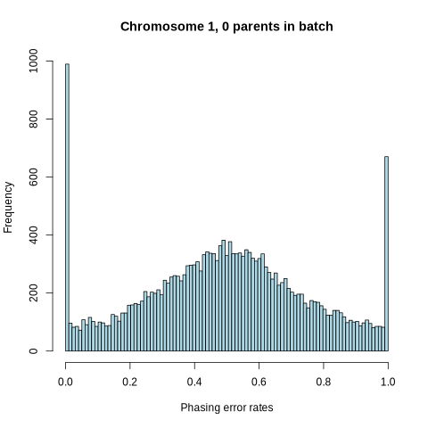

### Phasing error rates, chromosome 2
#### Combined error rates
 - Trios = Number of trios
 - Sites = Total number of sites where error can occur (summed over all trios)
 - Errors = Total number of errors
| Parents in batch | Trios | Sites | Errors | Error rate |
|:----|:----|:----|:----|:----|
| 0 | 20984 | 10179215 | 5028575 | 0.49 |
| 1 | 6569 | 3218052 | 72 | 2.2e-05 |
| 2 | 26935 | 13194801 | 8 | 6.1e-07 |

#### Individual error rates
| Parents in batch | min | max | median | mean |
|:----|:----|:----|:----|:----|
| 0 | 0 | 1 | 0.49 | 0.49 |
| 1 | 0 | 0.0049 | 0 | 2.3e-05 |
| 2 | 0 | 0.0087 | 0 | 9.1e-07 |

#### Histogram of individual error rates
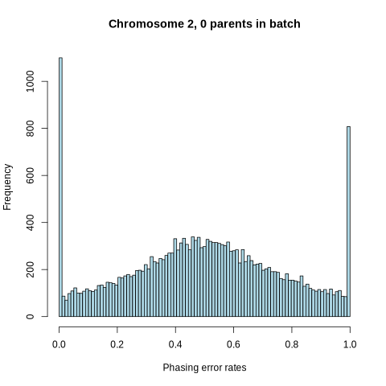

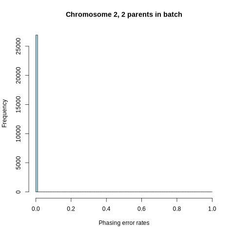
### Phasing error rates, chromosome 3
#### Combined error rates
 - Trios = Number of trios
 - Sites = Total number of sites where error can occur (summed over all trios)
 - Errors = Total number of errors
| Parents in batch | Trios | Sites | Errors | Error rate |
|:----|:----|:----|:----|:----|
| 0 | 20984 | 8930645 | 4370892 | 0.49 |
| 1 | 6569 | 2828760 | 44 | 1.6e-05 |
| 2 | 26935 | 11544220 | 8 | 6.9e-07 |

#### Individual error rates
| Parents in batch | min | max | median | mean |
|:----|:----|:----|:----|:----|
| 0 | 0 | 1 | 0.49 | 0.49 |
| 1 | 0 | 0.0028 | 0 | 1.6e-05 |
| 2 | 0 | 0.0029 | 0 | 7.2e-07 |

#### Histogram of individual error rates
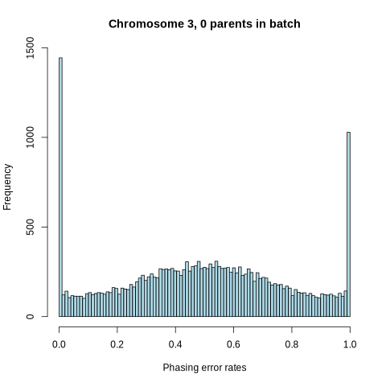

### Phasing error rates, chromosome 4
#### Combined error rates
 - Trios = Number of trios
 - Sites = Total number of sites where error can occur (summed over all trios)
 - Errors = Total number of errors
| Parents in batch | Trios | Sites | Errors | Error rate |
|:----|:----|:----|:----|:----|
| 0 | 20984 | 8803480 | 4296304 | 0.49 |
| 1 | 6569 | 2786048 | 51 | 1.8e-05 |
| 2 | 26935 | 11417841 | 6 | 5.3e-07 |

#### Individual error rates
| Parents in batch | min | max | median | mean |
|:----|:----|:----|:----|:----|
| 0 | 0 | 1 | 0.49 | 0.49 |
| 1 | 0 | 0.0076 | 0 | 1.9e-05 |
| 2 | 0 | 0.0093 | 0 | 7.7e-07 |

#### Histogram of individual error rates
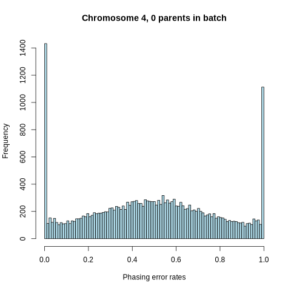

### Phasing error rates, chromosome 5
#### Combined error rates
 - Trios = Number of trios
 - Sites = Total number of sites where error can occur (summed over all trios)
 - Errors = Total number of errors
| Parents in batch | Trios | Sites | Errors | Error rate |
|:----|:----|:----|:----|:----|
| 0 | 20984 | 8163793 | 4018643 | 0.49 |
| 1 | 6569 | 2579473 | 41 | 1.6e-05 |
| 2 | 26935 | 10580959 | 6 | 5.7e-07 |

#### Individual error rates
| Parents in batch | min | max | median | mean |
|:----|:----|:----|:----|:----|
| 0 | 0 | 1 | 0.5 | 0.49 |
| 1 | 0 | 0.0068 | 0 | 1.7e-05 |
| 2 | 0 | 0.0027 | 0 | 5.4e-07 |

#### Histogram of individual error rates
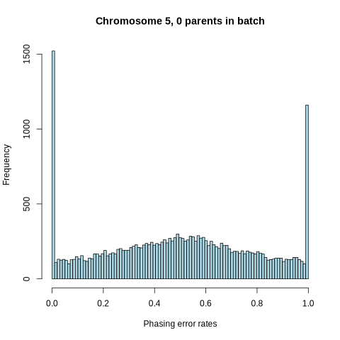

### Phasing error rates, chromosome 6
#### Combined error rates
 - Trios = Number of trios
 - Sites = Total number of sites where error can occur (summed over all trios)
 - Errors = Total number of errors
| Parents in batch | Trios | Sites | Errors | Error rate |
|:----|:----|:----|:----|:----|
| 0 | 20984 | 7826775 | 3834379 | 0.49 |
| 1 | 6569 | 2473753 | 53 | 2.1e-05 |
| 2 | 26935 | 10113533 | 6 | 5.9e-07 |

#### Individual error rates
| Parents in batch | min | max | median | mean |
|:----|:----|:----|:----|:----|
| 0 | 0 | 1 | 0.49 | 0.49 |
| 1 | 0 | 0.0063 | 0 | 2.2e-05 |
| 2 | 0 | 0.0029 | 0 | 5.9e-07 |

#### Histogram of individual error rates
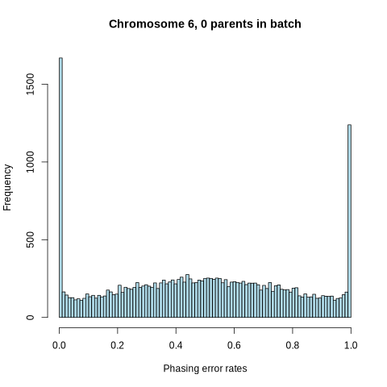

### Phasing error rates, chromosome 7
#### Combined error rates
 - Trios = Number of trios
 - Sites = Total number of sites where error can occur (summed over all trios)
 - Errors = Total number of errors
| Parents in batch | Trios | Sites | Errors | Error rate |
|:----|:----|:----|:----|:----|
| 0 | 20984 | 7173156 | 3532739 | 0.49 |
| 1 | 6569 | 2267883 | 51 | 2.2e-05 |
| 2 | 26935 | 9293082 | 6 | 6.5e-07 |

#### Individual error rates
| Parents in batch | min | max | median | mean |
|:----|:----|:----|:----|:----|
| 0 | 0 | 1 | 0.49 | 0.49 |
| 1 | 0 | 0.012 | 0 | 2.4e-05 |
| 2 | 0 | 0.0031 | 0 | 6.2e-07 |

#### Histogram of individual error rates
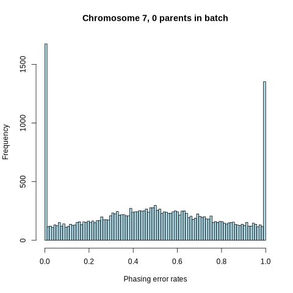

### Phasing error rates, chromosome 8
#### Combined error rates
 - Trios = Number of trios
 - Sites = Total number of sites where error can occur (summed over all trios)
 - Errors = Total number of errors
| Parents in batch | Trios | Sites | Errors | Error rate |
|:----|:----|:----|:----|:----|
| 0 | 20984 | 6339081 | 3113672 | 0.49 |
| 1 | 6569 | 2007433 | 52 | 2.6e-05 |
| 2 | 26935 | 8215894 | 6 | 7.3e-07 |

#### Individual error rates
| Parents in batch | min | max | median | mean |
|:----|:----|:----|:----|:----|
| 0 | 0 | 1 | 0.49 | 0.49 |
| 1 | 0 | 0.01 | 0 | 2.7e-05 |
| 2 | 0 | 0.02 | 0 | 1.4e-06 |

#### Histogram of individual error rates
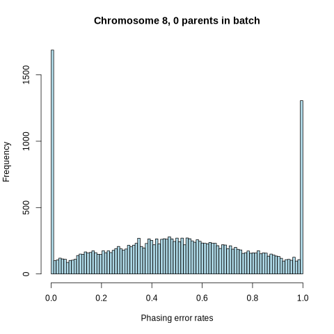

### Phasing error rates, chromosome 9
#### Combined error rates
 - Trios = Number of trios
 - Sites = Total number of sites where error can occur (summed over all trios)
 - Errors = Total number of errors
| Parents in batch | Trios | Sites | Errors | Error rate |
|:----|:----|:----|:----|:----|
| 0 | 20984 | 2558683 | 1260419 | 0.49 |
| 1 | 6569 | 811166 | 75 | 9.2e-05 |
| 2 | 26935 | 3305878 | 2 | 6e-07 |

#### Individual error rates
| Parents in batch | min | max | median | mean |
|:----|:----|:----|:----|:----|
| 0 | 0 | 1 | 0.5 | 0.49 |
| 1 | 0 | 0.025 | 0 | 9.3e-05 |
| 2 | 0 | 0.0093 | 0 | 6e-07 |

#### Histogram of individual error rates
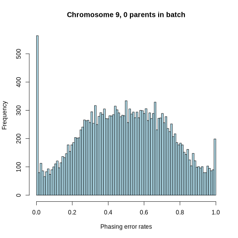
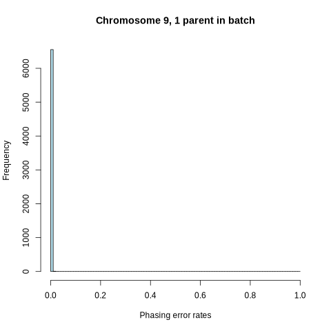

### Phasing error rates, chromosome 10
#### Combined error rates
 - Trios = Number of trios
 - Sites = Total number of sites where error can occur (summed over all trios)
 - Errors = Total number of errors
| Parents in batch | Trios | Sites | Errors | Error rate |
|:----|:----|:----|:----|:----|
| 0 | 20984 | 6642196 | 3272678 | 0.49 |
| 1 | 6569 | 2104256 | 49 | 2.3e-05 |
| 2 | 26935 | 8589492 | 6 | 7e-07 |

#### Individual error rates
| Parents in batch | min | max | median | mean |
|:----|:----|:----|:----|:----|
| 0 | 0 | 1 | 0.5 | 0.49 |
| 1 | 0 | 0.0074 | 0 | 2.4e-05 |
| 2 | 0 | 0.0064 | 0 | 7.2e-07 |

#### Histogram of individual error rates
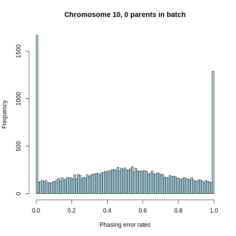

### Phasing error rates, chromosome 11
#### Combined error rates
 - Trios = Number of trios
 - Sites = Total number of sites where error can occur (summed over all trios)
 - Errors = Total number of errors
| Parents in batch | Trios | Sites | Errors | Error rate |
|:----|:----|:----|:----|:----|
| 0 | 20984 | 6550710 | 3216052 | 0.49 |
| 1 | 6569 | 2070385 | 37 | 1.8e-05 |
| 2 | 26935 | 8464711 | 3 | 3.5e-07 |

#### Individual error rates
| Parents in batch | min | max | median | mean |
|:----|:----|:----|:----|:----|
| 0 | 0 | 1 | 0.49 | 0.49 |
| 1 | 0 | 0.01 | 0 | 1.9e-05 |
| 2 | 0 | 0.004 | 0 | 3.3e-07 |

#### Histogram of individual error rates
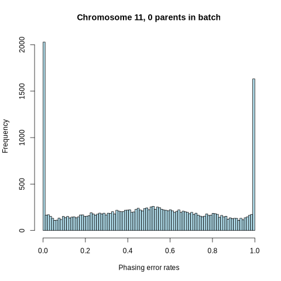

### Phasing error rates, chromosome 12
#### Combined error rates
 - Trios = Number of trios
 - Sites = Total number of sites where error can occur (summed over all trios)
 - Errors = Total number of errors
| Parents in batch | Trios | Sites | Errors | Error rate |
|:----|:----|:----|:----|:----|
| 0 | 20984 | 6328086 | 3116082 | 0.49 |
| 1 | 6569 | 2005126 | 36 | 1.8e-05 |
| 2 | 26935 | 8153440 | 1 | 1.2e-07 |

#### Individual error rates
| Parents in batch | min | max | median | mean |
|:----|:----|:----|:----|:----|
| 0 | 0 | 1 | 0.49 | 0.49 |
| 1 | 0 | 0.013 | 0 | 1.8e-05 |
| 2 | 0 | 0.0038 | 0 | 1.4e-07 |

#### Histogram of individual error rates
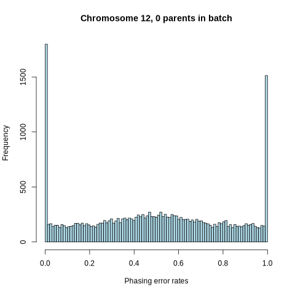
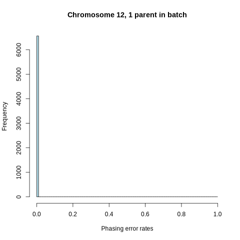

### Phasing error rates, chromosome 13
#### Combined error rates
 - Trios = Number of trios
 - Sites = Total number of sites where error can occur (summed over all trios)
 - Errors = Total number of errors
| Parents in batch | Trios | Sites | Errors | Error rate |
|:----|:----|:----|:----|:----|
| 0 | 20984 | 4969172 | 2430513 | 0.49 |
| 1 | 6569 | 1571510 | 26 | 1.7e-05 |
| 2 | 26935 | 6401557 | 3 | 4.7e-07 |

#### Individual error rates
| Parents in batch | min | max | median | mean |
|:----|:----|:----|:----|:----|
| 0 | 0 | 1 | 0.49 | 0.49 |
| 1 | 0 | 0.017 | 0 | 1.7e-05 |
| 2 | 0 | 0.083 | 0 | 3.3e-06 |

#### Histogram of individual error rates
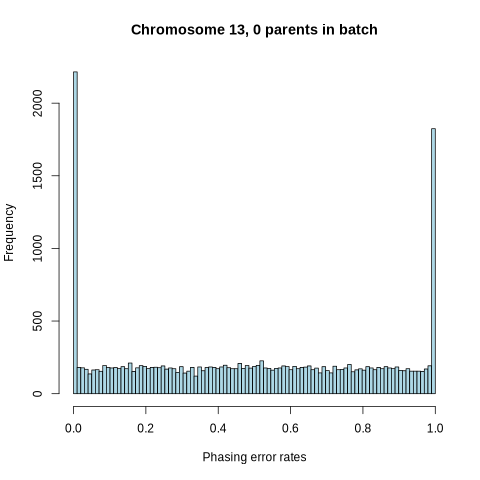

### Phasing error rates, chromosome 14
#### Combined error rates
 - Trios = Number of trios
 - Sites = Total number of sites where error can occur (summed over all trios)
 - Errors = Total number of errors
| Parents in batch | Trios | Sites | Errors | Error rate |
|:----|:----|:----|:----|:----|
| 0 | 20984 | 4437507 | 2191815 | 0.49 |
| 1 | 6569 | 1401055 | 35 | 2.5e-05 |
| 2 | 26935 | 5725210 | 5 | 8.7e-07 |

#### Individual error rates
| Parents in batch | min | max | median | mean |
|:----|:----|:----|:----|:----|
| 0 | 0 | 1 | 0.5 | 0.49 |
| 1 | 0 | 0.015 | 0 | 2.8e-05 |
| 2 | 0 | 0.0054 | 0 | 8.8e-07 |

#### Histogram of individual error rates

### Phasing error rates, chromosome 15
#### Combined error rates
 - Trios = Number of trios
 - Sites = Total number of sites where error can occur (summed over all trios)
 - Errors = Total number of errors
| Parents in batch | Trios | Sites | Errors | Error rate |
|:----|:----|:----|:----|:----|
| 0 | 20984 | 3873262 | 1905573 | 0.49 |
| 1 | 6569 | 1229180 | 23 | 1.9e-05 |
| 2 | 26935 | 4979684 | 5 | 1e-06 |

#### Individual error rates
| Parents in batch | min | max | median | mean |
|:----|:----|:----|:----|:----|
| 0 | 0 | 1 | 0.49 | 0.49 |
| 1 | 0 | 0.014 | 0 | 2.1e-05 |
| 2 | 0 | 0.0064 | 0 | 1.1e-06 |

#### Histogram of individual error rates

### Phasing error rates, chromosome 16
#### Combined error rates
 - Trios = Number of trios
 - Sites = Total number of sites where error can occur (summed over all trios)
 - Errors = Total number of errors
| Parents in batch | Trios | Sites | Errors | Error rate |
|:----|:----|:----|:----|:----|
| 0 | 20984 | 4144771 | 2047224 | 0.49 |
| 1 | 6569 | 1315618 | 29 | 2.2e-05 |
| 2 | 26935 | 5349400 | 11 | 2.1e-06 |

#### Individual error rates
| Parents in batch | min | max | median | mean |
|:----|:----|:----|:----|:----|
| 0 | 0 | 1 | 0.5 | 0.49 |
| 1 | 0 | 0.016 | 0 | 2.4e-05 |
| 2 | 0 | 0.022 | 0 | 3.1e-06 |

#### Histogram of individual error rates
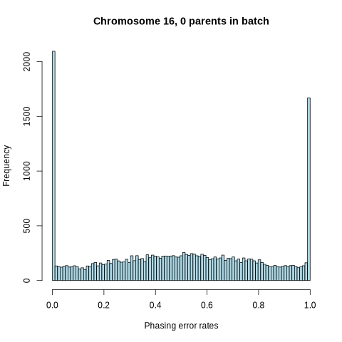

### Phasing error rates, chromosome 17
#### Combined error rates
 - Trios = Number of trios
 - Sites = Total number of sites where error can occur (summed over all trios)
 - Errors = Total number of errors
| Parents in batch | Trios | Sites | Errors | Error rate |
|:----|:----|:----|:----|:----|
| 0 | 20984 | 3524700 | 1732698 | 0.49 |
| 1 | 6569 | 1116704 | 37 | 3.3e-05 |
| 2 | 26935 | 4538665 | 7 | 1.5e-06 |

#### Individual error rates
| Parents in batch | min | max | median | mean |
|:----|:----|:----|:----|:----|
| 0 | 0 | 1 | 0.49 | 0.49 |
| 1 | 0 | 0.011 | 0 | 3.4e-05 |
| 2 | 0 | 0.013 | 0 | 1.6e-06 |

#### Histogram of individual error rates
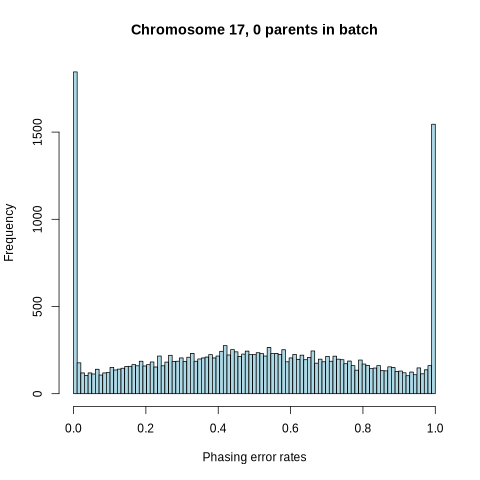

### Phasing error rates, chromosome 18
#### Combined error rates
 - Trios = Number of trios
 - Sites = Total number of sites where error can occur (summed over all trios)
 - Errors = Total number of errors
| Parents in batch | Trios | Sites | Errors | Error rate |
|:----|:----|:----|:----|:----|
| 0 | 20984 | 3919820 | 1924186 | 0.49 |
| 1 | 6569 | 1243285 | 32 | 2.6e-05 |
| 2 | 26935 | 5046796 | 6 | 1.2e-06 |

#### Individual error rates
| Parents in batch | min | max | median | mean |
|:----|:----|:----|:----|:----|
| 0 | 0 | 1 | 0.49 | 0.49 |
| 1 | 0 | 0.013 | 0 | 2.6e-05 |
| 2 | 0 | 0.0065 | 0 | 1.3e-06 |

#### Histogram of individual error rates

### Phasing error rates, chromosome 19
#### Combined error rates
 - Trios = Number of trios
 - Sites = Total number of sites where error can occur (summed over all trios)
 - Errors = Total number of errors
| Parents in batch | Trios | Sites | Errors | Error rate |
|:----|:----|:----|:----|:----|
| 0 | 20984 | 2852406 | 1395299 | 0.49 |
| 1 | 6569 | 906091 | 31 | 3.4e-05 |
| 2 | 26935 | 3678613 | 3 | 8.2e-07 |

#### Individual error rates
| Parents in batch | min | max | median | mean |
|:----|:----|:----|:----|:----|
| 0 | 0 | 1 | 0.49 | 0.49 |
| 1 | 0 | 0.027 | 0 | 3.6e-05 |
| 2 | 0 | 0.0078 | 0 | 8e-07 |

#### Histogram of individual error rates

### Phasing error rates, chromosome 20
#### Combined error rates
 - Trios = Number of trios
 - Sites = Total number of sites where error can occur (summed over all trios)
 - Errors = Total number of errors
| Parents in batch | Trios | Sites | Errors | Error rate |
|:----|:----|:----|:----|:----|
| 0 | 20984 | 3080524 | 1513426 | 0.49 |
| 1 | 6569 | 975938 | 27 | 2.8e-05 |
| 2 | 26935 | 3970466 | 2 | 5e-07 |

#### Individual error rates
| Parents in batch | min | max | median | mean |
|:----|:----|:----|:----|:----|
| 0 | 0 | 1 | 0.49 | 0.49 |
| 1 | 0 | 0.0087 | 0 | 2.9e-05 |
| 2 | 0 | 0.0078 | 0 | 5e-07 |

#### Histogram of individual error rates
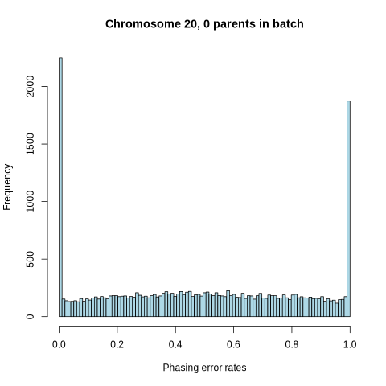

### Phasing error rates, chromosome 21
#### Combined error rates
 - Trios = Number of trios
 - Sites = Total number of sites where error can occur (summed over all trios)
 - Errors = Total number of errors
| Parents in batch | Trios | Sites | Errors | Error rate |
|:----|:----|:----|:----|:----|
| 0 | 20984 | 1873286 | 916350 | 0.49 |
| 1 | 6569 | 593058 | 22 | 3.7e-05 |
| 2 | 26935 | 2413258 | 0 | 0 |

#### Individual error rates
| Parents in batch | min | max | median | mean |
|:----|:----|:----|:----|:----|
| 0 | 0 | 1 | 0.48 | 0.49 |
| 1 | 0 | 0.037 | 0 | 4.5e-05 |
| 2 | 0 | 0 | 0 | 0 |

#### Histogram of individual error rates
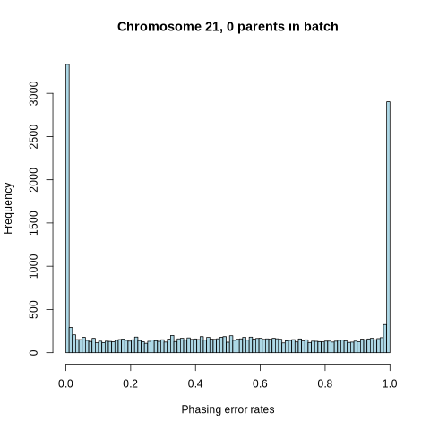

### Phasing error rates, chromosome 22
#### Combined error rates
 - Trios = Number of trios
 - Sites = Total number of sites where error can occur (summed over all trios)
 - Errors = Total number of errors
| Parents in batch | Trios | Sites | Errors | Error rate |
|:----|:----|:----|:----|:----|
| 0 | 20984 | 1903684 | 931433 | 0.49 |
| 1 | 6569 | 604019 | 21 | 3.5e-05 |
| 2 | 26935 | 2454593 | 2 | 8.1e-07 |

#### Individual error rates
| Parents in batch | min | max | median | mean |
|:----|:----|:----|:----|:----|
| 0 | 0 | 1 | 0.48 | 0.49 |
| 1 | 0 | 0.022 | 0 | 3.7e-05 |
| 2 | 0 | 0.011 | 0 | 7.8e-07 |

#### Histogram of individual error rates
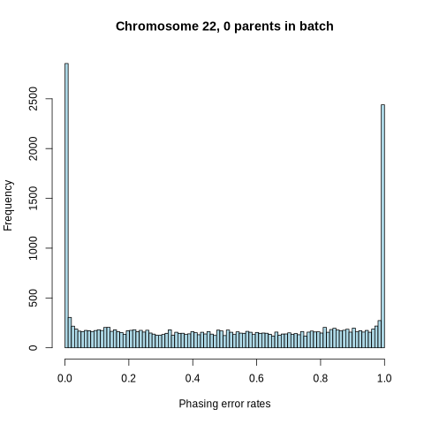

## Mendelian error rates per chromosome and number of parents in same batch as child
### Mendelian error rates, chromosome 1
#### Combined error rates
 - Trios = Number of trios
 - Sites = Total number of sites where error can occur (summed over all trios)
 - Errors = Total number of errors
| Parents in batch | Trios | Sites | Errors | Error rate |
|:----|:----|:----|:----|:----|
| 0 | 20984 | 1071863005 | 217026 | 2e-04 |
| 1 | 6569 | 335994615 | 23715 | 7.1e-05 |
| 2 | 26935 | 1381482092 | 9251 | 6.7e-06 |

#### Individual error rates
| Parents in batch | min | max | median | mean |
|:----|:----|:----|:----|:----|
| 0 | 0 | 0.028 | 0.00014 | 2e-04 |
| 1 | 0 | 0.0023 | 3.9e-05 | 7.1e-05 |
| 2 | 0 | 0.00057 | 0 | 6.7e-06 |

#### Histogram of individual error rates

### Mendelian error rates, chromosome 2
#### Combined error rates
 - Trios = Number of trios
 - Sites = Total number of sites where error can occur (summed over all trios)
 - Errors = Total number of errors
| Parents in batch | Trios | Sites | Errors | Error rate |
|:----|:----|:----|:----|:----|
| 0 | 20984 | 1218610794 | 218218 | 0.00018 |
| 1 | 6569 | 382034505 | 23227 | 6.1e-05 |
| 2 | 26935 | 1568236607 | 11474 | 7.3e-06 |

#### Individual error rates
| Parents in batch | min | max | median | mean |
|:----|:----|:----|:----|:----|
| 0 | 0 | 0.027 | 1e-04 | 0.00018 |
| 1 | 0 | 0.0019 | 3.4e-05 | 6.1e-05 |
| 2 | 0 | 0.011 | 0 | 7.3e-06 |

#### Histogram of individual error rates

### Mendelian error rates, chromosome 3
#### Combined error rates
 - Trios = Number of trios
 - Sites = Total number of sites where error can occur (summed over all trios)
 - Errors = Total number of errors
| Parents in batch | Trios | Sites | Errors | Error rate |
|:----|:----|:----|:----|:----|
| 0 | 20984 | 1031816377 | 186723 | 0.00018 |
| 1 | 6569 | 323513418 | 20164 | 6.2e-05 |
| 2 | 26935 | 1327788755 | 9157 | 6.9e-06 |

#### Individual error rates
| Parents in batch | min | max | median | mean |
|:----|:----|:----|:----|:----|
| 0 | 0 | 0.027 | 1e-04 | 0.00018 |
| 1 | 0 | 0.0023 | 2e-05 | 6.3e-05 |
| 2 | 0 | 0.00064 | 0 | 6.9e-06 |

#### Histogram of individual error rates

### Mendelian error rates, chromosome 4
#### Combined error rates
 - Trios = Number of trios
 - Sites = Total number of sites where error can occur (summed over all trios)
 - Errors = Total number of errors
| Parents in batch | Trios | Sites | Errors | Error rate |
|:----|:----|:----|:----|:----|
| 0 | 20984 | 1015508311 | 180800 | 0.00018 |
| 1 | 6569 | 318358900 | 21668 | 6.8e-05 |
| 2 | 26935 | 1307307131 | 10629 | 8.1e-06 |

#### Individual error rates
| Parents in batch | min | max | median | mean |
|:----|:----|:----|:----|:----|
| 0 | 0 | 0.026 | 1e-04 | 0.00018 |
| 1 | 0 | 0.018 | 4.1e-05 | 6.8e-05 |
| 2 | 0 | 0.011 | 0 | 8.2e-06 |

#### Histogram of individual error rates

### Mendelian error rates, chromosome 5
#### Combined error rates
 - Trios = Number of trios
 - Sites = Total number of sites where error can occur (summed over all trios)
 - Errors = Total number of errors
| Parents in batch | Trios | Sites | Errors | Error rate |
|:----|:----|:----|:----|:----|
| 0 | 20984 | 929638898 | 164592 | 0.00018 |
| 1 | 6569 | 291452194 | 17945 | 6.2e-05 |
| 2 | 26935 | 1196516391 | 8590 | 7.2e-06 |

#### Individual error rates
| Parents in batch | min | max | median | mean |
|:----|:----|:----|:----|:----|
| 0 | 0 | 0.028 | 0.00011 | 0.00018 |
| 1 | 0 | 0.0085 | 2.3e-05 | 6.2e-05 |
| 2 | 0 | 0.0034 | 0 | 7.2e-06 |

#### Histogram of individual error rates

### Mendelian error rates, chromosome 6
#### Combined error rates
 - Trios = Number of trios
 - Sites = Total number of sites where error can occur (summed over all trios)
 - Errors = Total number of errors
| Parents in batch | Trios | Sites | Errors | Error rate |
|:----|:----|:----|:----|:----|
| 0 | 20984 | 886532951 | 143678 | 0.00016 |
| 1 | 6569 | 277912197 | 15010 | 5.4e-05 |
| 2 | 26935 | 1140771882 | 7785 | 6.8e-06 |

#### Individual error rates
| Parents in batch | min | max | median | mean |
|:----|:----|:----|:----|:----|
| 0 | 0 | 0.028 | 9.4e-05 | 0.00016 |
| 1 | 0 | 0.0018 | 2.4e-05 | 5.4e-05 |
| 2 | 0 | 0.00045 | 0 | 6.8e-06 |

#### Histogram of individual error rates

### Mendelian error rates, chromosome 7
#### Combined error rates
 - Trios = Number of trios
 - Sites = Total number of sites where error can occur (summed over all trios)
 - Errors = Total number of errors
| Parents in batch | Trios | Sites | Errors | Error rate |
|:----|:----|:----|:----|:----|
| 0 | 20984 | 799179449 | 148280 | 0.00019 |
| 1 | 6569 | 250567065 | 16480 | 6.6e-05 |
| 2 | 26935 | 1028602409 | 7380 | 7.2e-06 |

#### Individual error rates
| Parents in batch | min | max | median | mean |
|:----|:----|:----|:----|:----|
| 0 | 0 | 0.029 | 0.00011 | 0.00019 |
| 1 | 0 | 0.0022 | 2.6e-05 | 6.6e-05 |
| 2 | 0 | 0.00058 | 0 | 7.2e-06 |

#### Histogram of individual error rates

### Mendelian error rates, chromosome 8
#### Combined error rates
 - Trios = Number of trios
 - Sites = Total number of sites where error can occur (summed over all trios)
 - Errors = Total number of errors
| Parents in batch | Trios | Sites | Errors | Error rate |
|:----|:----|:----|:----|:----|
| 0 | 20984 | 743414369 | 141313 | 0.00019 |
| 1 | 6569 | 233073356 | 14938 | 6.4e-05 |
| 2 | 26935 | 956817077 | 6923 | 7.2e-06 |

#### Individual error rates
| Parents in batch | min | max | median | mean |
|:----|:----|:----|:----|:----|
| 0 | 0 | 0.028 | 0.00011 | 0.00019 |
| 1 | 0 | 0.0022 | 2.8e-05 | 6.4e-05 |
| 2 | 0 | 0.0098 | 0 | 7.3e-06 |

#### Histogram of individual error rates

### Mendelian error rates, chromosome 9
#### Combined error rates
 - Trios = Number of trios
 - Sites = Total number of sites where error can occur (summed over all trios)
 - Errors = Total number of errors
| Parents in batch | Trios | Sites | Errors | Error rate |
|:----|:----|:----|:----|:----|
| 0 | 20984 | 155167109 | 98063 | 0.00063 |
| 1 | 6569 | 48706658 | 10375 | 0.00021 |
| 2 | 26935 | 199674978 | 2237 | 1.1e-05 |

#### Individual error rates
| Parents in batch | min | max | median | mean |
|:----|:----|:----|:----|:----|
| 0 | 0 | 0.046 | 0.00041 | 0.00063 |
| 1 | 0 | 0.0032 | 0.00013 | 0.00021 |
| 2 | 0 | 0.0087 | 0 | 1.1e-05 |

#### Histogram of individual error rates

### Mendelian error rates, chromosome 10
#### Combined error rates
 - Trios = Number of trios
 - Sites = Total number of sites where error can occur (summed over all trios)
 - Errors = Total number of errors
| Parents in batch | Trios | Sites | Errors | Error rate |
|:----|:----|:----|:----|:----|
| 0 | 20984 | 707561700 | 131459 | 0.00019 |
| 1 | 6569 | 221867268 | 13945 | 6.3e-05 |
| 2 | 26935 | 910523656 | 6834 | 7.5e-06 |

#### Individual error rates
| Parents in batch | min | max | median | mean |
|:----|:----|:----|:----|:----|
| 0 | 0 | 0.029 | 0.00012 | 0.00019 |
| 1 | 0 | 0.0021 | 3e-05 | 6.3e-05 |
| 2 | 0 | 0.01 | 0 | 7.5e-06 |

#### Histogram of individual error rates

### Mendelian error rates, chromosome 11
#### Combined error rates
 - Trios = Number of trios
 - Sites = Total number of sites where error can occur (summed over all trios)
 - Errors = Total number of errors
| Parents in batch | Trios | Sites | Errors | Error rate |
|:----|:----|:----|:----|:----|
| 0 | 20984 | 778159420 | 136436 | 0.00018 |
| 1 | 6569 | 243965124 | 14559 | 6e-05 |
| 2 | 26935 | 1001000112 | 7032 | 7e-06 |

#### Individual error rates
| Parents in batch | min | max | median | mean |
|:----|:----|:----|:----|:----|
| 0 | 0 | 0.026 | 0.00011 | 0.00018 |
| 1 | 0 | 0.014 | 2.7e-05 | 6e-05 |
| 2 | 0 | 0.00084 | 0 | 7e-06 |

#### Histogram of individual error rates

### Mendelian error rates, chromosome 12
#### Combined error rates
 - Trios = Number of trios
 - Sites = Total number of sites where error can occur (summed over all trios)
 - Errors = Total number of errors
| Parents in batch | Trios | Sites | Errors | Error rate |
|:----|:----|:----|:----|:----|
| 0 | 20984 | 671845644 | 125920 | 0.00019 |
| 1 | 6569 | 210674691 | 13042 | 6.2e-05 |
| 2 | 26935 | 864152324 | 6371 | 7.4e-06 |

#### Individual error rates
| Parents in batch | min | max | median | mean |
|:----|:----|:----|:----|:----|
| 0 | 0 | 0.029 | 0.00012 | 0.00019 |
| 1 | 0 | 0.0023 | 3.1e-05 | 6.2e-05 |
| 2 | 0 | 0.00069 | 0 | 7.4e-06 |

#### Histogram of individual error rates

### Mendelian error rates, chromosome 13
#### Combined error rates
 - Trios = Number of trios
 - Sites = Total number of sites where error can occur (summed over all trios)
 - Errors = Total number of errors
| Parents in batch | Trios | Sites | Errors | Error rate |
|:----|:----|:----|:----|:----|
| 0 | 20984 | 548037258 | 98066 | 0.00018 |
| 1 | 6569 | 171845417 | 10778 | 6.3e-05 |
| 2 | 26935 | 704855342 | 5646 | 8e-06 |

#### Individual error rates
| Parents in batch | min | max | median | mean |
|:----|:----|:----|:----|:----|
| 0 | 0 | 0.028 | 0.00011 | 0.00018 |
| 1 | 0 | 0.013 | 3.8e-05 | 6.3e-05 |
| 2 | 0 | 0.0056 | 0 | 8e-06 |

#### Histogram of individual error rates

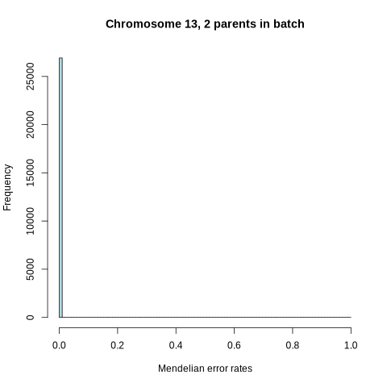
### Mendelian error rates, chromosome 14
#### Combined error rates
 - Trios = Number of trios
 - Sites = Total number of sites where error can occur (summed over all trios)
 - Errors = Total number of errors
| Parents in batch | Trios | Sites | Errors | Error rate |
|:----|:----|:----|:----|:----|
| 0 | 20984 | 457688432 | 81708 | 0.00018 |
| 1 | 6569 | 143516591 | 8670 | 6e-05 |
| 2 | 26935 | 588718145 | 4270 | 7.3e-06 |

#### Individual error rates
| Parents in batch | min | max | median | mean |
|:----|:----|:----|:----|:----|
| 0 | 0 | 0.031 | 9.2e-05 | 0.00018 |
| 1 | 0 | 0.0022 | 0 | 6.1e-05 |
| 2 | 0 | 0.0094 | 0 | 7.3e-06 |

#### Histogram of individual error rates

### Mendelian error rates, chromosome 15
#### Combined error rates
 - Trios = Number of trios
 - Sites = Total number of sites where error can occur (summed over all trios)
 - Errors = Total number of errors
| Parents in batch | Trios | Sites | Errors | Error rate |
|:----|:----|:----|:----|:----|
| 0 | 20984 | 389919812 | 83848 | 0.00022 |
| 1 | 6569 | 122306168 | 8585 | 7e-05 |
| 2 | 26935 | 501323301 | 4116 | 8.2e-06 |

#### Individual error rates
| Parents in batch | min | max | median | mean |
|:----|:----|:----|:----|:----|
| 0 | 0 | 0.028 | 0.00011 | 0.00022 |
| 1 | 0 | 0.0023 | 0 | 7.1e-05 |
| 2 | 0 | 0.00076 | 0 | 8.2e-06 |

#### Histogram of individual error rates

### Mendelian error rates, chromosome 16
#### Combined error rates
 - Trios = Number of trios
 - Sites = Total number of sites where error can occur (summed over all trios)
 - Errors = Total number of errors
| Parents in batch | Trios | Sites | Errors | Error rate |
|:----|:----|:----|:----|:----|
| 0 | 20984 | 414762539 | 94512 | 0.00023 |
| 1 | 6569 | 130094481 | 10271 | 7.9e-05 |
| 2 | 26935 | 533412751 | 4938 | 9.3e-06 |

#### Individual error rates
| Parents in batch | min | max | median | mean |
|:----|:----|:----|:----|:----|
| 0 | 0 | 0.028 | 0.00015 | 0.00023 |
| 1 | 0 | 0.0022 | 5e-05 | 7.9e-05 |
| 2 | 0 | 0.0074 | 0 | 9.3e-06 |

#### Histogram of individual error rates

### Mendelian error rates, chromosome 17
#### Combined error rates
 - Trios = Number of trios
 - Sites = Total number of sites where error can occur (summed over all trios)
 - Errors = Total number of errors
| Parents in batch | Trios | Sites | Errors | Error rate |
|:----|:----|:----|:----|:----|
| 0 | 20984 | 304489849 | 79571 | 0.00026 |
| 1 | 6569 | 95538173 | 8645 | 9e-05 |
| 2 | 26935 | 391631201 | 3521 | 9e-06 |

#### Individual error rates
| Parents in batch | min | max | median | mean |
|:----|:----|:----|:----|:----|
| 0 | 0 | 0.035 | 0.00014 | 0.00026 |
| 1 | 0 | 0.0025 | 6.8e-05 | 9.1e-05 |
| 2 | 0 | 0.00062 | 0 | 9e-06 |

#### Histogram of individual error rates

### Mendelian error rates, chromosome 18
#### Combined error rates
 - Trios = Number of trios
 - Sites = Total number of sites where error can occur (summed over all trios)
 - Errors = Total number of errors
| Parents in batch | Trios | Sites | Errors | Error rate |
|:----|:----|:----|:----|:----|
| 0 | 20984 | 381800436 | 78320 | 0.00021 |
| 1 | 6569 | 119763456 | 8288 | 6.9e-05 |
| 2 | 26935 | 490914271 | 4240 | 8.6e-06 |

#### Individual error rates
| Parents in batch | min | max | median | mean |
|:----|:----|:----|:----|:----|
| 0 | 0 | 0.027 | 0.00011 | 0.00021 |
| 1 | 0 | 0.0026 | 0 | 7e-05 |
| 2 | 0 | 0.0089 | 0 | 8.7e-06 |

#### Histogram of individual error rates

### Mendelian error rates, chromosome 19
#### Combined error rates
 - Trios = Number of trios
 - Sites = Total number of sites where error can occur (summed over all trios)
 - Errors = Total number of errors
| Parents in batch | Trios | Sites | Errors | Error rate |
|:----|:----|:----|:----|:----|
| 0 | 20984 | 220104512 | 63185 | 0.00029 |
| 1 | 6569 | 69070810 | 7072 | 1e-04 |
| 2 | 26935 | 283162389 | 2709 | 9.6e-06 |

#### Individual error rates
| Parents in batch | min | max | median | mean |
|:----|:----|:----|:----|:----|
| 0 | 0 | 0.038 | 0.00019 | 0.00029 |
| 1 | 0 | 0.0029 | 0 | 1e-04 |
| 2 | 0 | 0.00076 | 0 | 9.6e-06 |

#### Histogram of individual error rates

### Mendelian error rates, chromosome 20
#### Combined error rates
 - Trios = Number of trios
 - Sites = Total number of sites where error can occur (summed over all trios)
 - Errors = Total number of errors
| Parents in batch | Trios | Sites | Errors | Error rate |
|:----|:----|:----|:----|:----|
| 0 | 20984 | 264358812 | 63950 | 0.00024 |
| 1 | 6569 | 82937238 | 6602 | 8e-05 |
| 2 | 26935 | 340037850 | 2886 | 8.5e-06 |

#### Individual error rates
| Parents in batch | min | max | median | mean |
|:----|:----|:----|:----|:----|
| 0 | 0 | 0.035 | 0.00016 | 0.00024 |
| 1 | 0 | 0.0025 | 0 | 8e-05 |
| 2 | 0 | 0.00088 | 0 | 8.5e-06 |

#### Histogram of individual error rates

### Mendelian error rates, chromosome 21
#### Combined error rates
 - Trios = Number of trios
 - Sites = Total number of sites where error can occur (summed over all trios)
 - Errors = Total number of errors
| Parents in batch | Trios | Sites | Errors | Error rate |
|:----|:----|:----|:----|:----|
| 0 | 20984 | 153812430 | 39833 | 0.00026 |
| 1 | 6569 | 48257677 | 4362 | 9e-05 |
| 2 | 26935 | 197824865 | 2203 | 1.1e-05 |

#### Individual error rates
| Parents in batch | min | max | median | mean |
|:----|:----|:----|:----|:----|
| 0 | 0 | 0.035 | 0.00014 | 0.00026 |
| 1 | 0 | 0.019 | 0 | 9.1e-05 |
| 2 | 0 | 0.0037 | 0 | 1.1e-05 |

#### Histogram of individual error rates

### Mendelian error rates, chromosome 22
#### Combined error rates
 - Trios = Number of trios
 - Sites = Total number of sites where error can occur (summed over all trios)
 - Errors = Total number of errors
| Parents in batch | Trios | Sites | Errors | Error rate |
|:----|:----|:----|:----|:----|
| 0 | 20984 | 155603361 | 39500 | 0.00025 |
| 1 | 6569 | 48813518 | 4445 | 9.1e-05 |
| 2 | 26935 | 200117550 | 2026 | 1e-05 |

#### Individual error rates
| Parents in batch | min | max | median | mean |
|:----|:----|:----|:----|:----|
| 0 | 0 | 0.04 | 0.00013 | 0.00026 |
| 1 | 0 | 0.0079 | 0 | 9.2e-05 |
| 2 | 0 | 0.013 | 0 | 1e-05 |

#### Histogram of individual error rates

