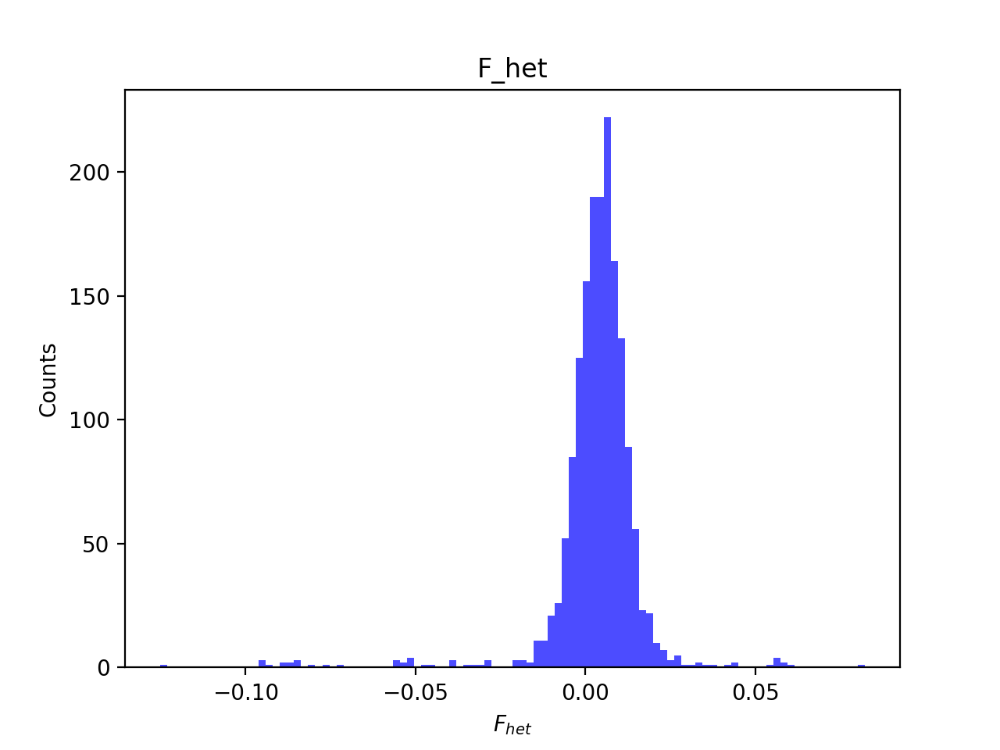
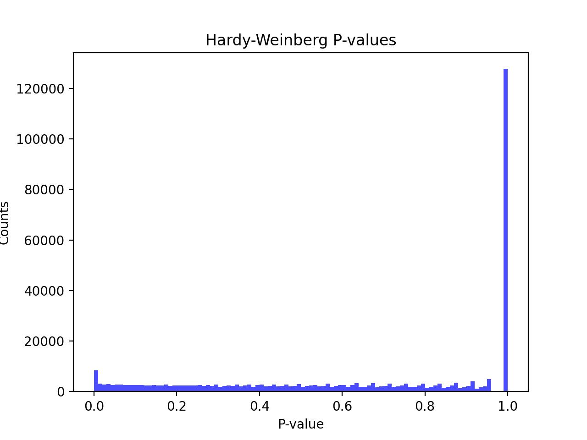
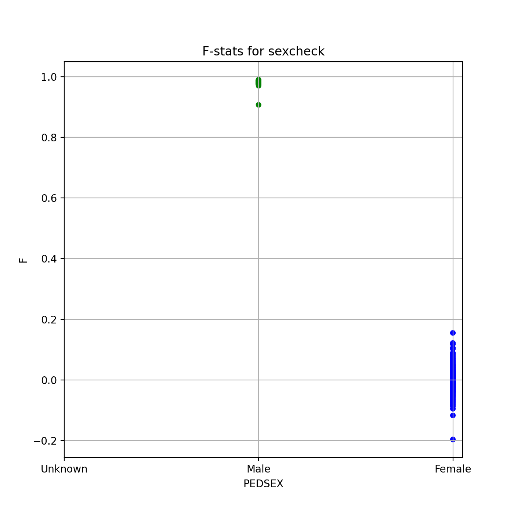
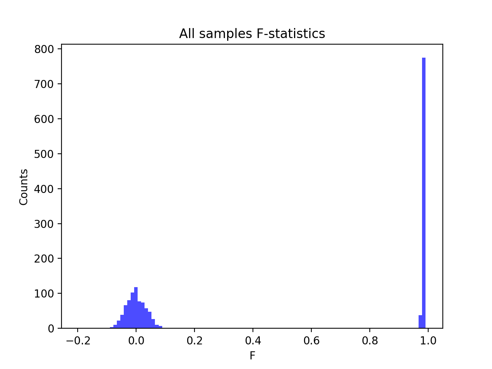
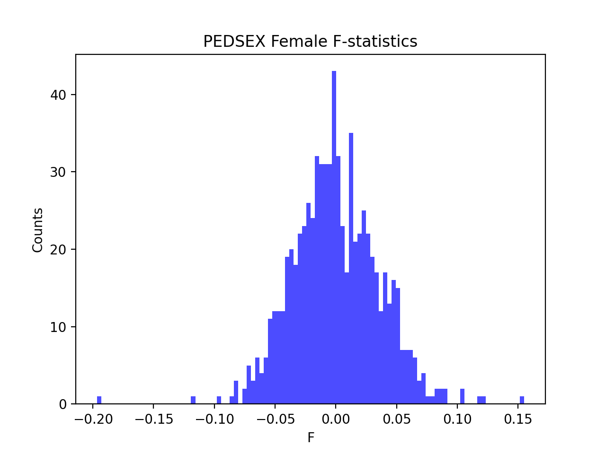

# Batch report for batch snp002, module mod5-pre-phasing
## Samples overview
1662 samples
 1391 kinship clusters
 164 offspring with mother ID
 164 offspring with mother in batch
 162 mothers with offspring in batch
 0 mothers missing from batch
 97 offspring with father ID
 97 offspring with father in batch
 96 fathers with offspring in batch
 0 fathers missing from batch
## Call rates
### Sample call rates
min: 0.9663704
 max: 0.9999627255
 median: 0.999880189 
### SNP call rates
min: 0.9801444
 max: 1.0
 median: 1.0 
## F_het
min: -0.125089
 max: 0.0822018
 median: 0.00460084 
## Hardy-Weinberg P-values
min: 1.00586e-06
 max: 1.0
 median: 0.723952 
## Sexcheck
1566 out of 1662 OK 
| PEDSEX | Total | SNPSEX Male | SNPSEX Female | SNPSEX Unknown | OK | Problem |
| ------ | ------ | ------ | ------ | ------ | ------ | ------ |
| Male | 813 | 813 | 0 | 0 | 813 | 0 |
| Female | 753 | 0 | 753 | 0 | 753 | 0 |
| Unknown | 0 | 0 | 0 | 0 | 0 | 0 |

### All samples 
### All samples F-statistics
min: -0.1965
 max: 0.9901
 median: 0.9778 
### PEDSEX Male
### PEDSEX Male F-statistics
min: 0.9071
 max: 0.9901
 median: 0.9819 
### PEDSEX Female
### PEDSEX Female F-statistics
min: -0.1965
 max: 0.1549
 median: -0.002084 