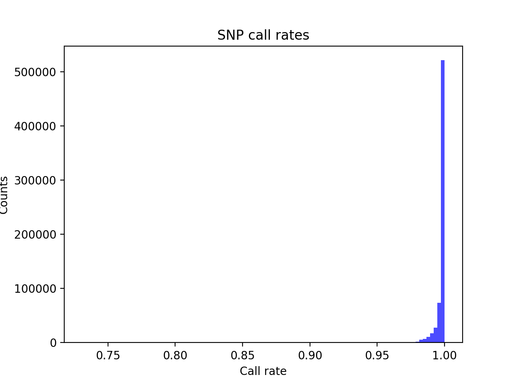
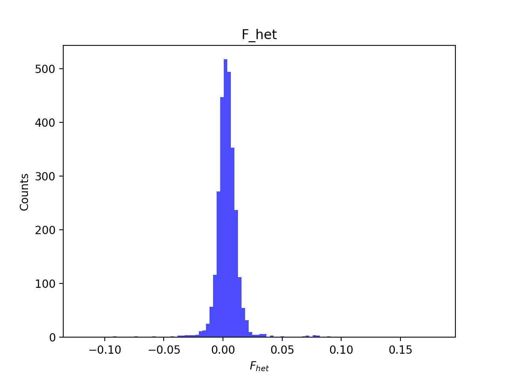
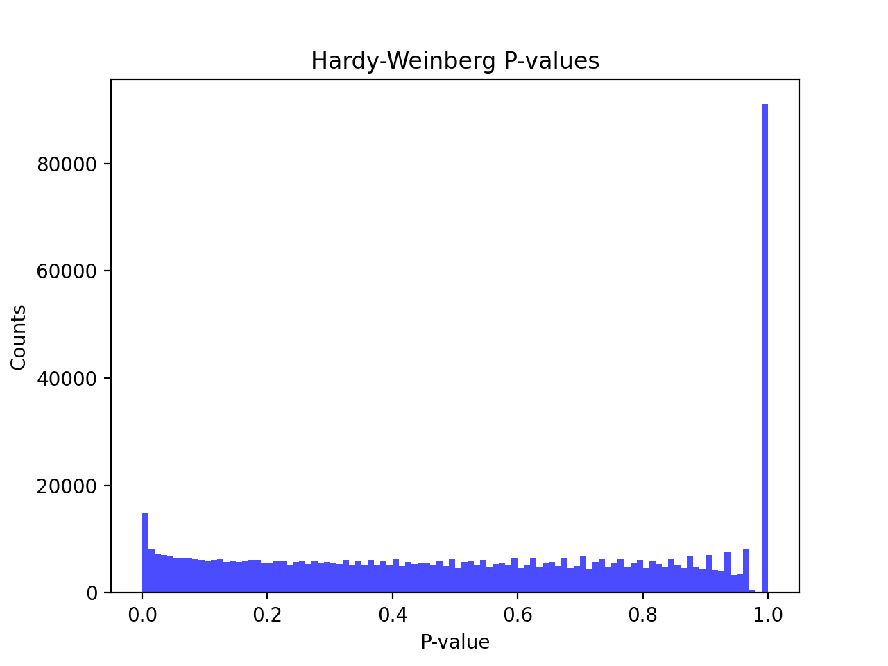

# Batch report for batch snp008, module mod5-harmonization
## Samples overview
2841 samples
 2835 kinship clusters
 2841 offspring with mother ID
 0 offspring with mother in batch
 0 mothers with offspring in batch
 2841 mothers missing from batch
 2841 offspring with father ID
 0 offspring with father in batch
 0 fathers with offspring in batch
 2841 fathers missing from batch
## Call rates
### Sample call rates
min: 0.9577217
 max: 0.999488338
 median: 0.99868623 
### SNP call rates
min: 0.731081
 max: 1.0
 median: 0.999296023 
## F_het
min: -0.119875
 max: 0.18135
 median: 0.00318749 
## Hardy-Weinberg P-values
min: 1.00114e-06
 max: 1.0
 median: 0.540588 
## Sexcheck
2694 out of 2841 OK 
| PEDSEX | Total | SNPSEX Male | SNPSEX Female | SNPSEX Unknown | OK | Problem |
| ------ | ------ | ------ | ------ | ------ | ------ | ------ |
| Male | 1377 | 1376 | 1 | 0 | 1376 | 1 |
| Female | 1321 | 0 | 1318 | 3 | 1318 | 3 |
| Unknown | 1 | 0 | 1 | 0 | 0 | 1 |

### All samples 
### All samples F-statistics
min: -0.249
 max: 0.9972
 median: 0.9904 
### PEDSEX Male
### PEDSEX Male F-statistics
min: 0.0233
 max: 0.9972
 median: 0.9932 
### PEDSEX Female
### PEDSEX Female F-statistics
min: -0.249
 max: 0.2216
 median: 0.0009939 