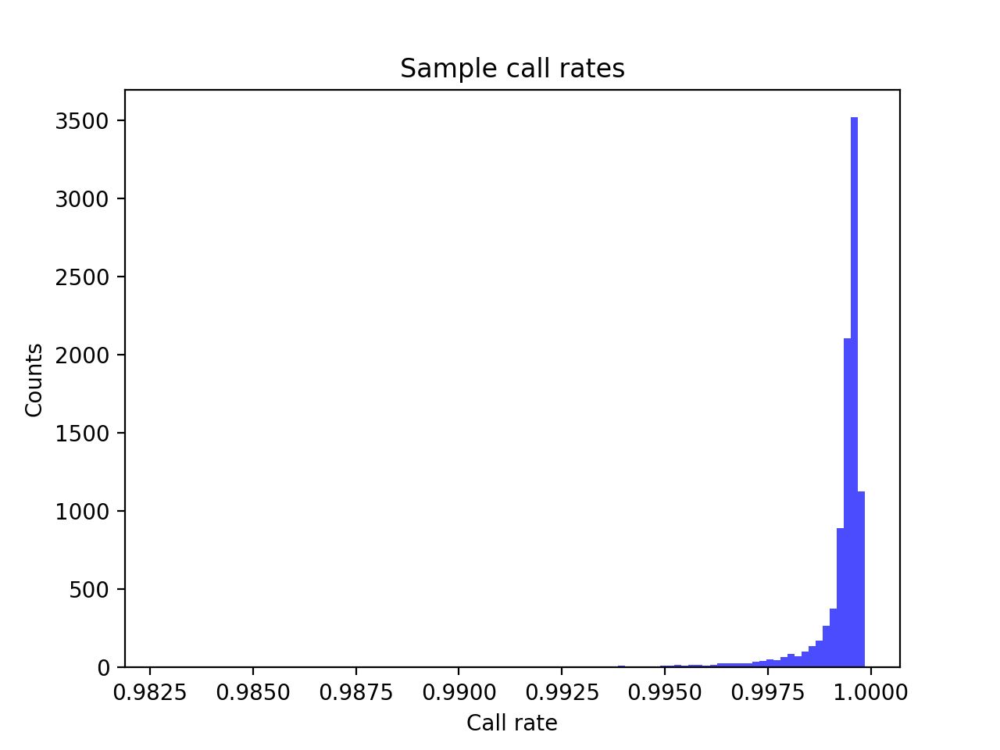
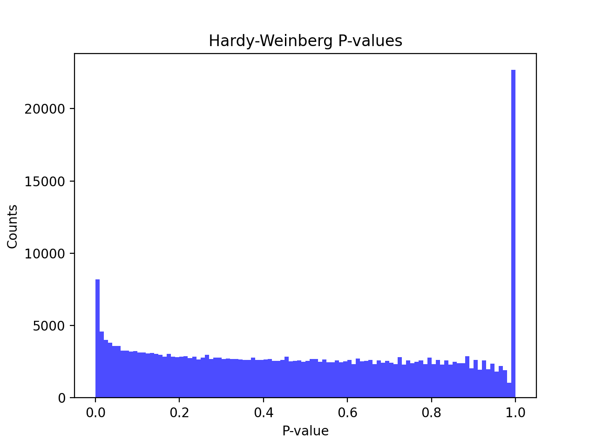
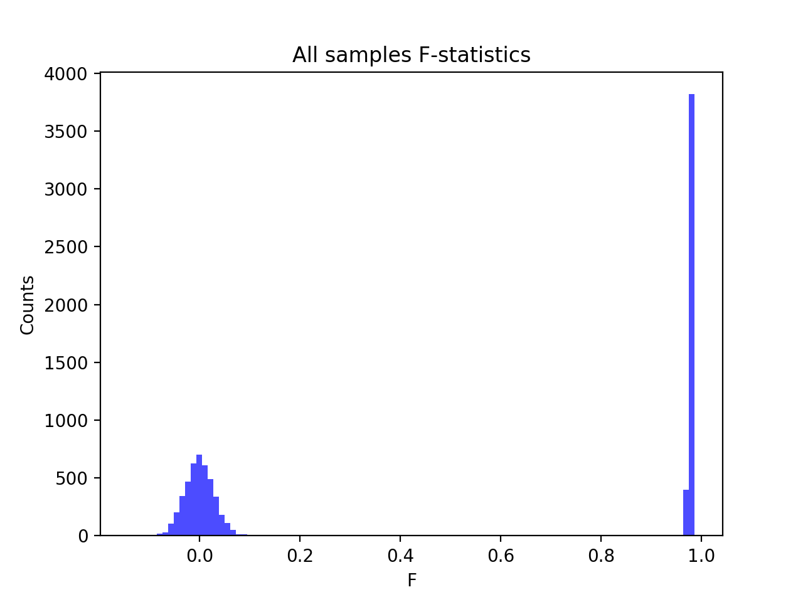
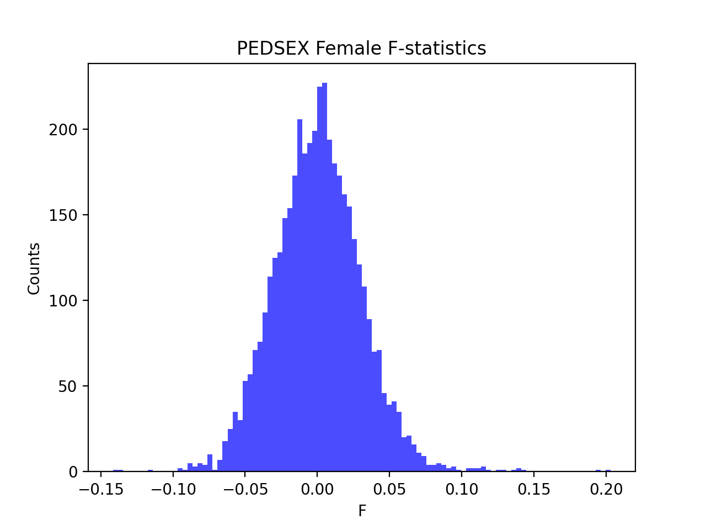

# Batch report for batch snp010, module mod5-harmonization
## Samples overview
9568 samples
 6067 kinship clusters
 1911 offspring with mother ID
 1911 offspring with mother in batch
 1896 mothers with offspring in batch
 0 mothers missing from batch
 1557 offspring with father ID
 1557 offspring with father in batch
 1542 fathers with offspring in batch
 0 fathers missing from batch
## Call rates
### Sample call rates
min: 0.9827485
 max: 0.999854138
 median: 0.999502743 
### SNP call rates
min: 0.9800376
 max: 1.0
 median: 0.99979097 
## F_het
min: -0.149366
 max: 0.101379
 median: 0.0035418150000000002 
## Hardy-Weinberg P-values
min: 1.01338e-06
 max: 1.0
 median: 0.480327 
## Sexcheck
8529 out of 9568 OK 
| PEDSEX | Total | SNPSEX Male | SNPSEX Female | SNPSEX Unknown | OK | Problem |
| ------ | ------ | ------ | ------ | ------ | ------ | ------ |
| Male | 4216 | 4216 | 0 | 0 | 4216 | 0 |
| Female | 4314 | 0 | 4313 | 1 | 4313 | 1 |
| Unknown | 18 | 0 | 16 | 2 | 0 | 18 |

### All samples 
### All samples F-statistics
min: -0.1414
 max: 0.9864
 median: 0.069465 
### PEDSEX Male
### PEDSEX Male F-statistics
min: 0.9155
 max: 0.9864
 median: 0.9784 
### PEDSEX Female
### PEDSEX Female F-statistics
min: -0.1414
 max: 0.2029
 median: 0.0002562 